# 利用 GRC 进行安全研究和审计 – 将无线电信号转换为数据包 

2014/12/01 9:08 | [mramydnei](http://drops.wooyun.org/author/mramydnei "由 mramydnei 发布") | [技术分享](http://drops.wooyun.org/category/tips "查看 技术分享 中的全部文章"), [无线安全](http://drops.wooyun.org/category/wireless "查看 无线安全 中的全部文章") | 占个座先 | 捐赠作者

## 0x00 介绍

* * *

InGuardians 作为一家从事信息安全研究和咨询的公司，自创立以来不但关注着 web 应用的渗透测试，网络取证，嵌入式设备等领域也致力于无线网络的评估方法上面的研究。在期间无线网络评估也从起初单一的企业无线网络部署慢慢地发展到开始涉及一些通用或自定义的蓝牙，zigbee 等网络的分析。

InGuardians 和其它一些企业，安全机构一样会一直通过参考其它人发表的一些研究结果来扩充自己的知识。在利用別人发表的内容来提高自我水平的同时，他们也从来没有在分享自己的一些经验和研究结果上有过止步。如果你有关注 BH，DC 等会议你们应该有在这些会议上看到过他们的身影。

在寻求充分理解无线电审计背后的技术过程当中，InGuardians 意识到市面上缺乏一些一步一步指导人们如何分析无线电信号的文稿。其中最大的缺口出现在教会人们如何利用 GRC（GNU Radio Companion）来对无线电信号进行彻底地分析，最终再将无线电信号转换为更易于我们理解和分析的数据包。虽然我们没有办法将个别案例中的分析方法原样地应用到任意的项目当中，但是了解一些分析案例中各个步骤背后的种种不但可以帮助人们开发出更好的工具，在某些时候也可以帮助人们完成其它类似的研究。作为工具 GRC Bit Converter3(GRC Bit Converter: https://github.com/cutaway/grc_bit_converter ) 就是个很好的例子。它可以很好地帮助安全研究人员和无线电爱好者完成他们的项目和工作。

## 0x01 安装与配置

* * *

市面上有很多关于如何购买适合自己的无线电设备，如何安装 GRC 和如何安装频谱分析应用的教程。所以再重复叙述那些东西应该是没有任何意义的。在这里只给出这些硬件和软件的相关链接。

. 硬件资源

USRP . http://home.ettus.com/

HackRF Jawbreaker . https://github.com/mossmann/hackrf/wiki (.1)

bladeRF - http://nuand.com/

RTL-SDR . http://en.wikipedia.org/wiki/List_of_software-defined_radios

CC1111EMK - http://www.ti.com/tool/cc1111emk868-915

Ubertooth . http://ubertooth.sourceforge.net/

Atmel RZUSBstick - http://www.atmel.com/tools/rzusbstick.aspx

软件资源

GNU Radio Companion –

http://gnuradio.org/redmine/projects/gnuradio/wiki/GNURadioCompanion

SDR# - http://sdrsharp.com/

GQRX – http://gqrx.dk/

Baudline - http://www.baudline.com/

RFcat – http://code.google.com/p/rfcat/

Ubertooth - http://ubertooth.sourceforge.net/

KillerBee - http://code.google.com/p/killerbee/

通过学习并使用 GRC(GNU Radio Companion)你可以很轻易地敲开通往无线电世界的大门。GRC 十分易用的图形操作界面可以让你很轻易地实现一些复杂的无线电功能。GRC 中的许多特定操作都重度依赖于那些可配置的模块（block）。通过对不同的 block 进行连接和配置，最终就可以实现我们想要的功能。市面上有大量的教程教授人们如何使用 GRC 和它的主要模块来捕捉并显示我们所需要的无线电信号。了解并探索如何入门 GRC 对于本文的读者来说应该是不错的锻炼机会。InGuardians 建议大家可以试着用一下我们在上面所列出的那些软件。使用 SDR#，GQRX 等软件可以帮助读者对无线电传输的可视化和调整有一个初步的了解。这也许可以帮助读者更快地进入 GRC 的大门。

## 0x02 管理 DC Spike

* * *

HackRF,BladeRF 或其它一些 RTL-SDR 的使用者在使用一些频谱分析工具进行调频时会看到一个很大的尖峰（Spike）。这个尖峰就被称做 DC Spike。(图 2 中心处的尖峰)

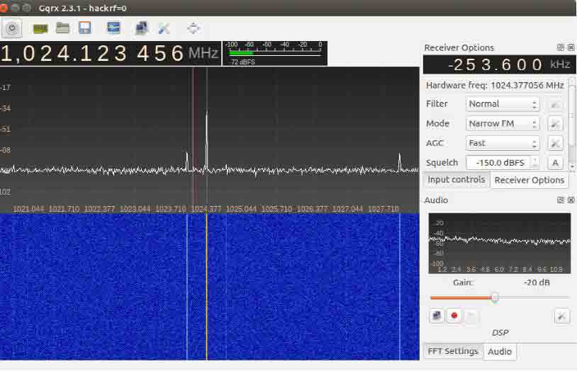

图 2 DC Spike

当一些用户第一次看到这些 Spike 时可能会担心自己的设备是否存在缺陷，在这里可以告诉大家这和你选购的硬件或该硬件所使用的固件并没有任何的关系，只要你使用无线电 DC Spike 就会与你同在。关于 DC Spike，在这 https://github.com/mossmann/hackrf/wiki/FAQ 你可以看到一些很好的解释。

正如 HackRF FAQ 当中所描绘的那样，在多数情况下我们是不需要考虑 DCSpike 的。但是，你如果想要成功地解调你所捕获的信号或捕捉被发射的信号你就需要尽力去保证这个信号是干净的。因此，为了避免受到 DC Spike 的干扰我们可以使用“DC Offset”来解决此类的问题。我们需要做的就是通过正确的 GRC 模块将接收频率调至无线电的传输带宽之外。唯一需要注意的是，我们需要选择一个合理的 offset 将 DC Spike 移动到传输的信号之外，但同时要保证不要将 offset 设置过大导致我们不得不使用我们本不需要的带宽。

通常确定如何去配置 DC Offset 的方法有两种。第一种方法，需要我们对产品手册中的数据进行分析来确定无线电设备的性能。在手册当中你通常可以找到关于信道间隔的标注。简单的来说，信道间隔就是从中心频率到两个不同传输区域之间的距离。借助这个信息我们就可以很好的调整我们的 DC Spike。信道间隔和传输的大小没有必然的联系。例如,在观察 wifi 的信号传输时我们会发现，Wifi 虽然有 14 条信道，但是在无线电适配器的传输当中会有 6 条信道被吞噬。除此之外，通过频谱分析工具对传输带宽进行观察可以帮助我们调节 DCOffset，这也是我们之前提到的两种方法中的第二个。图 3 就是将信道间隔应用到无线网格网络中实现 FHSS 很好的一个例子。在 GRC FFT 当中使用“PeakHold”选项，就可以图中看到 DC Spike 会出现的位置。

图 3

无线电设备会通过设置信道间隔来防止信道之间的相互干扰。默认的信道间隔也会因设备和制造商而异。但幸运的是，因为这些值都是预设的，所以通常我们可以在制造商所提供的文档中找到这些值。如果你无法从产品附属的手册或产品供应商那里获取这些值，你也许可以在论坛,产品源代码或一些专利申请中找到你想了解的参数的值。

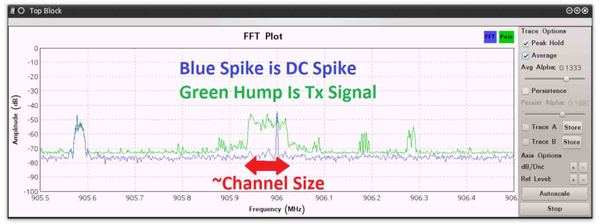

图 4 DC Spike 出现在传输信号内

如果你找到的文档不全或需要验证信道间隔的值，图形化分析可以帮助确定一个粗略的信道间隔。图 4 就是通过图形化界面来目测信道间隔很好的例子。其中的蓝色尖峰即为 DC Spike，绿色波峰为传输的信号，而用红色标注出来的距离则为频道的大小。其中出现的个传输信号的边缘之间间隔就正好是信道间隔。

GRC 当中通常会使用变量模块(variable blocks)来对一些值进行修改。在下面的例子当中我们将使用变量模块来定义信道间隔的值。一旦 channel_spacing 设定完毕我们就可以在其他模块当中使用我们所设定的值。为了使用信道间隔来控制 DC Spike，我们将定义另外一个变量模块 freq_offset 并让其值等于(channel_spacing / 2) * (channel_spacing * .1)。借助这个公式我们就可以把 DC Spike 推移到信号的边缘部分。如果我们进一步将此处的 1 调整到 10 就可以将 DC Spike 推移到传输信号之外了（如图 5 所示）。图 6 中将告诉大家应该如何去设置相关的 osmocom Source。

图 5 freq_offset 的相关配置

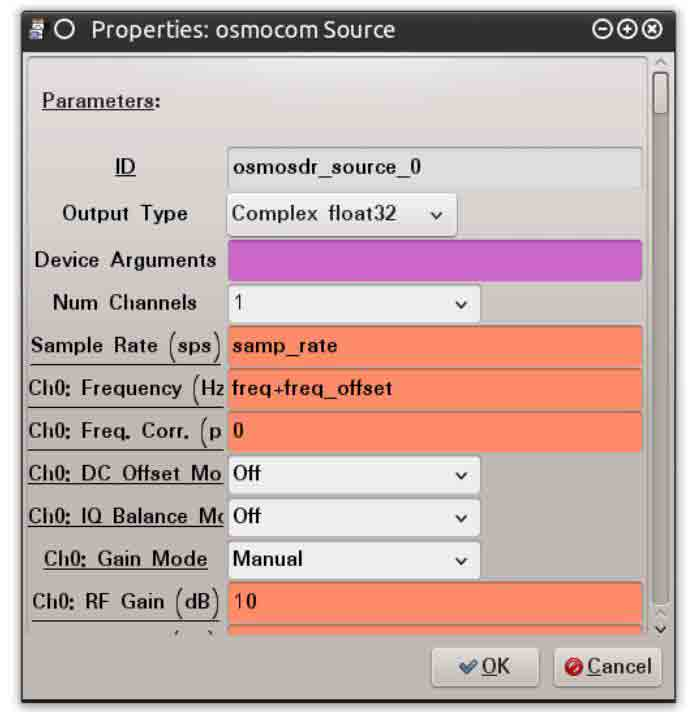

图 6 设置相对应的 osmocom Source 模块

一旦我们完成了这些模块的配置后，我们将会所对应的区域中看到公式计算厚的结果呈现在其中。被计算后的的结果如图 7 所示。

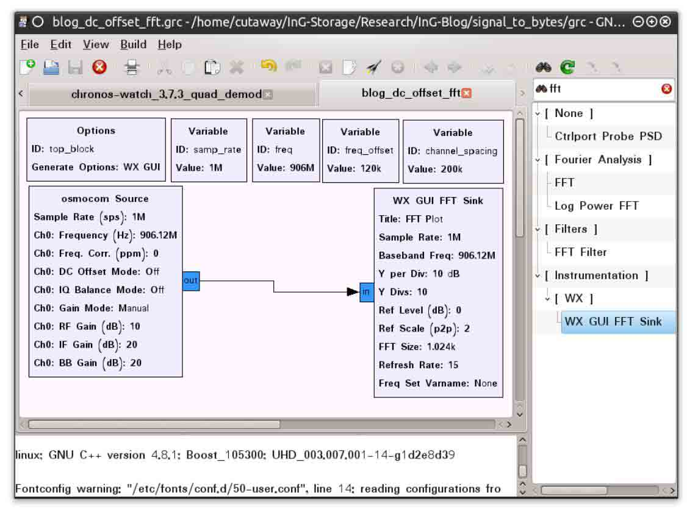

图 7 GRC 捕获配置图

最后在图 8 中可以看到我们已经成功地将 DC Spike 推移到了传输之外。

 图 8

## 0x03 传输信号的分离

* * *

一旦 DC Spike 的问题得到解决，我们就可以在不受它干扰的情况下对信号进行处理了。接下来需要我们去做的就是信号的分离。GRC 当中存在两个模块可以帮助我们对信号进行分离。它们分别是 Low Pass Filter（LPF）和 FrequencyXlating FIR Filter（FXFF）模块。从功能上来将两者能为我们提供的几乎是相同的。但是相对于 LPF，FXFF 为我们提供了更多的选项可以让我们在分离或对传输的信号进行操作时有一个更好的开始。在这里我们先对 LPF 做一个简单的介绍。

在 LPF 的配置当中，第一个可调节选项是 Decimation。通过对该值进行调节，我们可以修改即将输入进来的信号的采样率（Sampling Rate）。你会在众多 FM 解调的 GRC 例子当中看到 Decimation。这个参数的取值通常会和图 5 中的 freq_offset 一样由计算公式来完成。虽然使用 Decimation 在有些信号解调中是需要使用到的，但是在我们这次的例子当中我们不会用到它。所以我们可以让它保持在默认的值“1”,这样就不会对我们的采样率（Sample Rate）有任何的影响。这种做法也能同时保证我们不会去打破采样定理中提到的每一个正弦周期需要进行两次采样的说法。

下一个需要我们去设置的是“Window”这个选项。这个选项的默认值是“Hamming”。但是在 Balint Seeber 的“Blind signal analysis with GNU Radio”演讲当中他曾经提到我们应该将 Window 的值设置成“BlackMan”，因为这相对于另外一个来说是更优秀的算法。

在设置完 Decimation 和 Window 参数之后，还需要我们设置 SampleRate，Cutoff Frequency 和 Transition Width 来完成我们的信号分离。Sample Rate 的设置很简单，它是输入采样率并应当和前面所提到的一样被默认的设置成“samp_rate”。这里需要注意的是即使我们使用 decimation 修改了输出的采样率，Sample Rate 应当依旧设置成我们的输入采样率。Cutoff Frequency 为我们之前提到的图 4 中所显示的频道大小。然而频道间隔的设定也应当和我们在之前所提到的一样，应该有同名的变量模块进行设定。

其中最为麻烦的可能就属 Transition Width 的设定了。在设定这个值之前我们需要做一些测试来给它赋予一个正确的值。更多的经验和调查将会对于你在起初如何设定这个值有很大的帮助。当然这也会取决于中心频率，带宽，无线电设备类型等因素的影响。有些时候传输的信号不会恰好地集中在中心频率。它时常都有可能受到天气，Power，甚至是其它信号的干扰。总而言之，该值的不合理设定可能会导致多余信号的产生，又或者是信号的丢失。根据我们的经验，我们会将该值设定为频道间隔（Channel Spacing）的４０％～５０％之间的值。在后面我们也会看到这个设定可以为我们带来最好的结果。在图 9 中我们将使用下述的参数来对 LPF 进行配置。

Frequency Offset 120,000

Channel Spacing 200,000

Channel Transition 80,000

Window BlackMan

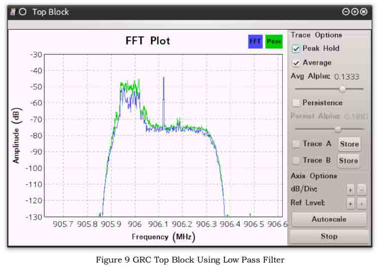

当我们用上述的参数观察我们分离出来的信号时，我们发现我们的信号并没有位于 FFT Plot 的中心处。然而为了正确地解调信号我们需要把信号移动到 FFT Plot 的中心处。这里就需要我们使用 Frequency Xlating FIRFilter（FXFF）来实现这个操作。

FXFF 和我们前面所提到的那样，和 LPF 有着许多相似之处。所以在这里我们可以将 Decimation 和 Sample Rate 设置成与之前在 LPF 中同样的值。在 FXFF 当中还有一个叫 Center Frequency 的变量。这个变量和 DC_Offset 一样通常用来矫正信号并将其调整到中心处。如果在设置过程当中我们没有使用 DC_Offset 那么该值应当设置成０，如果不是它的值应当设置成 freq_offset。最后一个需要我们去设置的是 Taps 变量。对于这个变量的设定，我们使用 Dragorn 在他的博客 Playing with the HackRF – Keyfobs 中所提到的公式：“ firdes.low_pass(1, samp_rate,channel_spacing, channel_trans, firdes.WIN_BLACKMAN, 6.76) ”。（详见图 10）

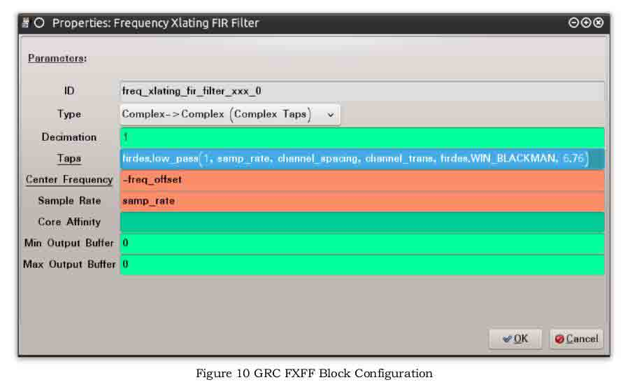

对于 FXFF 进行了上述的设定之后我们就可以在图 11 中看到我们所预期的结果。

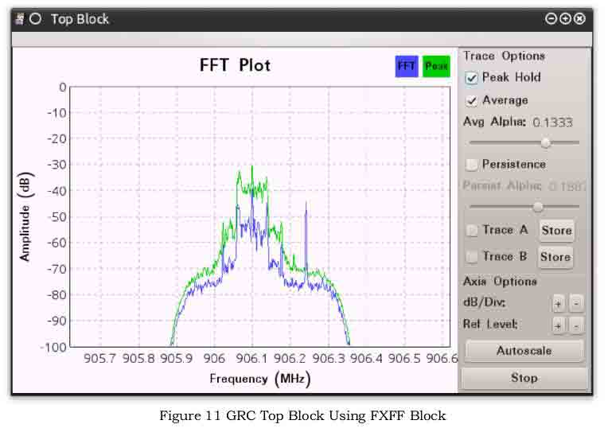

## 0x04 实际调解

* * *

使用 LPF 和 FXFF 对信号进行分离可以帮助我们更有效的对信号进行解调。Michael Ossmann 在他的无线电培训课程当中讲述了从这个点开始应当如何进行解调。在他的课程的当中他不但讲述了相关的概念和数学知识，也告诉了我们为了解调不同的 ASK（amplitude-shift key）和 FSK(frequency-shifykey)所需要的模块。解调 ASK 我们可以使用“Complex to Mag” 或“Complex to Mag ^ 2”。然而解调 FSK（尤其是 2FSK 和 GFSK）我们可以使用“Quadrature Demod”。

在这个例子当中我们需要解调的是通过 GFSK 传输的信号。在此之前的图片当中我们所看到的一些结果都是 Texas Instrument (TI) Chronos Watch 和 IChronos black dongle 之间的数据传输结果。在 TI 的站点上我们可以找到和这个 dongle 相关的一些数据，甚至是它的源代码。最终我们在这个产品的源代码中看到了我们想了解的信息（Mudulation=（1）GFSK），如图 12 所示。

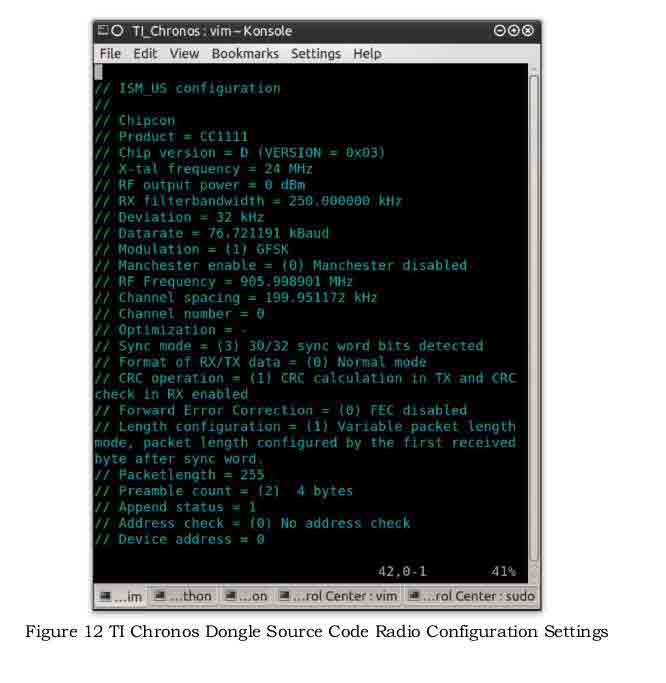

现在我们已经知道了 Modulation type，那么剩下的就是需要知道 Deviation 了。这个值我们可以从源代码中获取（可以看到在图 12 当中 Deviation=32Khz）。

当我们对在需要解调 GFSK 索要用到的“Quadrature Demod”模块进行配置时，我们会看到的默认的 Gain 变量将通过这样的公式进行计算：samp_rate/(2*math.pi*fsk_deviation_hz/8.0)，这意味着我们还需要添加一个变量模块 fsk_deviation_hz 来协助 Gain 的计算。这个 fsk_deviation_hz 就正好是我们之前提到的需要我们知道并且设定的第二个变量 Deviation（如图 13 所示）。这也是为什么我们会说除了 Modulation type 之外我们还需要知道 Deviation 的值。

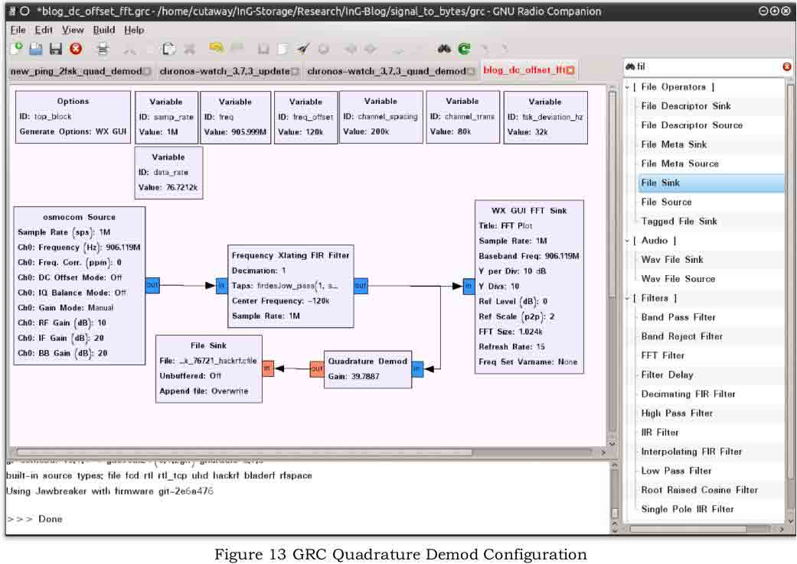

在图 13 当中我们可以看到模块 Quadrature Demod 处理结果最终会输出到 File Sink 模块当中。这是因为从这一步开始我们需要将解调过后的结果放到其它的工具里来完成我们之后的步骤。在这里需要提到的一点是，关于文件的命名和输出的位置。有时候我们需要在很短的时间内将很大的文件写入到磁盘。如果你是 Linux 用户，我们建议你将文件写入到“/dev/shim”，这样做会比直接写入到硬盘会快一些。关于文件命名你可以参考将一些可能会用到和重要的信息放到文件名称当中，方便日后的分析和处理工作。如，

“/tmp/blog_demod_1e6_905.99e6_gfsk_76721_hackrf.cfile.”

在完成了这些设定之后，运行图 13 中的 GRC 会将调节后的信号存储到我们预设定的文件当中。将此文件导入到频谱分析工具 Baudline（Baudline:http://www.baudline.com/）中，就可以继续我们下面的工作了。如果你对此处的一些细节有疑问，可以在 Dragorn 发布的 Keyfob blog post 中看到一些更详细的解释（评论中有很多亮点）。图 14 所展示的是，我们将文件导入到 Baudline 之后所呈现的 FFT 和波形图。

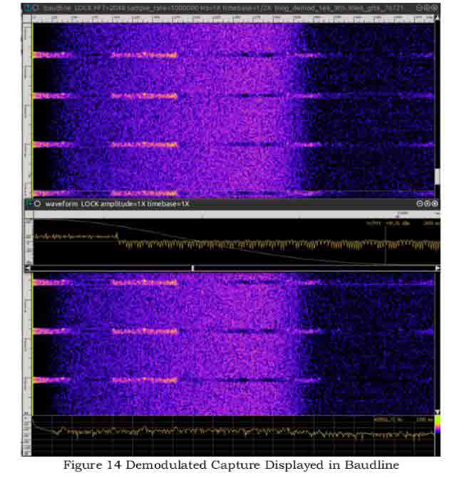

通过使用 Baudline 我们可以在把无线电信号转换成数据包之前对我们得到的结果进行分析和判断。现在我们将上图中的波形图进行放大来进一步观察。（如图 15 所示）

通过上图对我们解调过后的信号进行观察，我们可以发现一些很有价值的信息。首先我们可以从图中，看到我们获取的信号并没有我们预期的那么干净。其次，波形图整体偏下，且并没有穿过中心轴（X-axis）.然而这些对于我们将无线电信号转换成 0 和 1 是十分的不利的。为了实现信号的转换我们需要在 Quadrature Demodulation 和 File Sink blocks 之间加入另外一个 LPF。就像在之前所提到的那样，这个模块需要我们配置它的“Cutoff Freq”和“Transition Width”变量。然而问题是，现在还并没有什么好的文档能告诉我们该如何去设定这个 LPF 当中的这两个变量。这些变量的取值一般可能会受到频率，Modulation 和其它一些配置的影响。根据经验，我们通常会从 100,000 开始设定“Cutoff Freq”并将“Transition Width”的设置为它一半的值。通过重复调节这些参数并将输出文件导入到 Baudline 进行观察，再经过几轮甚至是更多次的调试之后我们将会在 Baudline 当中看到看上去更像是数据的波形图。图 16 中的波形图，就是我们将“Cutoff Freq”设置成 80,000，“Transition Width”设置成 50,000 后的结果。

现在我们可以看到我们的信号看上去好了很多。但是波形和中心轴的问题依然没有得到解决。解决这个问题，只需要我们在 LPF 和 File Sink 当中再加入一个 Add Const 模块来对 waveform 进行整体上移。关于如何设置 AddConst 的值，你可以参考之前 LPF 的调节方式，对其值进行逐步增加，直到出现如图 17 所示的画面（在这里我们将 contast 设定为 6）。

了解如何在不丢失数据的情况下对 wave pattern 进行操作在我们分析其它的信号时也十分的重要。举个例子来说，如果厂商的文档中有提到数据是倒置之后进行传送的，那么我们就可以通过设定 contast 值为-1,来进行反向的数据反转。

## 0x05 位计数

* * *

在完成了解调之后就需要我们从 wave 中检测出所有的 0 和 1.在 GRC 中我们可以使用“Clock Recovery MM”和“Binary Slicer”来实现它。其中的“Clock Recovery MM”负责从 wave 中找出高位和地位，再由“Binary Slicer”负责将它们转换成 1 和 0。首先，我们需要配置“Clock Recovery MM”模块。在打开“Clock Recovery MM”的配置界面后（如图 18 所示）你可能会被这些多的有点让人难受的变量给吓到。但是实际上其中的“Gain Omega,”“Mu,” “Gain Mu,” ， “Omega Relative Limit”等变量在一般情况下是不需要我们去重新设定的。所以只要让它们保持默认的值就可以了。 所以在这里唯一需要我们去设定的是，“Omega”变量。在“Omega”的默认值当中我们可以看到，这样的设定：samp_per_sym*(1+0.0)。这意味着我们需要和之前一样添加一个变量模块 samp_per_sym 来帮助“Clock Recovery MM”计算每帧抽样次数(Samples Per Symbol)。

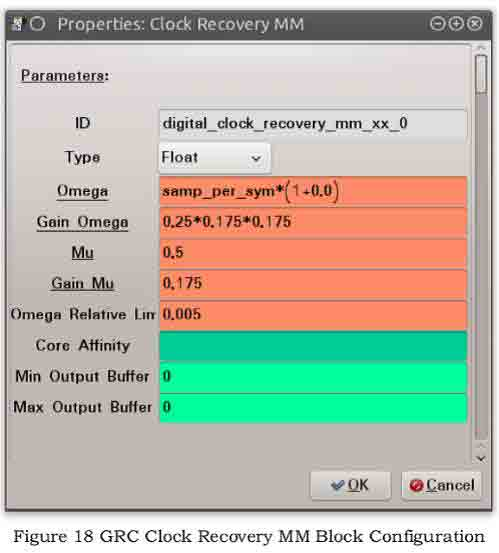

这里的 samp_per_sym 可以通过公式“int(samp_rate / data_rate)”进行计算（如图 19 所示）。samp_rate 对我们来说是已知的，但是 data_rate 呢？这个值我们可以从图 12 中找到。所以为了计算出 samp_per_sym 我们还需要再添加一个变量模块“data_rate”，并将其值设定为图 12 中所显示的 76721.191。

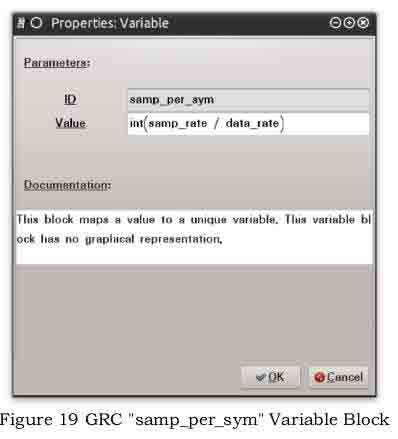

最终我们将配好的模块接入到我们之前做好的 GRC 当中（从图 20 中可以看到原始的 File Sink 处于 Disabled 状态）就应该是图 20 所呈现的样子

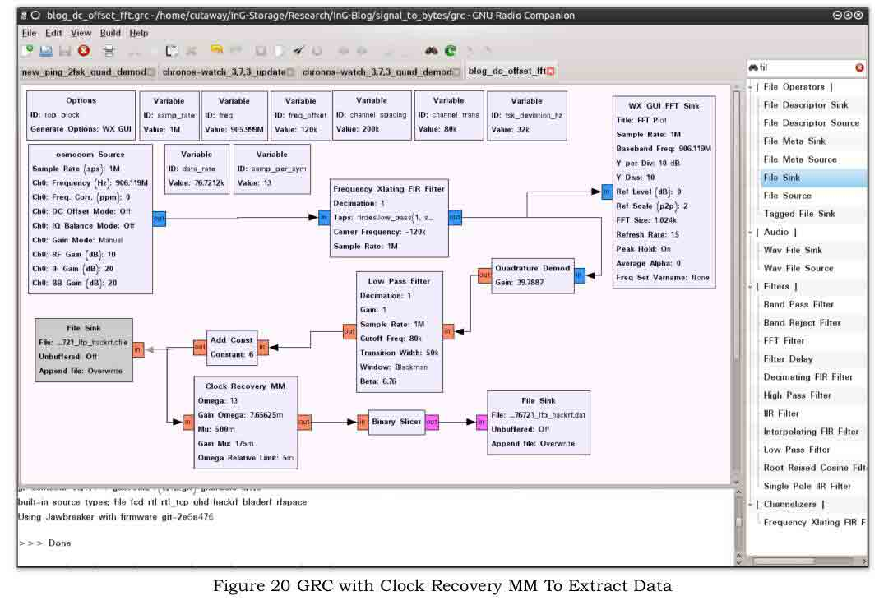

## 0x06 分析解调后的数据

* * *

在我们运行图 20 所展现的 GRC 之后我们会得到一个文件。通过 Linux 的 xxd 或任何平台上的 hex editor 打开我们所获得文件后你会看到如图 21 的内容。

和我们预期的一样我们可以在上图当中看到满满的 0 和 1。其中每 8 个 bit 可以视作是一个 bit 的数据。比如第一行的 0101 0101 0101 0101 0101 0101 0101 0101 就应该是 0b1111111111111111 或 0xff。第三行的 0101 01010101 0101 0001 0100 0100 0101 就应该是 0b1111111101101011 或 0xff6b。

但这些输出可能是被传输的数据，同时也可能是任何一些可以被 0 和 1 所表示的其它一些东西。所以在这里找出真正的数据将会是我们最大的挑战。而且根据经验，图 21 中所展现的数据在我们看来和空气中传播的杂音（noise）有极高的相似度。在我们现在配置当中“Clock Recovery MM”会将所有的高位和低位扔给“Binary Slicer”进行处理。然而从现在的数据来看和实际数据对比，我们收到了太多的杂音（noise）。也就说我们现在的 GRC 配置还不具备辨别数据，杂音和来字其它无线电设备的信号的功能。也许我们可以通过定位数据包的头 bit 来对实际产生的数据进行定位，但是 GRC 是否有这样的模块可以实现我们想要的这个功能呢？

除此之外，我们在图 21 中看到的数据还只是 raw data。所以我们需要将这些数据转换成 byte 再去讨论如何辨别杂音或找到真实数据的问题。在这里可以借助 InGuardians 开发的 GRC Bit Converter（https://github.com/cutaway/grc_bit_converter）将数据转换成 bytes（如图 22 所示）。

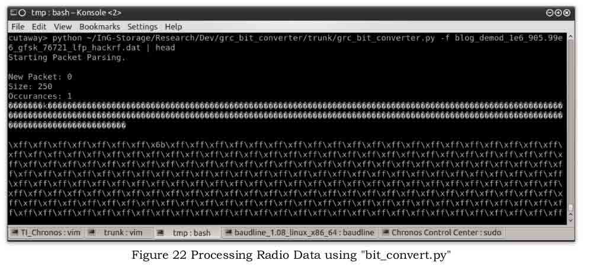

使用默认设置运行 grc_bit_converter.py，脚本会将每 2000 个 bits 转换成 250 个 bytes 并将其标记为一个数据包。这个流程会一直的重复，直到处理完所有的数据。其中的参数“Occurrences”会告诉我们有多少个包内的数据是一模一样的。这个参数在我们找到数据包之后会有很大的用处。

在完成转换之后我们需要确定传输的数据是如何被格式化的。这将有助于我们从这一坨数据当中找到它们。很多无线电设备（并不是所有的，大多数都是这样）在进行数据传输之前会发送前导码（preamble）和同步码（SyncWord）。前导码是一系列从高到低传输，如果从 binary 文件来看的话它通常会是这样“0b1010101010101010” 或这样 “0xaaaa”。前导码 byte 数取决与设备本身或它的相关配置。由于没有办法确定前导码的首位是什么所以在我们对 binary 文件进行过处理之后，你在解析过后的文件当中看到的前导码可能已经变成了“0101010101010101”或“0x5555”。 前导码通常只负责告诉设备接下来的数据是需要处理的。而真正告诉告诉设备数据是从哪里开始责由同步码负责。在真实世界的无线电传输当中最常用的同步码是“0xd391”。但是就和之前我们提到的前导码问题一样，在我们解析完之后“0xd391”很可能已经变成了其它的值。这时就需要我们使用 ipython 来对这个“0xd391”进行小小的处理了。在图 23 中你们会看到可能会变成 0xa722, 0x4e44 或 0x9c88 出现在我们解析过后的文件当中。

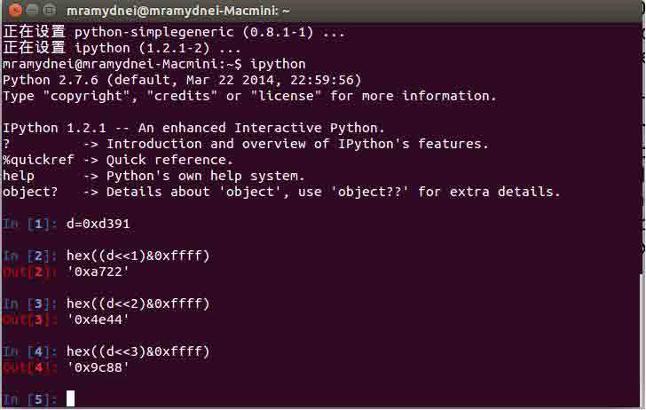

在有了一点线索之后，现在让我们试着从 grc_bit_converter.py 的输出结果中查找我们的同步码（0xd391）来定位我们的数据包(如图 24 所示）。

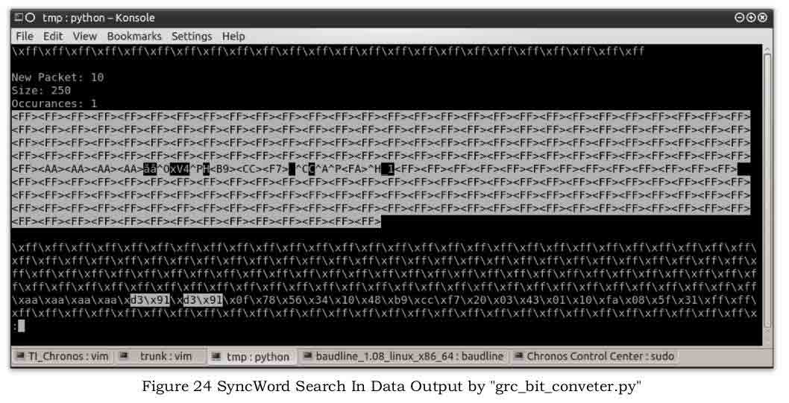

这下我们好像终于找到了看上去像数据的东西。当然了，我们也可以通过再此回顾图 12 中关于同步码和前导码的描述来确定我们的操作的准确性。在这里我们可以看到我们之前所提到的前导码是“\xaa\xaa\xaa\xaa”这个图 12 中叙说的 4 bytes 完全吻合。然而我们的同步码“\xd3\x91\xd3\x91”正好是 32bits，也和源代码中描述检测 32bits 的同步码的 30 位这一说相吻合。然后在源代码中我们还看到同步码后面的第一个 byte 表示整个数据包的长度。从上图中我们可以看到同步码后面的第一个 byte 正好是\x0f 也就是 15。从这里开始数 15 个 byte 我们会发现还会剩下两个 byte，这两个 byte 就是 CyclicRedundancy Check (CRC)了。这两位被称为数据错误，循环冗余检查通常用于检查数据的正确性和完整性。

## 0x07 对数据包进行标记

* * *

当我们手头上的信息十分的有限时，手工或通过脚本对数据进行解析有时候可能会是我们唯一的出路。但是这个案例当中我们拥有足够的信息来运用相关的 GRC 模块进行数据包的标记。

这个动作可以使用 GRC 中的“Correlate Access Code”模块完成。“Correlate Access Code”模块需要我们配置其中的两个变量来完成标记的操作。它们分别是“Access Code” 和 “Threshold”。其中的“Access Code”是我们需要定义的特征向量来对需要我们进行标记的包进行表示。然而另外一个参数“Threshold”是特征向量中可能会发生变化的部分的位数。在图 12 当中我们看到在检同步码时，只会检测 32 位当中的 30 位，这也就意味着其中的两位可能是不一样的。那么我们这里的“Threshold”的值就应该是 2 了。特征向量“Access Code”和我们之前提到的一样应当填入同步码所对应的值（如图 25 所示）。

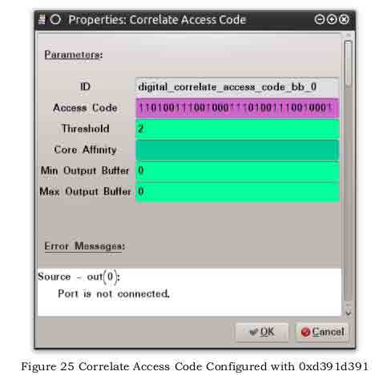

和之前所提到的一样，“Correlate Access Code”标记的是“Binary Slicer”处理后的数据。相关的位置关系将在图 26 展示。

在完成文件的输出之后，我们可以像之前一样用 xxd 或 hex editor 打开输出的文件，并通过搜索 02 或 03 来查找我们标记的数据包。（如图 27 所示）

就和前面使用 grc_bit_converter.py 对输出的文件进行分析一样，这次我们同样可以使用这个脚本。这次需要我们在脚本后面增加几个参数来检测“Correlate Access Code”模块标记过的数据包，并修改数据包的大小（如图 28 所示）。

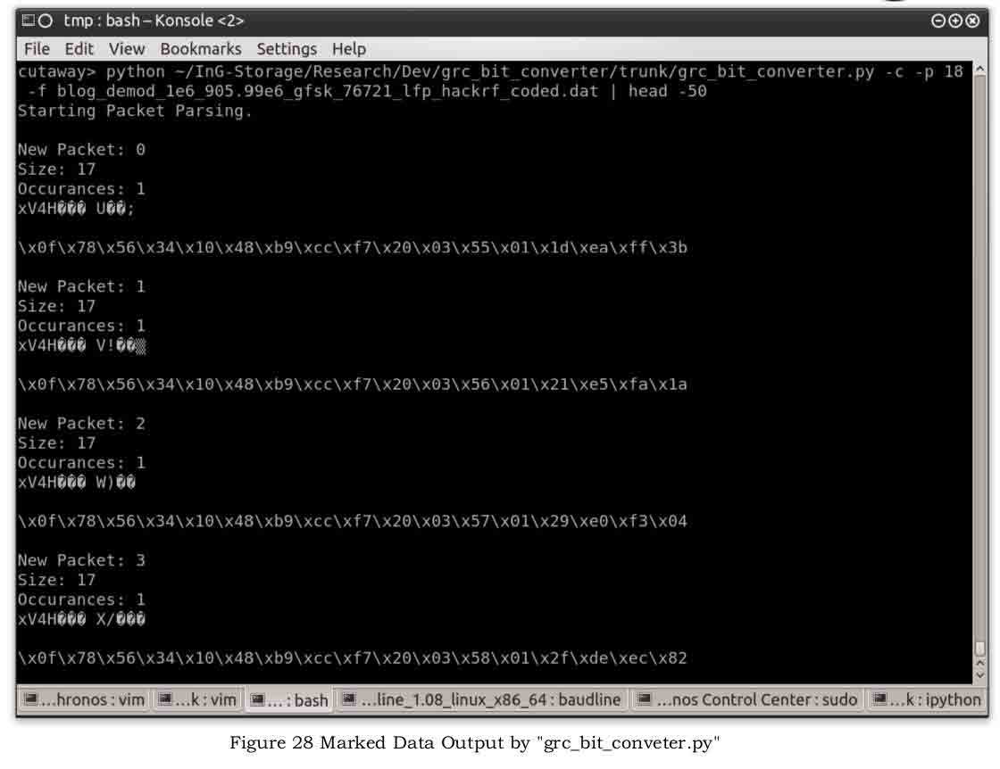

## 0x08 验证

* * *

在这个例子中的 GRC 配置对于我们的 TI Chronos Watch 来说工作的还算不错。但是文中提到的这些技术是否能同样的应用到其它的或类似的无线电传输当中呢？为了验证，我们会使用 http://lists.gnu.org/archive/html/discussgnuradio/2014-04/msg00097.html 中 Jay 为我们提供的使用 DC Offset 抓取的包进行验证。

为了对这个包进行分析我们需要将原来的 sources 模块替换成“File Source”和“Throttle”模块。在这个案例当中 capture rate 是 500,000，然而 DC Offset 是 200,000 Hz。这个 GFSK 信号在 903 MHz 进行传输（如图 29 所示）。

从图 29 可以看出，我们捕获到的信号靠近图形的左边缘。我们还可以发现频道大小从 902,950,000 到 903,100,000 将近为 150,000 Hz。随后再将 FXFF 中的频道间隔设置成 100,000，“Channel Transition”设置成 50,000 后我们可以可以在图 30 中看到变化。

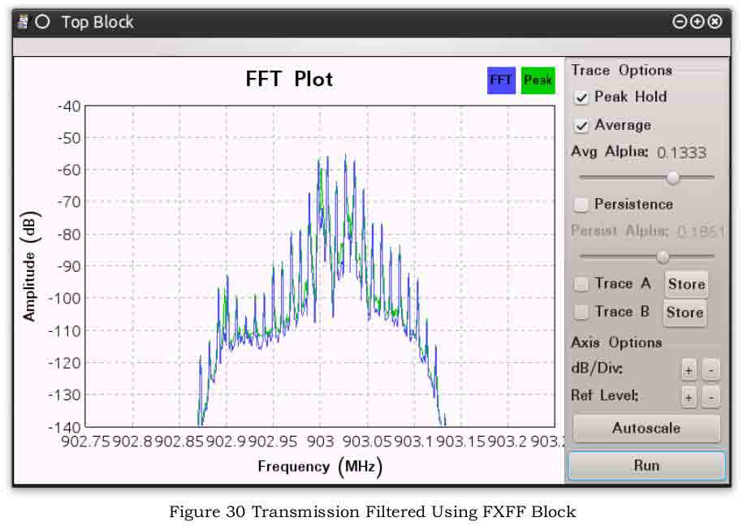

通过 Jay 的 Post 我们还可以知道其它的一些信息。比如：

. Deviation 16,500

. data rate 19200

在使用这些值完成我们前面所做过的步骤后，我们又可以到可以将信号导入到 baudline 进行调整和分析的步骤了。经过多次的调整我们最终将“CutOffFreq”和“Transition Width”分别设定成了 25,000 和 10,000。调整过后的波形图如图 31 所示。

从图中我们知道波形图还需要做一些上下的调整。在这里我们需要将“Add Constant”设置成-6,来让 wave 向下进行移动。在完成了 wave 的调整之后需要我们像之前那样验证同步码，最终得知只会发送一个"0xd391"。接住这个信息我们就设置“Correlate Access Code”来对包进行标记。再将包的大小设定为 80 之后我们再次调用 grc_bit_converter.py 对结果进行观察（如图 32 所示）。

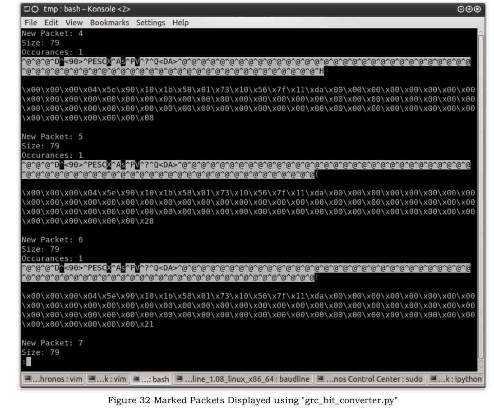

在完成了这些之后下一个步骤将会是对判定在这些数据传输中所使用的协议。从包的长度，CRC bytes，是否使用数据白话技术等入手将对我们分析这些数据会有很大的帮助。作为额外的数据捕获我们还可以尝试在接上电源，关闭电源，配对开始的情境下进行包的捕获。捕获的数据信息越多,就越有利于我们了解它们是如何进行通讯的，是什么中端在进行数据传输，我们应当如何去设置 GRC 来实现我们所需要的通讯。

## 0x09 结论

* * *

通过适当的设备和软件我们可以轻易的捕捉到我们想捕捉的信号。然而理解如何使用 GRC 来对捕捉到的信号进行操作会稍微困难一些。这使得对信号进行解调并转换成数据包变得更加复杂。但幸运的是，我们可以通过互联网阅读许多人分享的分析案例。通过理解这些案例可以使得我们的分析过程变得轻松许多。

版权声明：未经授权禁止转载 [mramydnei](http://drops.wooyun.org/author/mramydnei "由 mramydnei 发布")@[乌云知识库](http://drops.wooyun.org)

分享到：

### 相关日志

*   [树莓派打造无线扫描仪.](http://drops.wooyun.org/wireless/3810)
*   [Open Wifi SSID Broadcast vulnerability](http://drops.wooyun.org/wireless/2891)
*   [RFID 之 M1 卡数据分析](http://drops.wooyun.org/tips/3168)
*   [无线应用安全剖析](http://drops.wooyun.org/wireless/4295)
*   [WIFI 渗透从入门到精通](http://drops.wooyun.org/pentesting/3390)
*   [Burp Suite 使用介绍（二）](http://drops.wooyun.org/tools/1629)