# 教你解密 Gh0st 1.0 远控木马 VIP 版配置信息

2014/11/04 10:50 | [New4](http://drops.wooyun.org/author/New4 "由 New4 发布") | [二进制安全](http://drops.wooyun.org/category/binary "查看 二进制安全 中的全部文章"), [技术分享](http://drops.wooyun.org/category/tips "查看 技术分享 中的全部文章") | 占个座先 | 捐赠作者

## 0x00 简介

* * *

Gh0st 是一款非常优秀的开源远程控制软件，由红狼小组的 Cooldiyer 开发。开源 3.6 发布后一段时间，作者对其进行大量重写并发布 1.0 Alpha，这个版本是有 VIP 的，我也有幸收集到一套。 当你拿到一个别人的免杀木马你想做什么，学习免杀方法？而你由发现你拿到的样本你手头的控制端可以完美兼容，你想把配置信息修改了写个专版生成器吗？想？那就跟我来吧！（其实你看完文章也不会写，我也没有写过）

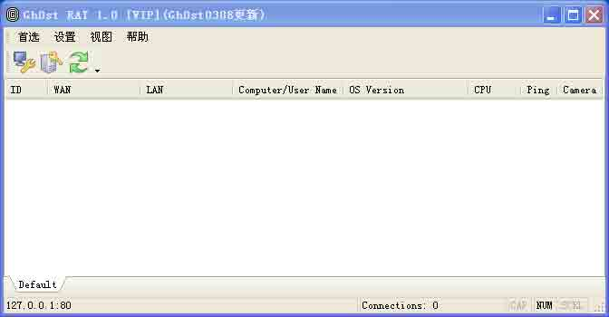

## 0x01 分析过程

* * *

本文用到的 Ollydbg 快捷键：

```
F9 运行程序/继续运行
F8 步过代码，遇到 CALL 容易跑飞建议少用
F7 跟进，不容易跑飞程序。
F2 下断点，然后 F9 可以跳过一些代码段。
F4 执行到所选行，常用。 
```

想写生成器吗，前提条件要先把配置信息加密解密算法给解了，这里我从服务端 exe 入手，就不从生成器上下手了，毕竟我们多数情况只有服务端 exe 样本。

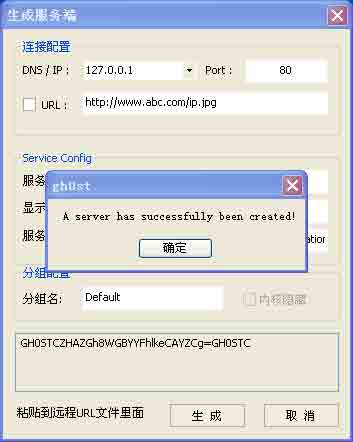

注意看生成器下面“GH0STC+用户配置信息+GH0STC”，这就是我们要解密的字符串。假如我们现在才抓到服务端 exe 怎么找配置？一般情况能直观快速找到的，1、写在资源文件里面 2、写在 exe、dll 尾部附加数据上。（我写 DRAT 的时候这两种都试过），我们用 C32ASM 工具 16 进制编辑。拖到最后发现文件尾部有配置信息。大家是否觉得有点简单…… 难的篇幅太大不在本文考虑范围内。

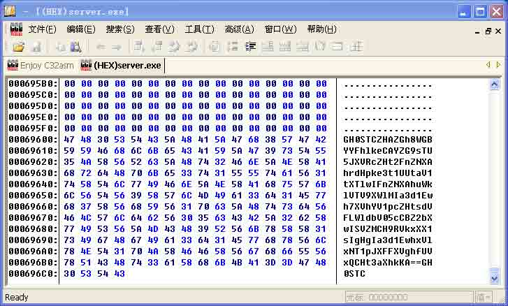

下面我们用动态调试工具 Ollydbg 打开，设置 CreateFileW 函数断点，这里我用工具直接设置，你也可以使用 bp CreateFileW 命令设置。为什么要这么做？它要读取自身配置肯定要“打开自己”所以断点设置在这个函数最合适，当然也有其他方法不在本文讨论范围，然后按 F9 把程序运行起来。

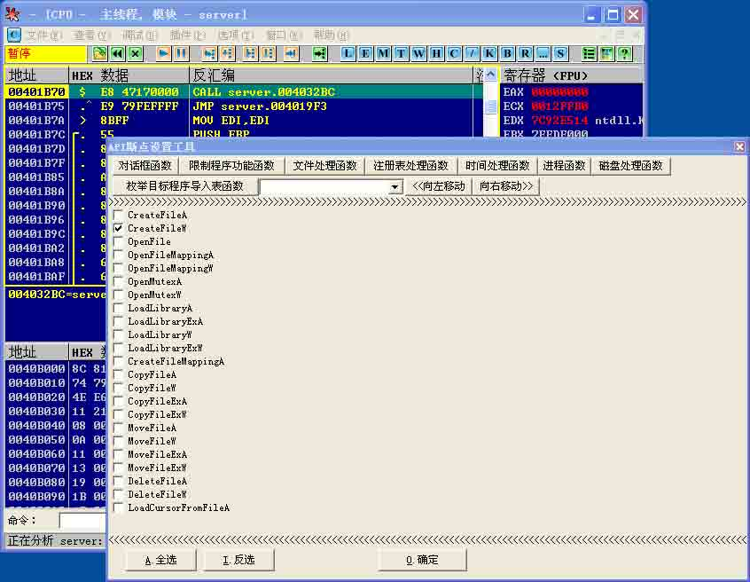

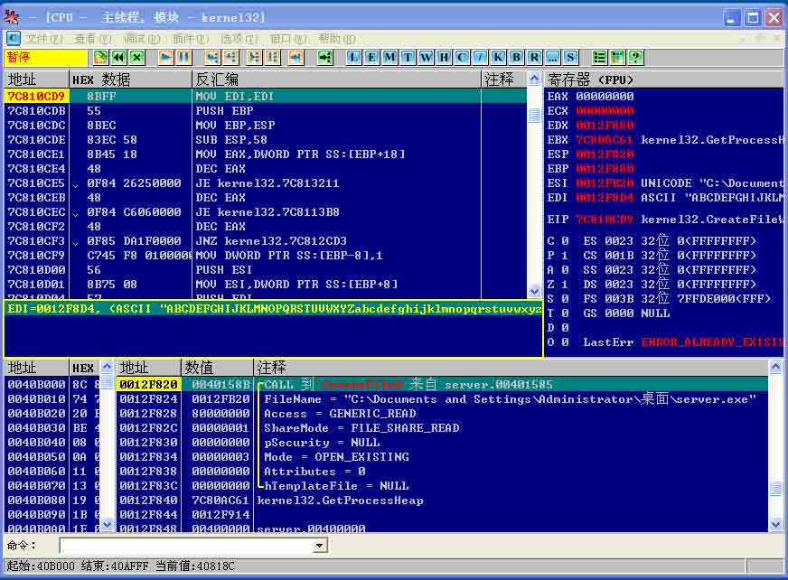

如上图所示的时候（如果不是的话继续按 F9），我们按 ALT+F9 返回程序，按几下 F8 向下走。看到 ReadFile 函数还有 CloseHandle、字符 GH0STC，这个时候就说明程序已经把“配置”读取完了，正常情况下应该准备进入解密了。所以下面出现的 CALL 调用都要非常注意（一般要按 F7 进入，不要再按 F8 了可能会跳过关键）

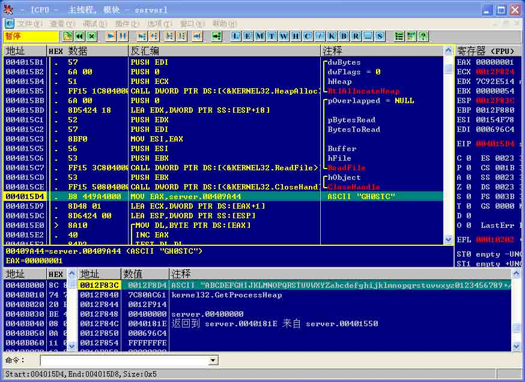

看到这个 CALL，我们用 F7 跟进，然后按多个 F8 直到下一个 CALL。

```
004015F3  |.  E8 88FEFFFF   CALL server.00401480
n……
……
…… 
```

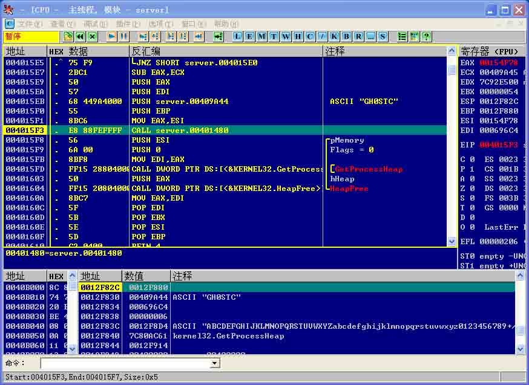

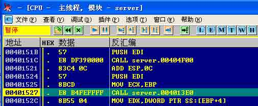

看到关键算法 CALL（00401527，至于怎么判断的我只能说我事先做过功课了，实践中大家要多试试），我们还是用 F7 跟进（其他无用部分你可以用 F2+F9 或 F4 跳过即可）。

```
00401527  |.  E8 B4FEFFFF   CALL server.004013E0 
```

在 F7 跟入就可以看到

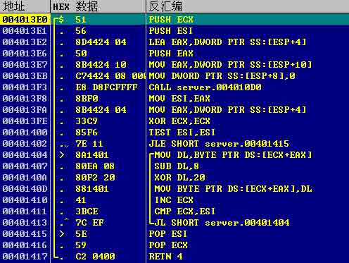

```
00401404  |> /8A1401        /MOV DL,BYTE PTR DS:[ECX+EAX]
00401407  |. |80EA 08       |SUB DL,8
0040140A  |. |80F2 20       |XOR DL,20
0040140D  |. |881401        |MOV BYTE PTR DS:[ECX+EAX],DL
00401410  |. |41            |INC ECX
00401411  |. |3BCE          |CMP ECX,ESI
00401413  |.^\7C EF         \JL SHORT server.00401404 
```

这是解密算法关键部分记下地址，我们这里换个工具用 IDA 看看这个函数（004013E0）。 提示：IDA 快速跳转地址快捷键是”G”，

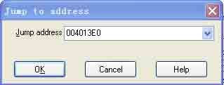

转过去以后我喜欢用 F5 插件（Hex-Rays Decompiler），这里我直接按 F5 看 C 代码了（这部分操作就不截图装 B 了，事实是也没什么需要好截的）。

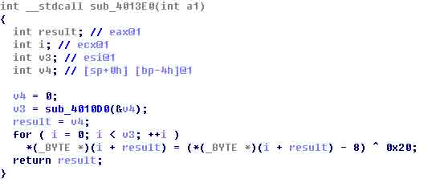

对比下 OD 里面的汇编代码慢慢品，你会发现关键代码就两行。

```
00401407  |.  80EA 08       |SUB DL,8
0040140A  |.  80F2 20       |XOR DL,20 
```

有一个字符，减 8 和异或 20 的操作。

```
for (i = 0; i < len; i++)
{
    data[i] -= 0x8;
    data[i] ^= 0x20;
} 
```

到这里我们已经找到关键算法部分，你可能没弄明白还是不知道怎么办。看下图的现成工具，实在懒的话自己百度找，或者你找一下 gh0st 3.6 开源代码然后差不多的改改就能用来解密了。

## 0x02 课后作业

* * *

留下三个作业给喜欢折腾的同学： 1、继续看下 004010D0 函数作用（看了没看明白看下 3.6 代码）

2、对比一下 gh0st 3.6 加密解密字符和 1.0 有什么区别（其实最关键部分我已经说了，其他都是除了头尾“GH0STC”不一样其他没变化）

3、写个配套生成器，还是参考 3.6 代码改改就行。

我这里就不发样本和其他附件了，有需要的来“暗组”论坛。你想要的这里都有！

下面在附上 1.0 字符串解密核心代码： decode.h

```
static char base64[] = "ABCDEFGHIJKLMNOPQRSTUVWXYZabcdefghijklmnopqrstuvwxyz0123456789+/";

static int pos(char c)
{
  char *p;
  for(p = base64; *p; p++)
    if(*p == c)
      return p - base64;
  return -1;
}

int base64_decode(const char *str, char **data)
{
  const char *s, *p;
  unsigned char *q;
  int c;
  int x;
  int done = 0;
  int len;
  s = (const char *)malloc(strlen(str));
  q = (unsigned char *)s;
  for(p=str; *p && !done; p+=4){
      x = pos(p[0]);
      if(x >= 0)
          c = x;
      else{
          done = 3;
          break;
      }
      c*=64;

      x = pos(p[1]);
      if(x >= 0)
          c += x;
      else
          return -1;
      c*=64;

      if(p[2] == '=')
          done++;
      else{
          x = pos(p[2]);
          if(x >= 0)
              c += x;
          else
              return -1;
      }
      c*=64;

      if(p[3] == '=')
          done++;
      else{
          if(done)
              return -1;
          x = pos(p[3]);
          if(x >= 0)
              c += x;
          else
              return -1;
      }
      if(done < 3)
          *q++=(c&0x00ff0000)>>16;

      if(done < 2)
          *q++=(c&0x0000ff00)>>8;
      if(done < 1)
          *q++=(c&0x000000ff)>>0;
  }

  len = q - (unsigned char*)(s);

  *data = (char*)realloc((void *)s, len);

  return len;
}

char* MyDecode(char *str)
{
    int     i, len;
    char    *data = NULL;
    len = base64_decode(str, &data);

    for (i = 0; i < len; i++)
    {
        data[i] -= 0x8;
        data[i] ^= 0x20;
    }
    return data;
}

```

[gh0st 附件](http://drops.wooyun.org/wp-content/uploads/2014/11/gh0st 附件.zip)

版权声明：未经授权禁止转载 [New4](http://drops.wooyun.org/author/New4 "由 New4 发布")@[乌云知识库](http://drops.wooyun.org)

分享到：

### 相关日志

*   [使用 netcat 进行反弹链接的 shellcode](http://drops.wooyun.org/tips/1376)
*   [MS15-002 telnet 服务缓冲区溢出漏洞分析与 POC 构造](http://drops.wooyun.org/papers/4621)
*   [逆向基础（七）](http://drops.wooyun.org/tips/2282)
*   [逆向基础（四）](http://drops.wooyun.org/tips/2046)
*   [逆向基础（十）](http://drops.wooyun.org/tips/2728)
*   [逆向基础（十二）](http://drops.wooyun.org/tips/3167)