# 探秘短信马产业链-从逆向到爆菊

2013/12/16 16:52 | [国士无双](http://drops.wooyun.org/author/国士无双 "由 国士无双 发布") | [技术分享](http://drops.wooyun.org/category/tips "查看 技术分享 中的全部文章"), [移动安全](http://drops.wooyun.org/category/mobile "查看 移动安全 中的全部文章") | 占个座先 | 捐赠作者

## 0x00 楔子

* * *

近日，小明有了一桩烦心事，扰的他寝食难安。原来是女神的某安卓手机出了怪病，短信收不到，发出去别人也收不到，更可气的是女神用来准备网购的钱都被神秘刷走。当女神满心焦躁翻遍通讯录时，蓦然发现了小明的备注：千斤顶 17 号-电脑、刷机。于是在女神可怜巴巴大眼睛的注视下，小明把胸脯拍的山响，承诺一天搞定。

于是，小明拿到了梦寐以求的女神手机。可没想到，后面发生的事让他始料未及。

## 0x01 锁定元凶

* * *

拿到手机的第一件事，就是找到收不到短信的原因。翻了翻系统短信设置和 APP，装的东西都很正常，没有发现可疑的空白图标，用软件管理工具查看，也没有发现可疑的迹象。于是小明从系统程序开始排查，果不然，在打开“谷歌商店”时，发现了狐狸尾巴。

如下图所示，第一，在未联网时点击这种 APP 会提示“手机无法联网”。


第二，在联网时点击这种 APP 会提示一大堆权限要求和出现“网络正常”提示

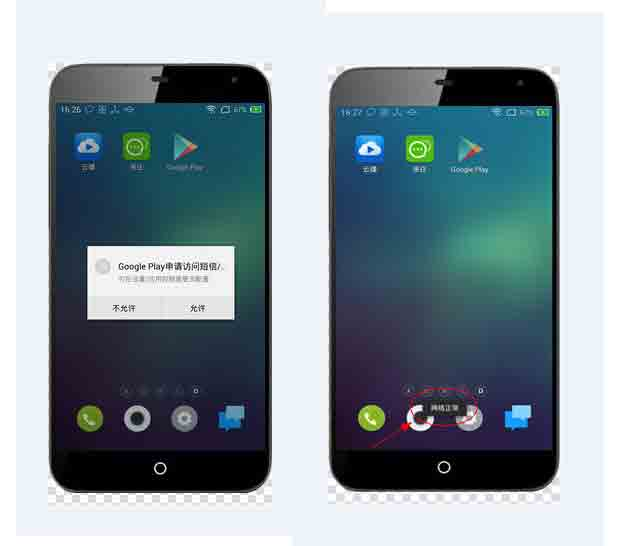

看到这，小明笑了，这不就是最正火的短信拦截马嘛。于是果断把手机通过豌豆荚导出目标 APK 文件包。如图所示


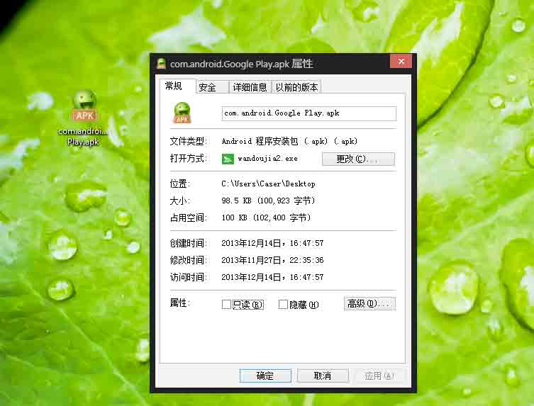

看着桌面上不到 100KB 的短信马，小明默默的系上了围裙（安卓虚拟环境），找出了手术刀（反编译工具 dex2jar+Xjad），把马儿按到在解剖台（Eclipse）上。

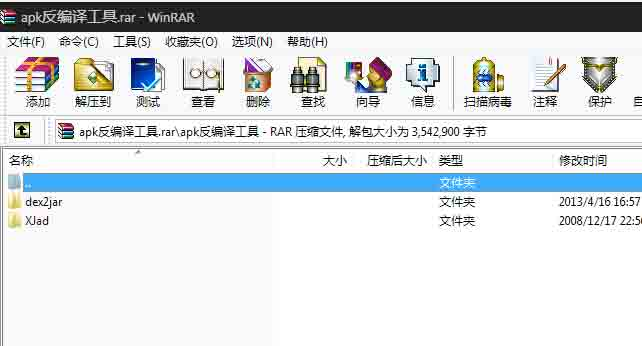

## 0x02 庖丁解牛

* * *

首先，小明把 APK 文件解压，然后找到关键的 classes.dex 文件。他是 APK 文件的 java 源码编译文件。

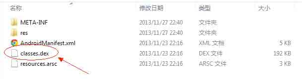

然后把 classes.dex 拷贝到 dex2jar 目录下,然后 cmd 进入 dex2jar 目录后再输入：dex2jar.bat classes.dex 回车,同目录下就得到我们想要的源码包：classes_dex2jar.jar

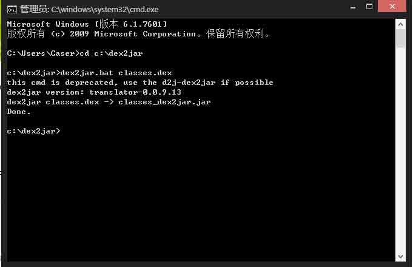

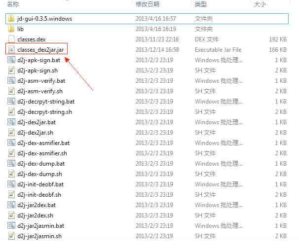

再请出我们的 jar 反编译 Xjad，点击文件-反编译 jar-选择上把生成的 jar 文件，就会反编译成源码文件夹。

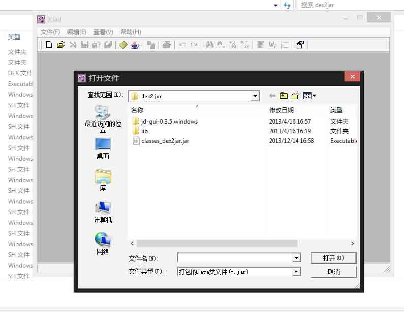

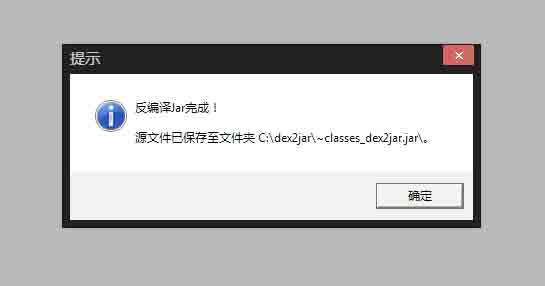

到这一步，我们的牛算是初步分解成功了，下面就是如何找出我们要的菲力牛排~

## 0x03 轻抚菊花

* * *

反编译后分析出木马和后台交互是通过调用 c#的 WebService 协议，而且菊花的 IP 是加密的，调用代码图如下: 

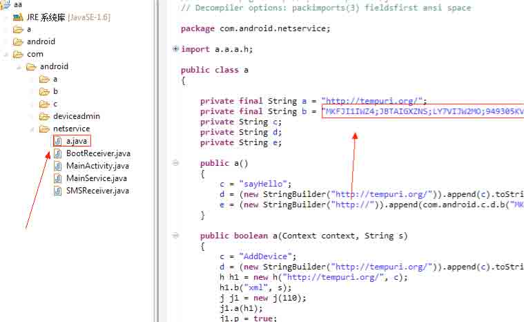

直接把加密代码，按图索骥找到加密函数后，反编译过来发现如下：

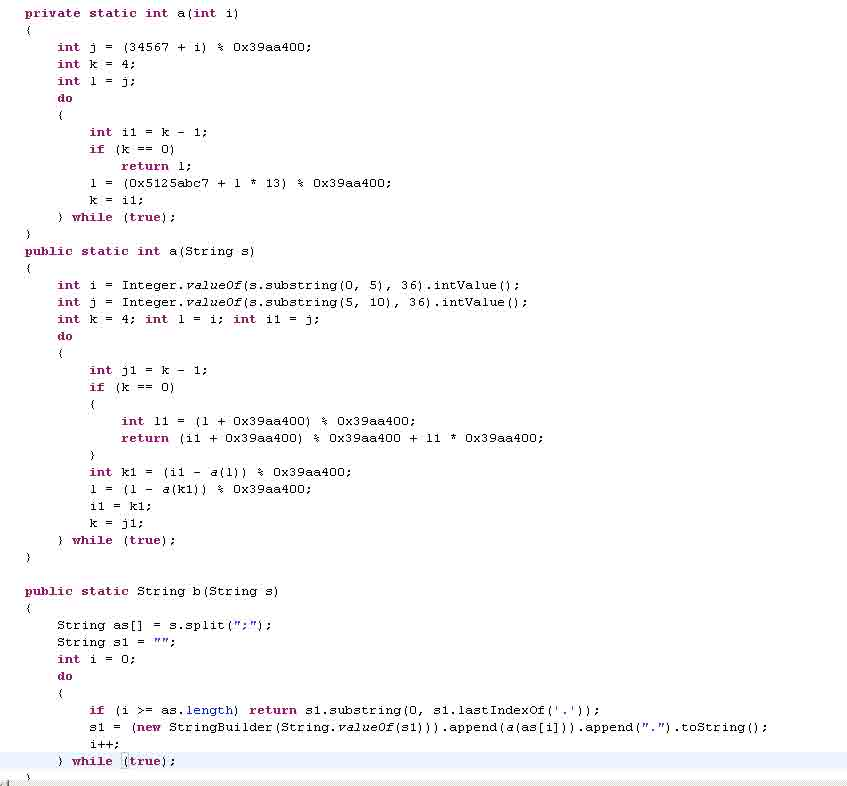

运行后，直接爆到服务器端的地址 http://103.X.X.X/priv1/baseservice.asmx

至此，找准了菊花的所在。下面开始研究爆菊啦

## 0x04 长驱注入（ 爆菊部分由 sql test 大牛完成）

* * *

既然找到后台地址了,下面怎么来拿下这后台，这是头疼的问题，用工具扫描了下没发现什么漏洞，本人能力有限。看样子只能从站点下手了，重新整理下思路，把 http://103.X.X.X/priv1/baseservice.asmx 输入到浏览器发现

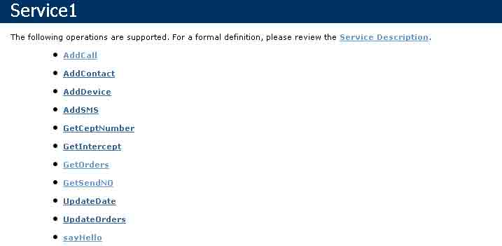

有这么几个方法，既然有方法可以我直接用下，打开程序引用了 WebService 代码如下：

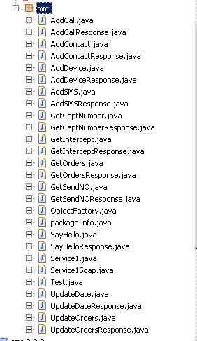

本来想试试 XSS ,用 AddCall 方法插入到数据库，代码如下


调用了下发现报错

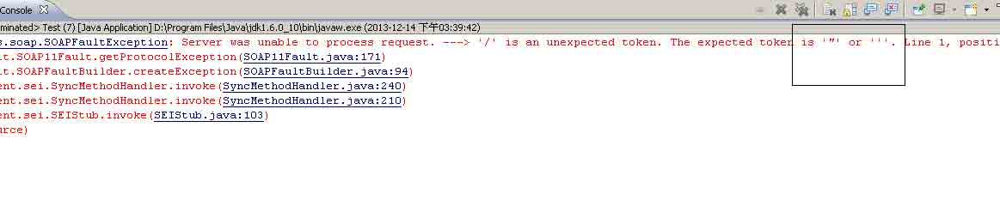

无语了，既然有 SQL 注入，下面我们来说下这 WebService SQL 注入。

挑选了一个获取方法 getOrders ,调用的时候把参数加了一个单引号提示 MYSQL 错误，这注入点也太多了吧

以下就改造了查询语句


返回了 XML：

```
<?xml version="1.0" encoding="UTF-8"?><RootJob><Job><Type>9</Type><Content>3</Content><Phone>2</Phone><JobID>1</JobID></Job></RootJob> 
```

这个一看就知道了，下面的步骤就不详细写，是 root 注入。

写入一句话，目标是 IIS，我也没找到目录程序目录，直接试了 C:Inetpubwwwroot 写了一个 Aspx 马上去了，在浏览器上访问成功了。

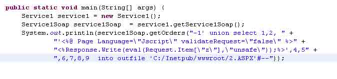

基本上完成了，剩下的就是提权了，在一个朋友的帮助下提权成功。

## 0x05 扩大战果

* * *

这时已经通过 mysql 拿到了服务器的权限，查看注册表发现端口是 55555，服务器版本为 2003R2，加了个用户就进去看看。

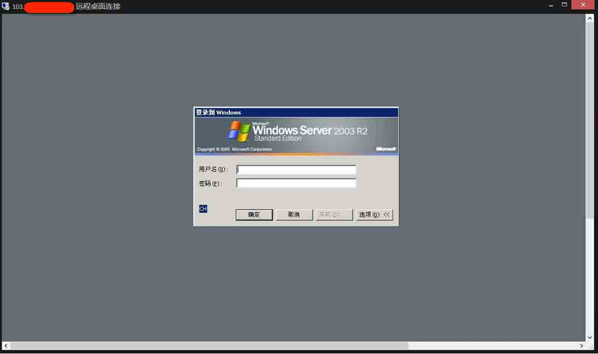

东西不复杂，IIS+mysql+C#的 WebService

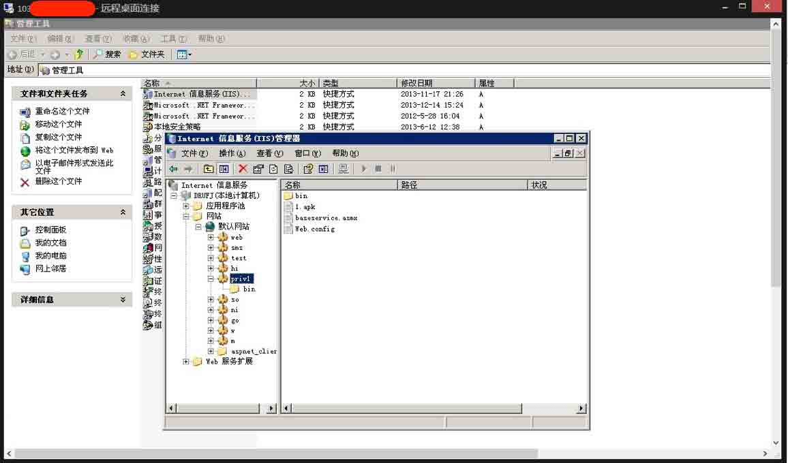

把 mysql 做了个远程，本地连上看看。一看之下，这个团伙通过短信马监控到被害者的内容令小明大吃一惊。

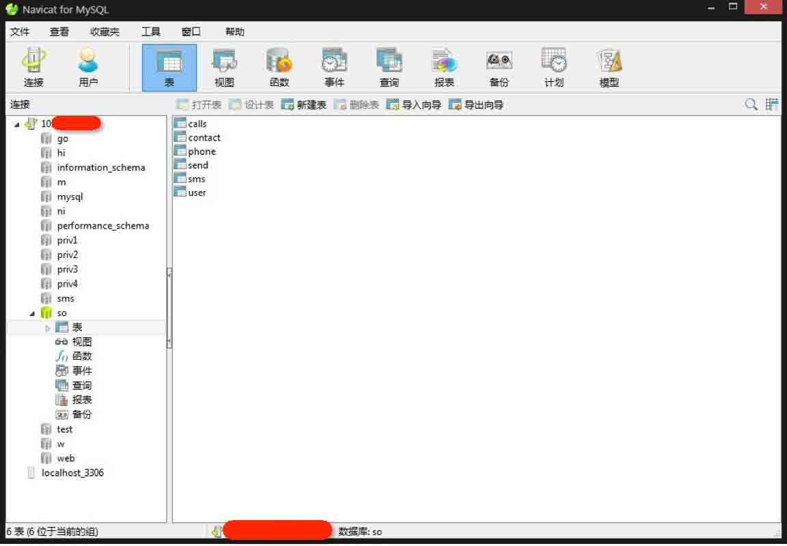

在 SO 这个库里，小明发现 N 多受害人的信息，包括大额的银行转账提示。如果这种短信被拦截的话，那后果可想而知。

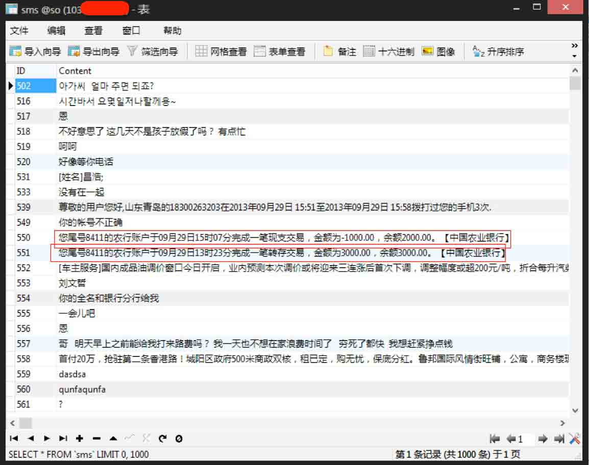

## 0x06 挖掘产业链

* * *

但凡一个行业必须是有利可图的，小明既然发掘到了源头，就逆流而上，去深挖一下，安卓短信拦截马的整个产业链条。

说干就干，小明在电脑上输入短信拦截马、短信马 出售等相关关键词，发现有很多人在发布相关的需求。

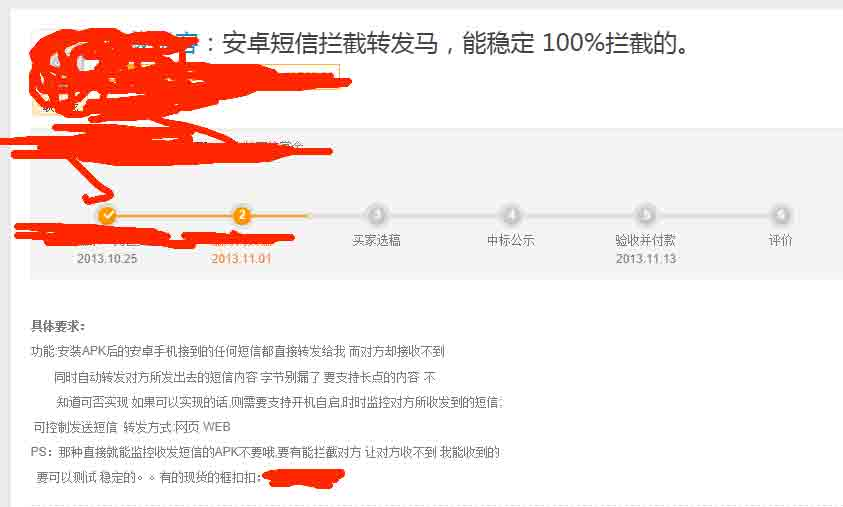

而是各种地下论坛里，很多相关求马的帖子。

他们买来主要就是为了诈骗。

或冒充熟人诈骗，或为了诱骗网银，或为了某些不可告人的秘密勾当。

随机找了个例子。

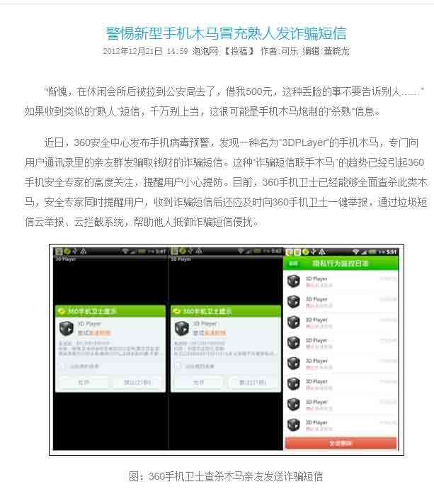

小明通过对代码的分析，发现短信马的运行方式是这样的。

一旦安装了木马的手机，并授权给木马后，木马会立刻上传受害手机的通讯录。该手机的所有短信来往都会发给指定的手机号，而且该手机号可以使用代码，来指挥木马进行伪造短信。从而实施诈骗的目的


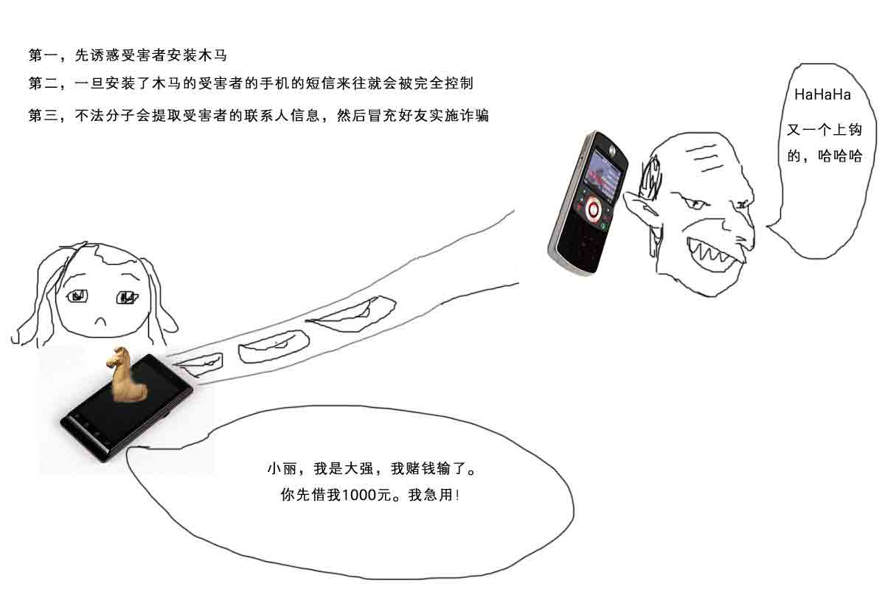

版权声明：未经授权禁止转载 [国士无双](http://drops.wooyun.org/author/国士无双 "由 国士无双 发布")@[乌云知识库](http://drops.wooyun.org)

分享到：

### 相关日志

*   [一次 app 抓包引发的 Android 分析记录](http://drops.wooyun.org/tips/2871)
*   [Samsung S Voice attack](http://drops.wooyun.org/tips/2736)
*   [XDS: Cross-Device Scripting Attacks](http://drops.wooyun.org/papers/1472)
*   [WebView 中接口隐患与手机挂马利用](http://drops.wooyun.org/papers/548)
*   [Android Adobe Reader 任意代码执行分析(附 POC)](http://drops.wooyun.org/papers/1440)
*   [Android Activtity Security](http://drops.wooyun.org/tips/3936)