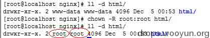
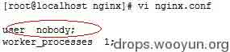
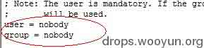

# Nginx 安全配置研究

2014/03/28 10:39 | [zhangsan](http://drops.wooyun.org/author/zhangsan "由 zhangsan 发布") | [技术分享](http://drops.wooyun.org/category/tips "查看 技术分享 中的全部文章"), [运维安全](http://drops.wooyun.org/category/%e8%bf%90%e7%bb%b4%e5%ae%89%e5%85%a8 "查看 运维安全 中的全部文章") | 占个座先 | 捐赠作者

## 0x00 测试环境

* * *

```
操作系统：CentOS6.5
Web 服务器：Nginx1.4.6
Php 版本：Php5.4.26 
```

## 0x01 Nginx 介绍

* * *

nginx 本身不能处理 PHP，它只是个 web 服务器，当接收到请求后，如果是 php 请求，则发给 php 解释器处理，并把结果返回给客户端。nginx 一般是把请求发 fastcgi 管理进程处理，fastcgi 管理进程选择 cgi 子进程处理结果并返回被 nginx。

nginx 涉及到两个账户，一个是 nginx 的运行账户，一个是 php-fpm 的运行账户。如果访问的是一个静态文件，则只需要 nginx 的运行账户对文件具有读取权限；而如果访问的是一个 php 文件，则首先需要 nginx 的运行账户对文件有读取权限，读取到文件后发现是一个 php 文件，则转发给 php-fpm，此时则需要 php-fpm 账户对文件具有读取权限。

## 0x02 研究发现的结论

* * *

```
1\. linux 下，要读取一个文件，首先需要具有对文件所在文件夹的执行权限,然后需要对文件的读取权限。 
2\. php 文件的执行不需要文件的执行权限，只需要 nginx 和 php-fpm 运行账户的读取权限。 
3\. 上传木马后，能不能列出一个文件夹的内容，跟 php-fpm 的运行账户对文件夹的读取权限有关。 
4\. 木马执行命令的权限跟 php-fpm 的账户权限有关。 
5\. 如果木马要执行命令，需要 php-fpm 的账户对相应的 sh 有执行权限。 
6\. 要读取一个文件夹内的文件，是不需要对文件夹有读取权限的，只需要对文件夹有执行权限。 
```

## 0x03 Nginx 服务器涉及到的安全配置

* * *

```
1\. Nginx.conf 的配置 
2\. php-fpm.conf 的配置 
3\. nginx 和 php-fpm 的运行账户对磁盘的权限配置 
4\. Php.ini 的配置 
```

## 0x04 常见需要配置的操作方法

* * *

### 1\. 禁止一个目录的访问

示例：禁止访问 path 目录

```
location ^~ /path { 
deny all; 
} 
```

可以把 path 换成实际需要的目录，目录 path 后是否带有"/",带“/”会禁止访问该目录和该目录下所有文件。不带"/"的情况就有些复杂了，只要目录开头匹配上那个关键字就会禁止；注意要放在 fastcgi 配置之前。

### 2\. 禁止 php 文件的访问及执行

示例：去掉单个目录的 PHP 执行权限

```
location ~ /attachments/.*\.(php|php5)?$ { 
deny all; 
} 
```

示例：去掉多个目录的 PHP 执行权限

```
location ~  
/(attachments|upload)/.*\.(php|php5)?$ { 
deny all; 
} 
```

### 3\. 禁止 IP 的访问

示例：禁止 IP 段的写法：

```
deny 10.0.0.0/24; 
```

示例：只允许某个 IP 或某个 IP 段用户访问，其它的用户全都禁止

```
allow  
x.x.x.x;  
allow 10.0.0.0/24;  
deny all; 
```

## 0x05 需要解决的常见问题

* * *

### 1\. 让木马上传后不能执行

针对上传目录，在 nginx 配置文件中加入配置，使此目录无法解析 php。

### 2\. 让木马执行后看不到非网站目录文件

取消 php-fpm 运行账户对于其他目录的读取权限。

### 3\. 木马执行后命令不能执行

取消 php-fpm 账户对于 sh 的执行权限。

### 4\. 命令执行后权限不能过高

Php-fpm 账户不要用 root 或者加入 root 组。

## 0x06 Nginx 安全配置方案

* * *

### 1\. 修改网站目录所有者为非 php-fpm 运行账户，此处修改所有者为 root。

命令：

```
chown -R root:root html/ 

```



### 2\. 修改 nginx 及 php-fpm 的运行账户及组为 nobody

```
nginx.conf 
```



```
Php-fpm.conf 
```



### 3\. 取消 nobody 对所有目录的的读取权限，然后添加对网站目录的读取权限

命令：

```
chmod o-r –R  /
chmod o+r –R html/

```

### 4\. 取消 nobody 对于/bin/sh 的执行权限 

```
chmod 776 /bin/sh 
```

### 5\. 确认网站目录对于 nobody 的权限为可读可执行，对网站文件的权限为可读

### 6\. 对于上传目录或者写入写文件的目录添加 nobody 的写入权限 

### 7\. 配置 nginx.conf 对于上传目录无 php 的执行权限

### 8\. 配置 nginx.conf 禁止访问的文件夹，如后台，或者限制访问 ip

### 9\. 配置 nginx.conf 禁止访问的文件类型，如一些 txt 日志文件

版权声明：未经授权禁止转载 [zhangsan](http://drops.wooyun.org/author/zhangsan "由 zhangsan 发布")@[乌云知识库](http://drops.wooyun.org)

分享到：

### 相关日志

*   [Apache 安全配置](http://drops.wooyun.org/%e8%bf%90%e7%bb%b4%e5%ae%89%e5%85%a8/2727)
*   [CVE 2015-0235: GNU glibc gethostbyname 缓冲区溢出漏洞](http://drops.wooyun.org/papers/4780)
*   [深入了解 SQL 注入绕过 waf 和过滤机制](http://drops.wooyun.org/tips/968)
*   [【.NET 小科普之一】数据库信息在哪儿](http://drops.wooyun.org/tips/975)
*   [生物特征识别之指纹识别，伪造，指纹设备缺陷设计](http://drops.wooyun.org/tips/2140)
*   [上传文件的陷阱](http://drops.wooyun.org/tips/2031)