# Kali Nethunter 初体验

2014/09/28 12:23 | [瘦蛟舞](http://drops.wooyun.org/author/瘦蛟舞 "由 瘦蛟舞 发布")   | [工具收集](http://drops.wooyun.org/category/tools "查看 工具收集 中的全部文章"), [移动安全](http://drops.wooyun.org/category/mobile "查看 移动安全 中的全部文章")  | 占个座先  | 捐赠作者

* * *

## 安装过程

* * *

1、官网环境要求：n5 n7 n10 android 4.4

2、实验设备:

*   N7 android 4.4.4
*   N7 android 4.4.3
*   N5 nadroid 4.4.2

3、开发者模式+usb 调试+解锁+root（一般刷过机的这些肯定都搞定了）

5、安装 busybox + TWRP

6、开启 MTP，卡刷包导入 sdcard 中，完成后关闭 MTP（也可以不用 MTP 直接 adb pull 进去）

7、使用 TWRP 进入 recovery（reboot recovery），安装 rom，等待半小时就 OK 了。

先来张帅气的桌面

## BadUSB MITM Attack

* * *

恶意 USB 中间人攻击：将装有 nethunter 的设备接入受害者电脑，执行此攻击可以劫持受害者流量。

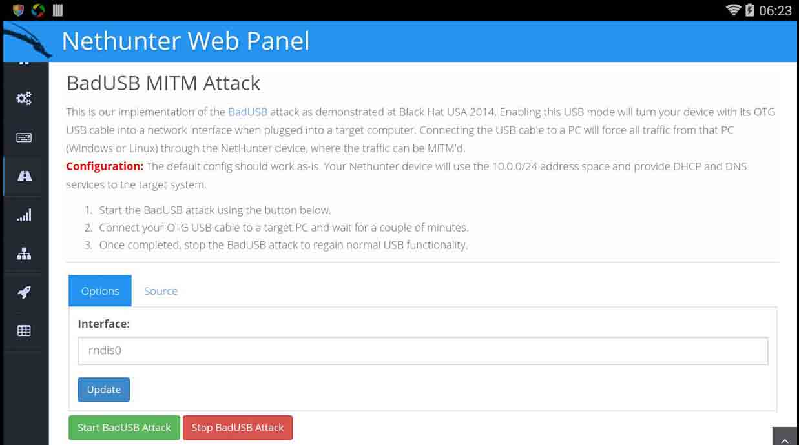

tcpdump 监听(默认 tcpdump 是被精简了的，需要自己上传一个。或者进入 kali shell)执行 tcpdump -i rndis0 icmp

受害者 PC 在攻击开始之前的网关

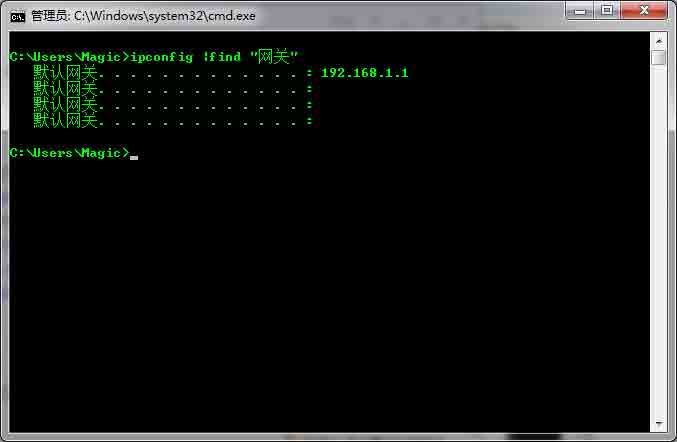

受害者 PC 在攻击开始之后的网关

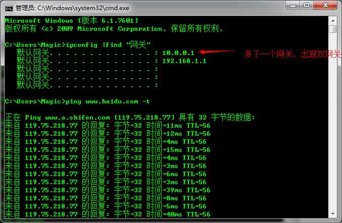

因为出现双网关现在所以并未像官网演示的那样流量直接走向恶意网关（10.0.0.1）而是依旧走的之前的网关（192.168.1.1）故劫持失败。在删除之前的网管后才生效。本帽觉得可以结合下文的**HID Keyboard Attack**先设置一个定时脚本执行对路由表的操作（删除原网关）。

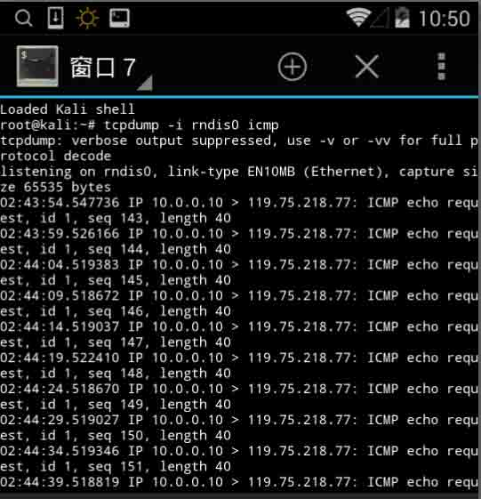

## HID Keyboard Attack

* * *

键盘劫持攻击：将智能设备伪造成功输入设备比如键盘输入恶意指令。比如添加管理员，反弹 shell...

下面的添加管理员的演示，因为只是伪装键盘所以锁屏下是无法进行的。

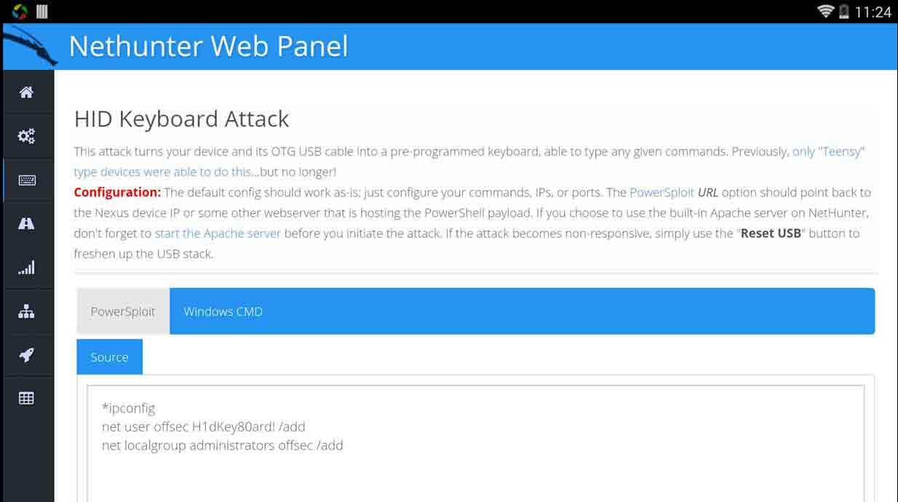

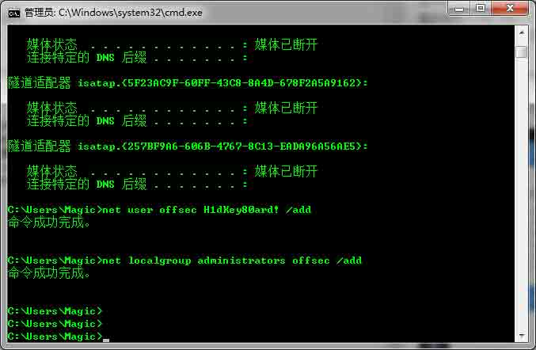

还要配置 payload 和监听懒得弄了。

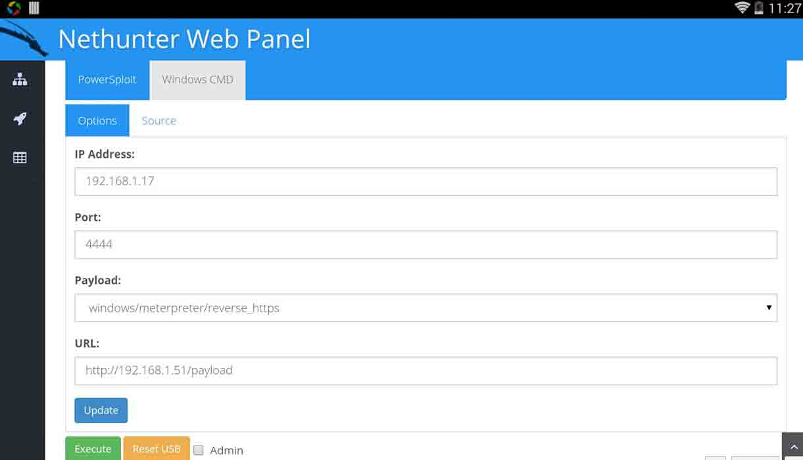

## 其他功能

* * *

功能菜单

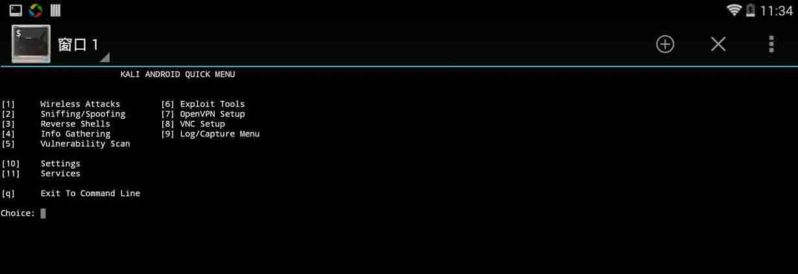

Mana 伪造 ap，dnsmasq,hostap，wifite(网卡原因，有关无线的实验未成功,感觉得有 sim 卡才行)

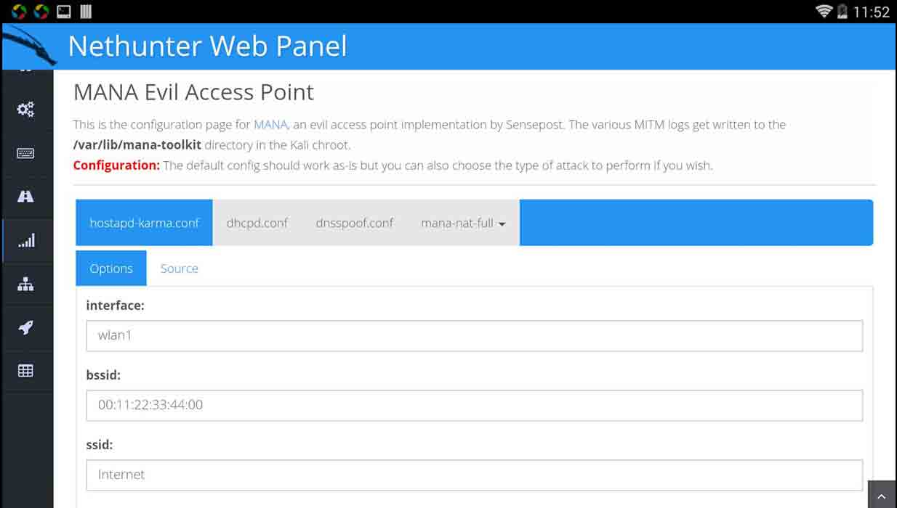

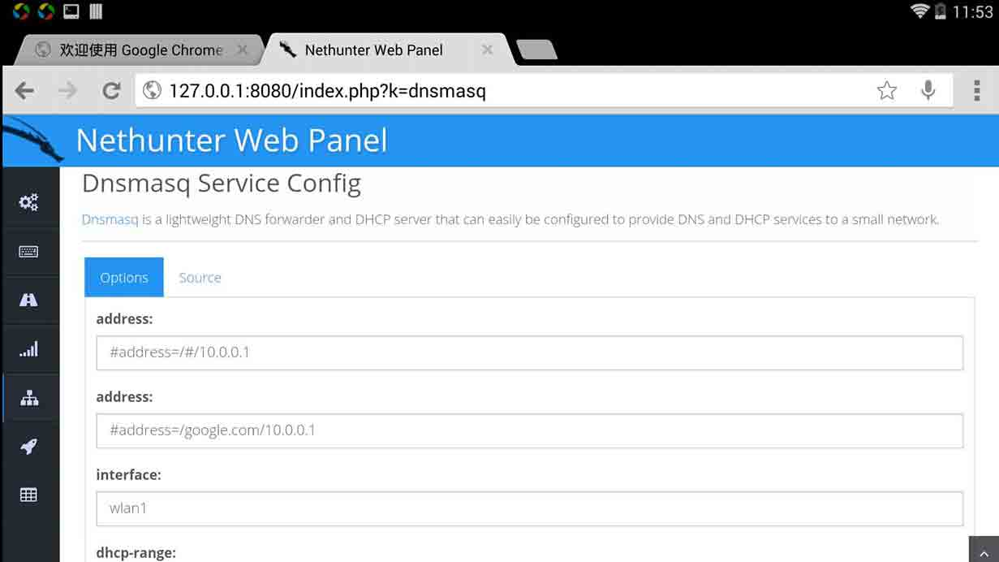

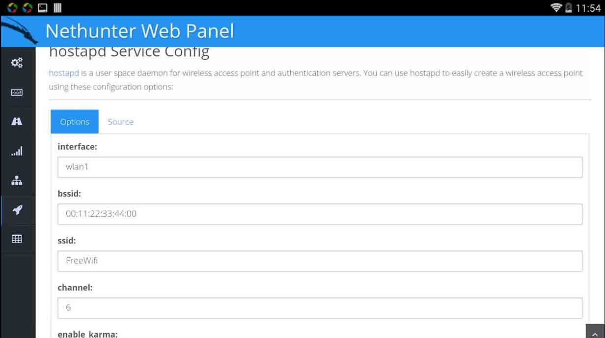

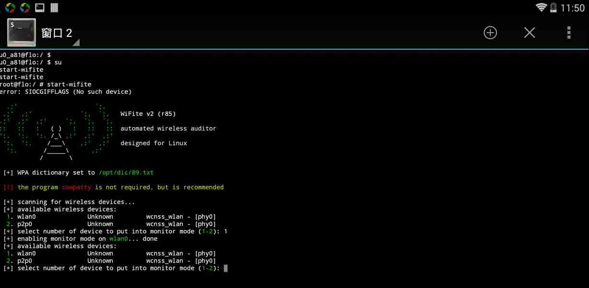

## 总结

* * *

nethunter 整体感觉比较鸡肋瑞士军刀言过其，刷着玩玩还可以，真指望他干些啥有价值的事情利用场景还是非常局限的。实在没啥好说的了，折腾了一段时间把经验和感想写出来分享给大家总比那些完全没有思考和实践仅从官网翻译几句话盗几张图来得有价值。

[下载](http://www.offensive-security.com/kali-linux-nethunter-download/)

[官网](http://www.kali.org/kali-linux-nethunter/)

[介绍](http://nethunter.com/)

版权声明：未经授权禁止转载 [瘦蛟舞](http://drops.wooyun.org/author/瘦蛟舞 "由 瘦蛟舞 发布")@[乌云知识库](http://drops.wooyun.org)

分享到：碎银子打赏，作者好攒钱娶媳妇：

### 相关日志

*   [Android UXSS 阶段性小结及自动化测试](http://drops.wooyun.org/tools/3186)
*   [Android 证书信任问题与大表哥](http://drops.wooyun.org/tips/3296)
*   [Android Content Provider Security](http://drops.wooyun.org/tips/4314)
*   [Android Activtity Security](http://drops.wooyun.org/tips/3936)
*   [Android Broadcast Security](http://drops.wooyun.org/tips/4393)
*   [Android Logcat Security](http://drops.wooyun.org/tips/3812)