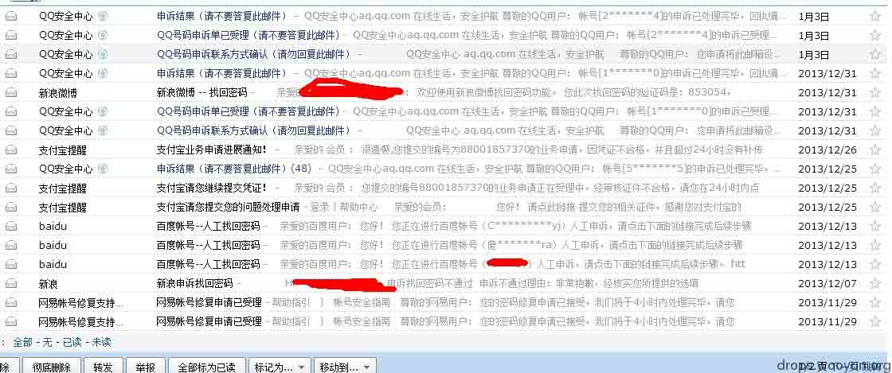
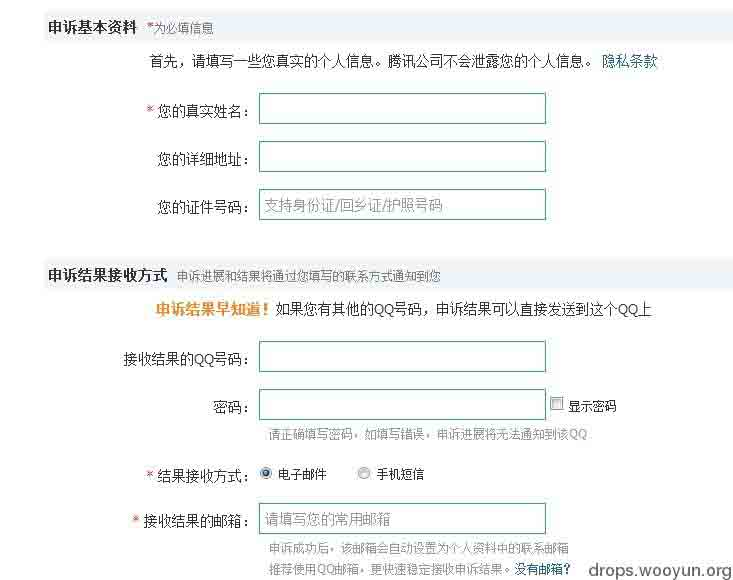
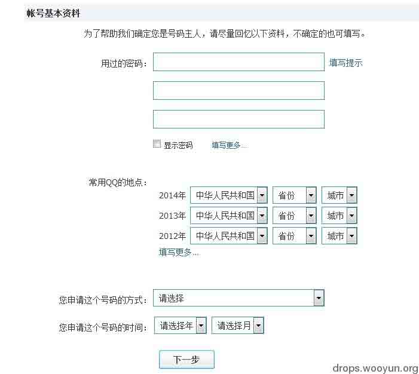
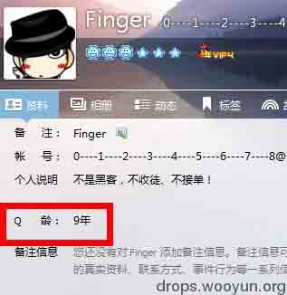

# QQ 申诉那点事

2014/01/15 17:13 | [李旭敏](http://drops.wooyun.org/author/李旭敏 "由 李旭敏 发布") | [技术分享](http://drops.wooyun.org/category/tips "查看 技术分享 中的全部文章"), [运维安全](http://drops.wooyun.org/category/%e8%bf%90%e7%bb%b4%e5%ae%89%e5%85%a8 "查看 运维安全 中的全部文章") | 占个座先 | 捐赠作者

## 0x00 背景

* * *

这算是一篇扯蛋的文章，也可以说是一个申诉漏洞的总结。

以下案例都是我自己亲自试验的。绝无虚假之处，（可能有些地方会夸张把~）

事情要从“乌云白帽子被盗事件”说起，因为白帽子“鬼魅羊羔”不知何原因，被人申诉了 QQ，再加上乌云网的安全保护措施还没有完善。让盗号者有了可乘之机。而且。希望乌云网能够在找回密码的地方加个验证码把，不然像[`zone.wooyun.org/content/6613`](http://zone.wooyun.org/content/6613)这里一样，撒网式盗号（批量导入乌云社区采集的白帽子邮箱，然后找到 QQ 邮箱，可进行社工等各种手法拿下 QQ 从而拿下乌云网帐号）。这个是题外话了。

我本人对申诉就有了那么一点兴趣。先说 QQ 申诉把····我第一次尝试申诉别人的 QQ 的时候，几率是 3/8。

吸取经验后，第二次的几率高达 5/8。或许你不信，或者说我在装逼，不过你可以问肉肉~她是我最好的证人。其中的 8 人。5 个是我身边的人，3 个是不认识的陌生人。成功的人中有 3 个是身边的人，2 个是陌生人。

利用手法很简单，就是半真半假，运气成分也不小。

事后申诉失败的次数也不少···

成功的申诉记录我因为某些私人就不方便公开了。

## 0x01 细节

* * *

先看申诉 QQ 的第一步，先收集好各方面的信息，

不完整或者不确定是否真实不要紧。

只要收集好，便可以。

第一个要填写的是姓名，这个不难，一般可以从对方的空间或者说说寻找到他的名字。

如果对方 QQ 空间有权限限制。那么可以去看看 QQ 校友（朋友网），或者腾讯微博。

个人觉得最容易泄漏信息的反而是微博，腾讯微博一般使用的都是真实名字，又或者是对方腾讯微博的 ID

比如 xiaoming0101 或者 lixiaoming20140114,这个可能是对方的名字和生日。

详细地址仍然可以通过 QQ 聊天获取 IP 地址和对方的一些个人资料啊，微博填写的所在地。

最简单的就是去看微信，对方微信写的所在地肯定是真的把？

获取结果的邮箱，这个可以随便写，推荐写一个自己的小号 QQ 和密码。（防止对方或者客服察觉）

获取验证码后到了下一步

这个才是最好玩的地方，比如填写密码，这个可以通过网上泄漏的数据库，和网上一些在线查询的社工库

一些常用的密码，如果没有很多的信息，那就靠瞎猜的啦。

比如试试对方的手机，a+对方的 QQ q+对方的 QQ qq+对方的 QQ 对方的常用 ID 

密码选项最多可以填写 8 个，按照我上面说的组合方法，组合出的密码肯定不值 8 个。

其中比如 a123456，q123456, qq123456 这类加上自己的 QQ 的密码也并不少见。

而且我曾经问过客服，腾讯客服说，申诉审核是半人工半后台自动识别的。我猜后台会自动匹配以前使用过的信息。所以，上面这么多组合，只要他使用过其中一个密码，或者相近的，你的成功率就会多 10%。

常用 QQ 地点~这个可是个浪费时间的活儿。

这个可以去看看对方的微博或者说说，不少人有一些习惯，会定位自己所在位置，比如“我在北京市海淀区 XX 街“ 根据这个，我们可以判断他这一年常用的地点了。准确率的话也不算太高，不过总比瞎猜的好。

申请 qq 的方式

这个是最简单的了，没有之一。

申请方式，这个可以去看看对方有没有密保手机，有密保手机的话，等级高的话，可能是近几年绑定的。

如果没有密保手机，那么这个 QQ 肯定是通过网站注册的了。如果有密保手机等级低的话，可能是通过手机申请的。

申诉 QQ 的时间，这个嘛，可以看 Q 龄。没错，除了接触 IT 行业的，熟悉社会工程学的。

一般人都选择将这些无关痛痒的功能对陌生人显示，比如目标的 Q 龄是 4 年，那么我们可以判断，他的 QQ 是 2009 注册的。因为注册要满 1 年后，才算 Q 龄 1 年。也就是减去可 Q 龄还要减去多一年就是 QQ 的注册时间年了。具体时间，可以问问对方的，比如对方 QQ 是 7 位数的，或者少一点的，你可以套近乎的说”哇，你的 QQ 是 7 位数的唉，什么的时候申请的？我也想要啊“之类的奉承话。

然后到了下一步，我就不上图了

就是对方的历史密保问题的答案，历史密保手机的号码。、

这些就要看你信息收集的程度了。一般拿到的对方的手机都不难。

然后到最后一步，就是 QQ 好友。

这个呢，鬼魅羊羔在帖子里有提过[`zone.wooyun.org/content/6425`](http://zone.wooyun.org/content/6425)

对方可能是开了小号加他···凑够了 3 个人。

这里还真的没说错，我自己试验了一下，一般至少要 2 个好友以上才会申诉成功。

而 QQ 好友可以是已经删除的，或者是经常聊天的。但是，这里隐藏了一个小技巧。

也可以是最近添加的，并且最近有近几天还有聊天过的好友。

案例 1:

我申诉一个骗子 QQ 的时候，失败了 26 次。你没看错，是 26 次。

当时是因为骗了一个女性朋友 200 元。她是一个住宿的学生，一个月的伙食费大概就 400 把。

当时我答应帮她了，然后就去收集了些许信息。当时按照我说的以上说的步骤都很成功，

失败了 2 次后，第三次成功了，我当时只利用了 2 个 QQ 好友就拿下了。1 个是我自己创的小号，为了和她套近乎，第二个是我女性朋友的 QQ，被骗后已经被她删除。加骗子和被骗子删的时间不到一个星期把。

申诉成功的时候是中午，当时那骗子经常在线，我怕重置密保后没多久就会被申诉回去。得不偿失。而且白天也要上班，没多余的时间管她。

于是乎我想等到晚上再继续。但是到了晚上，我填写申诉成功的凭证后，系统提示失效了，我一查，没错啊，申诉成功后，成功凭证内 7 天有效。后来才知道，原来骗子可能知道我在社她的密保问题，然后马上改了密保，然后我申诉成功的凭证就作废了····这坑爹啊！~~~

然后后面的大家都猜到了，我循环以相同的手法再去申诉，对方的 QQ。一直失败啊失败啊。

直到现在，再也没有成功过，其中我多次去找客服，客服只是安慰我，

once again ! 【除了哄人，真心没觉得有帮助】 所以我猜，申诉还有个黑名单机制。如果发现对方不是该号 的主人或者多次申诉。可能就会一直失败了。 这里要提一点，对于身边的人的 QQ 我申诉几率可以说有 80%了。很大原因也是因为我和他的登陆 IP 都是同一个城市，这里申诉时最好申诉人的 IP 和辅助好友 IP 不要一样。我之前是没有代理 IP，直接利用 2 个新 QQ 申诉掉别人的 QQ，题外话。我曾经想申诉 A 君的 QQ 来做案例，我身边也有不少好友加到 A 君，但是他们都不愿意帮助我，因为他是一个不错的白帽子，不过他知名度也挺高，也至于如果成功的话，会对 A 君有影响，A 君一些信息，百度百科上都有，包括之前泄漏的酒店数据库也有他的名字。我还是有信心能拿下 A 君的 QQ，只需要几个好友而已···········所以，希望 A 君能够保护好自己

对于最近泄漏的 QQ 群数据库和以前的几 G 的 QQ 老密码。对于申诉简直就是如虎添翼···比如昨天看到的，QQ 群关系网查询的一个网站。

列出了对方 QQ 的人际关系网。很恐怖。 一般 QQ 都会加过一些班群或者校群，通过这个网站我们就可以知道目标就读的学校啊，或者曾经就读的学校。这些对于申诉来说也是帮助很大的。

配合之前酒店数据库泄漏事件。人肉搜索真的会越来越严重·····

以上仅供参考和反思，学习就不要了。

## 0x02 总结

* * *

方小顿曾说过，大数据时代，你不保护好自己，谁会保护你？

对于上面也提到过，如果发现对方改你的密保或者套取你的密保问题，第一时间就是马上修改相关密保问题，让对方申诉失效。QQ 针对申诉的问题出了一个不错的功能，就是微信。在微信上关注 QQ 安全中心还是能够有效的第一时间知道自己的 QQ 安全状况。

将来短期内将会和肉肉针对重放攻击写一篇文章。希望能多多支持··

版权声明：未经授权禁止转载 [李旭敏](http://drops.wooyun.org/author/李旭敏 "由 李旭敏 发布")@[乌云知识库](http://drops.wooyun.org)

分享到：

### 相关日志

*   [Linux 被 DDOS&CC 攻击解决实例](http://drops.wooyun.org/tips/2457)
*   [lnmp 虚拟主机安全配置研究](http://drops.wooyun.org/tips/2866)
*   [SQL SERVER 2008 安全配置](http://drops.wooyun.org/tips/1670)
*   [基于 ossec logstash es 大数据安全关联分析](http://drops.wooyun.org/tips/2821)
*   [批量网站 DNS 区域传送漏洞检测——bash shell 实现](http://drops.wooyun.org/tips/2014)
*   [从 cloudstack 默认配置看 NFS 安全](http://drops.wooyun.org/tips/1473)