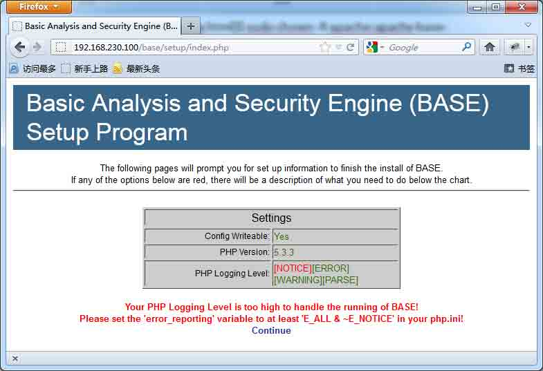
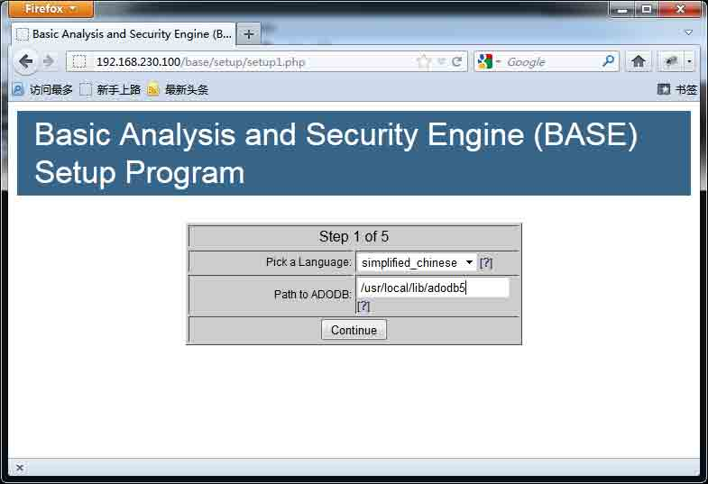
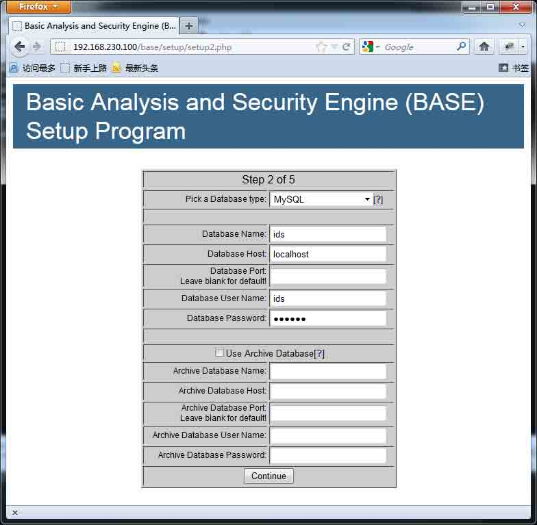
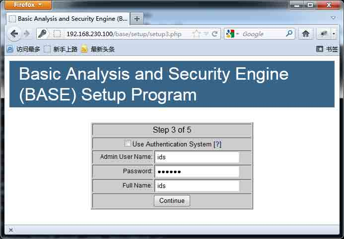
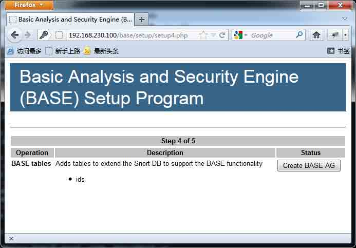
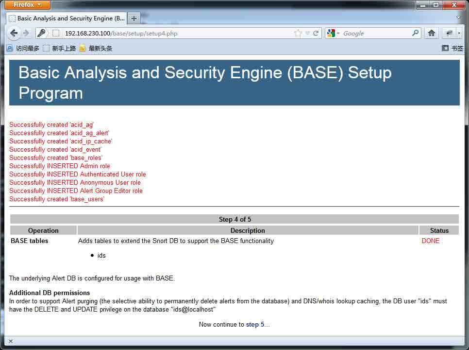
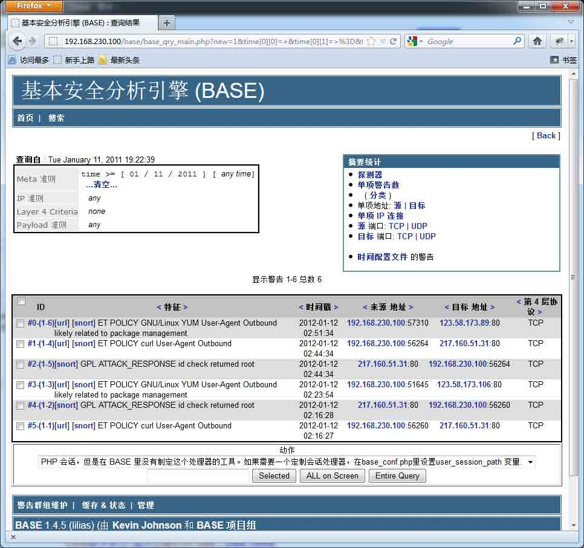

# CentOS 6.2 下安装基于 Suricata + Barnyard 2 + Base 的⼊侵检测系统

2013/08/05 19:24 | [五道口杀气](http://drops.wooyun.org/author/五道口杀气 "由 五道口杀气 发布") | [技术分享](http://drops.wooyun.org/category/tips "查看 技术分享 中的全部文章") | 占个座先 | 捐赠作者

## 0x00 准备工作

* * *

CentOS 6.2 我是最小化安装，同时使用 163 的源进行 update，所以还需要安装如下的依赖包：

```
[root@root ~]$ sudo yum install gcc make pcre pcre-devel libpcap libpcap-devel 
```

同时需要关闭 iptables、ip6tables：

```
[root@root ~]$ sudo service iptables stop
[root@root ~]$ sudo service ip6tables stop
[root@root ~]$ sudo chkconfig --level 2345 iptables off
[root@root ~]$ sudo chkconfig --level 2345 ip6tables off 
```

需要下载的软件：

```
Suricata

http://www.openinfosecfoundation.org/index.php/downloads

Barnyard 2

http://www.securixlive.com/barnyard2/

Base

http://base.secureideas.net/

yaml

http://pyyaml.org/

adodb

http://sourceforge.net/projects/adodb/

rules

http://rules.emergingthreats.net/open/suricata/emerging.rules.tar.gz

Image_Canvas

http://download.pear.php.net/package/Image_Canvas-0.3.3.tgz

Image_Graph

http://download.pear.php.net/package/Image_Graph-0.8.0.tgz 
```

## 0x01 配置 APM 环境

* * *

Base 需要 APM（Apache、PHP、Mysql）环境，通过 yum 来进行安装。

```
[root@root ids]$ sudo yum install httpd php mysql mysql-server mysql-devel php-mysql php-gd php-pear 
```

启动 httpd、mysql 服务

```
[root@root ids]$ sudo /etc/init.d/httpd start
[root@root ids]$ sudo /etc/init.d/mysqld start 
```

默认的 web 根目录是`/var/www/html`，在此目录新建 phpinfo 测试文件，来确认配置是否正确。

PS：mysql 安装后 root 账号默认口令为空，通过下面命令可以修改 root 账号口令

```
[root@root ~]$ mysqladmin -uroot -p password [新密码] 
```

## 0x02 安装 Barnyard 2

* * *

安装过程如下：

```
[root@root ids]$ tar zxvf barnyard2-1.9.tar.gz
[root@root ids]$ cd barnyard2-1.9
[root@root barnyard2-1.9]$ ./configure --with-mysql
[root@root barnyard2-1.9]$ make
[root@root barnyard2-1.9]$ sudo make install 
```

## 0x03 安装 Suricata

* * *

安装过程如下：

Suricata 需要依赖 yaml，首先安装 yaml

```
[root@root ids]$ tar zxvf yaml-0.1.4.tar.gz
[root@root ids]$ cd yaml-0.1.4
[root@root yaml-0.1.4]$ ./configure
[root@root yaml-0.1.4]$ make
[root@root yaml-0.1.4]$ sudo make install

[root@root ids]$ tar zxvf suricata-1.1.1.tar.gz
[root@root ids]$ cd suricata-1.1.1
[root@root suricata-1.1.1]$ ./configure
[root@root suricata-1.1.1]$ make
[root@root suricata-1.1.1]$ sudo make install 
```

## 0x04 配置 Suricata、Barnyard 2

* * *

### 配置 Barnyard 2

把 Barnyard 2 安装源文件中的`etc/barnyard2.conf`文件拷贝到 Suricata 的配置目录下

```
[root@root ids]$ cd barnyard2-1.9
[root@root barnyard2-1.9]$ sudo cp etc/barnyard2.conf /etc/suricata/ 
```

创建 barnyard2 日志目录`/var/log/barnyard2`

```
[root@root ~]$ sudo mkdir /var/log/barnyard2 
```

### 配置数据库

需要创建数据库和相应的账号

```
[root@root ~]$ mysql -uroot –p
mysql> create database ids;
mysql> grant create,select,update,insert,delete on ids.* to ids@localhost identified by 'ids123'; 
```

Barnyard 2 安装源文件中的 schemas/create_mysql 是创建表的 sql 文件，通过如下方式建表：

```
[root@root ~]$ mysql -uids -p -Dids < ids/barnyard2-1.9/schemas/create_mysql 
```

### 配置 Suricata

创建 Suricata 配置目录和日志目录

```
[root@root ~]$ sudo mkdir /var/log/suricata
[root@root ~]$ sudo mkdir /etc/suricata 
```

把规则文件拷贝到 Suricata 配置目录下

```
[root@root ids]$ tar zxvf emerging.rules.tar.gz
[root@root ids]$ sudo cp -R rules/ /etc/suricata/ 
```

把 Suricata 安装源文件中的`suricata.yaml/classification.config/reference.config`文件拷贝到 Suricata 的配置目录下

```
[root@root ids]$ cd suricata-1.1.1
[root@root suricata-1.1.1]$ sudo cp suricata.yaml classification.config reference.config /etc/suricata/ 
```

编辑 barnyard2.conf 文件

```
[root@root ~]$ cd /etc/suricata/
[root@root suricata]$ sudo vim barnyard2.conf 
```

找到下面的内容

```
config reference_file:      /etc/snort/reference.config
config classification_file: /etc/snort/classification.config
config gen_file:            /etc/snort/gen-msg.map
config sid_file:                /etc/snort/sid-msg.map 
```

更改为的内容如下：

```
config reference_file:      /etc/suricata/reference.config
config classification_file: /etc/suricata/classification.config
config gen_file:            /etc/suricata/rules/gen-msg.map
config sid_file:            /etc/suricata/rules/sid-msg.map 
```

同时在文件的末尾添加如下行，红色的 mysql 数据库、账号信息根据实际情况填写

```
output database: log, mysql, user=ids password=ids123 dbname=ids host=localhost 
```

编辑 suricata.yaml 文件

```
[root@root suricata]$ sudo vim suricata.yaml 
```

找到

```
HOME_NET: "[192.168.0.0/16,10.0.0.0/8,172.16.0.0/12]" 
```

这一行，根据实际的网络情况来修改，在这里我修改为

```
HOME_NET: "[192.168.0.0/16]" 
```

找到下面的内容：

```
host-os-policy:
  # Make the default policy windows.
  windows: [0.0.0.0/0]
  bsd: []
  bsd_right: []
  old_linux: []
  linux: [10.0.0.0/8, 192.168.1.100, "8762:2352:6241:7245:E000:0000:0000:0000"]
  old_solaris: []
  solaris: ["::1"]
  hpux10: []
  hpux11: []
  irix: []
  macos: []
  vista: []
  windows2k3: [] 
```

根据实际网络情况修改。

启动 Suricata、Barnyard 2

```
[root@root ~]$ sudo /usr/local/bin/barnyard2 -c /etc/suricata/barnyard2.conf -d /var/log/suricata -f unified2.alert -w /var/log/suricata/suricata.waldo -D
[root@root ~]$ sudo /usr/local/bin/suricata -c /etc/suricata/suricata.yaml -i eth1 -D 
```

启动 suricata 的-i 参数是镜像流量的网卡。

测试 suricata 工作是否正常，可以通过如下命令：

```
[root@root suricata]$ curl www.testmyids.com 
```

执行后，/var/log/suricata 目录下的 fast.log/suricata.waldo/unified2.alert*文件大小发生变化，同时查看 fast.log 文件有如下类似的内容则表示 suricata 工作正常：

```
01/12/2012-02:16:27.964981  [**] [1:2013028:3] ET POLICY curl User-Agent Outbound [**] [Classification: Attempted Informa
tion Leak] [Priority: 2] {TCP} 192.168.230.100:56260 -> 217.160.51.31:80
01/12/2012-02:16:28.309707  [**] [1:2100498:7] GPL ATTACK_RESPONSE id check returned root [**] [Classification: Potential
ly Bad Traffic] [Priority: 2] {TCP} 217.160.51.31:80 -> 192.168.230.100:56260 
```

## 0x05 配置 Base

* * *

Base 需要用到 adodb 以及 Image_Canvas、Image_Graph 绘图组件，配置过程如下：

解压 adodb514.zip

```
[root@root ids]$ unzip adodb514.zip 
```

把 adodb5 拷贝到/usr/local/lib/目录下，这个目录随意指定，记下来后面要用到

```
[root@root ids]$ sudo cp -R adodb5 /usr/local/lib/ 
```

安装 Image_Canvas、Image_Graph

```
[root@root ids]$ sudo pear install Image_Canvas-0.3.3.tgz
[root@root ids]$ sudo pear install Image_Graph-0.8.0.tgz 
```

解压 base-1.4.5.tar.gz

```
[root@root ids]$ tar zxvf base-1.4.5.tar.gz 
```

拷贝 base-1.4.5 到/var/www/html 目录下

```
[root@root ids]$ sudo cp -R base-1.4.5 /var/www/html/base 
```

更改/var/www/html/base 的属主为 apache

```
[root@root ids]$ cd /var/www/html/
[root@root html]$ sudo chown -R apache:apache base 
```

然后通过浏览器访问 http://192.168.230.100/base



根据页面中红色的部分提示来进行操作。

修改 php.ini

```
[root@root html]$ sudo vim /etc/php.ini 
```

找到

```
error_reporting = E_ALL & ~E_DEPRECATED 
```

内容，修改为如下：

```
error_reporting = E_ALL & ~E_DEPRECATED & ~E_NOTICE 
```

重新载入 apache 配置

```
[root@root html]$ sudo /etc/init.d/httpd reload 
```

然后点击“Continue”到下一步  

选择语言，和前面我们的 adodb5 的路径，然后点击“Continue”  

填写 mysql 相关信息，点击“Continue”继续  

填写认证的相关信息，如果需要验证身份，请勾上“Use Authentication System”,点击“Continue”  

点击“Create BASE AG”  

点击“step 5”，跳到首页。

 

## 0x06 最后

* * *

以上是整个安装过程，IDS 的价值在于规则设置的是否合适，根据实际情况设置合适的规则才能够体现 IDS 的强大。规则的设置见以后的文章。

**Tags:** [入侵](http://drops.wooyun.org/tag/%e5%85%a5%e4%be%b5), [检测](http://drops.wooyun.org/tag/%e6%a3%80%e6%b5%8b)

版权声明：未经授权禁止转载 [五道口杀气](http://drops.wooyun.org/author/五道口杀气 "由 五道口杀气 发布")@[乌云知识库](http://drops.wooyun.org)

分享到：

### 相关日志

*   [搭建基于 Suricata+Barnyard2+Base 的 IDS 前端 Snorby](http://drops.wooyun.org/papers/653)
*   [OSSEC 学习教程一](http://drops.wooyun.org/tips/636)
*   [Zmap 详细用户手册和 DDOS 的可行性](http://drops.wooyun.org/tools/515)
*   [利用 insert，update 和 delete 注入获取数据](http://drops.wooyun.org/tips/2078)
*   [php4fun.sinaapp.com PHP 挑战通关攻略](http://drops.wooyun.org/papers/660)
*   [Kippo 蜜罐指南](http://drops.wooyun.org/papers/4578)