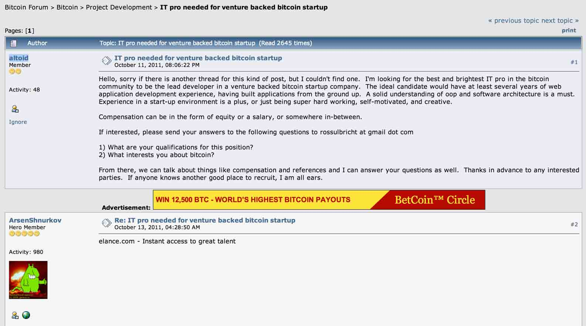

# 从丝绸之路到安全运维（Operational Security）与风险控制（Risk Management） 上集

2013/10/14 16:13 | [insight-labs](http://drops.wooyun.org/author/insight-labs "由 insight-labs 发布")   | [业界资讯](http://drops.wooyun.org/category/news "查看 业界资讯 中的全部文章")  | 占个座先  | 捐赠作者

## 0x00 背景

* * *

2013 年 10 月 2 日，在大家都沉浸在十一长假喜悦中的时候，遥远的美国爆发出了一个震惊 Tor 社区和比特币社区的消息，运营在 Tor 上使用 hidden service 和用比特比交易的 Silkroad 丝绸之路被 FBI 查封，并且创始人 Ross William Ulbricht，也就化名为 Dread Pirate Roberts 的网站管理员和主要运营者在美国被抓。在大家都认为这种运营方式无懈可击绝无被查水表可能的时候，勤劳的 FBI 却早在今年 7 月就已经获得了丝绸之路服务器的硬盘镜像，并且潜伏在服务器中长达 3 个月，从而获得了网站管理员的真实身份。

和美国政府作对，面对的将是全世界最强大的社工手段和全世界最全的 0day 库，一旦被定位，很可能会被物理消灭。这样的人需要的是智慧，胆识和技术，不幸的是，似乎丝绸之路的创始人哪样都差了那么一些。

根据 FBI 提交给法官的文件，里面详细的描述了他们是如何找到并且如何证明 Ross 就是 DPR 这个人的。不过该文件却对如何进入 silkroad 的服务器一笔带过，这让 Tor 社区感到非常不安，大家都在怀疑 FBI 是通过和 NSA 的合作关系，利用了传说中的国家级大数据和隐藏在 Tor 中的后门找到了服务器的真实 IP，通过 IP 又通过一纸搜查令让服务器提供商复制了一份服务器硬盘内容。

不过即使 FBI 没能进入丝绸之路的服务器，要找到创始人看来也没有想象中的那么困难。FBI 的文件显示，在丝绸之路创立的初期，创始人犯了很多 2B 错误。

## 0x01 过程

* * *

2011 年 1 月 27 日，用 altoid 用户名在 shoomery.注册并发帖宣传丝绸之路(链接：[`www.shroomery.org/forums/showflat.php/Number/13860995`](http://www.shroomery.org/forums/showflat.php/Number/13860995))

2011 年 1 月 29 日，用 altoid 用户名在 bitcointalk.org 注册并发帖宣传，原帖已被删，但是被人引用了(链接：[`bitcointalk.org/index.php?topic=175.msg42670#msg42670`](https://bitcointalk.org/index.php?topic=175.msg42670#msg42670))

2011 年 10 月 11 日，在 bitcointalk.org 用 altoid 用户名发帖招程序员,并且帖子里附上了用自己真实姓名注册的 gmail 地址 rossulbricht@gmail.com (连接：[`bitcointalk.org/index.php?topic=47811.0`](https://bitcointalk.org/index.php?topic=47811.0))



2012 年 3 月 5 日，在 stackoverlow 以真实姓名和邮箱注册了帐号"Ross Ulbricht” -> rossulbricht@gmail.com

2013 年 3 月 13 日，被丝绸之路用户 FriendlyChemist 勒索，他后来通过丝路的私信(非加密，服务器被端之后被 FBI 看光光)找杀手试图将其做掉，据说杀手和勒索的都是一个人……似乎被摆了一道……

2013 年 3 月 16 号，在 stackoverflow 发帖询问如何用 PHP 的 curl 连接 tor 的 hidden service(链接 [`stackoverflow.com/questions/15445285/how-can-i-connect-to-a-tor-hidden-service-using-curl-in-php`](http://stackoverflow.com/questions/15445285/how-can-i-connect-to-a-tor-hidden-service-using-curl-in-php)) ，发完贴后一分钟，他把用户名改成了 frosty

2013 年 4 月某日，他把 stackoverflow 的注册 email 改成了 frosty@frosty.org

2013 年 6 月某日，他向之前找的杀手买了几个伪造的身份证，用的是他自己驾照上的照片，假名字假地址。收件人是他的真名并且用的真实地址。

2013 年 7 月 10 号，从加拿大寄到美国的假证件被海关在一次“随机检查”中拦截。

2013 年 7 月 23 号，丝绸之路的服务器硬盘被 FBI 镜像。FBI 发现服务器的 SSH key 里面的用户名是 frosty@frosty，根据服务器登录日志显示，最近几次登录来自一家 VPN 服务商的 IP，根据服务商供出的源 IP，位置在 Ross William Ulbricht 住处旁边 500 米的一个网吧。并且根据 Google 提供给 FBI 的 gmail 帐户信息显示 rossulbricht@gmail.com 这个帐户最后几次登录 IP 也和 VPN 的 IP 相同。

2013 年 7 月 26 号，美国国土安全部工作人员上门查水表，询问假证的事情，他说是被人陷害的，因为 "任何人都能去 Tor 里那个叫丝绸之路的网站买假证寄给别人来陷害他"

2013 年 10 月 2 号，Ross 在一家社区图书馆，刚刚解锁完笔记本，就被周围 20 多个便衣 FBI 按到墙上逮捕。笔记本里他登录的用户名是 frosty。

2B 行为：

```
1，用真名注册邮箱。用真名注册邮箱可以，一般都用来以真实身份对外公开交流。但是用这个邮箱注册帐号宣传自己的地下邪恶网站就太 2B 了。  
2，管理一个只能通过 tor 访问的网站，居然只用了一层 VPN。  
3，在丝绸之路服务器中用了自己正在用或者曾经使用过的用户名等信息，比如 frosty。  
4, 买假证没关系，假证上用自己的真实照片并且寄到自己家的地址……呵呵……  
5, 第一次被查水表的时候不打自招……  
6, 有价值几千万美元的比特币，居然肉身还待在美国。 
```

## 如何隐藏呢

* * *

本文但从技术角度讨论下如何不被查水表的方式。

在 Tor 中用 hidden service 架设的服务，应该只用 Tor 管理。SSH 登录也应该采用双因素或者三因素认证，比如私钥+密码+动态口令。SSH 通过 proxychains 用 Tor 的 socks5 代理登录服务器。

宣传贴和问题应该用随机生成的用户名，通过 Tor 发帖。

服务器里不要保存任何和自己任何信息有关的内容。

买假证不要用和自己真实证件上一样的照片，不要在收件人上用真名，收件地址是自己家……

赚了差不多的钱之后就应该移民到俄罗斯……
做到这个程度，假设 Tor 安全可信的话，即使服务器被拿下，也是无法从服务器里的内容追踪到服务器管理员的。除非从服务器购买信息着手，比如注册用户名和 IP，信用卡等等。所以最好找可以用比特币等匿名支付手段购买的服务器，或者用黑卡，购买的时候也要通过 Tor。

## 本章总结

* * *

安全最重要的因素是人，凡事都要考虑到人会犯的错误，大意，懒惰等等。可以说，在目前的信息安全体系中，人类才是最大的弱点，机器是冷酷可靠的。

版权声明：未经授权禁止转载 [insight-labs](http://drops.wooyun.org/author/insight-labs "由 insight-labs 发布")@[乌云知识库](http://drops.wooyun.org)

分享到：

### 相关日志

*   [一种被命名为 Chameleon 的病毒可以通过 WiFi 相互之间传播](http://drops.wooyun.org/news/976)
*   [【.NET 小科普之一】数据库信息在哪儿](http://drops.wooyun.org/tips/975)
*   [一起针对国内企业 OA 系统精心策划的大规模钓鱼攻击事件](http://drops.wooyun.org/tips/2562)
*   [论黑产黑阔如何安全地转移赃款/洗钱？](http://drops.wooyun.org/news/2450)
*   [网络安全威胁周报——第 201411 期](http://drops.wooyun.org/news/1195)
*   [马航 MH370 航班被黑了？](http://drops.wooyun.org/news/1202)