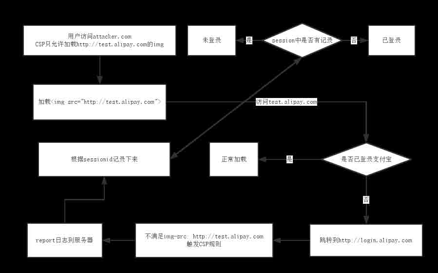
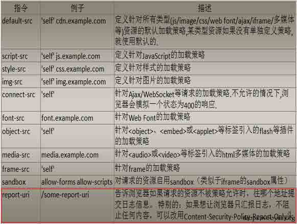
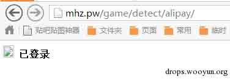
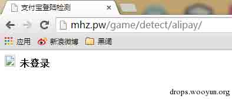
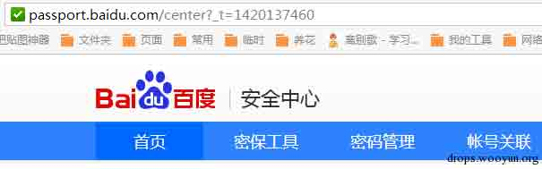
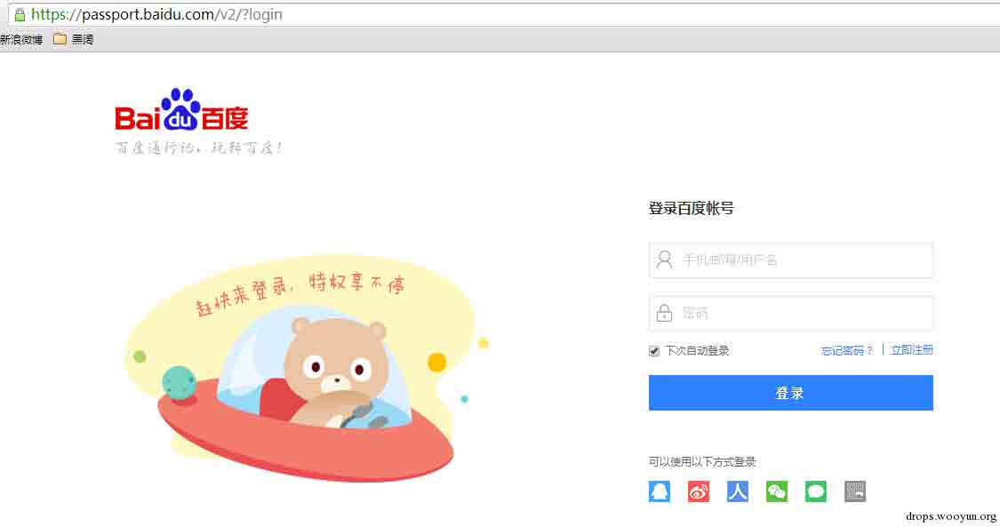

# 利用 CSP 探测网站登陆状态（alipay/baidu 为例）

2015/01/04 14:54 | [phith0n](http://drops.wooyun.org/author/phith0n "由 phith0n 发布") | [web 安全](http://drops.wooyun.org/category/web "查看 web 安全 中的全部文章"), [技术分享](http://drops.wooyun.org/category/tips "查看 技术分享 中的全部文章") | 占个座先 | 捐赠作者

## 0x00 背景

* * *

今天看到 zone 里有同学发帖说了探测支付宝登录状态的帖子：http://zone.wooyun.org/content/17665

由此我想到了我们 parsec 的@/fd 半年前提到的一个思路，当时他给出了一个探测 twitter 是否登录的页面，可是我那个时候才疏学浅，好像一直没理解。这时候返回去看看，就有了这篇文章。

## 0x01 CSP 简介

* * *

内容安全策略（Content Security Policy，简称 CSP）是一种以可信白名单作机制，来限制网站中是否可以包含某来源内容。默认配置下不允许执行内联代码 `<script>` 块内容，内联事件，内联样式 ，以及禁止执行 eval() , newFunction() , setTimeout([string], …) 和 setInterval([string], …) 。

  CSP 更详尽的介绍可以在 drops 看到：http://drops.wooyun.org/tips/1439

#   0x02 大环境介绍与原理

* * *

  简单了解一下 CSP，我们知道 CSP 可以限制网站中可否包含某来源的内容。同时，csp 还可以在页面违反规则的时候发送一个数据包，将具体细节通知给服务端。

  我们再来想想像支付宝这种集成度很高的网站服务，当我们在未登录的情况下访问 alipay 的某个子域名（如 test.alipay.com），很可能是会 302 跳转到一个用户登陆专用的域名（如 login.alipay.com）下要求用户登录。而在已登录的情况下是不会跳转的。

  这就造成了一个登录/未登录的一个差别，主要差别如下：

1.  HTTP 状态码（302 和 200）     

2.  最终访问的域名（test.alipay.com 和 login.alipay.com）     

  因为浏览器 SOP（同源策略）的限制，正常情况下我们是无法获取到 alipay 域名下 HTTP 状态码的。

  但结合 CSP 安全策略，我们却可以简单获得第 2 个，也就是最终访问域名。为什么？

  我前面说了 CSP 是可以限制页面中允许加载哪些来源的内容的。所以，当我们将 CSP 设置为只接受来源为 test.alipay.com 的内容，那么当加载来源为 login.alipay.com 的请求时就会被 CSP 策略拒绝，并可以将这个访问 report 给服务端，我们通过 report 的内容就能判断用户访问的是 test 还是 login。 过程如下：

  

  这就是原理，很赞的一个思路，再次崇拜一次@/fd。

#   0x03 以支付宝为例编写探测代码

* * *

  所以，根据上面的思路，我们第一步就是找到一个这样的页面：登录、未登录用户访问时到达的“域名”不相同。这里的“域名”包括 protocol 和 hostname，也就是说 http://test.alipay.com 和 https://test.alipay.com 是不同的域名。

  像支付宝这种网站有很多这样的页面，因为支付宝的很多服务是登录用户才能查看的，而登录入口又只有那么一个。

  比如这个 URL：https://my.alipay.com/portal/i.htm，当未登录用户访问的时候会跳转到 https://auth.alipay.com/login/index.htm，已登录用户访问时不会跳转。

  这时候我们将 CSP 的 img-src 限制为 https://my.alipay.com，再将 https://my.alipay.com/portal/i.htm 作为 img 的 src，这个时候就会出现一个有趣的现象：未登录的用户访问时，会触发 CSP 规则。

  因为未登录的用户访问时实际 img 加载的 src 是 https://auth.alipay.com/login/index.htm，不符合 CSP 限制的 img-src，自然就触发规则了。 这时候我们在设置 CSP 的 report-uri 为 report.php，不符合规则的请求会被记录下作为日志发送到 report.php 里：

  

  不过浏览器在发送这个 report 包的时候是不带 cookie 的，所以服务器那边并不能直接判断是哪个用户发送的 report 包，所以我们在 report 的 GET 参数里带上用户的 session id。

  示例代码如下：

```
<?php
session_start();
$ssid = session_id();
header("Content-Security-Policy:img-src https://my.alipay.com; report-uri report.php?ssid={$ssid}");
?>
<html>
<head>
<meta charset="utf-8" />
<title>支付宝登陆检测</title>
</head>
<body onload="return check();">

<b id="result"></b>
<script type="text/javascript">
function check()
{
    with(new XMLHttpRequest) {
        open('GET', 'alipay.php');
        send();
        onreadystatechange = function() {
            if (readyState ^ 4) return;
            result.innerHTML = parseInt(responseText) > 0 ? '未登录' : '已登录';
        }
    }
}
</script>
</body>

```

  report.php 用来记录：

```
<?php
session_start();
if (preg_match('/^[a-z0-9]*$/i', $_GET['ssid'])) {
    session_id($_GET['ssid']);
}else{
    exit;
}
$report = file_get_contents("php://input");
if (!empty($report)) {
    $_SESSION['nologin'] = 1;
}else{
    $_SESSION['nologin'] = 0;
}
?>

```

  当接收到 php://input 的时候说明 CSP 发送报告了，说明请求违反的 CSP 规则了，也就意味着用户没有登录，所以将 session 中的 nologin 设置为 1。 然后在 index.php 里用一个 ajax 来向 alipay.php 请求，实际上就是获得$_SESSION[nologin]的值：

```
<?php
session_start();
echo isset($_SESSION['nologin']) ? $_SESSION['nologin'] : 0;
setcookie('PHPSESSID', '', time() - 10);
session_destroy();
?>

```

  如上，获取完后将 session 清除一下，以免影响下一次的判断。

  获得值如果为 1 的话，说明没有登录，如果为 0 说明已登录，就可以显示出来或做任何其他操作了。

  来个演示：http://mhz.pw/game/detect/alipay/

  登录支付宝以后访问，显示“已登录”

  

  换个浏览器，直接访问则显示“未登录”：

  

#   0x04 由 http/https 混用造成的问题（百度为例）

* * *

  同样的问题，不仅仅是支付宝存在，只要有“统一登录入口”的网站都可能出现这个问题，因为统一登录入口通常是一个单独的域名。

  还有一种情况，是 http 和 https 混用造成的。有些网站的登录页面是 https 加密传输的，但登陆以后实际的操作页面是走 http。

  这之间一样存在一个跳转的问题，当我们访问一个登陆后才能看到的页面如 http://xxx.com/index，未登录的用户就会跳转到登录页面，如 https://xxx.com/login。

  在 CSP 里 http 和 https 是完全不同的两个来源，所以也能触发 CSP 规则。

  比如 https://passport.baidu.com，这是百度的安全中心。当已登录用户访问的时候会跳转到“安全中心”首页 http://passport.baidu.com/center（注意，此处是 http）：

  

  而未登录用户访问则会跳转到 https://passport.baidu.com/v2/?login（这时候是 https）：

  

  虽然两个域名都是 passport.baidu.com，但因为 protocol 不同，混用的 http 和 https 就能够影响 CSP 的拦截情况。

  我们将 CSP 设置为 img-src https://passport.baidu.com ，那么 img 的 src 就只接受来源为 https://passport.baidu.com 的 img，那么已登录用户访问的 http://passport.baidu.com/center 就会被阻止，产生一个 CSP 报告。记录下这个报告，一样能判断访客是否已登录百度。

  测试你是否登录百度：http://mhz.pw/game/detect/baidu/

#   0x05 影响及防范方法

* * *

  严格来论，只是判断用户是否登录，这个问题并不算一个漏洞。当时@/fd 将问题提交到推特之后推特的回应也是不算漏洞，但确实如果与其他一些漏洞结合使用，会让某些漏洞的成功率提高一大截。所以我们可以将之归为一个“奇技淫巧”。

  这个问题更容易出现在一些大型网站、企业网络之中，往往这些网站的统一性和重用性都做的很好，所以往往登录入口只有一个（现在流行一个 user center 的概念），所以难免会出现一些跳转的问题。有这些跳转，就是探测用户登录的基础。

  这个方法还有一个限制，就是用户使用的浏览器需要是现代浏览器，需要支持 CSP 安全策略。如果你要探测的用户还在用 IE6~IE10，那么是肯定不行的。 如何解决这个问题？如果你真的觉得这是个安全问题的话，那么尽量避免跳转，或者使用 javascript 进行页面的跳转。

版权声明：未经授权禁止转载 [phith0n](http://drops.wooyun.org/author/phith0n "由 phith0n 发布")@[乌云知识库](http://drops.wooyun.org)

分享到：

### 相关日志

*   [HttpOnly 隐私嗅探器](http://drops.wooyun.org/tips/2834)
*   [一个可大规模悄无声息窃取淘宝/支付宝账号与密码的漏洞 -（埋雷式攻击附带视频演示）](http://drops.wooyun.org/papers/1426)
*   [Browser Security-css、javascript](http://drops.wooyun.org/tips/150)
*   [Wordpress 3.8.2 补丁分析 HMAC timing attack](http://drops.wooyun.org/papers/1404)
*   [CSRF 简单介绍及利用方法](http://drops.wooyun.org/papers/155)
*   [SSLStrip 的未来 —— HTTPS 前端劫持](http://drops.wooyun.org/tips/3199)