# 【.NET 小科普之一】数据库信息在哪儿

2014/03/03 11:48 | [wefgod](http://drops.wooyun.org/author/wefgod "由 wefgod 发布") | [技术分享](http://drops.wooyun.org/category/tips "查看 技术分享 中的全部文章") | 占个座先 | 捐赠作者

## 0x00 前言

* * *

最近有人问到 ASP.NET 里面的数据库连接信息一般去哪里找。

这里我简单总结一下我遇到过的一些情况，和大家分享一些简单的方法去找 ASP.NET 的数据库连接信息或数据库文件。

## 0x01 寻找方式

* * *

先说一般的数据库连接信息。

### 第一种

一般在 web.config，如某套 OA 就是将连接字符串存放在该文件内，如下图：

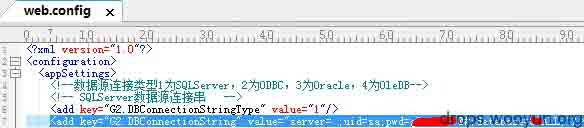

### 第二种

有的 ASP.NET 程序功能较多，会自定义其它 config 文件，所以可能会存在多个 config，而数据库连接信息就存放在其它 config 文件中，比如逐浪 CMS（你们懂的）就有多个 config 文件，如下图:

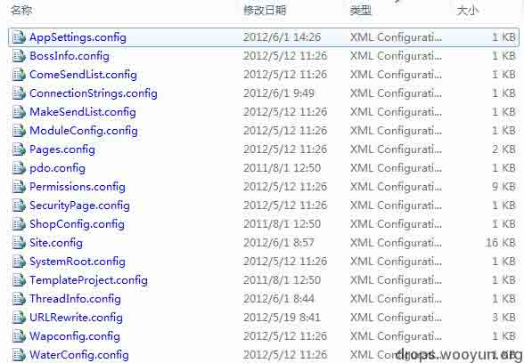

但数据库相关连接信息存放在 ConfigConnectionStrings.config 里：

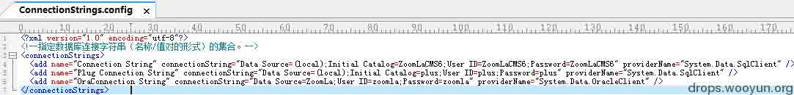

### 第三种

也有更标新立异的压根不存放在 config 中，比如信游（你们也懂的）的免费版，也有一个 config 文件夹，里面的文件大致如下：

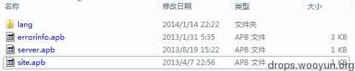

数据库连接信息存放在 server.apb 中：

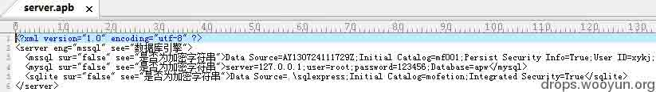

### 第四种

有一些比较奇葩的，直接写在代码中。这种情况下如果没有源码 cs 文件，就只能反编译 bin 目录下的 dll 文件了，必须扩展开来说，这是后话了。

数据库文件

那如果是 access 或者 SQLite 的情况又会有什么变化呢？他们的数据库会存放在什么位置？

现在大多 CMS 为了避免直接下载 MDB 或相关格式的问题，在.NET 中采取了其它手段去防下载，比如 50cms 将 SQLite 的数据库存放在根目录的 App_Data 文件夹中：

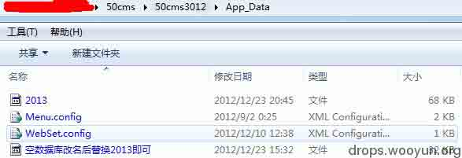

2013 就是 50cms 的数据库：

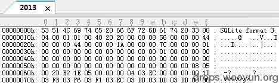

另外还有直接将 access 数据库存放在 App_Code 文件夹中的，保存为.cs 后缀，由于 App_Code 和 App_Data 是无法直接通过 post 和 get 来直接访问的（你有任意文件下载的话谁都拦不住你），所以在一定程度上保证了网站的安全性，比如下面的 2013.cs 实际就是网站的数据库：

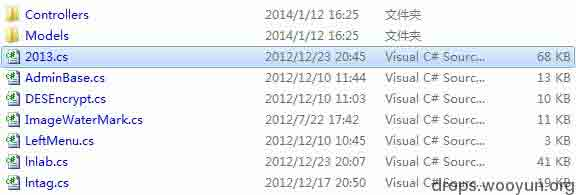

当然了，上面说的也是较为常见的，凡事总会有奇葩的，结合实际情况以不变应万变吧！

总结一下，数据库或者数据库相关信息会在哪里：

```
1\. web.config 
2\. 其它 config 文件 
3\. 某些有特征的文件夹下的某个文件（如上面信游的那个） 
4\. 源码中，去 dll 翻翻吧 
5\. App_Code 或 App_Data 
6\. 其它各种奇葩情况…… 
```

下面重点说说第四种寻找方式。

## 0x02 反编译.NET 程序

* * *

### 1 .NET 的程序是怎样的？

我们这说的.NET 不是什么 www.caoliu.net，都指的是微软的开发语言。下文对.NET 的分析主要是我个人的总结，并非官方语言。

那常见的.NET 程序其简单构成是咋样的呢？

第一种，我们常见的桌面应用，可以是 winform 和 console 类型，比如常见的 winform 应用其可编译的项目源文件结构大概如下（以 VS2008 为例）：

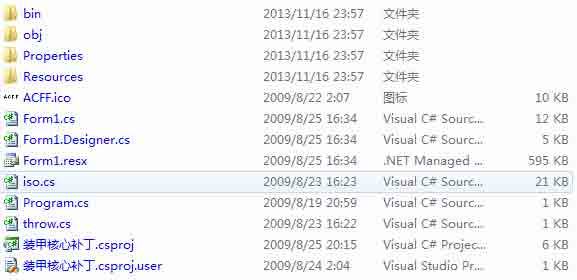

Bin 目录是编译后的两种类型的可执行文件：

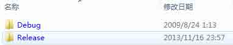

Debug 编译后的程序会带有一些相关的调试信息，体积会大一点，release 是发布版本的相对没带有那么多调试信息，体积会小一些。

第二种，就是我们要重点熟知的 asp.net 应用程序，一个很简单的 asp.net 应用程序的源码目录结构如下：

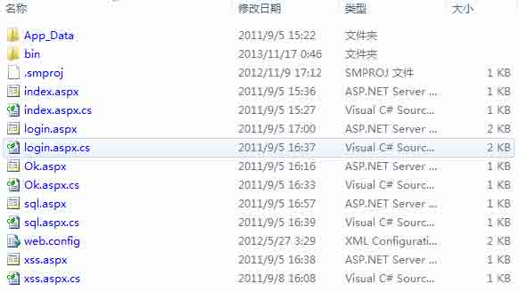

一般来说，我们的关注点更多不在 aspx 文件中，因为 VS2005 之后都主要是将相关的代码分离到了 cs 文件中。所以我们更多要关注的是.cs 后缀的文件，但是在发布版的网站中，是不包含 cs 文件的，此时我们要关注的就是 bin 目录了，bin 目录中有相关的 dll。比如上面的小网站的 bin 目录只有一个 dll 文件：


### 2\. 用什么反编译.NET 的程序

目前相对比较有名的.NET 反编译程序主要有两款：

```
Reflector
ILSpy 
```

Reflector 是一个比较早出现而且功能也比较强大的反编译软件（在这略微提醒一下，是反编译不是反汇编），支持自定义插件和代码调试的功能，支持将源码反编译为 IL 语言、VB.NET、C#、Delphi.NET、F#和 MC++等并可选择.NET 框架的相关版本（不同版本有不同的语言特性），目前最新版已经是 8.0，7.3 版的截图如下：

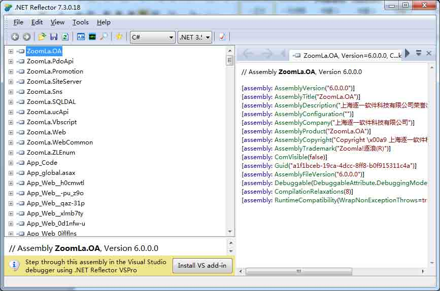

选定某个 dll 后，可以在 File 菜单中选择导出源码：

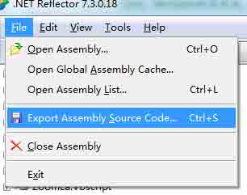

ILSpy 是一个开源且免费的反编译程序，主要功能还是反编译，不支持插件，可以翻译成的语言主要是 C#、VB.NET 和 IL。最新版截图如下：

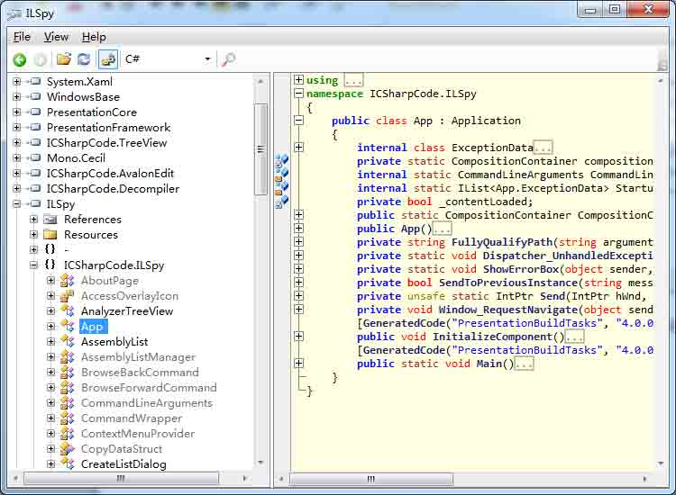

选中某个 dll 后，可以在 File 菜单中导出源码：


### 3\. 反编译的简单实例

在这以简单免费的 ILSPY 做演示。

先来一个找源码中数据库连接信息的例子，示例是用我们上面提到的一个小网站。

先打开 ILSpy，拖动相关的 dll 到左边的边栏中：

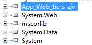

点击+号，展开相关的信息：

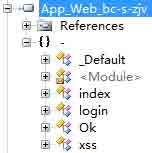

这里没有做混淆（这是后后后话了），所以反编译出来的类比较容易从名词中看出其作用。
既然要找数据库连接信息，那要先考虑一点，什么时候会进行数据库的连接？很简单！登录的时候吗，所以一般来说，都是先围绕登录点相关的类和函数进行。点击上面的 login：

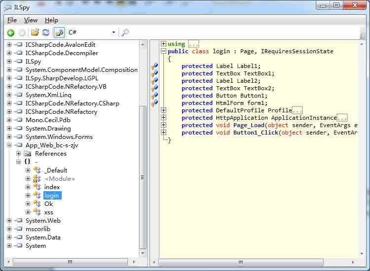

此时右边的分栏可以看到该 login 类的源码了。里面主要有两个方法：Page_Load 和 Button1_Click。其中 Page_Load 是页面加载时一定会调用的方法，Button1_Click 是按钮点击事件的方法（简单说就是点击登录按钮时调用的方法）。
点击左边的+号展开两个方法，会发现 Page_Load 是空的，Button1_Click 是包含有源代码的：

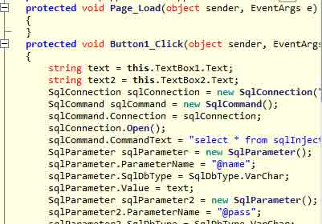

所以只能从按钮点击那下手了。

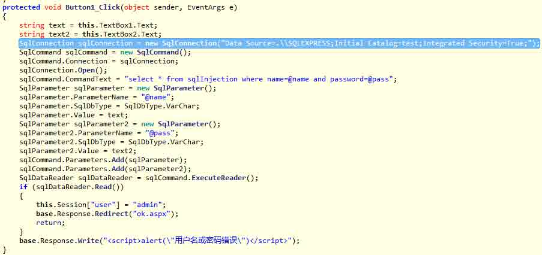

看上图标蓝色的地方，很明显就是数据库连接信息，把数据库连接信息写入到源码中，不是很利于后期的维护。

另外一篇例子，可以参考我发布在 zone 里的

[`zone.wooyun.org/content/3469`](http://zone.wooyun.org/content/3469)

寻找正方教务系统数据库连接解密方法的一篇文章。

再展示下，如果没混淆和加密的.NET 程序，我们可以做到什么。比如下面这个大牛写的程序：

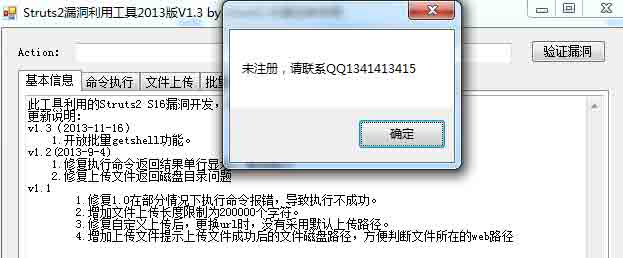

确定就退出了，只要稍加修改马上可以去掉相关的代码，任意用了：

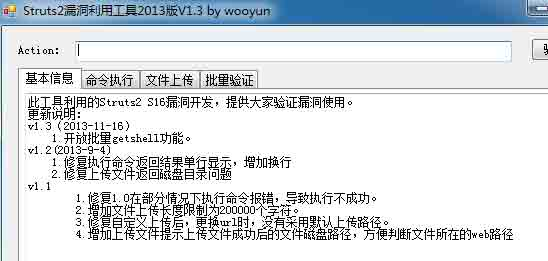

最后就不总结什么了，祝大家 0day 多多！

浊文一篇为博大家一笑，请勿较真……第一次来提交，写得不好请指正。

版权声明：未经授权禁止转载 [wefgod](http://drops.wooyun.org/author/wefgod "由 wefgod 发布")@[乌云知识库](http://drops.wooyun.org)

分享到：

### 相关日志

*   [深入了解 SQL 注入绕过 waf 和过滤机制](http://drops.wooyun.org/tips/968)
*   [Nginx 安全配置研究](http://drops.wooyun.org/tips/1323)
*   [生物特征识别之指纹识别，伪造，指纹设备缺陷设计](http://drops.wooyun.org/tips/2140)
*   [上传文件的陷阱](http://drops.wooyun.org/tips/2031)
*   [Wordpress 3.8.2 补丁分析 HMAC timing attack](http://drops.wooyun.org/papers/1404)
*   [CVE 2015-0235: GNU glibc gethostbyname 缓冲区溢出漏洞](http://drops.wooyun.org/papers/4780)