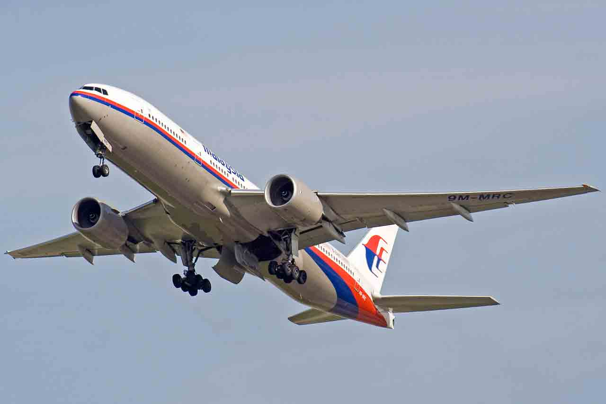

# 马航 MH370 航班被黑了？

2014/03/17 15:19 | [News](http://drops.wooyun.org/author/news "由 News 发布") | [业界资讯](http://drops.wooyun.org/category/news "查看 业界资讯 中的全部文章") | 占个座先 | 捐赠作者

华盛顿--有证据表明，马航的 MH370 的驾驶舱存在系统故障，而这正是导致 MH370 失联的主要原因。现在调查人员怀疑是否存在违规操作。

报道说，这架波音 777 客机的两个关键通讯和定位系统陆续被关闭，然后飞机在此之后仍继续飞行了数小时，这就证实了此飞机的通讯和定位系统是被人为关闭或者电子干扰。

WTOP 了解到，波音公司一直怀疑这架飞机是否遭到黑客袭击，并且事先联系了 FAA（美国联邦航空管理局）。

此前在 2012 年 8 月 21 日，波音公司已经申请了在 777 系列飞机上安装新设备，并将此设备作为飞机的数据网络系统的一部分。

根据 FR（联邦注册机构）给出的信息，数据网络和综合设计系统可能存在安全漏洞，而这些漏洞有可能造成人为或者非人为的危害，而这些对飞机的安全来说真的是致命的。

根据 FR 方面给出的信息，在波音 777-200、777-300 和 777-300ER 系列飞机模型的网络系统配置中，都增强了同外部网络的连通性。增加了更多的网络系统服务，比如乘客娱乐信息服务。而这将导致网络安全漏洞有可能被利用，无疑增加了飞机和乘客的安全风险。

波音似乎还担心某些 777 飞机的座椅靠背上的用来外联 USB 设备的接口存在漏洞。

也有人担心在飞机维护期间，未授权的访问有可能造成安全危害。

2013 年 11 月，波音公司在 777 系列飞机上做出的修改被作为特殊情况批准了。

2013 年 4 月，一个西班牙安全研究人员 Hugo Teso 在阿姆斯特丹的 Hack-In-The-Box 安全会议中证实了当飞机在飞行过程中遭遇黑客攻击的可能性。

Teso 证明了通过一个经过改造的安卓智能手机，他可能完全控制飞机的通讯系统。

他声称，他可以用一个叫 PlaneSploit 的应用和 SIMON 的攻击代码不仅控制飞机的系统，还可以控制飞行员的显示信息。

FAA（美国联邦航空局）迅速回应说完全控制一架飞机是不可能的。

同时，Teso 指出在独立自动监视系统 (ADS-B)和飞机通讯寻址报告系统（ACARS）中的漏洞，普遍当时的航空业还没有准备好面临这种攻击。

当局也承认了在某些情况下，ADS-B 和 ACAR 中的漏洞有可能遭受到攻击利用。

鉴于马航的 MH370 航班现有信息，调查人员也分析了很多可能性，马来西亚政府也密切关注人为破坏的可能性。

from:[`www.wtop.com/?nid=893&sid=3581458`](http://www.wtop.com/?nid=893&sid=3581458)

版权声明：未经授权禁止转载 [News](http://drops.wooyun.org/author/news "由 News 发布")@[乌云知识库](http://drops.wooyun.org)

分享到：

### 相关日志

*   [网络安全威胁周报——第 201411 期](http://drops.wooyun.org/news/1195)
*   [通过伪造乌克兰相关文件进行传播的恶意软件 MiniDuke](http://drops.wooyun.org/news/1373)
*   [GnuTLS 和 Apple 证书验证的 bugs 并非为同一个](http://drops.wooyun.org/news/1021)
*   [NSA 暗中监视中国政府和企业网络（目标华为）](http://drops.wooyun.org/news/1289)
*   [网络安全威胁周报——第 201410 期](http://drops.wooyun.org/news/1034)
*   [一种被命名为 Chameleon 的病毒可以通过 WiFi 相互之间传播](http://drops.wooyun.org/news/976)