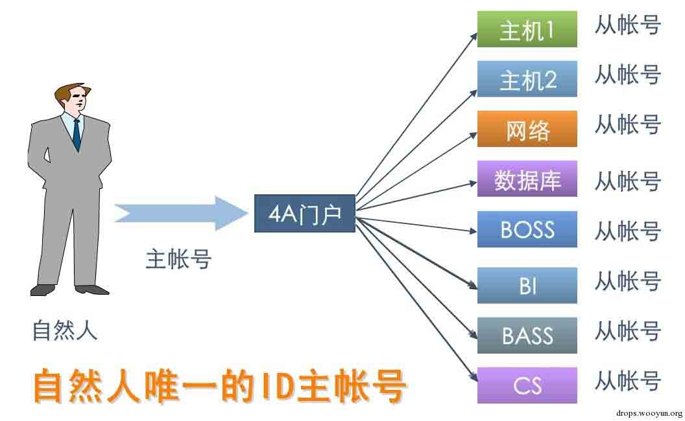
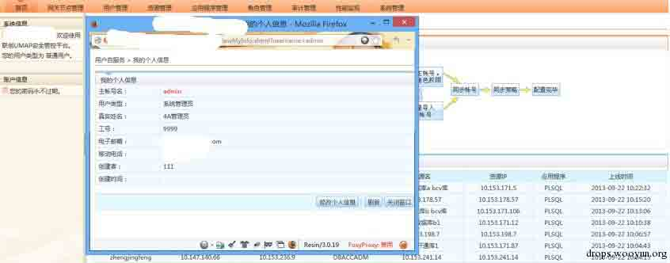
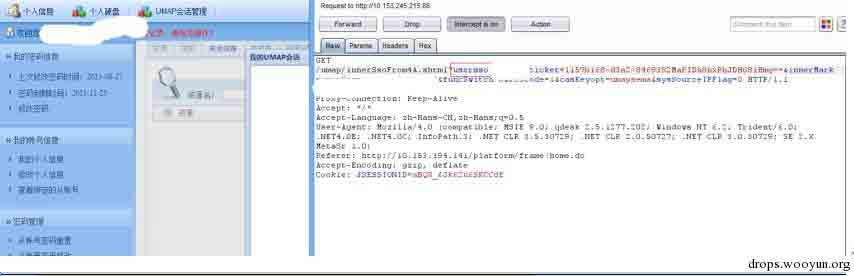

# 4A 安全性分析

2015/01/05 9:03 | [3xpl0it](http://drops.wooyun.org/author/3xpl0it "由 3xpl0it 发布") | [技术分享](http://drops.wooyun.org/category/tips "查看 技术分享 中的全部文章") | 占个座先 | 捐赠作者

## 0x00.概述

* * *

### 0.1 起因

前段时间在 zone 里看到有人问 4A 的渗透测试，本人正好接触过几款 4A 和堡垒机产品，今天抽空就总结下个人在渗透中遇到的 4A 问题。

### 0.2 4A

4A 是指：认证 Authentication、账号 Account、授权 Authorization、审计 Audit，中文名称为统一安全管理平台解决方案。即将身份认证、授权、审计和账号（即不可否认性及数据完整性）定义为网络安全的四大组成部分，从而确立了身份认证在整个网络安全系统中的地位与作用。（百度百科）。

## 0x01.认证 Authentication

* * *

认证的方式一般有以下几种：

1.  静态口令

2.  动态口令令牌

3.  USB 令牌

存在的问题有：

### 1.1 账号枚举

这里的账号枚举并不是仅仅知道哪个账号存在，哪个账号不存在。

```
String mobileNumber = request.getParameter("mobile");
if(StringUtiles.isNotEmpty(mobileNumber)){
    PrimaryAccount primaryAccount = new PrimaryAccount();
    primaryAccount.setMobile(mobileNumber);
    List<PrimaryAccount> paList = accountService.getPraccList(PrimaryAccount);
    if(CollectionUtils.isNotEmpty(paList)){
        username = paList.get(0).getPracctName();
    }
}   
......
if(StringUtiles.isBlank(errMsg)){
    errMsg = "认证失败"
}
String oper = "主账号:" + username + "登录 4A 认证不成功，原因:" + errMgs;
......

```

从上面账号可以看到，登录时，如果你输入的是手机号，那么登录失败的时候，就会将手机号对应的 username 返回，那么我们就可以拿手机号和用户名到密码找回页面等地方做进一步的测试。

### 1.2 锁屏绕过

在某厂商的 4A 平台上有个锁屏的功能，即点击锁屏时，4A 管理界面就会被锁定，重新输入密码后，就可以进入管理平台。

```
Ext.Ajax.request({
    url : '../platform/login!lockLogin.do',
    params : {
        name : name,
        lockPwd : lockPwd
    },
    success : function(rsp,opt){
        var responseArray = Ext.util.JSON.decode(rsp.responseText);
        var result = responseArray.resultStr;
        var desc = responseArray.descStr;
        if(result == true){
            $.unblockUI();
            $("#lockPwd").val("");
            times=0;
        }else if......
    }
})

```

从代码可以看到，只要 result == 0，就可以解锁，那么我们可以用 burp 拦截 response，也可以修改 JS 等。

## 0x02.账号 Account

* * *

4A 中账号分为主账号和从账号，一个用户只会有一个主账号，唯一标识了他的身份。这个主账号还会有 N 个从账号，对不同的系统会有不同的从账号，方便用户访问其可以访问的系统。如下图



### 2.1 重置用户密码

> http://wooyun.org/bugs/wooyun-2010-072644

在这个 bug 中，可以通过修改密码的功能，重置其他用户的密码。典型的账号管理问题。

### 2.2 token

token 在 4A 中可谓是到处都是，那么如果 token 验证不严谨，很可能出现戏剧性的结果。接下来这个漏洞给大家展示 token 失效的时候。


这个页面不是通过 4A 登录过来的，而是直接访问网站的登录界面，登录后的页面。



上面的图是通过 4A 登录后，访问系统时，将 URL 和 username 修改为管理员的页面和用户名，然后可以看到，页面显示的就是管理员的页面了。

## 0x03.授权 Authorization

* * *

授权一般分为：

1.基于用户的授权 UBAC

2.基于用户角色的授权 RBAC

3.基于资源的授权 ABAC

存在的问题有：

### 3.1 调用 cmd

4A 权限分配中有个很重要的功能就是基于资源的授权，比如给主账号 A 分配一个 securecrt，让其可以使用 SSH，给主账号 B 分配一个 notepad，让其可以使用记事本。但是大家都知道通过浏览器、记事本等“查找文件”的功能可以调出 cmd 等功能。

如下图，是通过分配的 IE 浏览器，直接调用出 cmd 窗口，接下来，你想干什么，都 OK。


### 3.2 访问他人资源

一般的 4A 中都集成了“个人文件夹”功能，这个文件夹就是可以上传文件到自己的文件夹里面，但是点击个人文件夹时，可以修改 username，然后就看到了其他人的文件。



### 3.3 下载文件

同样是个人文件夹(或者其他提供下载的地方)的问题，可以下载指定的文件，但是没有对文件做限制，可以下载任意文件。

```
public String execute() throws FAException{
    ......
    String file = request.getParameter("file");
    String place = request.getParameter("place");
    String fileName = request.getParameter("filename");
    download(file,fileName,request,response,place);
}
private void download(String file,String fileName,HttpServletRequest request,HttpServletResponse response,String place) throws FAException{
    ......
    path = (request.getSession().getServletContext().getRealPath("/") + file).replace("/",File.separator).replace("\",File.separator);
}
FileInputStream fis  = new FileInputStream(path);
......
response.setHeader("Content-Disposition","attachment:filename=\"" + fileName_zh + "\"");

```

从代码中可以看到，通过获取 file 等参数，然后直接就下载文件了。。

### 3.4 前置机

一些堡垒机具有前置机，意思是某些在堡垒机中实现不了的功能(比如内置 pcanywhere，只是比如)，那么就需要把 pcanywhere 放到前置机中，当需要使用 pcanywhere 时，就会远程登录到前置机上，调用 pcanywhere 的页面。

问题是什么呢，既然是远程登录调用 pcanywhere 的页面，那么我们只要使用 windows 键或者使用 alt+tab 就可以切换到其他程序上，进而就控制了前置机。

### 3.5 奇葩问题

> [WooYun: AuditSec 运维操作审计-堡垒机密码的利用](http://www.wooyun.org/bugs/wooyun-2014-048368)

大家可以看看这个密钥问题。。

## 0x04.审计 Audit

* * *

审计主要是对登录、访问等所有的动作记录日志，查看是否有不合规的事件。

### 4.1 伪造登录 IP

> [帕拉迪/华为/江南天安堡垒机伪造 WEB 登录来源 IP 漏洞](http://wooyun.org/bugs/wooyun-2010-074369)

在这个 bug 中通过 x-forwarded-for 伪造了登录的 IP，这就对日志造成了影响，如果以后需要整理日志，或者根据日志找出不合规事件，那就会存在很大的影响。

## 0x05\. 总结

* * *

以上只是列举了我在测试 4A 或堡垒机时遇到过的问题，肯定还有许多猥琐的方式我没有观察到，欢迎大家补充。
元旦在家码字不容易。求互粉：http://weibo.com/0xExploit/

版权声明：未经授权禁止转载 [3xpl0it](http://drops.wooyun.org/author/3xpl0it "由 3xpl0it 发布")@[乌云知识库](http://drops.wooyun.org)

分享到：碎银子打赏，作者好攒钱娶媳妇：


### 相关日志

*   [一种新的攻击方法——Java-Web-Expression-Language-Injection](http://drops.wooyun.org/tips/2494)
*   [一次 app 抓包引发的 Android 分析（续）](http://drops.wooyun.org/tips/2986)
*   [PHP 安全编码](http://drops.wooyun.org/tips/135)
*   [深入分析 Fiesta Exploit Kit](http://drops.wooyun.org/tips/4858)
*   [调皮的 location.href](http://drops.wooyun.org/papers/892)
*   [Modsecurity 原理分析–从防御方面谈 WAF 的绕过（一）](http://drops.wooyun.org/tips/3804)