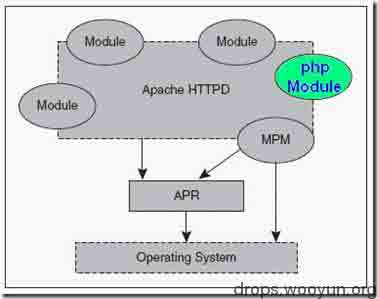

# Apache 安全配置

2014/08/04 12:44 | [zhangsan](http://drops.wooyun.org/author/zhangsan "由 zhangsan 发布") | [运维安全](http://drops.wooyun.org/category/%e8%bf%90%e7%bb%b4%e5%ae%89%e5%85%a8 "查看 运维安全 中的全部文章") | 占个座先 | 捐赠作者

## 0x00 测试环境

* * *

centos6.5+apache2.2.15+php5.3.3

## 0x01 php 的运行模式介绍

* * *

php 的运行模式分四种：

```
1\. CGI 通用网关接口 
2\. fast-cgi 常驻型的 CGI 
3\. cli 命令行运行 
4\. web 模块模式 
```

一般情况下，apache 使用 web 模块模式运行 php

## 0x02 Apache 运行原理介绍

* * *

Apache 是基于模块化设计的，各个模块在系统启动的时候按需载入。Apache 对于 php 的解析，就是通过众多 Module 中的 php Module 来完成的。



所以，php 加载成为了 apache 的一个模块，可以把 apache 和 php 当成一个整体看待。

当浏览器请求一个 php 文件时，我们可以理解为 apache 直接处理返回给浏览器结果，服务器上也只会有 httpd 进程，而不会有 php 进程。

apache 的一些配置主要是通过 httpd.conf 来实现的，但是可以在 httpd.conf 中开启对.htaccess 的支持，然后在.htaccess 中进行配置。不过一般情况下，不应该使用.htaccess 文件，除非你对主配置文件没有访问权限。.htaccess 文件应该被用在内容提供者需要针对特定目录改变服务器的配置而又没有 root 权限的情况下。如果服务器管理员不愿意频繁修改配置，则可以允许用户通过.htaccess 文件自己修改配置。

## 0x03 Apache 安全配置方案

* * *

### 1\. 选择漏洞较少的 apache 版本，并打上安全补丁

查看 apache 版本号：httpd -v

然后在 sebug 上搜索该版本号有什么漏洞，可根据提示提升版本或者打上补丁

### 2\. 关闭一些不使用的模块及功能

可在 LoadModule 前加#，来注释掉一些不使用的模块

### 3\. 隐藏 banner 信息

ServerTokens OS　 修改为：ServerTokens Prod （在出现错误页的时候不显示服务器操作系统的名称）

ServerSignature On 修改为：ServerSignature Off（不回显 apache 版本信息）

### 4\. 删除默认网站及页面

删除默认的页面，防止泄露服务器信息

### 5\. 可修改 banner 信息

### 6\. 配置 httpd.conf 禁止目录浏览

将 Options Indexes FollowSymLinks 改为 Options -Indexes FollowSymLinks

### 7\. 配置 httpd.conf 设置默认文档

DirectoryIndex index.html

### 8\. 合理配置 apache 的运行账户

为 apache 单独建立一个运行账户及账户组，并在 httpd.conf 配置

```
User apache
Group apache 
```

### 9\. 合理控制 apache 运行账户对磁盘的写入，执行权限

取消 apache 运行账户对网站目录的写入权限，上传目录除外，其他非网站目录尽量不给权限

### 10\. 合理控制 apache 运行账户对 sh 等的执行权限

取消掉了运行账户对 sh 等的执行权限后能够防止 webshell 通过默认的 sh 执行命令

### 11\. 配置 httpd.conf 取消对上传目录的 php 执行权限

```
<Directory "/var/www/html/aaa">     
    <FilesMatch ".(php|php5)$">     
        Deny from all     
    </FilesMatch> 
</Directory> 
```

### 12\. 配置 httpd.conf 限制禁止访问的文件夹，例如后台目录

```
<Directory "/var/www/html/aaa">     
        Deny from all     
</Directory> 
```

### 13\. 配置 httpd.conf 限制一些特殊目录的特定 ip 访问，如内部接口等。

```
<Directory "/var/www/html/aaa">     
    Order Deny,Allow
    Deny from all
    Allow from 192.168.1.111    
</Directory> 
```

### 14\. 配置 httpd.conf 限制一些文件类型的访问，如 txt 的日志

```
<Files ~ ".txt$"> 
    Order allow,deny 
    Deny from all 
</Files> 
```

### 15.配置 httpd.conf 修改修改监听端口来防止一些内部系统被扫描

这样可以防止一些直接扫描 80 端口的黑客

```
Listen 12345 
```

### 16\. 关闭对.htaccess 的支持

```
AllowOverride All 
```

改为

```
AllowOverride None 
```

### 17\. 配置 httpd.conf 记录访问日志

## 0x04 .htaccess 常见配置方法参考

* * *

首先，不建议使用.htaccess,其次，使用.htaccess 需要在 httpd.conf 中开启，最后，开始.htaccess 支持后需要在 httpd.conf 中配置防止.htaccess 文件被下载，下面介绍几个基本配置方法不全，更多的可以参考其他网站专门针对.htaccess 的配置方法。

### 1\. 定制目录的默认文档

```
DirectoryIndex index.html index.php index.htm 
```

### 2\. 定制错误页面

```
ErrorDocument 404 errors/404.html 
```

### 3\. 控制访问文件和目录的级别

```
order deny,allow  
deny from all  
allow from 192.168.0.0/24 
```

### 4\. 防止列目录

```
Options -Indexes 
```

## 0x05 总结

* * *

其实一个 web 服务器的保护是分几个层次的（暂不考虑程序的漏洞）：

### 1\. 隐藏自己

要保护一个 web 服务器首先得学会隐藏自己，对于一些内部系统，如后台，内部接口等，我们可以通过改端口，限制 ip 等方式来不让黑客发现。

### 2\. 隐藏身份

对于多数 web 系统来说，都是提供给外面的访问的，所以想隐藏自己其实是很难的。但是我们还是要学会隐藏身份，可以通过改 banner，该返回信息来隐藏身份来加大黑客攻击的难度。

### 3\. 选用安全的版本及修补一些已知的漏洞

其实前面两步都是很容易突破，然后获知一个 web 系统所使用的 web 服务器版本的，此时我们能做的就是选择一个少漏洞的版本，及打上安全补丁。

### 4\. 做好安全配置

做好基础的安全配置，禁止目录浏览，设定默认文档，上传目录限制 php 执行等等，来阻挡黑客的入侵。

### 5\. 合理配置 web 服务进程账户的权限

当黑客已经通过程序漏洞上传了一个 webshell 并且已经成功执行了，此时，就只能很好的配置服务进程的账户权限，包括磁盘的读取写入，特殊程序如 sh 的执行，等等，这样可以讲危害降到最低。

### 6\. 记录日志

最后，当黑客已经光顾之后，我们也只能通过日志来分析，看问题出在哪里了。

版权声明：未经授权禁止转载 [zhangsan](http://drops.wooyun.org/author/zhangsan "由 zhangsan 发布")@[乌云知识库](http://drops.wooyun.org)

分享到：

### 相关日志

*   [Nginx 安全配置研究](http://drops.wooyun.org/tips/1323)
*   [安全科普：Waf 实现扫描器识别 彻底抵挡黑客扫描](http://drops.wooyun.org/tips/730)
*   [web 服务器分层架构的资源文件映射安全以及在 J2EE 应用中的利用与危害](http://drops.wooyun.org/papers/60)
*   [CDN 流量放大攻击思路](http://drops.wooyun.org/papers/679)
*   [账号安全之扫号](http://drops.wooyun.org/tips/2073)
*   [应对 CC 攻击的自动防御系统——原理与实现](http://drops.wooyun.org/%e8%bf%90%e7%bb%b4%e5%ae%89%e5%85%a8/4151)