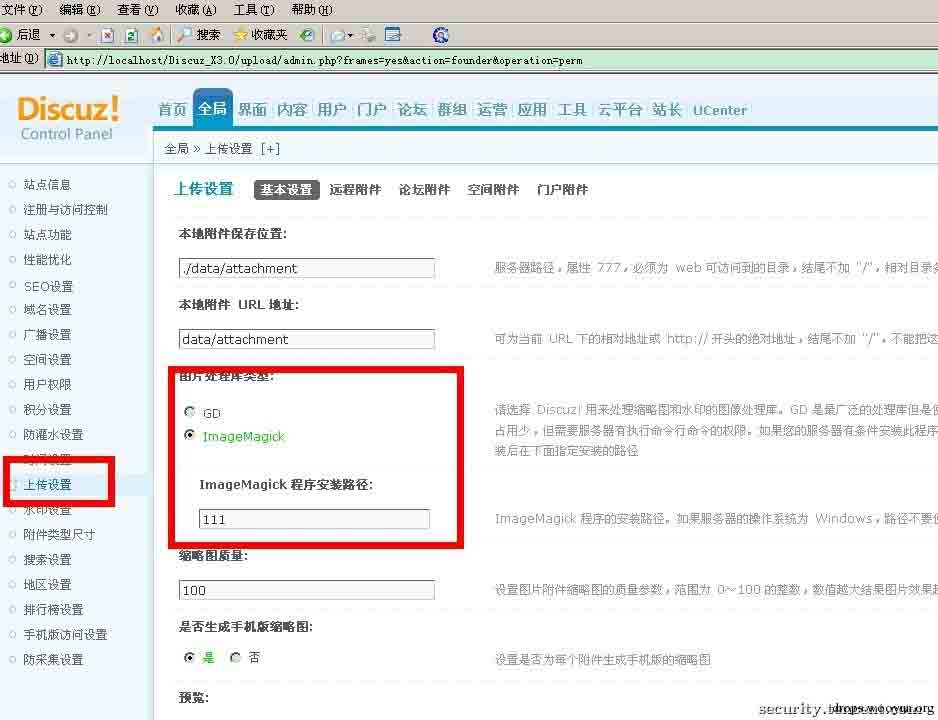
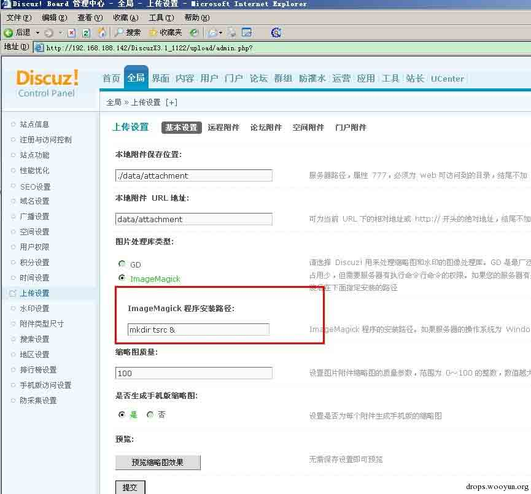
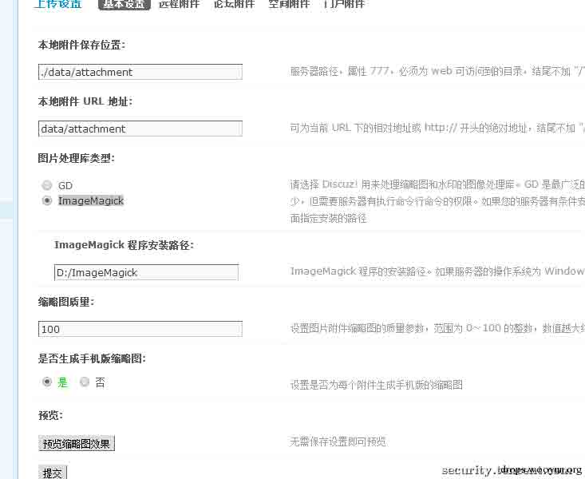
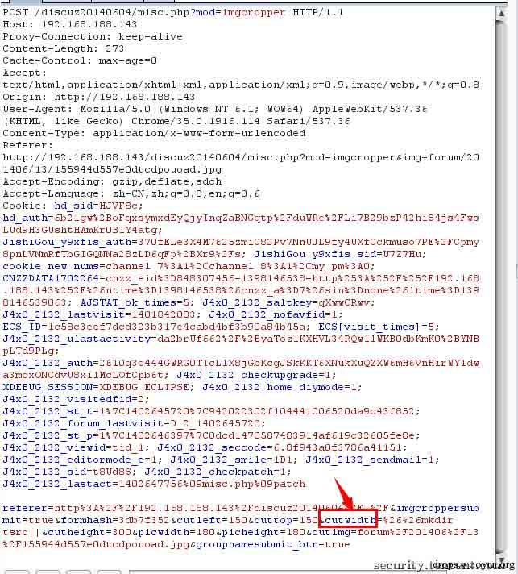
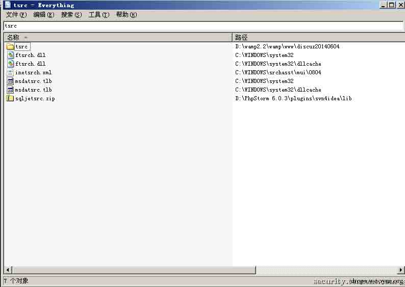

# DiscuzX 系列命令执行分析公开（三连弹） 

2015/01/15 18:55 | [tang3](http://drops.wooyun.org/author/tang3 "由 tang3 发布") | [漏洞分析](http://drops.wooyun.org/category/papers "查看 漏洞分析 中的全部文章") | 占个座先 | 捐赠作者

## 0x00 漏洞概要

* * *

昨天 360 补天发了这样的一条微博：


然后打听了一下细节，发现居然是我 13 年 7 月报给 TSRC 的漏洞，看今天大家玩的挺开心，与 TSRC 的人聊了两句，说这个系列可以发几个了，所以我也来凑个热闹，把原来的分析发出来给大家看一下（这里做个广告，TSRC 提交 Discuz 的漏洞，奖品棒棒哒~~）。这个漏洞原来我是作为前台命令执行发个 TSRC 的，虽然有限制，但是个人感觉还是不错的。只发一个怕各位不过瘾，就再来一发这个点比较直观的后台命令执行和绕过前台命令执行的修复。原 TSRC 上的漏洞标题是《Discuz! X 系列远程命令执行漏洞（二）》、《Discuz! X 系列远程命令执行漏洞（三）》和《Discuz! X 系列远程命令执行漏洞（四）》。

下面是原漏洞报告的概要部分：

> “腾讯旗下 Discuz! X 系列 cms 存在远程命令执行漏洞，经测试在其 2013 年 6 月 20 日发布的最新版本的 Discuz! X3 中仍存在此问题。目前这个漏洞尚未在网络中流传，属于 0day 漏洞。 这个漏洞存在于图片裁剪功能中，需要管理员启用 ImageMagick 上传图片功能方可触发。此漏洞只需一个可访问论坛内容的账号，即可利用。”

## 0x01 原理分析

* * *

## 0\. 一定条件下前台命令执行

* * *

这个漏洞出现在\source\class\class_image.php 文件中的 Thumb_IM()函数，问题代码如下：

```
function Thumb_IM() {
        switch($this->param['thumbtype']) {
            case 'fixnone':
            case 1:
                if($this->imginfo['width'] > $this->param['thumbwidth'] || $this->imginfo['height'] > $this->param['thumbheight']) {
                    $exec_str = $this->param['imageimpath'].'/convert -quality '.intval($this->param['thumbquality']).' -geometry '.$this->param['thumbwidth'].'x'.$this->param['thumbheight'].' '.$this->source.' '.$this->target;
                    $return = exec($exec_str);
                    if(!file_exists($this->target)) {
                        return -3;
                    }
                }
                break;
//省略部分代码

```

从第一行红色代码中可以看出，程序通过一些变量的拼接形成一条系统命令，在第二行使用 exec 方法进行执行。若用户可以控制这些变量中的任何一个，那么就可能导致任意命令的执行。

## 1\. 同点后台命令执行

* * *

这个漏洞出现在\source\class\class_image.php 文件中的 Thumb_IM()函数，问题代码如下：

```
function Thumb_IM() {
        switch($this->param['thumbtype']) {
            case 'fixnone':
            case 1:
                if($this->imginfo['width'] > $this->param['thumbwidth'] || $this->imginfo['height'] > $this->param['thumbheight']) {
                    $exec_str = $this->param['imageimpath'].'/convert -quality '.intval($this->param['thumbquality']).' -geometry '.$this->param['thumbwidth'].'x'.$this->param['thumbheight'].' '.$this->source.' '.$this->target;
                    $return = exec($exec_str);
                    if(!file_exists($this->target)) {
                        return -3;
                    }
                }
                break;
//省略部分代码

```

从第一行红色代码中可以看出，程序通过一些变量的拼接形成一条系统命令，在第二行使用 exec 方法进行执行。若用户可以控制这些变量中的任何一个，那么就可能导致任意命令的执行。

由于之前的《2013-07-24@Discuz! X 系列远程命令执行漏洞分析（二）》报告中提到过这个问题，也已经提交给腾讯修复了，使用的利用点是 param['thumbwidth']和 param[' thumbheight']。而这次我使用到 param['imageimpath']这个参数，这个参数对应的是后台配置中的“ImageMagick 程序安装路径”。

这个利用点应该是最后一个可控点了，因为 param['thumbwidth']和 param[' thumbheight']在提交给腾讯后添加了整形校验转换，无法传递字符串。而 source 和 target 需要在前面进行文件和文件是否存在的验证，无法自由发挥☹。

下面来看一下传递 param['imageimpath']这个参数的代码，它的位置在\source\admincp\admincp_checktools.php 文件中：

```
$settingnew = $_GET['settingnew'];
    if(!empty($_GET['previewthumb'])) {
        $_G['setting']['imagelib'] = $settingnew['imagelib'];
        $_G['setting']['imageimpath'] = $settingnew['imageimpath'];
        $_G['setting']['thumbwidth'] = $settingnew['thumbwidth'];
        $_G['setting']['thumbheight'] = $settingnew['thumbheight'];
        $_G['setting']['thumbquality'] = $settingnew['thumbquality'];

        require_once libfile('class/image');
        @unlink(DISCUZ_ROOT.$_G['setting']['attachdir'].'./temp/watermark_temp1.jpg');
        @unlink(DISCUZ_ROOT.$_G['setting']['attachdir'].'./temp/watermark_temp2.jpg');
        $image = new image;
//省略部分代码

```

可以从红色代码出看到 imageimpath 参数没有进行任何过滤，便传入到全局变量中了。在后面的 image 类中使用它也是直接从全局变量中提取，没有做任何的过滤和校验，下面是 image 类的构造函数代码：

```
function image() {
        global $_G;
        $this->param = array(
            'imagelib'      => $_G['setting']['imagelib'],
            'imageimpath'       => $_G['setting']['imageimpath'],
            'thumbquality'      => $_G['setting']['thumbquality'],
            'watermarkstatus'   => dunserialize($_G['setting']['watermarkstatus']),
            'watermarkminwidth' => dunserialize($_G['setting']['watermarkminwidth']),
            'watermarkminheight'    => dunserialize($_G['setting']['watermarkminheight']),
            'watermarktype'     => $_G['setting']['watermarktype'],
            'watermarktext'     => $_G['setting']['watermarktext'],
            'watermarktrans'    => dunserialize($_G['setting']['watermarktrans']),
            'watermarkquality'  => dunserialize($_G['setting']['watermarkquality']),
        );
}

```

## 2\. 前台命令执行修复绕过

* * *

在我之前的《2013-07-24@Discuz! X 系列远程命令执行漏洞分析（二）》和《2013-07-24@Discuz! X 系列远程命令执行漏洞分析（三）》两篇报告中，将视角盯死在了 Thumb_IM 这个方法上。在修复后，这个方法的命令执行失败，导致利用后续操作停止。

但是如果让这个方法正常完成它的工作，那么他后面的操作中还是有很多修复中没有考虑到的利用点。下面我们来看下其中的一个利用点,source/class/class_image.php 中的 Cropper_IM 方法：

```
function Cropper_IM() {
        $exec_str = $this->param['imageimpath'].'/convert -quality 100 '.
            '-crop '.$this->param['srcwidth'].'x'.$this->param['srcheight'].'+'.$this->param['srcx'].'+'.$this->param['srcy'].' '.
            '-geometry '.$this->param['dstwidth'].'x'.$this->param['dstheight'].' '.$this->source.' '.$this->target;
        exec($exec_str);
        if(!file_exists($this->target)) {
            return -3;
        }
}

```

从上面代码可以看出，这个方法先拼接命令，然后通过 exec 函数执行。在拼接的过程中很多变量的内容是可控的，而且在到达这个方法之前没有做足够的校验和过滤。从而导致攻击者可以通过传递一些带有命令操作的内容，来达到命令执行的目的。

## 0x02 利用思路

* * *

## 0\. 一定条件下前台命令执行

* * *

看到这个漏洞点后，我就开始尝试通过关键字从源码中寻找调用 Thumb_IM 函数的地方。搜索到使用此函数的文件很多，但是由于这个函数的前两个参数都是和上传文件的文件名相关，而且 discuz 对于上传文件名做了随机化命名和后缀白名单处理，所以导致前三个参数为不可控点。

所以这之后我将目标点瞄准到图片宽度和高度这几个点，从中筛选参数未被写死的可控调用。这样我找到了\source\module\misc\misc_imgcropper.php 文件，之后大量的时间花费在对于这个文件调用的业务逻辑的查找上。

## 1\. 一定条件下前台命令执行

* * *

无

## 2\. 前台命令执行修复绕过

* * *

漏洞的触发点在 source/module/misc/misc_imgcropper.php 中，部分代码如下：

```
$cropfile = md5($_GET['cutimg']).'.jpg';
$ictype = $_GET['ictype'];

if($ictype == 'block') {
        require_once libfile('function/block');
        $block = C::t('common_block')->fetch($_GET['bid']);
        $cropfile = block_thumbpath($block, array('picflag' => intval($_GET['picflag']), 'pic' => $_GET['cutimg']));
        $cutwidth = $block['picwidth'];
        $cutheight = $block['picheight'];
    } else {
        $cutwidth = $_GET['cutwidth'];
        $cutheight = $_GET['cutheight'];
    }
    $top = intval($_GET['cuttop'] < 0 ? 0 : $_GET['cuttop']);
    $left = intval($_GET['cutleft'] < 0 ? 0 : $_GET['cutleft']);
    $picwidth = $cutwidth > $_GET['picwidth'] ? $cutwidth : $_GET['picwidth'];
    $picheight = $cutheight > $_GET['picheight'] ? $cutheight : $_GET['picheight'];

    require_once libfile('class/image');
    $image = new image();
    $prefix = $_GET['picflag'] == 2 ? $_G['setting']['ftp']['attachurl'] : $_G['setting']['attachurl'];
    if(!$image->Thumb($prefix.$_GET['cutimg'], $cropfile, $picwidth, $picheight)) {
        showmessage('imagepreview_errorcode_'.$image->errorcode, null, null, array('showdialog' => true, 'closetime' => true));
    }
    $image->Cropper($image->target, $cropfile, $cutwidth, $cutheight, $left, $top);
    showmessage('do_success', dreferer(), array('icurl' => $cropfile), array('showdialog' => true, 'closetime' => true));
}

```

可以看到在最后调用了$image 对象的 Cropper 方法，而这个过程中$cutwidth 和$cutheight 都是用户可控的变量，并且在执行到 Cropper 方法前没有进行过任何校验和过滤。

## 0x03 技术验证

* * *

## 0\. 一定条件下前台命令执行

* * *

在管理员开启 ImageMagick 上传图片功能的前提下，攻击者只需要一个普通用户权限即可，后台设置方法如下图：



由于这个功能是对图片进行处理的，所以，要在访问时提供一个本站有效的图片地址。而且最好是存放在 data/attachment 目录下的，因为默认就是这个目录，否则就要用“../”来修改路径。

所以我的访问路径为：

```
http://localhost/Discuz_X3.0/upload/misc.php?mod=imgcropper&img=group/19/group_36_banner.jpg 
```

然后使用 chrome 审查元素功能，修改 picwidth 的 value 为“||whoami&”，如下图所示：


然后点击网页右下角的裁剪按钮就触发了。为了能直观显示，我添加了一行代码将接受执行结果的$return 变量，echo 出来并 exit 来结束掉后面的语句，效果如下图所示：


## 1\. 同点后台命令执行

* * *

在后台全局->上传设置->ImageMagick 程序安装路径



由于这个功能是对图片进行处理的，所以，要在访问时提供一个本站有效的图片地址。而且最好是存放在 data/attachment 目录下的，因为默认就是这个目录，否则就要用“../”来修改路径。

所以我的访问路径为

```
http://192.168.188.142/DiscuzX3.1_1122/upload/misc.php?mod=imgcropper&img=forum/201312/05/094746ub04zw03jr4wi44m.jpg 
```

然后直接点击左下角的裁剪，虽然会返回图片访问错误，但是命令却正常执行了，如下图所示：


## 2\. ImageMagick

* * *

这个漏洞需要在后台开启 ImageMagick 功能，并确保 ImageMagick 功能正常运行。下图是我在后台中开启的这个功能，并填写 ImageMagick 安装目录。



如果这个功能开启，我们甚至可以在没有账号的情况下，前台完成命令执行的触发。

首先访问裁切图片的这个功能，因为这个漏洞的触发必须要有一张有效图片，所以我们可以在论坛帖子中随便找到一张图片来引用。例如：我的发帖图片是:

```
http://192.168.188.143/discuz20140604/data/attachment/forum/201406/13/155944d557e0dtcdpouoad.jpg 
```

那么我要访问的裁切功能的 URL 为：

```
http://192.168.188.143/discuz20140604/misc.php?mod=imgcropper&img=forum/201406/13/155944d557e0dtcdpouoad.jpg 
```

然后修改 POST 数据包中 cutheight 或者 cutwidth 中的内容为“%26%26mkdir tsrc||”提交，就可以在 discuz 根目录下创建一个 tsrc 的目录。

修改输入包如下图所示：



提交后效果如下图所示：



版权声明：未经授权禁止转载 [tang3](http://drops.wooyun.org/author/tang3 "由 tang3 发布")@[乌云知识库](http://drops.wooyun.org)

分享到：

### 相关日志

*   [Android Adobe Reader 任意代码执行分析(附 POC)](http://drops.wooyun.org/papers/1440)
*   [MS15-002 telnet 服务缓冲区溢出漏洞分析与 POC 构造](http://drops.wooyun.org/papers/4621)
*   [CVE-2013-4547 Nginx 解析漏洞深入利用及分析](http://drops.wooyun.org/tips/2006)
*   [分析下难得一见的 ROR 的 RCE（CVE－2013－0156）](http://drops.wooyun.org/papers/61)
*   [Openssl 多个安全补丁简易分析危害及修复方案](http://drops.wooyun.org/papers/2185)
*   [一个可大规模悄无声息窃取淘宝/支付宝账号与密码的漏洞 -（埋雷式攻击附带视频演示）](http://drops.wooyun.org/papers/1426)