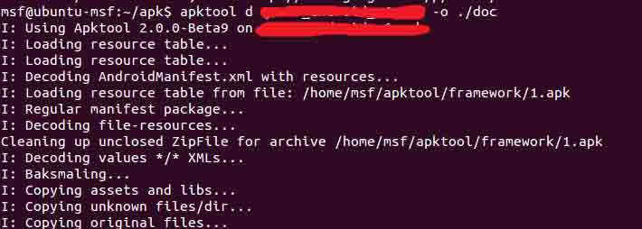
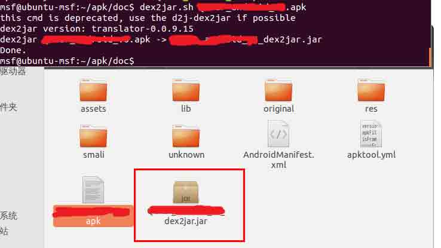
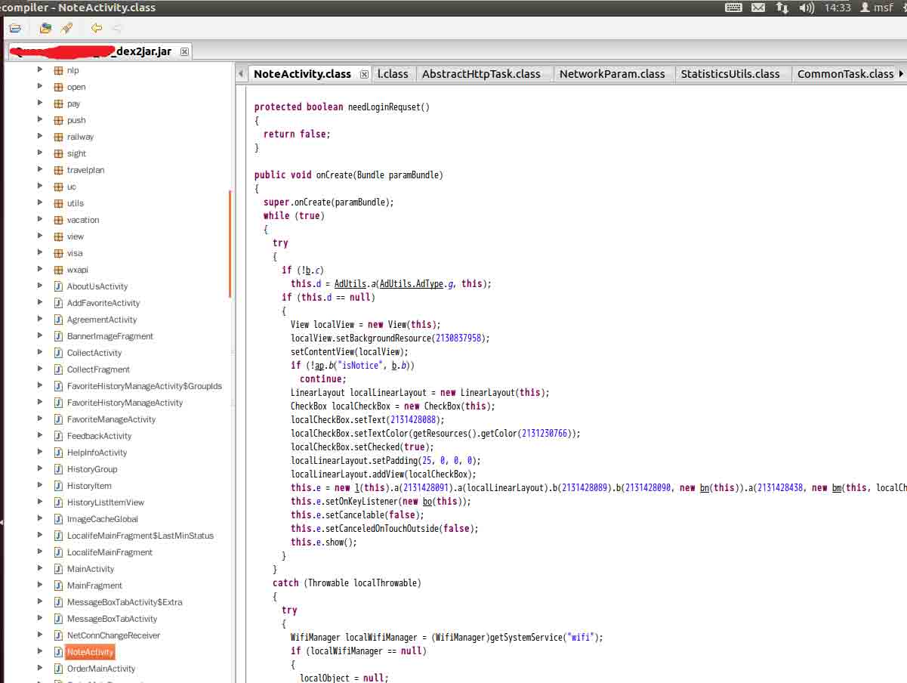
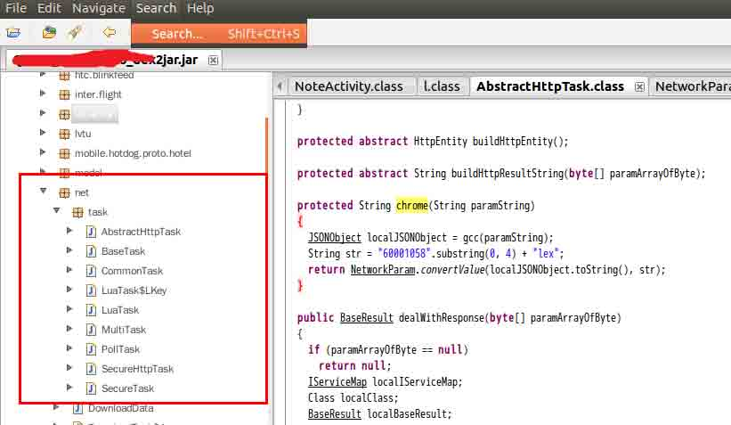
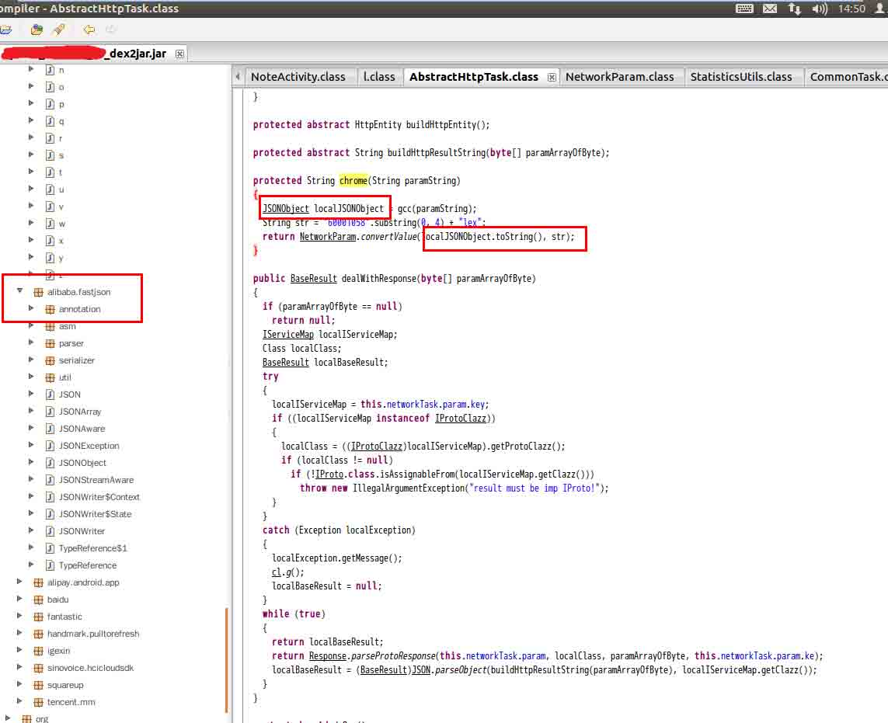
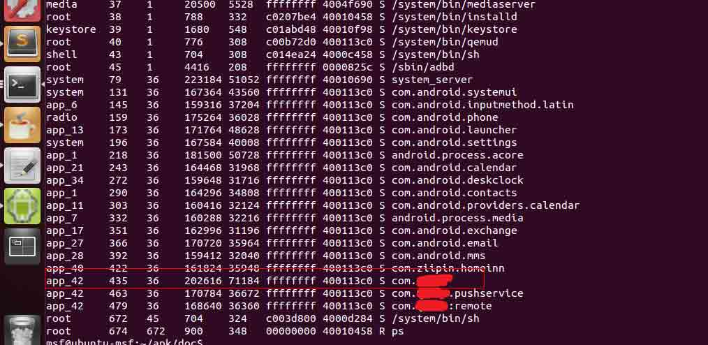
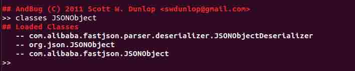
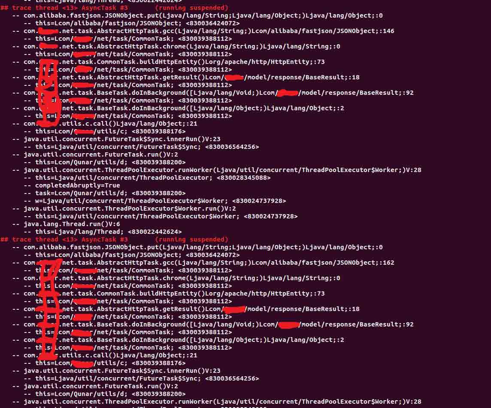
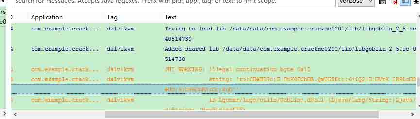
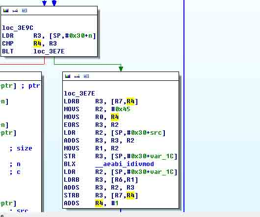

# 一次 app 抓包引发的 Android 分析记录

2014/08/26 12:55 | [绿盟科技](http://drops.wooyun.org/author/绿盟科技 "由 绿盟科技 发布") | [技术分享](http://drops.wooyun.org/category/tips "查看 技术分享 中的全部文章"), [移动安全](http://drops.wooyun.org/category/mobile "查看 移动安全 中的全部文章") | 占个座先 | 捐赠作者

## 0×00 起因

* * *

最近想了解下移动端 app 是如何与服务端进行交互的，就顺手下了一个某 app 抓下 http 包。谁知抓下来的 http 居然都长这个模样：

```
POST /ca?qrt=***LoginHTTP/1.1
Content-Type:application/x-www-form-urlencoded
Content-Length:821
Host:client.XXX.com
Connection:Keep-Alive

c=B946D7CF7B9E5B589F8DE6BC9E5DACF08DA6B35DA7A899DCA5AD5A58ADDAD5E66363589EF2D385B1ACACABDAD5E65F63589EF2D3F5B43EA7ACE36DFCA5383EABE7D4F1403E379FF0DEFCAD9FABA7E6E1F243A7AAAC74E380A4A09E6593D3FEA4ABA8ACF0DDF0AEAAB3A7EAE9FBA4A09E5F97D3FEA49EA09E9B97A9A4B69EADE7E1F6B0AC9EA0DA94A95E57609EF2D3B55E659EA0DA94B55F9EB69EDAD5E668689EB6DA98AA6E576E62939DE6A69E616D868CB673636162DAEBE6AEA2ACA2E486F3AD9EA09EA898A0A4B69EABE8E1F3B29EA09EA998A0A4B69EADE3E385AE3DA7ABDB6FF4B93A9F3DEFE3FBA537ACAD77D486AD37ADABE77383B4B4ACB4DAD5E66E9EB69EA886AF634061599F97E6A69E676394D3FEA4ACACACE8E1F4B2ACACACE8E1F4B2AC9EA0DA9CAAA4B69E9EDCD3B269589EB6DADFF4B2ACABACE3E9E675&b=AD178E267CA8666F636D6C54ADC1B3AEAD736574696950776D71A9BEACADA7A8727762A8C0AA67656172736A6D676F706E6369837F726C71A5AAA4756C656963ADC1A6797870615E676E7063666C756CAC7E&ext=&v=alex 
```

这是我在尝试登陆时抓包获取的唯一 http 包，显而易见 POST 数据中的 c 参数是包含登录信息的，但是为什么长这个模样？为了得到答案，我开启了我一周的 Android 动态调试和静态分析学习之旅。

这篇文章将通过这段字符串原文的过程，向各位介绍几种非常好用的 Android 调试工具以及它们的一些简单用法。

## 0×01 分析过程

* * *

### 1.基本静态分析过程

拿到一个 apk 最常规的做法应该是就是，反编译查看一下 java 源码了。

用[apktool](https://code.google.com/p/android-apktool/)反编译得到 smali（其实主要是为了看 AndroidManifest.xml）：

```
/*我用的 apktool 是 2.0.0-Beta9，命令和常见的 1.x 版本的命令有所不同*/ 
apktool d XXX.apk -o ./doc
/*我用的 apktool 是 2.0.0-Beta9，命令和常见的 1.x 版本的命令有所不同*/
apktooldXXX.apk-o./doc 
```



然后用的[dex2jar](https://code.google.com/p/dex2jar/)工具将 apk 反编译为 jar，并通过[JD-GUI](http://jd.benow.ca/)来查看 java 源码：

```
dex2jar.shXXX.apk 
```



在 apktool 反编译的目录中我们可以翻看 AndroidManifest.xml 来了解 apk 文件的基本结构，我从中首先找到主 Activity 的所在：

```
<activityandroid:configChanges=”keyboardHidden|orientation”android:exported=”true”android:name=”com.XXX.NoteActivity”android:screenOrientation=”portrait”android:theme=”@android:style/Theme.Black.NoTitleBar.Fullscreen”><intent-filter><actionandroid:name=”android.intent.action.MAIN”/><categoryandroid:name=”android.intent.category.LAUNCHER”/><categoryandroid:name=”android.intent.category.MULTIWINDOW_LAUNCHER”/></intent-filter> 
```

可以从上面的内容看出主 Activity 是 com.XXX.NoteActivity 这个类所定义的，然后通过 JD-GUI 打开 dex2jar 反编译后的 jar 包，查看 NoteActivity。



先来看 onCreate 中的操作，发现使用 produard 对 apk 进行了混淆了。这种混淆虽然不会影响我们反编译出来的代码内容，但是由于对类名、函数名、变量名进行了随机命名，导致我们阅读代码的过程比较痛苦。

我的目的很明确，就是定位到处理提交数据的代码，没有必要去花大量的时间来阅读被混淆的代码，所以我决定使用动态跟踪程序运行的轨迹来定位我想要获得的代码。

### 2.动态定位过程

虽然要用动态的方法来定位，但是还是需要简单的阅读 java 源码来确定提交数据的大概处理方式。

我的运气还是不错，网络传输部分的代码并没有被混淆。大体看了一下这些代码，发现和一般的 app 一样，客户端和服务端的数据交互也是使用 json 的格式进行的，并且使用了阿里开源的[fastjson](https://github.com/alibaba/fastjson)类来处理 json 内容。





了解了以上的这些情况，我决定通过跟踪 JSONObject 这个类来定位处理提交数据的位置。

这里推荐一个分析 app 的神器——[Andbug](https://github.com/swdunlop/AndBug)，虽然不能用来单步调试，但是动态跟踪 app 中各种线程调用栈、类调用栈、方法调用栈，断点获取当前内存中变量内容等功能还是非常实用的。

废话不多说了，来看操作吧，先获取要动态分析的 app 进程 ID：

```
adb shell ps 
```



进程 ID 445，使用[Andbug](https://github.com/swdunlop/AndBug)挂载该进程，并使用 classes 命令查找[fastjson](https://github.com/alibaba/fastjson)类的全路径：

andbug shell -p 435 classes JSONObject
andbug shell -p435 classes JSONObject



> 这里提示一个使用 classes 和 method 命令查找的小技巧。我们在 Andbug 的 shell 环境下使用 classes 时很容易由于 class 过多而导致没办法看到所有的 class。这是我们可以在终端环境下使用 classes 命令配合 more 来一点点的查看，就像这样：
>   andbug classes -p 435|more

然后我们使用 class-trace 命令来对这个类进行跟踪：

```
class-trace com.alibaba.fastjson.JSONObject 
```


在 app 中随便触发一个会提交请求的事件，调用过程在终端中完美的呈现了出来：



可以看到调用过程都用到了 com.XXX.net.task.CommonTask 中的方法，打开这个类的 java 源码第一眼就看到这段代码：

```
protectedHttpEntity buildHttpEntity()
  {
    if(this.hostUrl.indexOf(“?”)>0)
      this.hostUrl=(this.hostUrl+“&qrt=”+this.networkTask.param.key.getDesc());
    while(true)
    {
      Stringstr=String.valueOf(this.networkTask.param.ke);
      StringBuilderlocalStringBuilder1=newStringBuilder();
      localStringBuilder1.append(“c=”+chrome(str));
      localStringBuilder1.append(“&”);
      StringBuilderlocalStringBuilder2=newStringBuilder(“b=”);
      BaseParamlocalBaseParam=this.networkTask.param.param;
      SerializerFeature[]arrayOfSerializerFeature=newSerializerFeature[1];
      arrayOfSerializerFeature[0]=SerializerFeature.WriteTabAsSpecial;
      localStringBuilder1.append(NetworkParam.convertValue(JSON.toJSONString(localBaseParam,arrayOfSerializerFeature),str));
      if((this.networkTask.param.param instanceofHotelBookParam))
      {
        HotelBookParamlocalHotelBookParam=(HotelBookParam)this.networkTask.param.param;
        if(localHotelBookParam.vouchParam!=null)
          dealVouchRequest(localStringBuilder1,localHotelBookParam.vouchParam);
      }
      localStringBuilder1.append(“&”);
      localStringBuilder1.append(“ext=”+NetworkParam.convertValue(XXXApp.getContext().ext,str));
      localStringBuilder1.append(“&v=alex”);
      this.networkTask.param.url=localStringBuilder1.toString();
      try
      {
        StringEntitylocalStringEntity=newStringEntity(this.networkTask.param.url);
        returnlocalStringEntity;
        this.hostUrl=(this.hostUrl+“?qrt=”+this.networkTask.param.key.getDesc());
      }
      catch(UnsupportedEncodingExceptionlocalUnsupportedEncodingException)
      {
        cl.m();
      }
    }
    returnnull;
  }

```

结合之前的抓包，这应该就是我要找的地方了。从中找到处理 c 参数的代码，看到调用了 com.XXX.net.task.AbstractHttpTask.chrome 对参数值进行了处理，跟进 chrome 方法：

```
protectedStringchrome(StringparamString)
  {
    JSONObjectlocalJSONObject=gcc(paramString);
    Stringstr=“60001058″.substring(0,4)+“lex”;
    returnNetworkParam.convertValue(localJSONObject.toString(),str);
  }

```

继续赶进到 convertValue 方法：

```
publicstaticStringconvertValue(StringparamString1,StringparamString2)
  {
    if(TextUtils.isEmpty(paramString1))
      return "";
    if(paramString2==null)
      paramString2=“”;
    try
    {
      Stringstr=URLEncoder.encode(Goblin.e(paramString1,paramString2),“utf-8″);
      returnstr;
    }
    catch(ThrowablelocalThrowable)
    {
      localThrowable.printStackTrace();
    }
    return "";
  }

```

感觉的胜利的曙光越来越近了，这个 Goblin.e 应该就是最后的加密方法了吧，谁知打开这个文件（内心一万只草泥马在狂奔）：

```
packageXXX.lego.utils;
importcom.XXX.XXXApp;

publicclassGoblin
{
  static
  {
    try
    {
      System.loadLibrary(“goblin_2_5″);
      return;
    }
    catch(UnsatisfiedLinkErrorlocalUnsatisfiedLinkError1)
    {
      try
      {
        System.load(“/data/data/”+XXXApp.getContext().getPackageName()+“/lib/lib”+“goblin_2_5″+“.so”);
        return;
      }
      catch(UnsatisfiedLinkErrorlocalUnsatisfiedLinkError2)
      {
      }
    }
  }

  publicstaticnativeStringSHR();

  publicstaticnativeStringd(StringparamString1,StringparamString2);

  publicstaticnativeStringdPoll(StringparamString);

  publicstaticnativeStringda(StringparamString);

  publicstaticnativeStringdn(byte[]paramArrayOfByte,StringparamString);

  publicstaticnativebyte[]dn1(byte[]paramArrayOfByte,StringparamString);

  publicstaticnativeStringduch(StringparamString);

  publicstaticnativeStringe(StringparamString1,StringparamString2);

  publicstaticnativeStringePoll(StringparamString);

  publicstaticnativeStringea(StringparamString);

  publicstaticnativebyte[]eg(byte[]paramArrayOfByte);

  publicstaticnativeStringes(StringparamString);

  publicstaticnativeintgetCrc32(StringparamString);

  publicstaticnativeStringgetPayKey();

  publicstaticnativeStringve(StringparamString);
}

```

### 3.调用 so 文件函数

居然把加密方法写到了 so 文件中！难道要去看 ARM 汇编？

既然这个 so 文件中有加密函数，那是不是就应该有解密函数，那我应该还是可以偷懒的吧。

我们在上面看到的 e 函数肯定是用来加密的，那那个 d 函数是不是用来解密的（encode 和 decode）？

自己本地创建一个 app，并且创建一个 XXX.lego.utils 包，添加一个 Goblin.java 文件，把我们刚刚看到的 Goblin 源码粘贴进去。然后在 app 的一个 Activity 中导入 Goblin，并在 OnCreate 中调用 d 函数来尝试解密。部分代码如下：

```
#！java
Stringc=“B946D7CF7B9E5B589F8DE6BC9E5DACF08DA6B35DA7A899DCA5AD5A58ADDAD5E66363589EF2D385B1ACACABDAD5E65F63589EF2D3F5B43EA7ACE36DFCA5383EABE7D4F1403E379FF0DEFCAD9FABA7E6E1F243A7AAAC74E380A4A09E6593D3FEA4ABA8ACF0DDF0AEAAB3A7EAE9FBA4A09E5F97D3FEA49EA09E9B97A9A4B69EADE7E1F6B0AC9EA0DA94A95E57609EF2D3B55E659EA0DA94B55F9EB69EDAD5E668689EB6DA98AA6E576E62939DE6A69E616D868CB673636162DAEBE6AEA2ACA2E486F3AD9EA09EA898A0A4B69EABE8E1F3B29EA09EA998A0A4B69EADE3E385AE3DA7ABDB6FF4B93A9F3DEFE3FBA537ACAD77D486AD37ADABE77383B4B4ACB4DAD5E66E9EB69EA886AF634061599F97E6A69E676394D3FEA4ACACACE8E1F4B2ACACACE8E1F4B2AC9EA0DA9CAAA4B69E9EDCD3B269589EB6DADFF4B2ACABACE3E9E675″;
Stringp2=“6000lex”;
Stringtest=Goblin.d(c,p2);
System.out.println(test); 
```



天不遂人愿啊！解密出错，看来真的要去看 ARM 汇编了。。。。。。

### 4.动态调试 so 文件

由于 app 自带的加密数据，我们不知道原来的样子，所以要自己构造一个字符串加密，来调试。修改上面的 app 代码如下：

```
#！java
Stringjson=“json{/”test/”:/”test1/”,/”test4/”:/”test1/”,/”test5/”:/”test1/”,/”test6/”:/”test1/”,/”test3/”:/”test1/”,/”test2/”:/”test1/”,/”test1/”:/”test1/”}”;
Stringp2=“6000lex”;
Stringtest=Goblin.e(c,p2);
System.out.println(test); 
```

生成代码如下：

```
C0990850B69C969E92C19C9DC5CDD9F0FAB99AD3960CE3F6D2CFB0AA9AE904F6C0A099A68DFFD0C1EE978CA985CAD2FCF6CD92A7C4FCE106CCC99CC39C11F7F3D0A9BDAD8AE3E0D9C3BC898EB8DCD3F2BB8B8BB3C010D9DAFAB99AD3960FE30CD2CFB0AA9AEC04E0C0A099A68DFFD0D7EE978CA985CED2B5 
```

好了准备活动完成了，下面我们开始动态跟踪之旅吧。在《Android 软件安全与逆向分析》中提供的动态分析工具是 IDA pro 6.1 以上版本，这个我在调试过程中发现加载很慢。虽然加载完成后，能够跟着 IDA 生成的流程图来调试很爽，但是加载成功率实在是太低了。所以，我放弃了用 IDA 进行动态调试，而是选择了 这个号称移动端 Onllydbg 的[gikdbg](http://gikir.com/product.php)来进行调试，同时配合 IDA 的流程图。

[gikdbg](http://gikir.com/product.php)使用参考[《gikdbg.art 系列教程 2.1-调试 so 动态库》](http://gikir.com/blog/?p=115)这篇 blog 很容易上手，这里也就不多说了。

调试跟踪过程很枯燥，也没什么可以说的，我们直接看结过吧。

通过反复的动态跟踪，确定下面这个循环是加密的关键：



可以看出加密方法比较简单，对于源数据的每一个字符与 0×45 进行异或，然后 jia0x24，最后再加上硬编码在 so 文件的一串 key 中的一个字符。根据汇编逆向出来的 python 代码如下：

```
result=""
i=0
while(i<len(json)):
    char=json[i]⁶⁹
    j=i
    ifj>len(key):
        j=j%len(key)
    encode=int(ord(char))+36+key[i]
    result+=encode
    i+=1 
```

在加密完数据后，会在数据头部添加一个 8 个字符（32 位）的校验数据，校验算法使用的是 adler32。由此可以推出解密算法，代码如下：

defdecode():

```
ejson=‘B69C969E92C19C9DC5CDD9F0FAB99AD3960CE3F6D2CFB0AA9AE904F6C0A099A68DFFD0C1EE978CA985CAD2FCF6CD92A7C4FCE106CCC99CC39C11F7F3D0A9BDAD8AE3E0D9C3BC898EB8DCD3F2BB8B8BB3C010D9DAFAB99AD3960FE30CD2CFB0AA9AEC04E0C0A099A68DFFD0D7EE978CA985CED2B5′

key=‘cBHO06GYkxNModVyAtXiGzlPETyS5KUL8gE4′
i=0
result=”
while(i<len(ejson)):
    j=i/2
    char=ejson[i:i+2]
    ifj<len(key):
        k=key[j]
    else:
        k=key[j%len(key)]
    i=i+2
    c=int(char,16)-int(ord(k))
    ifc<0:
        c+=128
    c=c-36
    ifc<0:
        c+=128
    c=c⁶⁹
    dchar=chr(c)
    result+=dchar
printresult
decode() 
```

其中 ejson 中的内容为，我们使用 e 函数加密后获得的内容剔除前八位，解密效果如下：

## 0×02 最终结果&分析总结

* * *

不过悲剧的是用这个解密方法没办法解密前面我抓包获取的数据。。。。。。

郁闷之心无以言表啊！！！

不过这个过程还是很有意义的，了解了 Android 各种姿势的动态调试方法。这里再次回顾一些这个过程。

首先通过反编译获取 smali 和 java 代码进行静态分析，发现代码被混淆后，明确自己的最终目标——找到处理提交请求的方法，然后进行动态跟踪。动态跟踪和静态分析结合定位出处理提交请求的几个类，翻看这些类的代码，来找到最终我们想找的方法。

在发现处理方法使用了 so 文件中的函数，通过自己构造 app 来分别调用 so 中的各个函数，试图从中找到直接的解密函数。

在 so 中没有找到解密函数的情况下，通过动态调试与静态查看汇编，分析出加密算法，并写出解密工具。

## 0×03 参考文章

* * *

【1】[《Assembly Programming Principles》](http://www.peter-cockerell.net/aalp/html/ch-5.html)
【2】[《Android 动态逆向分析工具（一）——Andbug 之基本操作》](http://bbs.pediy.com/showthread.php?t=183412)
【3】[《Android 动态逆向分析工具（四）—— Andbug 补充调试功能》](http://bbs.pediy.com/showthread.php?t=183706)
【4】[《gikdbg.art 系列教程 2.1-调试 so 动态库》](http://gikir.com/blog/?p=115)

版权声明：未经授权禁止转载 [绿盟科技](http://drops.wooyun.org/author/绿盟科技 "由 绿盟科技 发布")@[乌云知识库](http://drops.wooyun.org)

分享到：

### 相关日志

*   [Android Adobe Reader 任意代码执行分析(附 POC)](http://drops.wooyun.org/papers/1440)
*   [一次 app 抓包引发的 Android 分析（续）](http://drops.wooyun.org/tips/2986)
*   [Android Broadcast Security](http://drops.wooyun.org/tips/4393)
*   [Android Logcat Security](http://drops.wooyun.org/tips/3812)
*   [Samsung S Voice attack](http://drops.wooyun.org/tips/2736)
*   [探秘短信马产业链-从逆向到爆菊](http://drops.wooyun.org/tips/789)