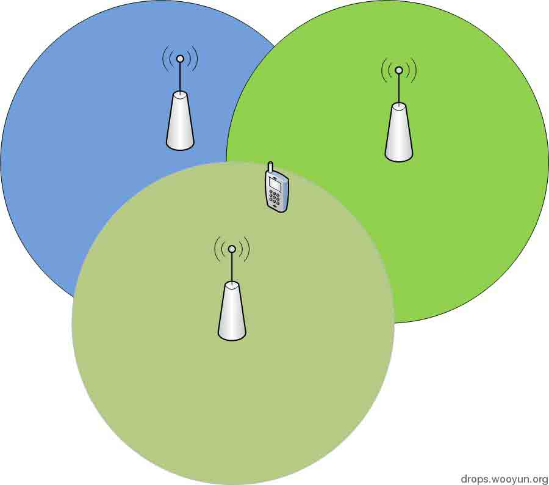
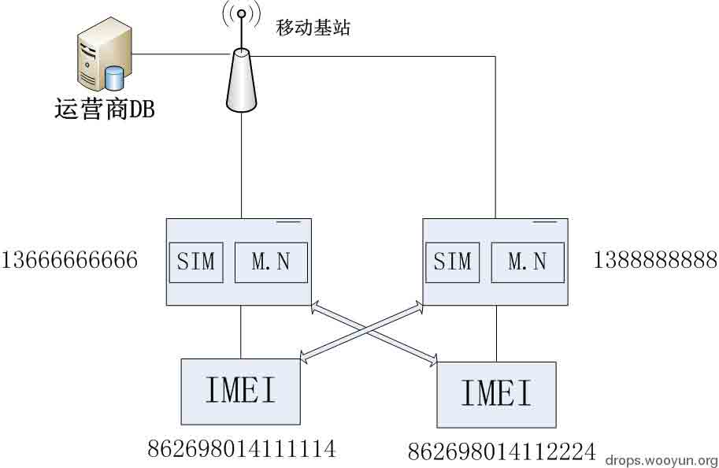
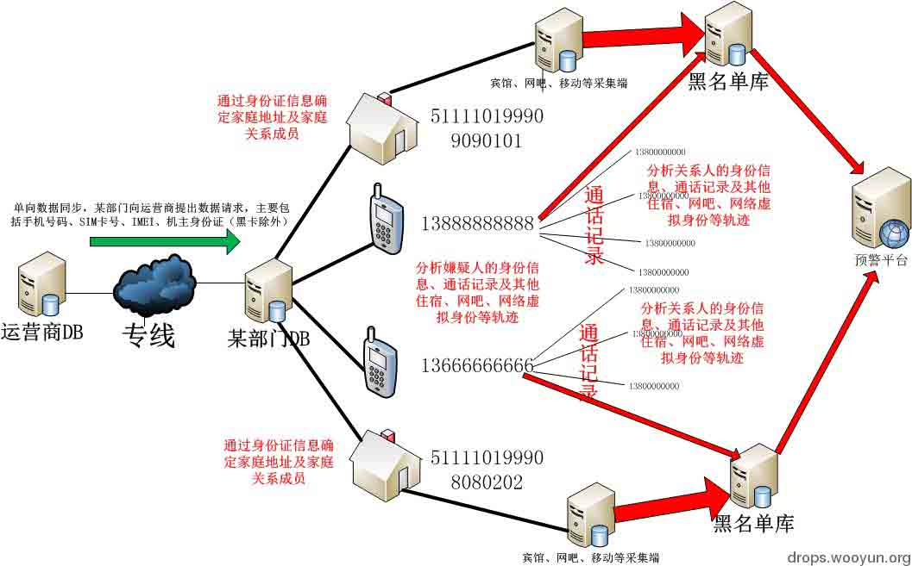

# 保护自己之手机定位信息收集

2013/07/26 11:46 | [啦绯哥](http://drops.wooyun.org/author/啦绯哥 "由 啦绯哥 发布") | [技术分享](http://drops.wooyun.org/category/tips "查看 技术分享 中的全部文章") | 占个座先 | 捐赠作者

### 0x00 名词解释

* * *

M.N：mobile number，11 位数字组成，拨打国内默认在号码前加+86，为确定国家位置；

IMEI：IMEI 由 15 位数字组成（如 862698014111114），全球唯一，一一对应每台手机，前 6 位是“型号核准号码，代表手机机型”（如 862698），接着 2 位代表产地（如 01），之后 6 位代表生产顺序号（其实就是厂家的 SN）（如 411111），最后 1 位数是校验码（如 4）。

SIM：卡上有 20 位数字，详见：[`baike.baidu.com/view/23558.htm?fromId=17668`](http://baike.baidu.com/view/23558.htm?fromId=17668)

刚才在 zone 里面看到 x0ers 发表的[《请教关于手机 IMEI 定位的问题》](http://zone.wooyun.org/content/5405)

突然想到最近的一个项目，在这里简单讲述一下关于手机定位的事情：

任何定位都是基于通讯的基础上，那么手机的定位亦是如此，手机的定位目前是基于基站三点定位，在基站分布越密集的区域精确度越准确，这就是大家到了偏远的地区，如果使用非 GPS 定位时，准确度很低的原因。

下面画了个简图解释三点定位：

### 0x01 细节

* * *

每个设备都有唯一识别码，手机有 IMEI，SIM 卡默认也有一个地址，在办理手机卡时，运营商会把你的手机号码和 SIM 卡进行绑定（相信做过 SIM 复制的朋友很熟悉，只要拿到人家的 SIM 或者知道 SIM 卡号，可以实现一号多卡），那么现在的 JCSS 为什么会去关注 IMEI 号码呢？

那是因为运营商会通过 SIM 通信收集手机的 IMEI 号码，当手机开机后，手机会自动通过移动信令把 IMEI 号码传到运营商的服务器里面，如果你的 SIM 卡换了一个手机，那么那边又会重新对该手机号码对应的 IMEI 号进行收集；其实 IMEI 就像电脑上的 MAC 地址一样，没有说知道 MAC 地址就能定位的，IMEI 亦是如此。

下图以 2 个手机号码和 2 个手机串号为例讲解：

当出现 IMEI 号码和多个手机号码关联时，系统默认这几个手机号码机主间产生强关系链，这个数据拿到情报部门，可以利用这个关系链对他们做进一步分析。

作为运营商应用到这个程度其实就够了，那么现在情报部门应用到什么程度了呢？

首先从运营商抽取手机号码、SIM 卡号、手机号机主身份证号、IMEI 号码、通话记录，那么有了这些数据可以干什么呢？

由于数据碰撞分析比较复杂，下面以一张简图的形式说明：

**Tags:** [手机定位](http://drops.wooyun.org/tag/%e6%89%8b%e6%9c%ba%e5%ae%9a%e4%bd%8d)

版权声明：未经授权禁止转载 [啦绯哥](http://drops.wooyun.org/author/啦绯哥 "由 啦绯哥 发布")@[乌云知识库](http://drops.wooyun.org)

分享到：

### 相关日志

*   [Pcshare 远控源码偏重分析（一）](http://drops.wooyun.org/tips/4412)
*   [Win10 安全特性之执行流保护](http://drops.wooyun.org/tips/4839)
*   [Mongodb 注入攻击](http://drops.wooyun.org/tips/3939)
*   [初探验证码识别](http://drops.wooyun.org/tips/4550)
*   [BurpSuite 扩展开发[1]-API 与 HelloWold](http://drops.wooyun.org/papers/3962)
*   [爬虫技术浅析](http://drops.wooyun.org/tips/3915)