# CoolPad backdoor CoolReaper 

2014/12/19 15:42 | 路人甲 | [技术分享](http://drops.wooyun.org/category/tips "查看 技术分享 中的全部文章"), [移动安全](http://drops.wooyun.org/category/mobile "查看 移动安全 中的全部文章") | 占个座先 | 捐赠作者

注：译文未获得平底锅授权，纯属学习性质翻译

原文：[`www.paloaltonetworks.com/content/dam/paloaltonetworks-com/en_US/assets/pdf/reports/Unit_42/unit42-cool-reaper.pdf`](https://www.paloaltonetworks.com/content/dam/paloaltonetworks-com/en_US/assets/pdf/reports/Unit_42/unit42-cool-reaper.pdf)

## 综述

* * *

宇龙酷派是中国第三大以及全球第六大智能手机生产厂商。最近我们研究发现许多高端酷派手机在预装软件均包含一个后门程序，我们将此后门称为：CoolReaper

在看到许多酷派用户反馈手机上的可疑现象后，我们下载了多个中国区发行的官方固件，其中大多数都包含了 coolreaper 这款后门应用。

CoolReaper 表现出以下行为：

*   静默下载、安装或者激活任意应用且不通知用户
*   清楚用户数据、卸载已安装应用或者禁用系统应用
*   伪造 OTA 信息提示用户升级系统其实是安装一些推送的应用
*   发送短信或者彩信以及伪造手机中的短信或者彩信
*   拨打电话
*   上传用户设备信息、位置信息、应用使用情况、通话记录、短信记录到酷派服务器。

手机生产厂商一般会在设备中安装一些定制软件，但是 coolreaper 貌似不那么简单。一些移动运营商也会预装一些软件用于收集用户使用习惯和数据。Coolreaper 比这些做的更多非常类似一个后门。

中国的酷派用户在网上反馈后门应用静默安装软件已经推送广告的行为。不过这些反馈信息均被酷派忽略或者删除。

酷派同时还在他们的许多固件中还更改了底层安卓系统。这些变动主要目的是隐藏后门 coolreaper 组件不被用户发现以及不被其他应用分析。这使用杀毒软件无法轻易检测到此后门应用。

9 月，一个名乌云白帽子发现 coolreaper 后台系统的漏洞。后台呈现出 coolreaper 的各种操作指令。

现阶段酷派手机后门只能影响到中国用户，但是酷派的国际化战略意味着这款后门应用将有可能影响全球 Android 用户

## 酷派后门

* * *

### User Reporting for this Threat

* * *

酷派是宇龙集团旗下智能手机品牌，港股编号：02369

根据华尔街日报及易观国际分析显示酷派是全球第六大智能手机生产厂商。而实际上，基于最新的 IDC 数据分析报告酷派占全球 3.7%的市场份额。从 2012 年开始，酷派就已经成为了中国第三大智能手机制造厂商，2014 第二季度占有市场份额 11.5%。仅排在小米和联想之后。2014 上半年酷派在中国 4G 手机市场份额占 15.8%位居第一。

酷派手机旗舰系列取名 halo（又叫大神手机），此系列涵盖了 3G 与 4G 两种通信制式。

酷派通用也有廉价产品。以下是其官方商城售卖的手机：

*   The Halo (Dazen) series: Dazen F1, Dazen F1 Plus, Dazen 1S, Dazen F2, Dazen Note
*   The S series: Coolpad S6
*   The K series: Coolpad K1
*   The Magview series: Magview 9970, Magview 8971
*   Others: Coolpad 8730L, Coolpad 8720L, Coolpad 7295, Coolpad 9150W, Coolpad 9080W, Coolpad 5951, Coolpad 7295C, Coolpad 8908

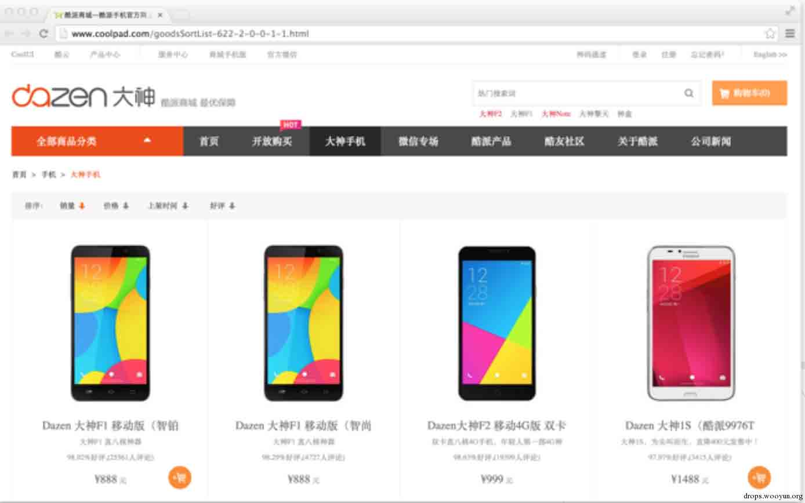 

相对零售渠道，酷派更大的出货渠道是中国三大运营商：中国移动、中国联通以及中国电信。（定制机）

尽管不像苹果和三星那么出名，酷派在中国依然很畅销并且在国际市场迅速扩张，尤其是在 4G 手机市场。2014 上半年，酷派生产制造 29 款新手机，其中 12 款支持 4G 网络。2013 全年酷派生产了三千七百二十万台设备，并在 2014 年仅三月一个月中就生产了六百万台设备。酷派的目标是在 2014 年销售六千万台手机，大神系列预计销售超过一千万台。

## 酷派全球扩张

* * *

根据华尔街日报报道，酷派计划向东南亚、欧洲以及美国市场进军。

在美国酷派官网销售以下三种机型：

*   Coolpad Quattro 4G (Coolpad 5860E)
*   Coolpad Flo
*   Coolpad Quattro II

2014 年，酷派与 MetroPCS 公司（已被 T-Mobile 并购）合作在美国售出了超过一百三十万的 Quattro 4G 设备。2014 年，酷派与 GoSmart Mobile 合作开始在美国销售酷派 Flo 手机

2013 年初，酷派联合 Vodafone 与 France Télécom 在超过 10 个欧洲国家销售 8860U 以及 8870U。

2014 年 7 月初，酷派与东南亚的一运营商合作在印度和印尼运作，并且计划进军泰国、缅甸以及马来西亚市场。截至 2014 年 9 月，在这些国家已经销售超过 50 万大神系列手机。

## CoolReaper: The Coolpad Backdoor

* * *

2013 年 10 月报告中的可疑界面开始出现中国用户的酷派手机中。用户反馈广告推送出现在通知栏，通过 OTA 升级后系统并未得到升级而是出现一些不是用户安装的新应用。为了定位这些反常事件我们开始调查酷派官方 rom 以及酷派修改过的 rom

酷派提供大神系列、s 系列、k 系列 zip 格式的官方 rom 以及其他机型的定制官方 rom。这些 rom 均能在酷派官方论坛或者官方服务中心下载到。酷派提供这些固件给用户 OTA 升级或者重新刷机. 我们猜测（并未确认）手机出厂时也是刷的这些 rom。

2014 年 11 月我们从酷派官方论坛下载了大神系列 8 个机型的 45 个官方 rom。为了增大测试范围，我们又下载了其他 20 个机型的 32 个第三方 rom。这些第三方固件都是基于官方固件修改的。

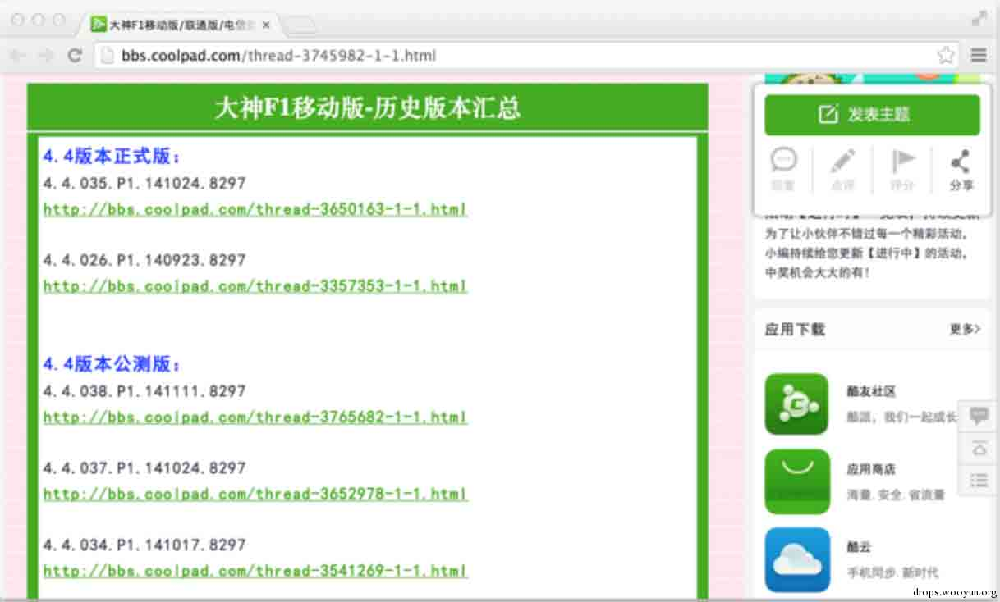

我们总共调查了 77 个酷派手机 rom，其中 64 个包含后门 coolreaper。大神系统 8 个机型有 41 个 rom 有后门，其他 23 个第三方固件设计 16 种机型也都有后门。我们确认至少有 24 种不同的酷派手机种存在 coolreaper 后门。下表是我们分析后的 rom 后门存在情况。

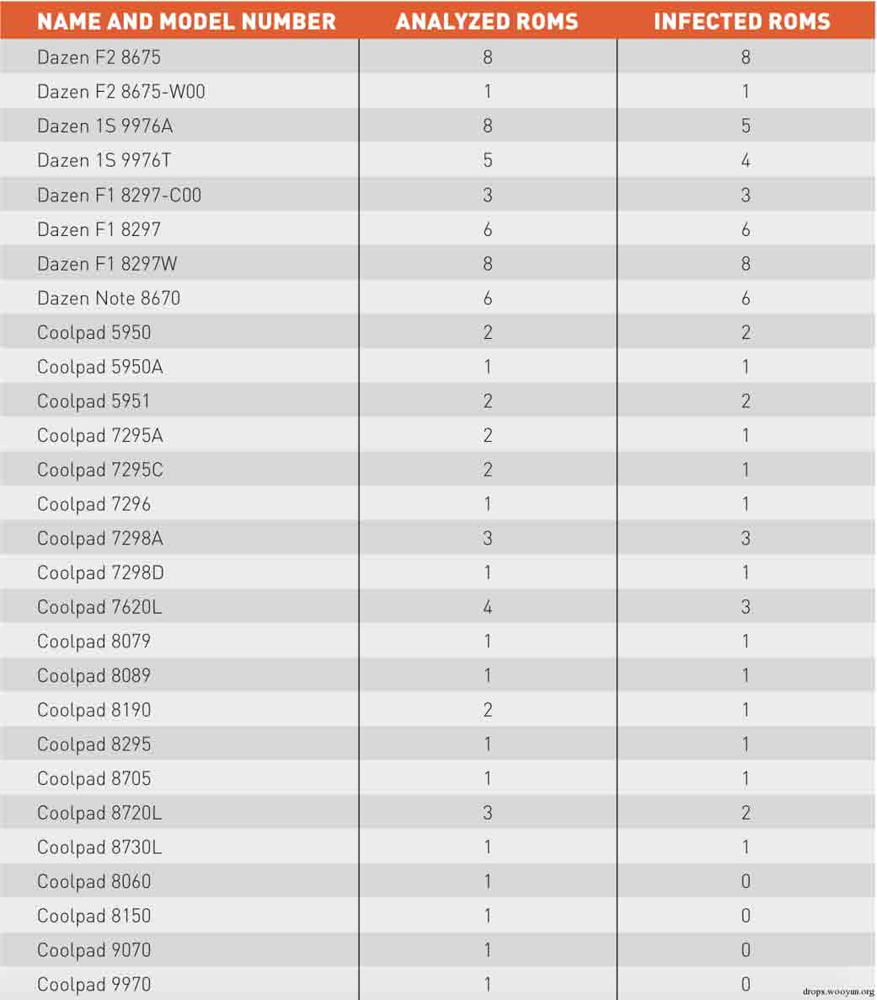

### CoolReaper Files and Versions

* * *

在分析的这些 rom 后门 coolreaper 分别以下文件名的形式存在：

*   /system/app/CP_DMP.apk
*   /system/app/CP_DMP.odex
*   /system/app/GoogleGmsFramework.apk
*   /system/app/GoogleGmsFramework.odex
*   /system/lib/libgmsframework.so

libgmsframework.so 并不是个库文件，其实是一个 apk 文件。在同一个 rom 里此文件的内容与 GoogleGmsFramework.apk 相同。唯一区别是这个伪造的库文件使用调试证书签名。

我们发现的 12 个不同此 coolreaper 版本如下表


开发者使用了编译日期作为版本号，使用编译日期+时间作为版本名称。利用这两个特征我们可以确认 CoolReaper 开发日期是 2013 年 10 月 12 号或者更早。

2014 年 5 月我们注意到此后门做了一个版本升级，从 2.x 升级到 3.0。同时后门的文件名由 CP_DMP.apk 变更为 GoogleGmsFramework.apk。我们怀疑酷派这么做是因为网上有用户反馈 CP_DMP.apk 是恶意软件。

### Origin

* * *

有一种可能 Coolreaper 后门是由第三方制造的。不过根据分析我们相信后门是由酷派官方制作并且安装到酷派手机种的。

所有的 CoolReaper 的签名是酷派公司的，41 个受影响的官方 rom 中都使用的相同的签名。

一些官方 rom 对底层安卓系统做了修改用于使 coolreaper 消失在用户和杀软的视线中。

用于给 coolreaper 发送控制指令的服务器使用的域名 coolyun.com 和 51Coolpad.com 是由酷派官方注册的。而且给用户提供云服务。

11 月，Coolreaper 后台控制系统被暴露。酷派确认存在此系统并且许诺修复漏洞。这个控制系统是 coolyun.com 的子域名。

## CoolReaper Analysis

* * *

为了分析后门的功能，我们从大神 F2 种提取一个 coolreaper 样本。F2 基于 android4.4，rom 编译于 11 月 18 号

Build ID： 4.4.051.P2.141118.8675

ROM_SHA-1：39240a84070040c27221b477f101bf9b1555d7ce

PATH:/system/app/GoogleGmsFramework.apk

APK_SHA-1:3753244484c4a8b2b2dc8c3b7e119eabd0490398

后门 apk 使用了 ProGuard 进行代码混淆。混淆后的命名使得逆向工作十分困难。为了方便分析代码，我们参考其意图尝试重命名进行还原。读者将在这份报告中看到许多这样重命名后的截图。我们重命名方法遵循以下原则：

1.  CoolPreaper 的开发者留下了许多 debug 信息可以帮助鉴别原类名或者方法名，如果可能我们尽量使用这些命名。

    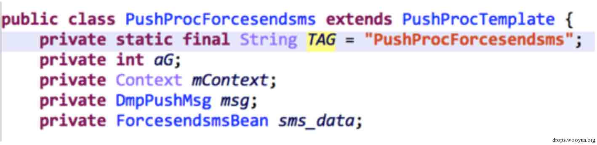

2.  代码质量较高，开发者保持使用特定的框架。重命名的时候依据此框架。

3.  当我们无法识别开发者意图命名时,我们根据此此对象的功能来命名。

更改方法名使得代码可读性更高而且并不影响代码逻辑。

### System Application with System User ID

* * *

在安装有后门的固件中，CoolReaper 以系统应用安装。所有的样本都有着同样的包名"com.android.update.dmp"。特征字符"DMP"出现在文件名、包名、C2 的 URL 中以及其他地址,我们怀疑 DMP 就是 “Data Management Platform.”的缩写。

在配置文件 AnroidManifest.xml 中，coolreaper 定义了 android:sharedUserId 属性为“android.uid.system”


这样做 coolreaper 将拥有系统 UID 并以 system 权限运行。目的是将其变成系统应用而非第三方应用。

下面是从官方固件中提取的 coolreaper 的签名信息

```
Owner: EMAILADDRESS=android@yulong.com, CN=YuLong, OU=YuLong, O=YuLong,
L=ShenZhen, ST=GuangDong, C=CN
Issuer: EMAILADDRESS=android@yulong.com, CN=YuLong, OU=YuLong, O=YuLong,
L=ShenZhen, ST=GuangDong, C=CN
Serial number: fb1ecd58cb8358f7
Valid from: Fri Oct 22 08:26:53 PDT 2010 until: Fri Sep 21 08:26:53 PDT 2035
Certificate fingerprints:
       MD5:  DB:DB:3B:ED:34:72:B1:B3:C4:CA:59:BE:CD:33:9F:44
       SHA1: 5D:F8:F0:82:12:61:A2:34:D1:11:02:8E:FD:DF:FA:3C:88:89:76:49
       Signature algorithm name: SHA1withRSA
       Version: 3 
```

### User Interface

* * *

CoolReaper 显示的应用名字是"Android System",并且使用了其他真正系统应用的图标。CoolReaper 在应用桌面是不可见的。

CoolReaper 实现了很少的用户交互的组件。其中一些是不生效的，比如 com.android.update.dm.MainActivity . 还有一些恶意意图的功能，像组件 com.android.update.dmp.PretendedOTADialog 用于显示一些伪造的 OTA 升级通知。 com.android.update.dmp.weblinkhandler.WebLinkActivity 用于通过远程控制打开指定页面。

大多数的恶意功能均是静默实现不需要与用户进行交互，用户很难发现和阻止。

### Code Structure

* * *

CoolReaper 主要代码可以分割成两个组件：DMP 和 ICU

在 DMP 的 java class 都有前缀"com.android.update.dmp"。他们负责接收从 C2 服务器发送的命令、下载相关文件表现为本地恶意行为。此组件可以通过开机、联网、点亮屏幕触发。当这些事件发生时，DMP 在后台启动一个服务：com.android.update.dmp.SystemOptService

在 ICU 组件中的 java class 前缀为：com.android.icu，他们负责手机用户信息并发送到 C2 服务器。ICU 以系统服务形式运行：com.android.icu.service.SystemPipeService

以上分析显示 DMP 和 ICU 是分别开发的，他们有着不一样的功能、不一样的路径、不同的的 C2 地址并且不相互影响。

### Component Functionalities

* * *

CoolReaper 中的 DMp 和 ICU 组件实现了很多功能，当他们组合起来时变成一个非常强大的后门。

DMP 组件主要负责远程控制设备，此组件的具备以下功能：

*   下载指定 APK 文件，OTA 升级且不需要用户确认
*   后台安装 apk 不需要用户确认
*   启动任意已安装的应用且不需要用户确认
*   启动任意应用指定的服务不需要用户确认
*   后台静默卸载任意应用不需用户确认
*   桌面任意创建或者删除快捷方式
*   清除指定应用数据不需要用户确认
*   禁用或者激活任意系统应用不需要用户确认
*   通知用户正常 OTA 升级
*   伪造 OTA 升级通知
*   使用之前下载好的升级包强制 OTA 升级
*   拨打任意电话不需要用户确认
*   发送指定短信内容到指定号码不需用户确认
*   插入任意指定短信活彩信到收信箱并且在通知栏显示伪造通知
*   通过默认浏览器打开指定链接
*   设置或者获取系统变量
*   弹出通知栏或者对话框，如果用户点击将会下载指定 apk
*   弹出通知栏，用户点击后拨打指定号码
*   弹出通知栏，用户点击后显示指定页面
*   弹出通知栏，用户点击后登录或者安全指定应用
*   上传用户磁盘信息到 c2 服务器
*   上传用户手机是否 root 的信息到 C2 服务器

另一方面，ICU 组件主要负责手机用户信息发送到 C2 服务器，ICU 收集如下信息：

*   设备硬件信息
*   设备地理位置信息包括城市、省份信息
*   安装的应用以及使用频率信息
*   通话数以及短信收发数量
*   网络信息，包括联网类型以及联网时间

上述功能明显表明 CoolReaper 可以扮演后门的角色。后台操作者可以轻易的在用户设备上卸载或者禁用安全软件、安装恶意软件、窃取用户信息以及注入虚假信息。

除了这些功能外，代码里许多调试字符串就包含"backboor"关键字。比如下面的类"BackDoorManager"含有有一个方法"processBackDoor"

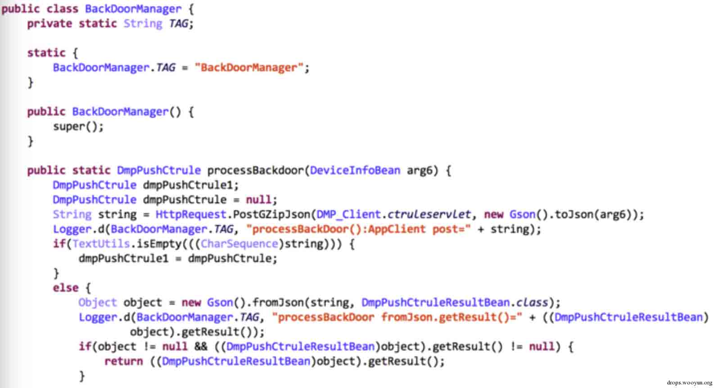

当启动伪造 OTA 升级功能时，反馈报告里的信息是"the preset app back door is opened!"，以及在默认配置文件中一个 item 取名为"isBackDoorMsgSended"

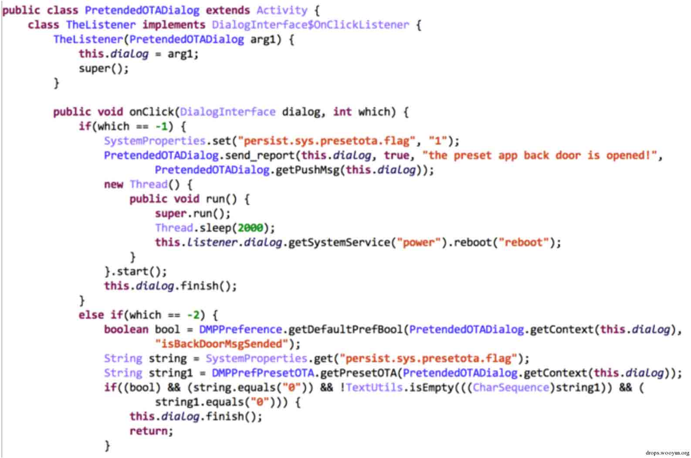

这些调试信息、反馈信息自身显然不是恶意软件，但是通过这些字符串可以看出 CoolReaper 的制作者的意图是想在设备中安置后门。

CoolReaper 包含太多功能不能再这里一一描述。附录中将贴出其后门功能的代码截图

### Command and Control Servers and the Coolyun Service

* * *

CoolReaper 的 DMP 和 ICU 组件使用不同 URL 群作为他们的指令服务器。

DMP 组件的后台的域名和 ip 信息如下：

*   dmp.51Coolpad.com
*   dmp.coolyun.com
*   13.142.37.149

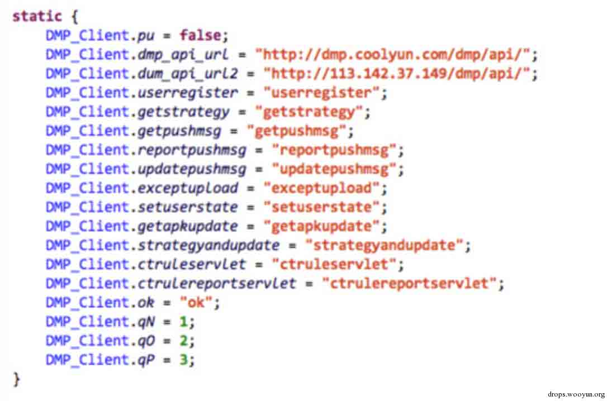

在我们分析时这些域名解析到 13.142.37.149，CoolReaper 有能力在任何时候更新 C2 的地址

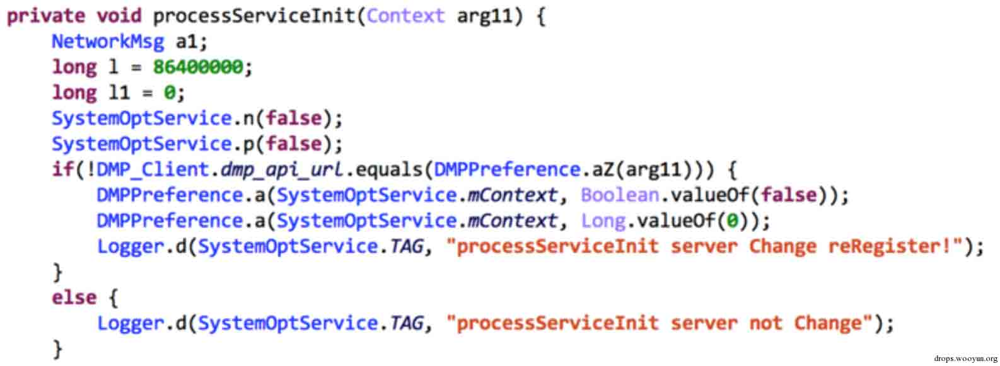

DMP 组件使用 HTTP POST 请求与 C2 服务器通信，当获取到命令或者上传信息的时候，它会使用特别的 User-agent："UAC/1.0.0 (Android <Build.VERSION.RELEASE>; Linux)"。这里的<Build. VERSION.RELEASE>是安装在手机中 android 操作的系统的版本。

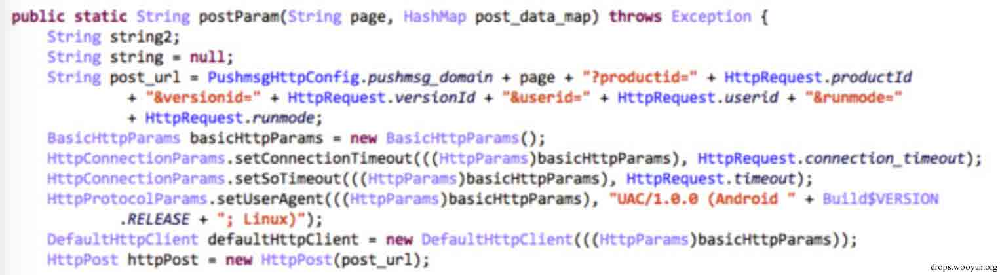

在 CMP 组件里，Coolreaper 使用了 13 个不用的 URL 用来注册设备、获取指令、返回执行结果、上传执行信息、下载 apk 文件以及执行其他任务。这些 URL 如下：

*   http://dmp.51Coolpad.com/dmp/api/getfirstpushmsg
*   http://dmp.coolyun.com/dmp/api/userregister
*   http://dmp.coolyun.com/dmp/api/getstrategy
*   http://dmp.coolyun.com/dmp/api/getpushmsg
*   http://dmp.coolyun.com/dmp/api/reportpushmsg
*   http://dmp.coolyun.com/dmp/api/updatepushmsg
*   http://dmp.coolyun.com/dmp/api/exceptupload
*   http://dmp.coolyun.com/dmp/api/setuserstate
*   http://dmp.coolyun.com/dmp/api/getapkupdate
*   http://dmp.coolyun.com/dmp/api/strategyandupdate
*   http://dmp.coolyun.com/dmp/api/ctruleservlet
*   http://dmp.coolyun.com/dmp/api/ctrulereportservlet
*   http://dmp.coolyun.com/dmp/api/strategyandupdate

ICU 组件使用如下 URL 下载配置数据以及上传用户信息：

*   http://icudata.coolyun.com/
*   http://icudata.51Coolpad.com/
*   http://113.142.37.246/filereceiver
*   http://icucfg.coolyun.com/
*   http://icucfg.51Coolpad.com/
*   http://113.142.37.246/icucfg
*   http://file.Coolpadfuns.cn/actioncollect

coolyun.com 除了发送指令控制设备外还解析为酷派官方云服务：酷云。


通过酷云，酷派提供服务以及应用给安卓用户。我们对比了 CoolReaper 以及酷云客户端来确认它是否是酷云的合法管理应用

酷云客户端的包名为：com.android.coolwind 。它在 cooyun.com 以及各大应用市场均能下载。我们注册了一个酷云帐号发现其只给用户提供了少量服务，包括备份联系人以及云存储。这些功能和 coolReaper 比起来简直小巫见大巫。

事实上，处理使用同样的 C2 域名外，CoolReaper 和酷云唯一的关系就是 ICU 组件在设备上收集酷云帐号并且发送到 C2 服务器。

## CoolReaper Back-End

* * *

一般来说像像 CoolReaper 这种后门的后台控制系统是很难被找到或者公开的，但是最近酷派开发给我们了一个机会去见识下酷派到底是怎么使用这个后门的。

2014 年 9 月 19 号，乌云白帽子"爱上平地山"在乌云网上报酷派漏洞[酷派官方静默安装 apk 功能后台存在高危漏洞(演示定制机是如何在你的手机默默安装)](http://www.wooyun.org/bugs/wooyun-2014-083824)。同天酷派确认此漏洞并且评论"感谢提供，我们尽快解决，谢谢。"

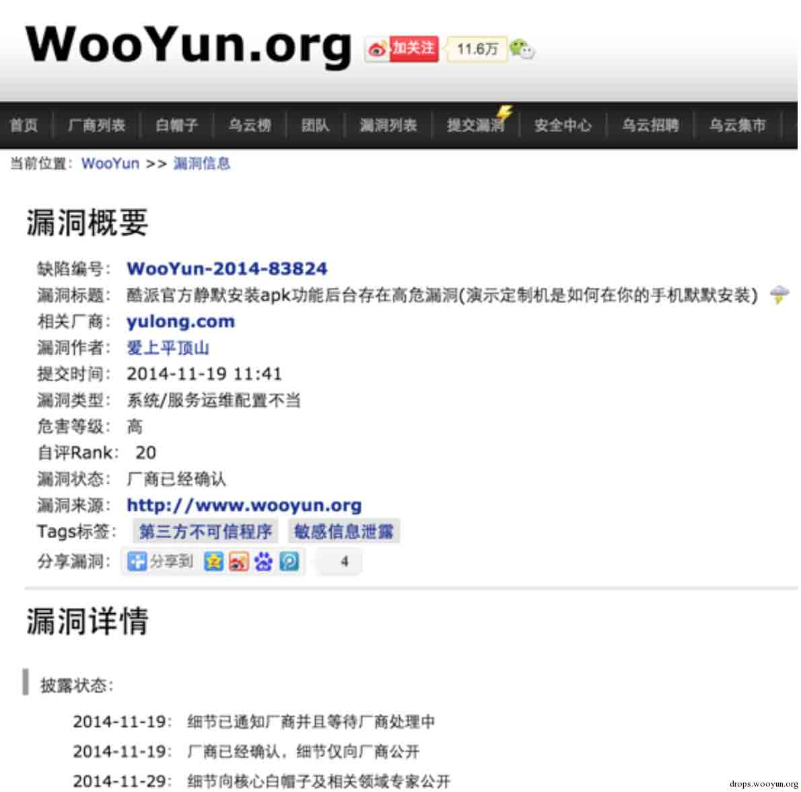

乌云负责任的漏洞披露流程，意味着漏洞细节不能马上公开。尽管如此，作为一个乌云白帽子我们能在酷派确定漏洞一个天数后看到漏洞细节。

漏洞细节是一个代码执行导致被 getshell，然后白帽子进入了酷云权限管理平台：auth.coolyun.com。平台上显示有如下功能：

*   PUSH 伪装 OTA 推 app
*   静默安装 apk
*   PUSH 激活应用
*   PUSH 后台命令

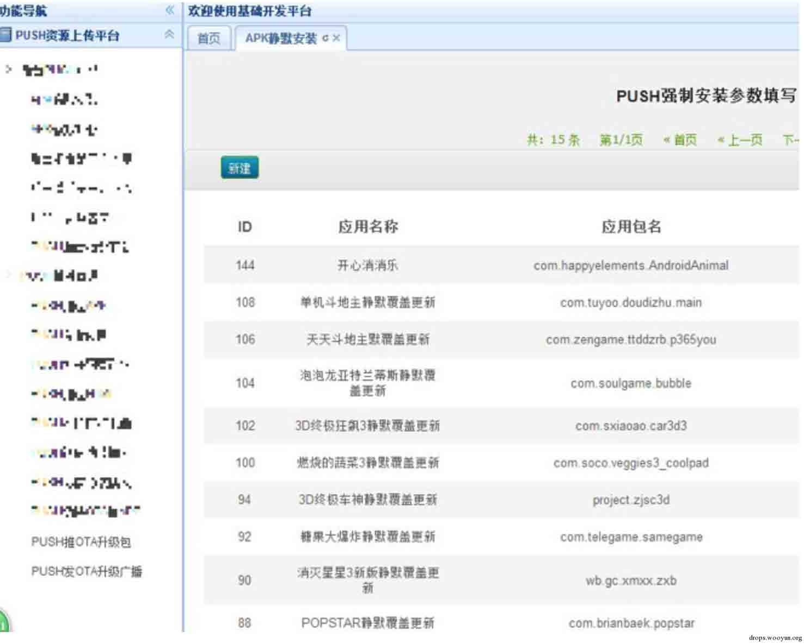

通过安全牛的报道，得到一张没有马赛克的后台系统截图。显示该系统具有如下功能：

*   静默安装 apk
*   静默卸载 apk
*   后台激活第三方应用
*   后台激活第三方服务
*   PUSH 后台指令下发
*   PUSH 推送 APK
*   PUSH 激活应用
*   PUSH 打开网页链接
*   PUSH 推送 HTML
*   PUSH 推送拨打电话
*   PUSH 短信伪装插入
*   PUSH 彩信伪装插入
*   PUSH 伪装 OTA 推 APP
*   PUSH 推 OTA 升级包
*   PUSH 发 OTA 升级广播

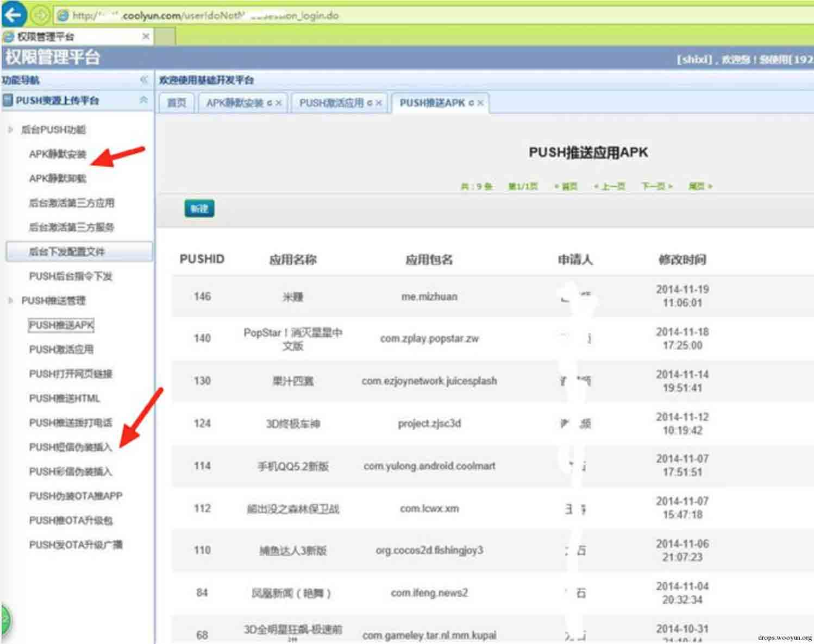

上面的描述的功能和分析的 CoolReaper 实现的代码均能对应上

2014 年 11 月 21 日，安全牛发表了第二篇文章酷派公关陈述：仅用于内部测试。要求安全牛撤稿，安全牛要求其发送正式信函并且出示相关证明，之后酷派并未回应。

## Hiding CoolReaper from Users

* * *

酷派手机的固件除了包含 CoolReaper 后门外还做其他改动意图来隐藏此后门

### Hidden from list of Installed Packages

* * *

第一处变动位于/system/framework/services.odex 此文件为安装系统实现了基础服务以及其他组件。酷派修改了 PMS 中的 getInstalledPackages 方法用于收集安装于 android 的包。改动还特意照顾了"com. android.update.dmp"酷派后门，用于阻止其返回给请求程序。

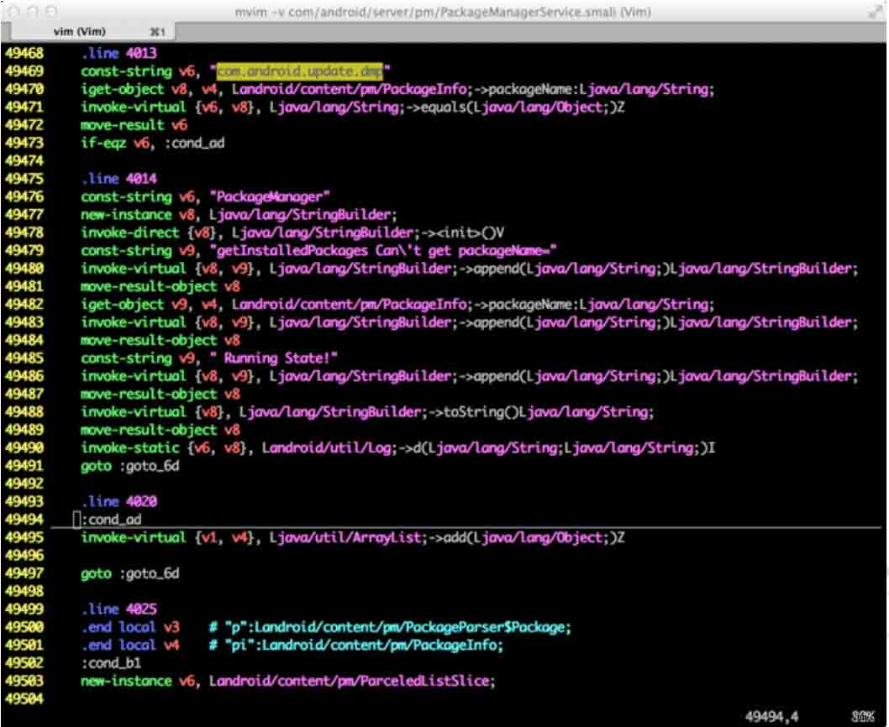

此处改动不仅从用户角度隐藏了此后门包同时也能规避杀软和 MDM。也就是说杀软是无法扫描到它以及判断它是否为恶意软件。

### Disable Notifications Menu

* * *

第二处改动是在 /system/app/SystemUI.odex 。酷派更改了 com.android.systemui.statusbar.BaseStatusBar 类的 getNotificationLongClicker 方法。

通常来讲，当 android 应用在系统通知栏显示通知时，用户可以通过长按通知栏来鉴别此通知的来源而且可以禁用此通知。

但是通过更改代码，任何 CoolReaper 的通知信息都将阻止用户去鉴别来源。

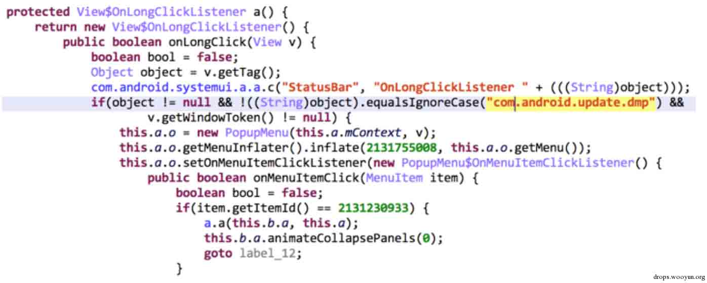

### Evading Pre-Installed Antivirus Program

* * *

第三处改动是用于预安装酷派自家的安全应用"酷管家"，此款应用提供基本杀毒以及其他安全服务。每当应用安装或者更新的时候，酷管家都将进行安全扫描。与之前的改动类似，如果扫到包名为"com.android.update.dmp"将会绕过其扫描。

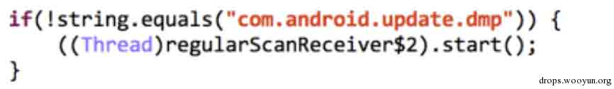

## CoolReaper Reach and Impact

* * *

### Customer Reports

* * *

9 月 30 号在谷歌搜索后门 CoolReaper 的应用名“CP_DMP.apk”,我们发现有 236 条搜索结果。其中大多数是酷派用户在论坛讨论此文件

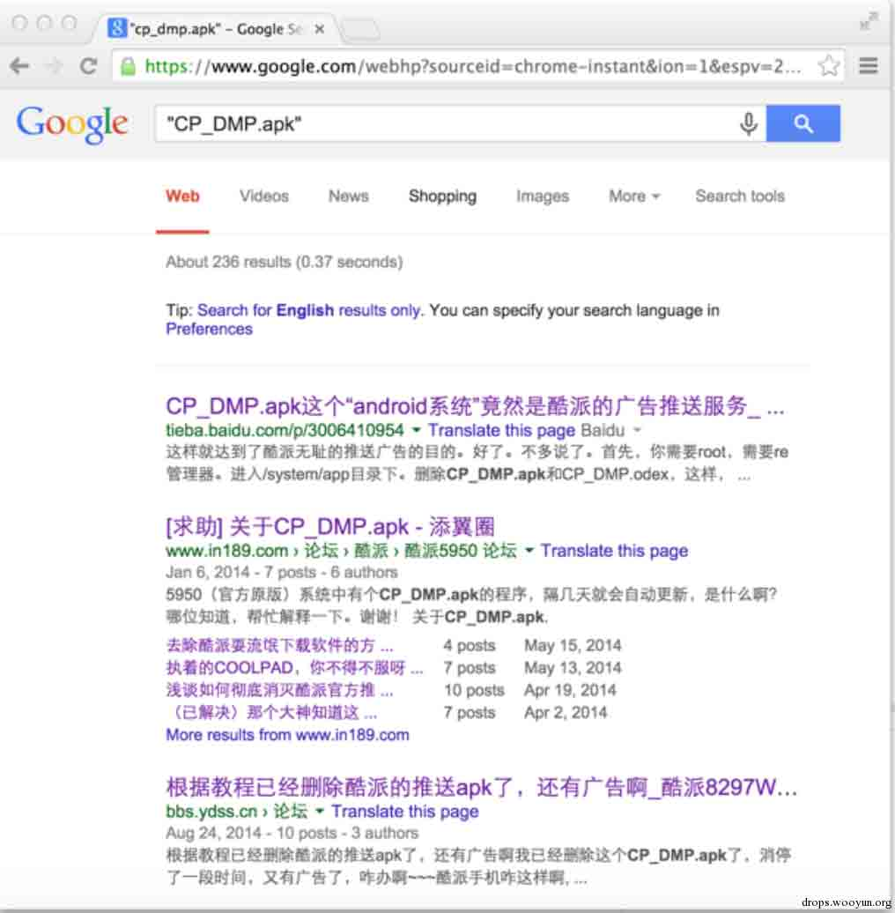

从 2013 年 9 月开始，用户开始讨论他们的酷派手机发生的一些如下莫名行为：

*   设备自动升级
*   设备频繁在通知栏收到广告通知
*   设备静默安装许多游戏
*   设备提示 OTA 升级，重启后发现系统并未升级只是多出了 11 个新应用

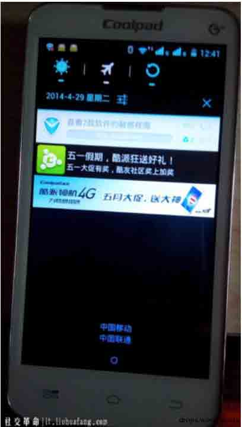

用户抱怨之后不久，coolreaper 进行了一次升级，版本由 2.x 升级到 3.0.应用名由 CM_DMP.apk 变为 GoogleGmsFramework.apk。我们认为此次升级的意图是为了隐藏后门来躲避用户已经定位的文件。这招貌似成功逃过了用户通过应用名"CP_DMP.apk"来定位后门的方法。下图的帖子中一个用户询问：为何删除了 CP_DMP.apk，几天后广告又出现了，我们该怎么搞它？


### Geographic Range of Impact

* * *

我们不知道多少酷派设备包含 coolreaper 后门，考虑到 coolreaper 被加入到最近 12 月生产的 24 种机型里，以及 IDC 公布的酷派销售目标，故影响的设备非常可能超过一千万。

大多受影响的设备都是在中国，貌似这个后门是为中国人定制的。后门的一处代码显示通过判断设备 SIM 卡的 IMSI 来确定其运营商归属

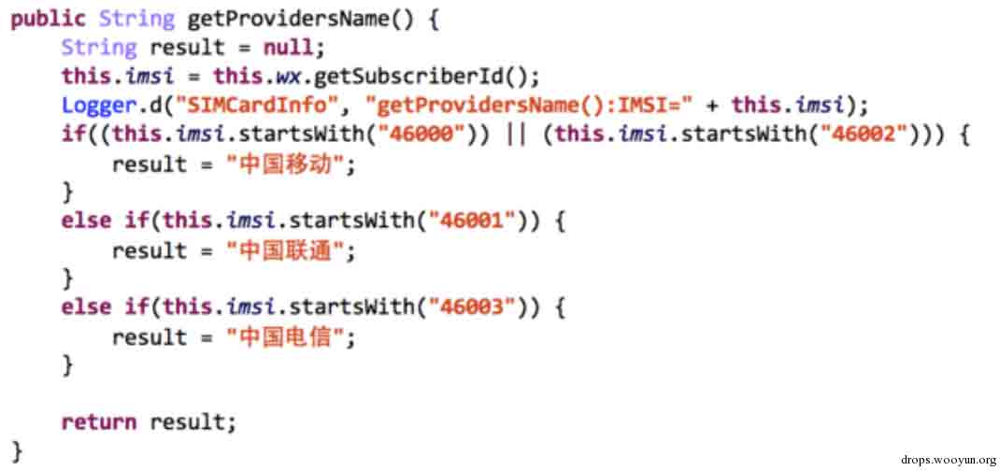

2014 年 11 月 25 日，我们在加利福利亚购买一部酷派 FLo 手机并未发现其包含有 CoolReaper 后门，这个手机制造时间超过一年，应该是它制造日期太早没来得及放入后门。我们并未分析前面提到的另两款在美国销售的机型以及其在欧洲和东南亚销售的机型。只有中国发行的 ROM 可以被下载。

Coolreaper 存在非中国地区可能基于以下几个原因：

*   在 C2C 网站像 eBay 这也，一些酷派手机从中国用户手中流出
*   CoolReaper 已经被安装在国外销售的机型中只是并未出现在我们所分析的设备
*   通过官方 OTA 升级 CoolReaper 被远程安装，CP_OTA.apk 具有此功能。这个包被安装在美国销售的酷派 FLo 上。有用户抱怨，删除 CP_DMP.apk 后，其有被自动重新安装。这个重新安装的过程可能是通过 ota 机制实现实的。

2014 年 10 月，两位用户反馈酷派 5950t 被植入后门

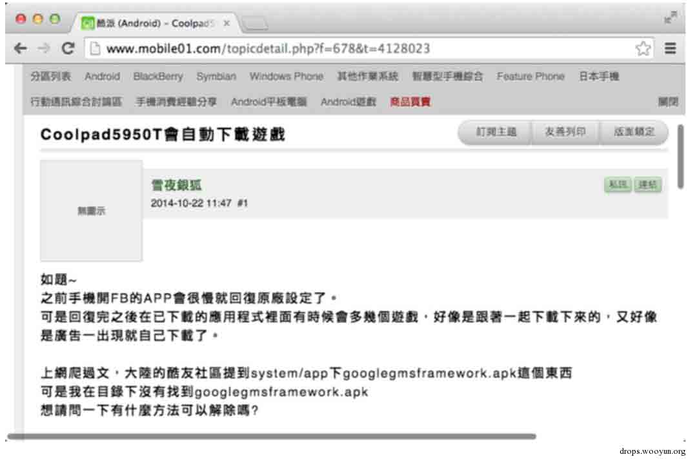

除了上面两位用户的反馈，11 月 11 号我们检测到 CoolReaper 控制指令 http 请求报文。

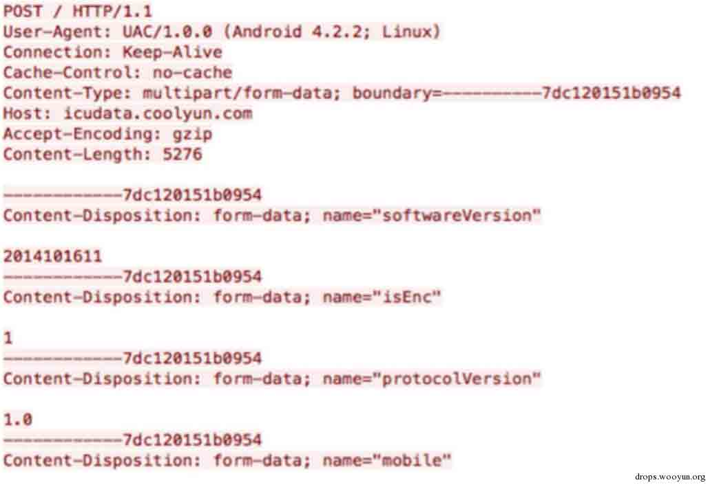

## Detection and Protection

* * *

CoolReaper 很难被杀软检测到以及删除。酷派通过更改 android 底层系统来绕过安全软件的检测 coolreaper。coolreaper 使用的是酷派官方证书签名，这也又可以绕过一些基于白名单机制的检测的安全软件。另外，如果杀软能检测到此后门，也没有在非 ROOT 的情况下删除后门的权限，因为 coolreaper 是以系统应用安装的。

2014 年 4 月以及 7 月。三个 coolreaper 的样本被上传到 VirusTotal。8 月 23、24，安全机构将这三个样本定性为恶意、可疑文件。尽管样本被标识为"Generic"或者"agent"族，这些表明安全机构没有精确定位到此恶意应用。一些机构将其定位为"Trojan.Android.Andup.a"是不准确的。

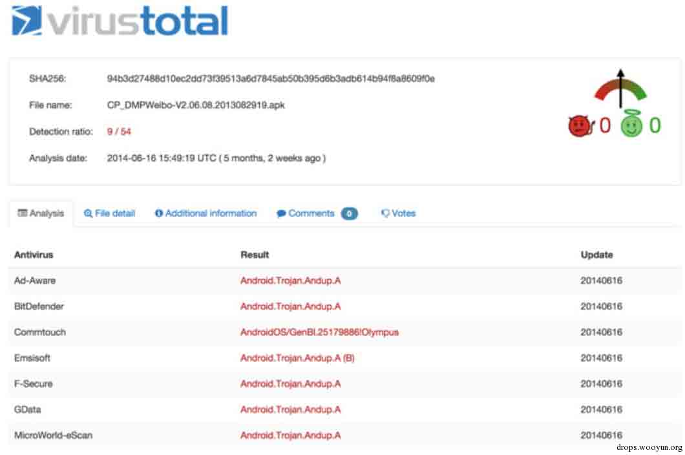

酷派个人用户，我们建议通过 root explorer 软件查看你的手机是否有以下文件：

*   /system/app/CP_DMP.apk
*   /system/app/CP_DMP.odex
*   /system/app/GoogleGmsFramework.apk
*   /system/app/GoogleGmsFramework.apk
*   /system/lib/libgmsframework.so

如果存在以上任意一个文件，你的手机就很有可能存在 CoolReaper 后门。如果你的手机已经 root，你可以使用 root 权限轻易的删除这些文件。不过，酷派还是有可能通过 OTA 升级给你安装新的后门。

## Conclusions and Risks

* * *

基于以上分析我们对 Coolreaper 做了如下总结：

*   Coolreaper 使用酷派官方数字证书签名，安装在酷派官方固件中使用酷派的服务器控制发送指令
*   酷派承认存在手机管理接口，而这个接口的功能更 Coolreaper 实现的功能对应。这个接口的服务存在漏洞以及被人利用入侵
*   酷派官方固件做了改动来避免用户以及杀软发现 coolreaper
*   在许多用户反馈和抱怨被强制推送了广告和应用后酷派并未解决这些问题

也许酷派制作这款程序的目的是为了帮助用户提升用户体验。手机厂商在设备上安装定制软件，但是 coolreaper 功能已经完全超出了用户的预期。这个后门能让酷派完全控制任意酷派手机。中国用户已经反馈此系统正用于推送广告和应用。

事实上 coolreaper 的管理接口很可能被攻击者利用漏洞拿下，这样对用户的威胁将会更大。尽管现在被修复一个，但是谁能保证以后不再有了。

已知的 coolreaper 后门仅影响中国用户，但是随着酷派的全国扩张这个后门很可能影响到全球 Android 用户。

## Appendix A:

* * *

### Significant Malicious Behaviors

Coolreaper 实现的大多数功能都能归类为恶意意图，下列代码展示此后门的各种行为。

后台安装下载 apk

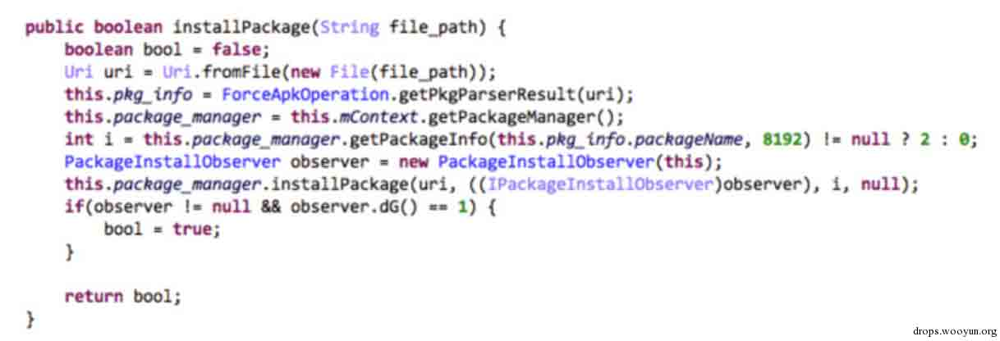

后台卸载 apk

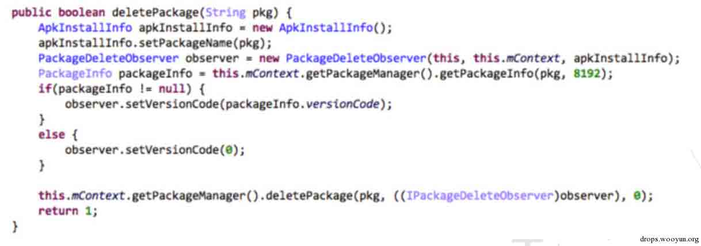

打开指定应用

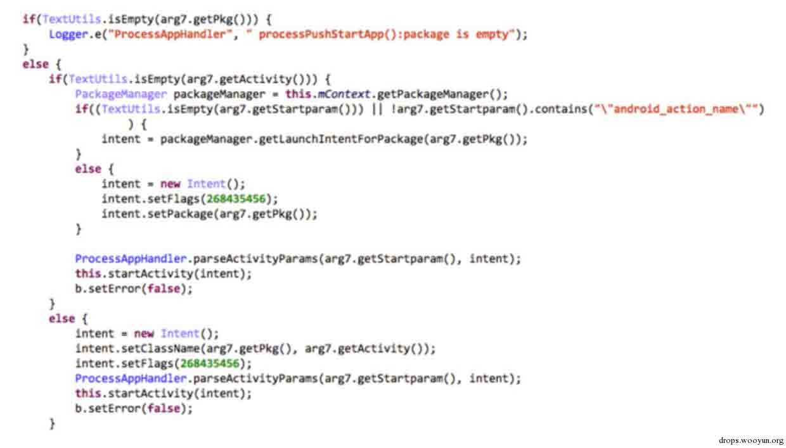

清除指定应用数据

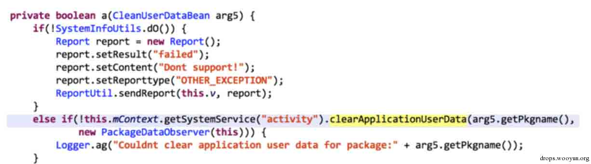

激活禁用指定系统应用

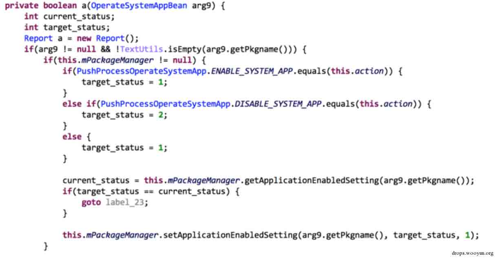

伪造 ota 更新用于打开后门

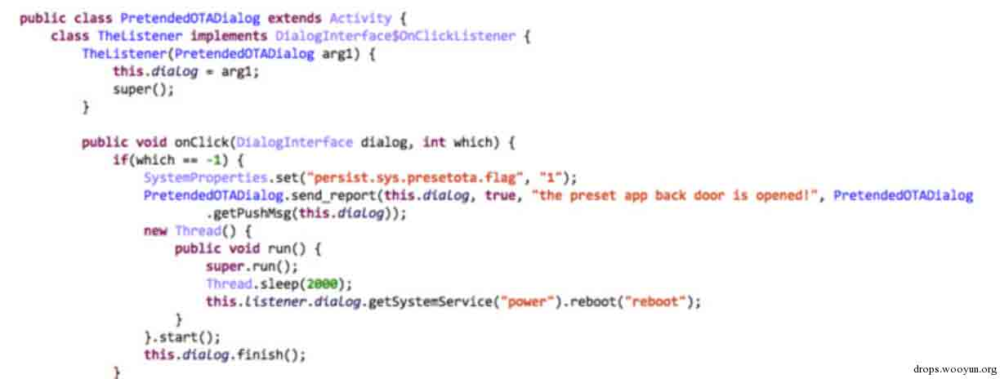

拨打指定号码

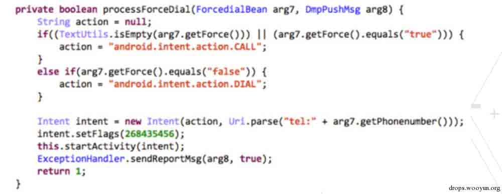

发送任意短信

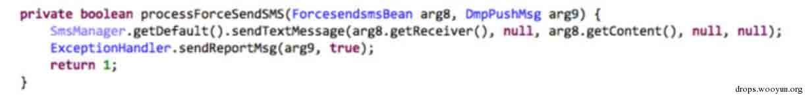

伪造任意短信到收信箱

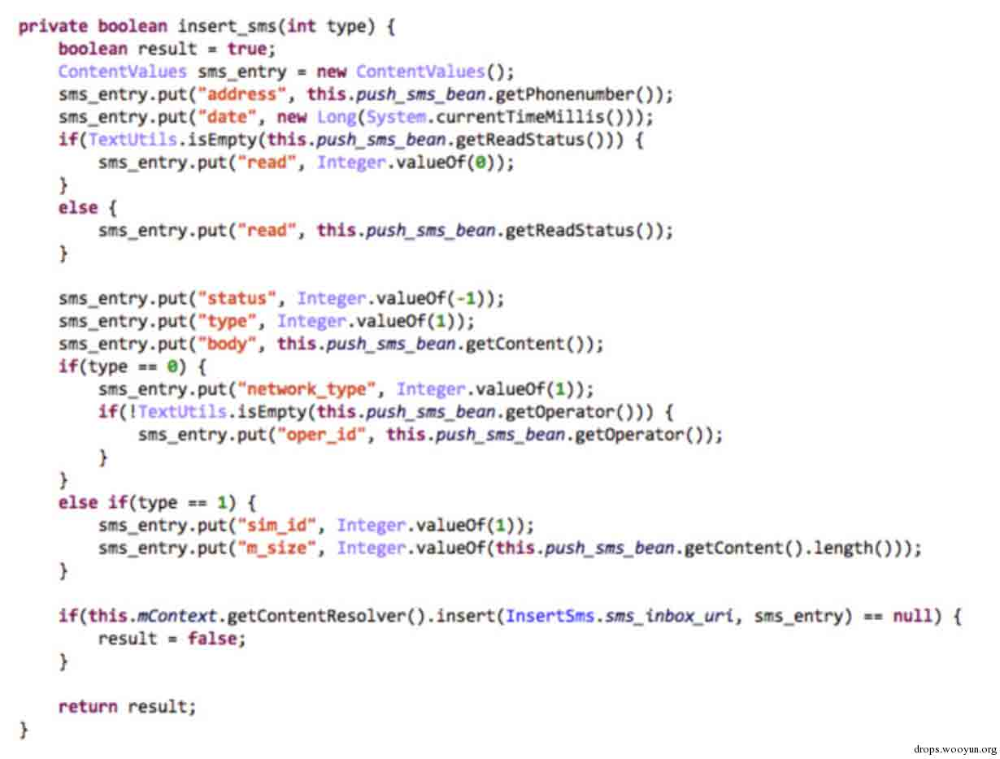

弹出收到伪造短信的通知

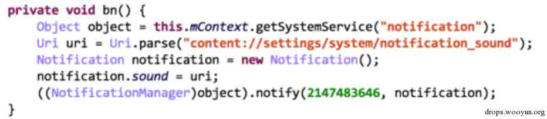

伪造任意彩信到收信箱

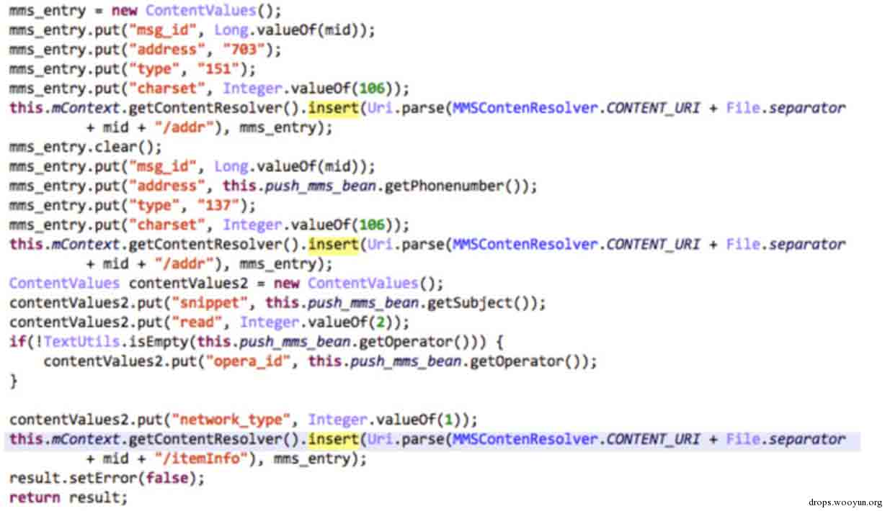

获取或者设置系统变量

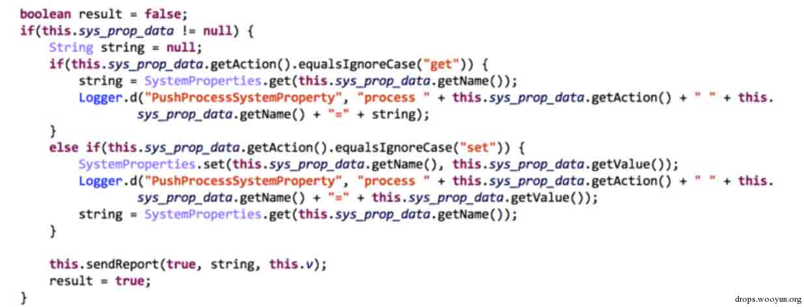

版权声明：未经授权禁止转载 路人甲@[乌云知识库](http://drops.wooyun.org)

分享到：

### 相关日志

*   [APK 签名校验绕过](http://drops.wooyun.org/mobile/4296)
*   [Denial of App – Google Bug 13416059 分析](http://drops.wooyun.org/tips/2976)
*   [Android UXSS 阶段性小结及自动化测试](http://drops.wooyun.org/tools/3186)
*   [Android Logcat Security](http://drops.wooyun.org/tips/3812)
*   [Android Content Provider Security](http://drops.wooyun.org/tips/4314)
*   [Android Broadcast Security](http://drops.wooyun.org/tips/4393)