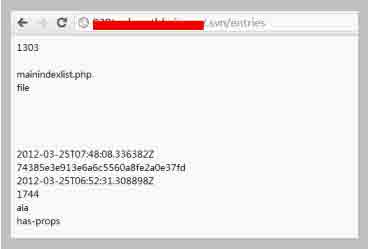
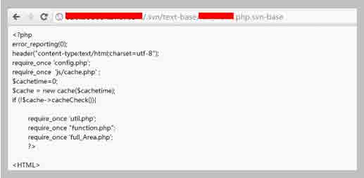

# SVN 安装配置及安全注意事项

2013/07/30 15:05 | [瞌睡龙](http://drops.wooyun.org/author/瞌睡龙 "由 瞌睡龙 发布") | [技术分享](http://drops.wooyun.org/category/tips "查看 技术分享 中的全部文章"), [运维安全](http://drops.wooyun.org/category/%e8%bf%90%e7%bb%b4%e5%ae%89%e5%85%a8 "查看 运维安全 中的全部文章") | 占个座先 | 捐赠作者

### 0x00 SVN 介绍

* * *

Subversion，简称 SVN，是一个开放源代码的版本控制系统，相对于的 RCS、CVS，采用了分支管理系统，它的设计目标就是取代 CVS。互联网上越来越多的控制服务从 CVS 转移到 Subversion。

Subversion 的官方网站是：[`subversion.tigris.org/`](http://subversion.tigris.org/)

中文的网站：[Subversion 中文站](http://www.subversion.org.cn/)、[SVNBook 正體中文版](http://svn.stu.edu.tw/svnbook/)、[Subversion 中文社区](http://www.iusesvn.com/)、[中文 SVN 技术资料](http://www.svn8.com/)。

这些网站都提供了非常详细、多样的说明文档，有时间大家可以逐一细查。

Subversion 使用服务端—客户端的结构，当然服务端与客户端可以都运行在同一台服务器上。在服务端是存放着所有受控制数据的 Subversion 仓库，另一端是 Subversion 的客户端程序，管理着受控数据的一部分在本地的映射（称为“工作副本”）。在这两端之间，是通过各种仓库存取层（Repository Access，简称 RA）的多条通道进行访问的。这些通道中，可以通过不同的网络协议，例如 HTTP、SSH 等，或本地文件的方式来对仓库进行操作。

### 0x01 安装配置

* * *

安装 SVN

```
#yum install subversion 
```

测试是否安装成功

```
#svnserve --version 
```

如果显示了版本信息则表示安装成功

创建仓库

```
#svnadmin create /home/svn/repo 
```

给 svn 设置密码

修改配置文件**/home/svn/repo/conf/svnserve.conf**
去掉

```
#[general] 
```

前面的#号

匿名访问的权限，可以是 read,write,none,默认为 read

```
anon-access = none 
```

认证用户的权限，可以是 read,write,none,默认为 write

```
auth-access = write 
```

密码数据库的路径

```
#password-db = passwd 
```

去掉前面的#

修改配置文件 passwd

```
#vim /home/svn/repo/conf/passwd 
```

=前面是用户名，后面是密码：

```
[users]
name = password 
```

启动 SVN 服务器

对于单个代码仓库

```
#svnserve -d -r /home/svn --listen-host 192.168.1.100 
```

svn 默认端口是 3690，在防火墙上开放这个端口。

```
/sbin/iptables -A INPUT -i eth0 -p tcp --dport 3690 -j ACCEPT
/sbin/service iptables save 
```

把/var/www/html/目录导入到 svn 的 repo 目录下

```
svn import /var/www/html/  file:///home/svn/repo  -m "test" 
```

### 0x02 注意的问题

* * *

1、检出(导出结果带.svn 文件夹的目录树)

```
svn  co  http://路径　[本地目录全路径]  --username 用户名 --password 密码
svn  co  svn://路径　[本地目录全路径]  --username 用户名 --password 密码
svn  checkout  http://路径　[本地目录全路径] --username　用户名
svn  checkout  svn://路径　[本地目录全路径]  --username　用户名 
```

如果不带--password 参数传输密码的话，会提示输入密码，建议不要用明文的--password 选项。
其中 username 与 password 前是两个短线，不是一个。
不指定本地目录全路径，则检出到当前目录下。

2、导出(导出一个干净的不带.svn 文件夹的目录树)

```
svn  export  [-r 版本号]  http://路径 [本地目录全路径]　--username　用户名
svn  export  [-r 版本号]  svn://路径 [本地目录全路径]　--username　用户名
svn  export  本地检出的(即带有.svn 文件夹的)目录全路径  要导出的本地目录全路径 
```

第一种从版本库导出干净工作目录树的形式是指定 URL。
如果指定了修订版本号，会导出相应的版本。
如果没有指定修订版本，则会导出最新的，导出到指定位置。
如果省略 本地目录全路径，URL 的最后一部分会作为本地目录的名字。
第二种形式是指定 本地检出的目录全路径 到 要导出的本地目录全路径，所有的本地修改将会保留。
但是不在版本控制下(即没提交的新文件，因为.svn 文件夹里没有与之相关的信息记录)的文件不会拷贝。

现实的开发环境中，强烈建议使用导出功能**svn export**而不是**svn co**。

由此可能导致非常严重的问题，很多管理员直接吧 svn co 出来的代码直接放到 web 目录下。

这就使.svn 隐藏文件夹被暴露于外网环境，黑客可以借助其中包含的用于版本信息追踪的“entries”文件，逐步摸清站点结构。



更严重的问题在于，SVN 产生的.svn 目录下还包含了以.svn-base 结尾的源代码文件副本（低版本 SVN 具体路径为 text-base 目录，高版本 SVN 为 pristine 目录），如果服务器没有对此类后缀做解析，黑客则可以直接获得文件源代码。



如果解析了该后缀，可能会有文件解析的漏洞，可能会有扩展解析漏洞，找地方上传 xxx.php.gif 也许就可以直接得到 webshell 了。

如果已经线上的生产环境已经有了.svn 目录不想删掉可以在服务器上设置禁制访问此目录：

另外 svn 更新至 1.7+ .svn/entries 目录就不包含文件目录列表了。

Apache:

```
<Directory ~ "\.svn">
Order allow,deny
Deny from all
</Directory> 
```

Nginx:

```
location ~ ^(.*)\/\.svn\/ {
return 404;
} 
```

附上个遍历.svn/entries 展现网站目录结构的两个脚本：

[svn 遍历脚本.zip](http://static.wooyun.org/20141017/2014101714374572884.zip)

wooyun 上也是已经有非常多的 svn 泄露网站信息的事件，有的甚至由此导致整个服务器沦陷：

[WooYun: 【盛大 180 天渗透纪实】第四章.SVN 猎手 （某站 SVN 信息泄露+设计问题导致服务器沦陷）](http://www.wooyun.org/bugs/wooyun-2013-020861)

[WooYun: 爱拍 svn 泄露，有被脱裤危险，想起了 csdn....](http://www.wooyun.org/bugs/wooyun-2013-018998)

[WooYun: 优酷某分站 SVN 信息及某 sql 文件泄漏](http://www.wooyun.org/bugs/wooyun-2013-026351)

[WooYun: 淘宝网某应用 svn 信息导致代码泄露](http://www.wooyun.org/bugs/wooyun-2012-012665)

[WooYun: 鲜果网怕是所有应用要沦陷了？](http://www.wooyun.org/bugs/wooyun-2012-012321)

参考：

[Subversion 快速入门教程](http://www.subversion.org.cn/?action-viewnews-itemid-1)

[使用 Subversion 进行版本控制](http://www.subversion.org.cn/svnbook/1.4/)

[用 Apache 和 Subversion 搭建安全的版本控制环境](http://www.ibm.com/developerworks/cn/java/j-lo-apache-subversion/)

[centos svn 安装及配置与使用](http://blog.csdn.net/kangquan2008/article/details/8070391)

[linux 下 svn 常用指令](http://www.cnblogs.com/aLittleBitCool/archive/2011/07/09/2101602.html)

[WooYun: .svn 目录未设权限限制的漏洞利用总结](http://www.wooyun.org/bugs/wooyun-2012-05539)

**Tags:** [SVN](http://drops.wooyun.org/tag/svn), [服务器配置](http://drops.wooyun.org/tag/%e6%9c%8d%e5%8a%a1%e5%99%a8%e9%85%8d%e7%bd%ae)

版权声明：未经授权禁止转载 [瞌睡龙](http://drops.wooyun.org/author/瞌睡龙 "由 瞌睡龙 发布")@[乌云知识库](http://drops.wooyun.org)

分享到：碎银子打赏，作者好攒钱娶媳妇：


### 相关日志

*   [Rsync 安全配置](http://drops.wooyun.org/papers/161)
*   [IIS WebDAV 安全配置](http://drops.wooyun.org/papers/238)
*   [mitmproxy 中 libmproxy 简单介绍](http://drops.wooyun.org/tips/2943)
*   [SSLStrip 的未来 —— HTTPS 前端劫持](http://drops.wooyun.org/tips/3199)
*   [Memcache 安全配置](http://drops.wooyun.org/papers/865)
*   [MongoDB 安全配置](http://drops.wooyun.org/%e8%bf%90%e7%bb%b4%e5%ae%89%e5%85%a8/2470)