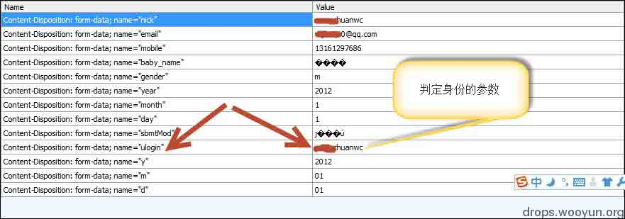
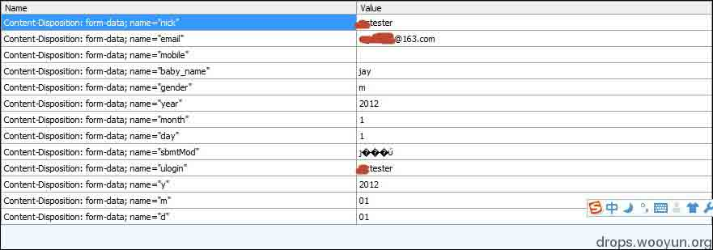
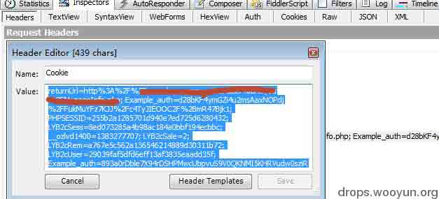

# 我的越权之道

2013/11/04 10:40 | [小川](http://drops.wooyun.org/author/小川 "由 小川 发布")   | [web 安全](http://drops.wooyun.org/category/web "查看 web 安全 中的全部文章"), [技术分享](http://drops.wooyun.org/category/tips "查看 技术分享 中的全部文章")  | 占个座先  | 捐赠作者

## 0x00 越权漏洞

* * *

越权漏洞是 Web 应用程序中一种常见的安全漏洞。它的威胁在于一个账户即可控制全站用户数据。当然这些数据仅限于存在漏洞功能对应的数据。越权漏洞的成因主要是因为开发人员在对数据进行增、删、改、查询时对客户端请求的数据过分相信而遗漏了权限的判定。所以测试越权就是和开发人员拼细心的过程。

## 0x01 分析可能存在越权的位置

* * *

上面说过了只要对数据库进行增、删、改、查询的情况都可能存在越权。我们来看一般我们在 web 应用开发时操作数据库常会出现的一般语句：

增加：

```
insert into tablename values(一些字段) where userid/username=12345/用户名 
```

参考例子：

[WooYun: 爱拍越权漏洞及设计不合理漏洞大礼包（妹子哭了）](http://www.wooyun.org/bugs/wooyun-2013-033542)

删除：

```
delete from tablename where id=123 
```

参考例子：

[WooYun: 百度创意专家某功能平行权限漏洞（可删除他人素材）](http://www.wooyun.org/bugs/wooyun-2013-039358)

更改：

```
update 一些字段 tablename set 一些字段 where userid/username=12345/用户名 
```

[WooYun: 搜狐白社会任意用户信息修改漏洞](http://www.wooyun.org/bugs/wooyun-2013-036411)

查询：

```
select * from tablename where id=12345 
```

[WooYun: Like 团用户信息泄露+越权漏洞（可获取大量用户住址联系信息）](http://www.wooyun.org/bugs/wooyun-2013-033748)

本人不做开发，sql 语句比较弱，大牛勿喷，此处只是为了说明问题。大家可以看到，以上语句都涉及 where，而后面的 userid 或 username 即是越权的突破口。在操作数据库时功能请求中往往会带着一些参数来用于辨别信息的唯一值。而这些参数就是我们越权时需要注意的。

在 web 开发中判断用户身份的字段往往是不会在客户端传递的。用户登录系统后，开发人员一般会创建一个 session 来保存用户名。当用户在查看、修改个人信息等需要判定用户身份时，就直接从 session 中获取，而不会在客户端传递，也就避免了篡改。但若出现从客户端传递的话，那么就必须要有一步权限验证的要求了。所以在测试越权时要用抓包工具截获请求，细览下可能存在辨别信息的唯一值，来进行测试。这里要说一点，传输的参数并不一定在请求参数中，也有可能存在链接等位置。如：

[WooYun: 虾米网送娃娃漏洞（平行权限漏洞）](http://www.wooyun.org/bugs/wooyun-2013-031826)

有人可能开始抱怨，请求中那么多参数、而且还可能存在一个请求需要多个辨别参数的可能，再加上链接中也有可能，这也太难找了。现提供一个方法可以轻松让你知道哪里存在越权。喜欢玩 XSS 的人定会恍然大悟。

## 0x02 测试越权技巧

* * *

相信越权的成因大家都已经理解了，哪些功能可能存在越权大家也心里也有谱了。接下来就是测试了。相信这才是大家最想看的，王尼玛同学是如何高效测试越权的？

看官莫急，先看基础测试方法：要测试越权需要注册两个账户，来互相探测能否影响到对方数据。方法很简单打开两个不同的浏览器，大小号账户各自登录一个不同浏览器。

### 步骤一：

打开 fiddler2 按 f11，截断大号上更新用户信息请求。（查看参数可以选择 fiddler 中 Inspects 下的 WebFroms 或 TextView。只有在截断的情况下，才可以修改请求。）



判断出可能辨别用户身份的参数 ulogin。

### 步骤二：截断小号浏览器中更新用户信息的请求



步骤 3：将小号中 ulogin 的参数值替换为大号的，然后解除 fiddler 截断（shift+f11）,将请求放过去（），查看下大号用户信息是否更改。

以上即是常规的测试方法。大家可以看到消耗时间的麻烦在辨别参数上、对比大号和小号请求有何不一样的参数值上、切换浏览器查看数等等。如果遇到更改删除等功能，还要两端各自新建出数据、查看 id 等等、麻烦的要死。

为了避免以上消耗时间的操作其实可以利用 fiddler2 复制小号浏览器中的 cookie 值，到大号的请求中即可验证越权。操作就是用 fiddler 先截获一个小号的访问目标站点的请求，在 fiddler2 的 head 标签下将 cookie 复制出来



小号的浏览器就可以不用管了，用 Fiddler2 截断大号的请求，把小号的 cookie 覆盖大号的 cookie，进行测试。如果改变了大号的数据则说明越权，然后在分析是哪个参数造成的。如果未改变，则说明不存在越权，该功能直接越过。小号的 cookie 一直在剪贴板中的，所以在测其他功能会非常方便。用不了多长时间，即可测试完整个站点下的功能。

我们来看这个方法的优点：1 不用去辨别哪个参数是辨别身份的；2 不用两个账户同时去创建数据；3 不用去查看小号 id；4 单浏览器即可测试，免去切换浏览器的烦恼。这就是我常用的方法，个人感觉已经很高效了，是不是觉得跟 XSS 窃取了 cookie 后劫持浏览器的感觉一样？但是此方法并不是对所有站点都起作用，有时你会发现小号会把大号挤出去进入大号的浏览器或者登陆状态消失，直接退出。具体什么原因造成的，我现在还不太清楚，估计是服务器端有对 cookie 的判断吧，希望大牛们能给出合理的解释。不过在测试大部分站点时此方法还是很好用的。顺便说一下 Fiddler2 是一个非常好用的抓包工具，熟练使用这个工具也是测试越权时的必要技能。小白们可以自行百度下其使用方法。

## 0x03 遵守的白帽子原则

* * *

越权的危害说轻则轻，说弱则弱，但是还是要求大家不要恶意破坏厂商数据，遵守白帽子原则。

版权声明：未经授权禁止转载 [小川](http://drops.wooyun.org/author/小川 "由 小川 发布")@[乌云知识库](http://drops.wooyun.org)

分享到：

### 相关日志

*   [PHP 漏洞挖掘思路+实例](http://drops.wooyun.org/tips/838)
*   [PHP 安全编码](http://drops.wooyun.org/tips/135)
*   [Webscan360 的防御与绕过](http://drops.wooyun.org/tips/3790)
*   [PHP Session 序列化及反序列化处理器设置使用不当带来的安全隐患](http://drops.wooyun.org/tips/3909)
*   [waf 绕过的技巧](http://drops.wooyun.org/tips/132)
*   [SQL Injection via DNS](http://drops.wooyun.org/tips/4605)