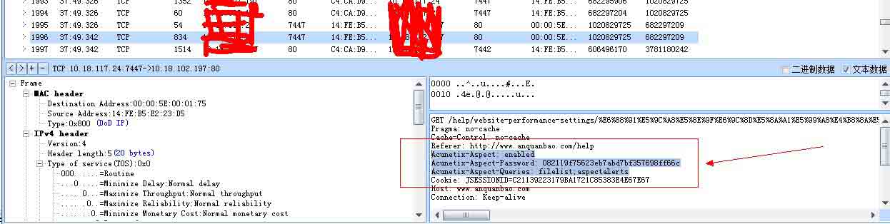
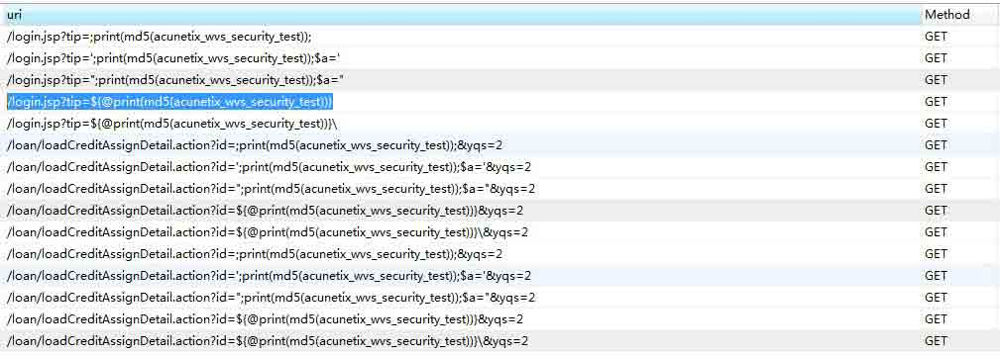
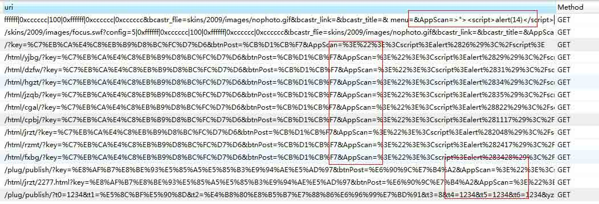
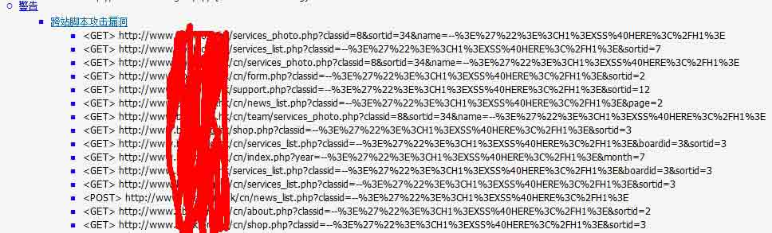
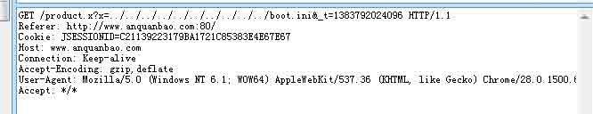
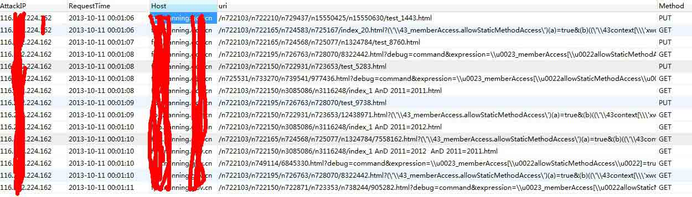
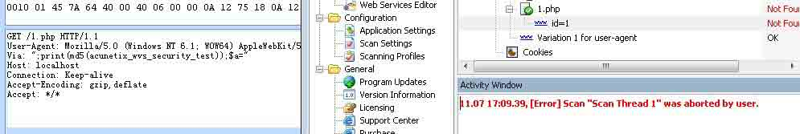
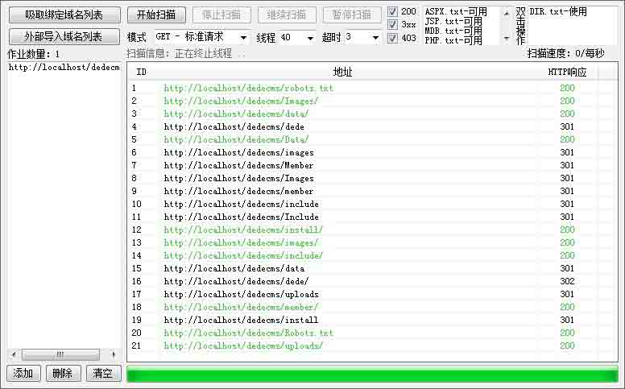

# 安全科普：Waf 实现扫描器识别 彻底抵挡黑客扫描

2013/11/08 11:04 | [Seay](http://drops.wooyun.org/author/Seay "由 Seay 发布") | [技术分享](http://drops.wooyun.org/category/tips "查看 技术分享 中的全部文章"), [运维安全](http://drops.wooyun.org/category/%e8%bf%90%e7%bb%b4%e5%ae%89%e5%85%a8 "查看 运维安全 中的全部文章") | 占个座先 | 捐赠作者

## 0x00 背景

* * *

目前安全测试的软件越来越多，也越来越强大，越来越多的人成为[黑客]，今天在网上看到一个文章说拦截 wvs 的扫描，勾起了我写这篇文章的欲望。

因为公司的三大业务之一就有一个云 waf，每天拦截的日志里面，有将近 90%的请求是扫描器发出，waf 接收到请求会解析数据包，然后过一遍规则，过完成百上千条规则必定对性能有一定的影响。如果能识别出来是人还是扫描器的请求，就可以在这方面节省很大的资源。

下面的分析介绍只针对 web 安全扫描器。

## 0x01 分析特征

* * *

目前全能型的扫描器主要是 wvs（Acunetix Web Vulnerability Scanner）、AppScan、WebInspect，国内的像 aisec、bugscan 等等…还有国内那些老安全厂商的扫描器就不说了，主要提一下像 wvs 这种使用率比较高的。另外还有目录文件型的扫描器、注入工具(类似 sqlmap、Havij)等等。

扫描器识别主要从以下几点来做：

```
一、 扫描器指纹(head 字段/请求参数值等) 
二、 单 IP+ cookie 某时间段内触发规则次数 
三、 隐藏的链接标签(<a>) 
四、 Cookie 植入 
五、 验证码验证 
六、 单 IP 请求时间段内 Webserver 返回 http 状态 404 比例 
```

### 一、扫描器指纹(head 字段/请求参数值等)

目前最常见的手法就是收集扫描器的指纹特征来做识别，不同的扫描器都有自己的一些特征，比如发出的请求会加一些特定的 head 字段，测试漏洞的请求参数的值会带上自己扫描器的名称等。

下面通过抓网络数据包来看常见扫描器的指纹特征：

wvs（Acunetix Web Vulnerability Scanner）：

下面是我抓到的一个 wvs 的请求



```
GET /help/website-performance-settings/x HTTP/1.1
Pragma: no-cache
Cache-Control: no-cache
Referer: http://www.anquanbao.com/help
Acunetix-Aspect: enabled
Acunetix-Aspect-Password: 082119f75623eb7abd7bf357698ff66c
Acunetix-Aspect-Queries: filelist;aspectalerts
Cookie: xxxxxxxxxxxx
Host: www.anquanbao.com
Connection: Keep-alive
Accept-Encoding: gzip,deflate
User-Agent: Mozilla/5.0 (Windows NT 6.1; WOW64) AppleWebKit/537.36 (KHTML, like Gecko) Chrome/28.0.1500.63 Safari/537.36
Accept: */* 
```

请求头里面有三个很明显的标志：

```
Acunetix-Aspect: enabled
Acunetix-Aspect-Password: 082119f75623eb7abd7bf357698ff66c
Acunetix-Aspect-Queries: filelist;aspectalerts 
```

另外在请求的参数值，比如 URL 跟 POST 数据中都有很明显的 acunetix_wvs_security_test 特征，下图是我从 waf 拦截中调取到的结果。



根据以上抓取到的特征，我们可以把这个作为 wvs 的一个指纹，在 waf 中进行过滤。

#### Appscan

同样的，appscan 也有自己的一些特征，如下



#### Bugscan

关于 Bugscan，我咨询了一下作者，作者给了 XSS 模块的扫描源码我看了下，主要特征是：

```
–>’”><H1>XSS@HERE</H1> 
```

另外还有一些特征就不一一列举。



注意：并不是所有的请求都会带有扫描器的特征，比如下面的一个包也是 wvs 发出的，但是没有带上面我们说的特征，扫描器指纹特征只能抵挡住一部分的扫描，但是我们可以利用这些信息识别出扫描器然后干掉 IP 等。



### 二、单 IP+ cookie 某时间段内触发规则次数

根据某个 IP+ cookie 某时间段内触发 waf 拦截规则的次数大于设定的某个阀值，比如在 20 秒内，某个 IP+cookie 触发 waf 拦截规则 10 次。

数据证明如下图：



另外还可以根据 IP+user angent 等，或者更多维度。

### 三、隐藏的链接标签等(<a>)

扫描器的爬虫会把页面里面的所有链接都抓出来去做漏洞探测，特别是现在基于 webkit 一类的扫描器，能够渲染 css 跟 js，可以爬出更多的链接测试。

下面贴出一个百度百科关于 webkit 的介绍

```
WebKit 是一个开源的浏览器引擎，与之相对应的引擎有 Gecko（Mozilla Firefox 等使用）和 Trident（也称 MSHTML，IE 使用）。同时 WebKit 也是苹果 Mac OS X 系统引擎框架版本的名称，主要用于 Safari，Dashboard，Mail 和其他一些 Mac OS X 程序。WebKit 前身是 KDE 小组的 KHTML，WebKit 所包含的 WebCore 排版引擎和 JSCore 引擎来自于 KDE 的 KHTML 和 KJS，当年苹果比较了 Gecko 和 KHTML 后，仍然选择了后者，就因为它拥有清晰的源码结构、极快的渲染速度。Apple 将 KHTML 发扬光大，推出了装备 KHTML 改进型 WebKit 引擎的浏览器 Safari。 
```

隐藏的标签链接是指人看不见的链接，如

```
<a href="http://www.cnseay.com/"></a> 
```

形式，人是点击不到的，只有软件能够匹配出这个地址，我们新建一个网页，抓扫描器数据包测试。

```
<html>
 <head>
  <title>test</title>
 </head>
 <body>
  <a href="http://localhost/1.php?id=1"></a>
 </body>
</html>

```

通过抓取 wvs 的数据包可以看到，扫描器很快的捕获了 http://localhost/1.php?id=1 这个链接，并进行漏洞测试。



当然如果在正常情况下也给所有用户植入这种代码是非常令人反感的，用户体验也会大打折扣，可以在前期先做一些条件限制，比如固定时间段内触发 waf 拦截规则到达预定阀值，再给这个用户单独植入一个隐藏链接。

### 四、Cookie 植入

Cookie 植入的方式跟上面讲的隐藏链接植入大同小异，实现原理是：当一个 IP+user angent 在固定时间段内触发规则的次数到达一定阀值，给发起请求的这个人植入一个 cookie，如果下次再请求没有携带这个 cookie，则说明是扫描器。
cookie 植入有利有弊，优点是更直接，种下 cookie 马上就能根据下一个请求判断。缺点是这个方式在基于 webkit 的扫描器上面行不通。

### 五、验证码验证

验证码验证的方式跟上面的 cookie 植入也大同小异，不过是把 cookie 换成了验证码的方式，这种方法也被用于防 CC 攻击。

### 六、单 IP 请求时间段内 Webserver 返回 http 状态 404 比例

这种方法主要用来应对探测敏感目录和文件的扫描器，这类的扫描器都是基于字典文件，通过对字典内的 url 进行请求获得的返回信息来进行判断目录或者文件的是否存在。
如果某个 IP 在一段时间内请求频率过快，这时候 waf 可以进行收集一段时间内 webserver 返回 404 状态数目，到达一定阀值后进行封杀。



## 0x02 思考

* * *

看过上面几种方法的介绍，应该大部分人都会想到两个问题，

```
 1\.  一大拨人使用同一个公网 IP，怎么判断谁是攻击者？
  2\.  一大拨人使用同一个公网 IP，怎么才能保证不误杀？ 
```

第一，对于怎么判断攻击者，当然不能单纯的从一个 IP 判断，一般一个完整的 http 请求都会带有 user angent、cookie 等信息，我们可以结合 ip+user angent 来判断请求的人，或者再加一个 cookie 的维度，当然在给这个攻击者植隐藏链接、cookie 或者验证码之前，需要它触发一些规则阀值，以免影响用户体验。

第二，说到怎么保证不误杀，也就是怎么去封杀的问题，关键在于怎么二次判断攻击者，目前最好的方法也是利用 ip+user angent，在判断是扫描器请求后，根据 IP+user angent 进行封杀，另外也是靠 cookie 封杀，关键在于是携带某个 cookie 键的封杀掉还是不带的封杀掉。

PS：如果误杀太大，如果刚好哪个妹纸在线看小电影到激情片段，这是多伤人妹纸的心啊。

出自：[`www.cnseay.com/3469/`](http://www.cnseay.com/3469/)

版权声明：未经授权禁止转载 [Seay](http://drops.wooyun.org/author/Seay "由 Seay 发布")@[乌云知识库](http://drops.wooyun.org)

分享到：

### 相关日志

*   [常见的 HTTPS 攻击方法](http://drops.wooyun.org/tips/4403)
*   [攻击 JavaWeb 应用[9]-Server 篇[2]](http://drops.wooyun.org/papers/869)
*   [DNS 泛解析与内容投毒，XSS 漏洞以及证书验证的那些事](http://drops.wooyun.org/tips/1354)
*   [Apache 安全配置](http://drops.wooyun.org/%e8%bf%90%e7%bb%b4%e5%ae%89%e5%85%a8/2727)
*   [深入了解 SQL 注入绕过 waf 和过滤机制](http://drops.wooyun.org/tips/968)
*   [Discuz!X 升级/转换程序 GETSHELL 漏洞分析](http://drops.wooyun.org/papers/929)