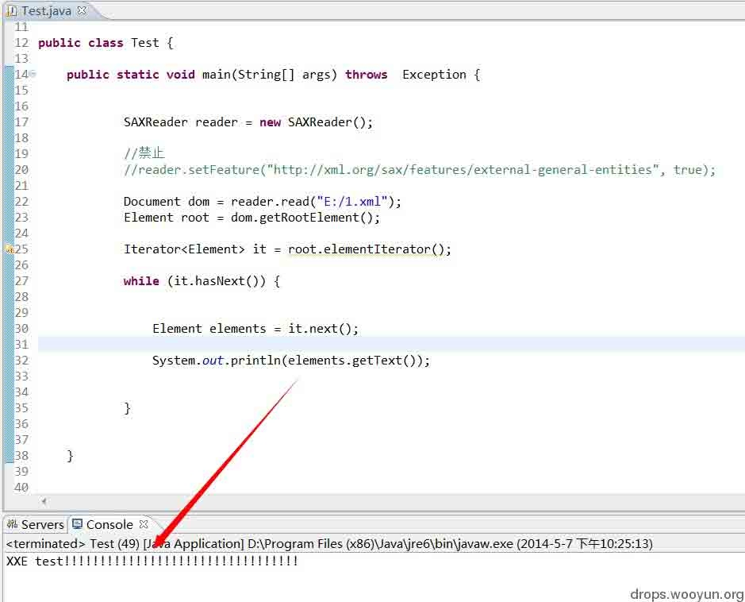
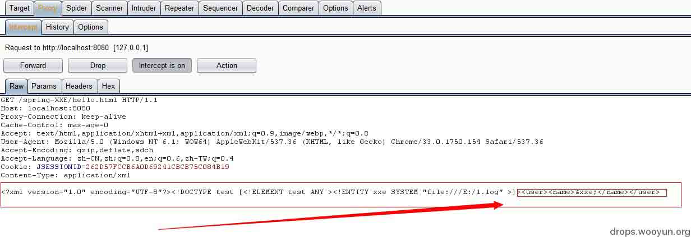
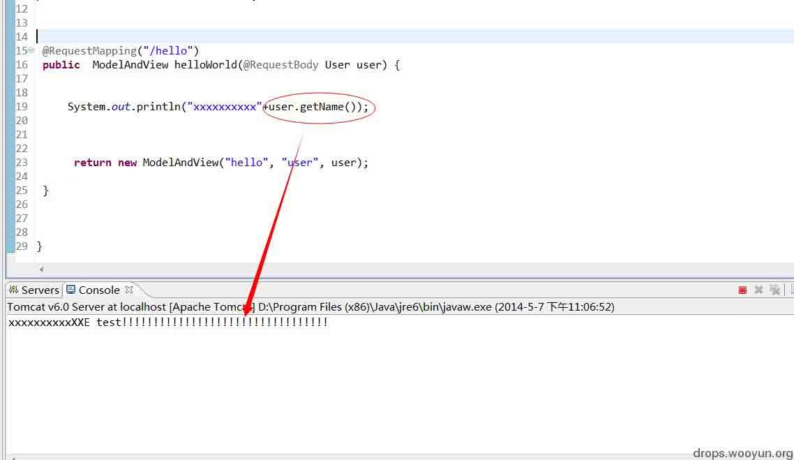

# Spring MVC xml 绑定 pojo 造成的 XXE

2014/05/08 12:20 | [Nebula](http://drops.wooyun.org/author/Nebula "由 Nebula 发布") | [漏洞分析](http://drops.wooyun.org/category/papers "查看 漏洞分析 中的全部文章") | 占个座先 | 捐赠作者

## 0x00 背景

* * *

什么是 XXE ? 就是我们所说的所谓 xml 实体注入.这里不去讲所有 xml 语法规范了,稍微就说一下 XML entity:

```
entity 翻译为"实体"。它的作用类似 word 中的"宏"，也可以理解为 DW 中的模板，你可以预先定义一个 entity，然后在一个文档中多次调用，或者在多个文档中调用同一个 entity(XML 定义了两种类型的 entity。一种是我们这里说的普通 entity，在 XML 文档中使用；另一种是参数 entity，在 DTD 文件中使用。)。 
```

entity 的定义语法为:

```
<!DOCTYPE filename
[  
    <!ENTITY entity-name "entity-content"  
]>

```

如果要引用一个外部资源:

```
<!DOCTYPE test
[  
    <!ENTITY test SYSTEM "http://xxx.xxx.com/test.xml">   
]> 

```

ENTITY 可以使用 SYSTEM 关键字,调用外部资源,而这里是支持很多的协议,如:http;file 等

然后,在其他 DoM 结点中可以使用如:`&test;`引用该实体内容.

那么,如果在产品功能设计当中,解析的 xml 是由外部可控制的,那将可能形成,如:文件读取,DoS,CSRF 等漏洞.

这里只介绍文件读取漏洞,其他可以自己 google 了解.

## 0x01 原理

* * *

规范没有问题,xml 解析器有些也没有问题,有问题的是使用他的人.

java SAX 解析器 demo:

Test.java

```
public static void main(String[] args) throws  Exception {   
    SAXReader reader = new SAXReader();  
    //禁止  
    //reader.setFeature("http://xml.org/sax/features/external-general-entities", true);  
    Document dom = reader.read("E:/1.xml");  
    Element root = dom.getRootElement();  
    Iterator<Element> it = root.elementIterator();  
    while (it.hasNext()) {  
        Element elements = it.next();  
        System.out.println(elements.getText());  

    }  
}  

```

解析的 xml,1.xml:

```
<?xml version="1.0" encoding="utf-8"?>
<!DOCTYPE test
[<!ELEMENT test ANY ><!ENTITY xxe SYSTEM "file:///E:/1.log" >]>
<root>
    <name>&amp;xxe;</name>
</root>

```

实体调用的资源，1.log：

```
XXE test!!!!!!!!!!!!!!!!!!!!!!!!!!!!!!!!! 
```

先说一点,解析器一般会支持所有 xml 规范的.使用 file 协议,理论上,我们至少可以读取到当前系统的任意文件内容.如:读取 E 盘符下的 1.log 文件内容.

然后被 root 的子节点,name 内容域引用.解析结果,如图：



接下来讲，spring MVC 在 xml 格式到 java 对象反序列化中，可能存在的 XXE 形成的文件读取：

spring 是提供 xml 请求内容绑定到 pojo 的功能（也可以理解成 javabean 什么的（有区别，可以自己去看看），spring 在这里规范化了，所以就跟着叫），用得比较多的还有表单绑定，json 绑定。

spring mvc JAXB xml to pojo unMarshaller demo:

spring-servlet.xml：

```
<?xml version="1.0" encoding="UTF-8"?>  
<beans   

 xsi:schemaLocation="http://www.springframework.org/schema/beans  
  http://www.springframework.org/schema/beans/spring-beans-3.0.xsd  
  http://www.springframework.org/schema/context  
  http://www.springframework.org/schema/context/spring-context-3.0.xsd">  

 <context:component-scan base-package="net.spring.controller" />   

    <bean class="org.springframework.web.servlet.mvc.annotation.AnnotationMethodHandlerAdapter">  
        <property name="messageConverters">  
            <list>  
                <ref bean="stringHttpMessageConverter" />  
                <ref bean="jsonHttpMessageConverter" />  
                <ref bean="marshallingHttpMessageConverter" />  
            </list>  
        </property>  
    </bean>  
<bean id="stringHttpMessageConverter" class="org.springframework.http.converter.StringHttpMessageConverter" />   
<bean id="jsonHttpMessageConverter" class="org.springframework.http.converter.json.MappingJacksonHttpMessageConverter" />  
<bean id="marshallingHttpMessageConverter" class="org.springframework.http.converter.xml.MarshallingHttpMessageConverter">  
        <constructor-arg ref="jaxbMarshaller" />  
        <property name="supportedMediaTypes" value="application/xml"></property>  
</bean>  
<bean id="jaxbMarshaller" class="org.springframework.oxm.jaxb.Jaxb2Marshaller">  
        <property name="classesToBeBound">  
            <list>  
                <value>net.spring.controller.User</value>  
            </list>  
        </property>  
</bean>  
</beans>  

```

HelloWorldController.java：

```
import org.springframework.stereotype.Controller;  
import org.springframework.web.bind.annotation.RequestBody;  
import org.springframework.web.bind.annotation.RequestMapping;  
import org.springframework.web.servlet.ModelAndView;  

@Controller  
public class HelloWorldController {   
    @RequestMapping("/hello")  
    public  ModelAndView helloWorld(@RequestBody User user) {  

        System.out.println("xxxxxxxxxx"+user.getName());  
        return new ModelAndView("hello", "user", user);   
    }   
} 

```

User.java（xml 绑定的 pojo）：

```
import javax.xml.bind.annotation.XmlElement;  
import javax.xml.bind.annotation.XmlRootElement;  

@XmlRootElement(name="user")    
public class User {  
    private String name;  

    public String getName() {  
        return name;  
}  
@XmlElement  
    public void setName(String name) {  
        this.name = name;  
    }  
}   

```

发包，xml 绑定 pojo,如图:



pojo User 对象的 name 属性被污染，如图：



如果，攻击者最终能看到这个 name 值（直接显示到页面或存储到数据库再现实到页面什么的），就是文件读取漏洞了！

不管是其他语言或场景，原理就这么回事。

spring 早已经修补，这里主要给个漏洞场景，现在基本没什么危害吧？因为这个功能使用不常见，但走在前面的框架使用者肯定会使用这个功能，可能需要等个十年左右：

https://jira.spring.io/browse/SPR-10806

当然，还存在一个小而很有意思的问题，过一段时间的文章中可能会讲到。

版权声明：未经授权禁止转载 [Nebula](http://drops.wooyun.org/author/Nebula "由 Nebula 发布")@[乌云知识库](http://drops.wooyun.org)

分享到：碎银子打赏，作者好攒钱娶媳妇：


### 相关日志

*   [攻击 JavaWeb 应用[5]-MVC 安全](http://drops.wooyun.org/tips/347)
*   [linux symbolic link attack tutorial](http://drops.wooyun.org/papers/4762)
*   [一次 app 抓包引发的 Android 分析（续）](http://drops.wooyun.org/tips/2986)
*   [Volatility FAQ](http://drops.wooyun.org/papers/2854)
*   [Flash CSRF](http://drops.wooyun.org/tips/688)
*   [OGNL 设计及使用不当造成的远程代码执行漏洞](http://drops.wooyun.org/papers/340)