# 关于 TRACERT 和 TTL

2013/01/29 11:14 | [lion(lp)](http://drops.wooyun.org/author/lion(lp) "由 lion(lp) 发布") | [技术分享](http://drops.wooyun.org/category/tips "查看 技术分享 中的全部文章") | 占个座先 | 捐赠作者

最近看了一些文章，比如利用 TTL 判断 G*F*W，或者一些奇怪设备的位置，特做一个实验，看一下 TTL 及 TRACERT 。 TRACERT 大概的原理，就是通过发送不断+1 的 TTL（TIME TO LIVE）的 ICMP REQUEST 到达最终设备，最后由最终设备返回 ICMP REPLY（中间经过的设备返回的都是 ICMP 超时---|||||ICMP TIME EX）实现。 先发一个 TRACERT 图

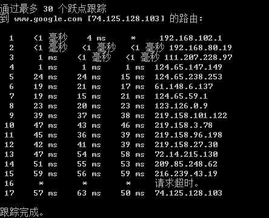

首先看第一个包

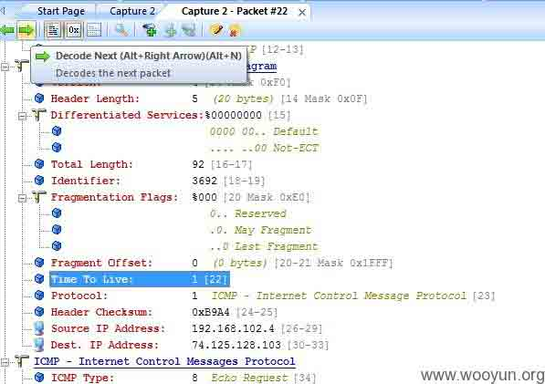

TTL 为 1，然后网关 102.1 返回了一个超时如下图：

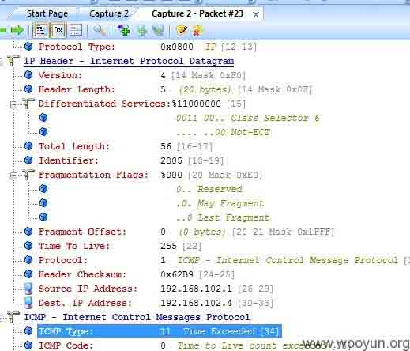

TTL+1

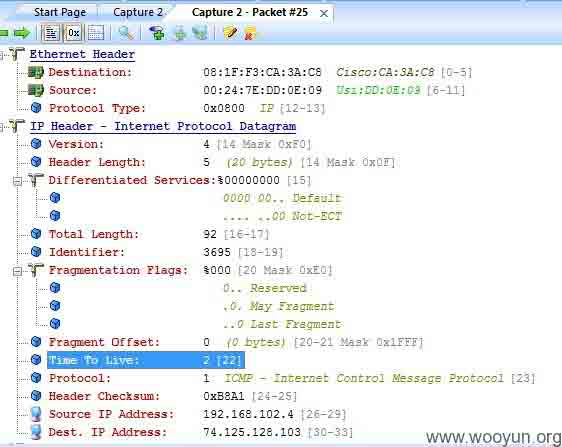

下一个设备返回 TTL 超时，这样就能确定了两个设备，如图：

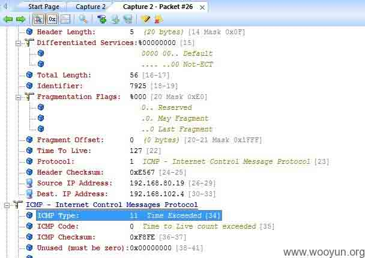

TTL 再+1

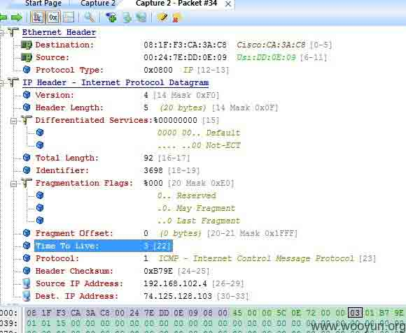

再超时

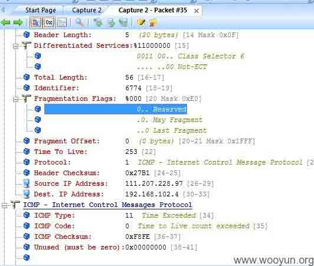

最后一个设备（google 服务器）TTL 已经是 17

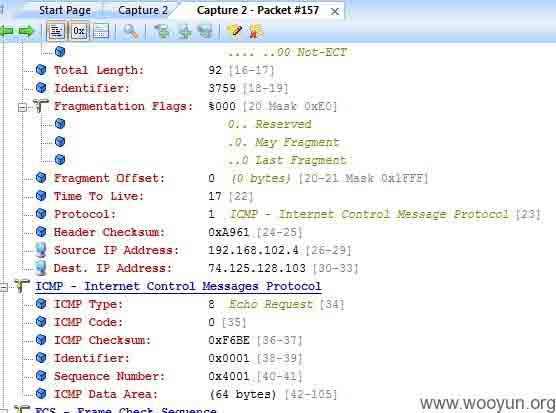

谷歌服务器返回 ICMP REPLY

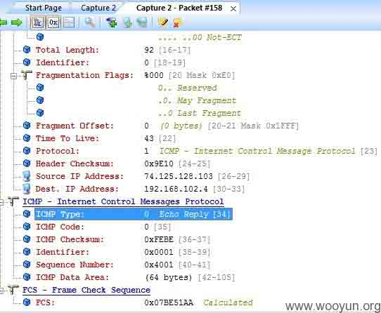

证明我和 GOOGLE 服务器距离 17 跳。PING GOOGLE （IP 地址变了，但 TTL 还是 43）

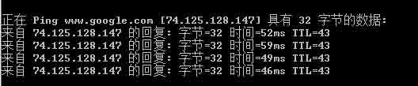

基本上确定 43+17=61 （google 服务器的 TTL 好像是 61：从另一个国外 linux PING 和 tracert

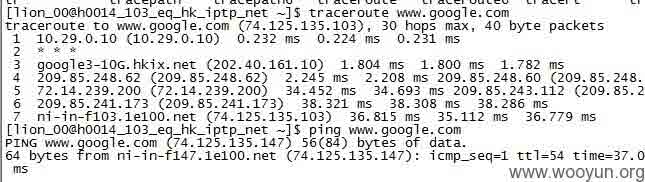

54+7=61

版权声明：未经授权禁止转载 [lion(lp)](http://drops.wooyun.org/author/lion(lp) "由 lion(lp) 发布")@[乌云知识库](http://drops.wooyun.org)

分享到：

### 相关日志

*   [非扫描式定位攻击域内 SQL Server](http://drops.wooyun.org/pentesting/2134)
*   [使用 SQLMAP 对网站和数据库进行 SQL 注入攻击](http://drops.wooyun.org/tips/2113)
*   [Samsung S Voice attack](http://drops.wooyun.org/tips/2736)
*   [Dionaea 低交互式蜜罐部署详解](http://drops.wooyun.org/tips/640)
*   [Denial of App – Google Bug 13416059 分析](http://drops.wooyun.org/tips/2976)
*   [SCTF-WriteUp](http://drops.wooyun.org/tips/4243)