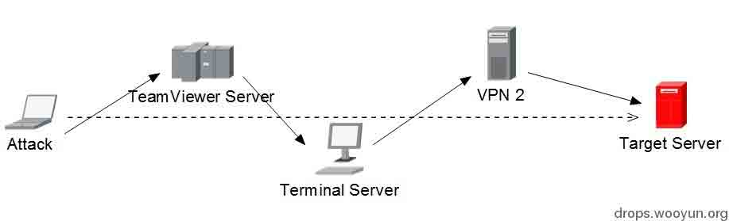
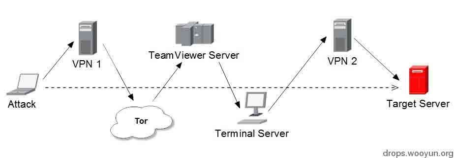
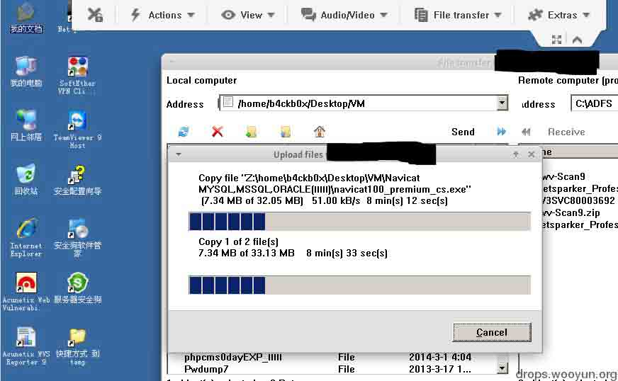

# 多层代理下解决链路低延迟的技巧

2014/03/22 13:19 | [Xeyes](http://drops.wooyun.org/author/Xeyes "由 Xeyes 发布") | [技术分享](http://drops.wooyun.org/category/tips "查看 技术分享 中的全部文章") | 占个座先 | 捐赠作者

## 0x00 背景

* * *

大多数小伙伴们在渗透测试的时候经常需要挂多层代理隐藏行踪，往往采取在较小的成本上达到最大化资源的利用实现多层代理，并且保持较低的网络延迟进行正常工作。而想要利用多环链路进行匿名，就必须忍受速度质量的降低，我们往往只能在这二者之间寻找平衡点，所谓鱼和熊掌不可兼得。这里楼主分享一个简单实用的方法，各位看官见笑，这个方法我常用于控制远端 Windows Server 作为前期信息刺探的扫描平台。

PS：因为 Linux 下尚未出现能媲美 Netsparker，Acunetix Web Vulnerability Scanner 等这类优秀的 WEB 扫描软件，所以楼主一般会使用远端的 Windows Server 来安装这些软件进行前期的扫描工作。

## 0x01 原理

* * *

主要通过 TeamViewer 远程控制软件实现这一过程，实测过程中 TeamViewer 具有流量优化的作用。本机通过 TeamViewer 软件连接服务器的过程中流量通过 TeamViewer 服务器的优化跟中转实现了一层代理的效果，还能在远端 Windows Server 上再次拨一层 VPN 再对目标进行代理，而不会发生 Windows 远程终端（3389）连接因为服务器 IP 的改变而断开连接。

## 0x03 方法

* * *

1.  本地的环境: 电信 8M 速率，Backbox Linux + Tor + Proxychains + 2 个 VPN 翻墙账户 。

2.  远端 Windows Server 安装 TeamViewer 服务器版本，设置好密码，安装好后会分配一个固定 ID，客户端通过 ID 进行连接。服务器版本的好处是安装后可以实现服务器无人职守随时连接。

3.  本机安装 TeamViewer 客户端，通过连接目标 ID 验证密码后，连接远端 Windows Server（需要 Windows 登录认证）。

## 0x04 图示

* * *

3 层代理：

本机-> TeamViewer -> 服务器 -> VPN（本机通过 TeamViewer 连接远端 Windows Server，流量已经通过 TeamViewer 服务器的中转实现了一层代理）

4 层代理：

本机-> VPN 1 -> TeamViewer -> 服务器 -> VPN 2 （VPN 1 我用的是香港的 VPN 出口，速度快）

5 层代理：

本机-> VPN-> Tor -> TeamViewer -> 服务器(usa) -> VPN （第二层使用的是 Proxychains 本地代理 Tor 启动 TeamViewer ）

以我的网络环境实际使用中，使用 5 层代理桌面连接模式下传输文件速度平均值在 50K 左右。画质跟速度都在我可以接受的范围。这个方法适用于 Linux 下控制 Windows 终端保持画质跟速度的绝佳方法。当然如果不需要桌面终端，我们直接使用 Tor 加上多个 SSH 即可达到效果。

版权声明：未经授权禁止转载 [Xeyes](http://drops.wooyun.org/author/Xeyes "由 Xeyes 发布")@[乌云知识库](http://drops.wooyun.org)

分享到：

### 相关日志

*   [编写自己的 Acunetix WVS 漏洞脚本](http://drops.wooyun.org/tips/2498)
*   [自制分布式漏洞扫描](http://drops.wooyun.org/tips/862)
*   [安全科普：Waf 实现扫描器识别 彻底抵挡黑客扫描](http://drops.wooyun.org/tips/730)
*   [Exploiting “BadIRET” vulnerability (CVE-2014-9322, Linux kernel privilege escalation)](http://drops.wooyun.org/papers/4860)
*   [CVE-2014-6271 资料汇总](http://drops.wooyun.org/papers/3064)
*   [PHP WDDX Serializier Data Injection Vulnerability](http://drops.wooyun.org/tips/3911)