# Android Logcat Security

2014/11/10 10:07 | [瘦蛟舞](http://drops.wooyun.org/author/瘦蛟舞 "由 瘦蛟舞 发布")   | [技术分享](http://drops.wooyun.org/category/tips "查看 技术分享 中的全部文章"), [移动安全](http://drops.wooyun.org/category/mobile "查看 移动安全 中的全部文章")  | 占个座先  | 捐赠作者

## 0x00 科普

* * *

development version ：开发版，正在开发内测的版本，会有许多调试日志。

release version ： 发行版，签名后开发给用户的正式版本，日志量较少。

android.util.Log：提供了五种输出日志的方法

Log.e(), Log.w(), Log.i(), Log.d(), Log.v()

ERROR, WARN, INFO, DEBUG, VERBOSE

android.permission.READ_LOGS:app 读取日志权限，android 4.1 之前版本通过申请 READ_LOGS 权限就可以读取其他应用的 log 了。但是谷歌发现这样存在安全风险，于是 android 4.1 以及之后版本，即使申请了 READ_LOGS 权限也无法读取其他应用的日志信息了。4.1 版本中 Logcat 的签名变为“signature|system|development”了，这意味着只有系统签名的 app 或者 root 权限的 app 才能使用该权限。普通用户可以通过 ADB 查看所有日志。

## 0x01 测试

* * *

测试方法是非常简单的，可以使用 sdk 中的小工具 monitor 或者 ADT 中集成的 logcat 来查看日志，将工具目录加入环境变量用起来比较方便。当然如果你想更有 bigger 也可以使用 adb logcat。android 整体日志信息量是非常大的，想要高效一些就必须使用 filter 来过滤一些无关信息，filter 是支持正则的，可以做一些关键字匹配比如 password、token、email 等。本来准备想做个小工具自动化收集，但是觉得这东西略鸡肋没太大必要，故本文的重点也是在如何安全的使用 logcat 方面。

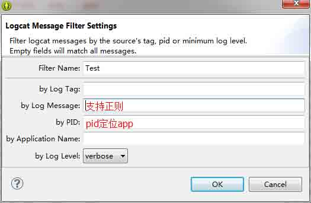

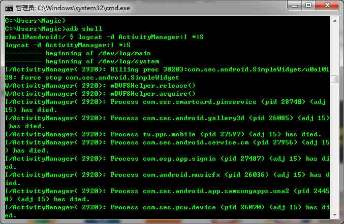

当然也可以自己写个 app 在直接在手机上抓取 logcat，不过前面提到因为 android 系统原因如果手机是 android4.1 或者之后版本即使在 manifest.xml 中加入了如下申请也是无法读取到其他应用的 log 的。

```
<uses-permission android:name="android.permission.READ_LOGS"/> 
```

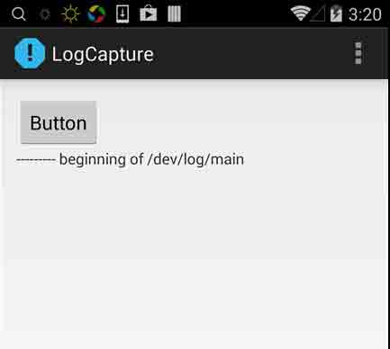

root 权限可以随便看 logcat，所以“logcat 信息泄露”漏洞因谷歌在 4.1 上的动作变得很鸡肋了。

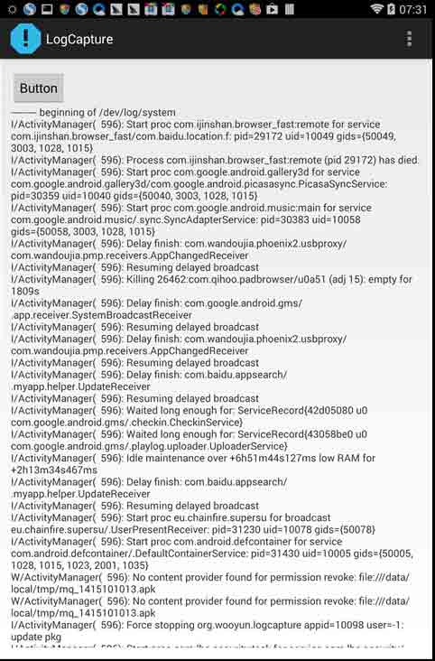

## 0x02 smali 注入 logcat

* * *

http://drops.wooyun.org/tips/2986 一文中提到将敏感数据在加密前打印出来就是利用静态 smali 注入插入了 logcat 方法。 使用 APK 改之理 smali 注入非常方便，但要注意随意添加寄存器可能破坏本身逻辑，新手建议不添加寄存器直接使用已有的寄存器。

```
invoke-static {v0, v0}, Landroid/util/Log;->e(Ljava/lang/String;Ljava/lang/String;)I 
```

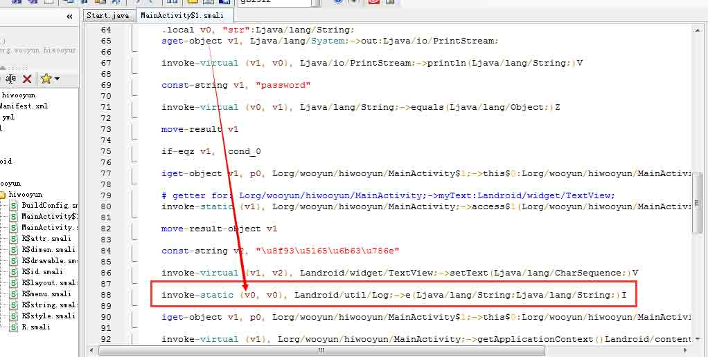

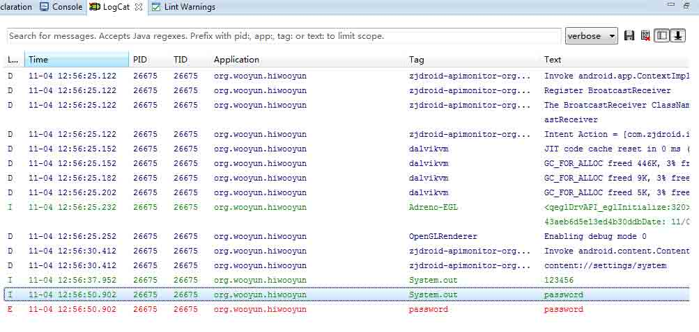

## 0x03 建议

* * *

有些人认为任何 log 都不应该在发行版本打印。但是为了 app 的错误采集，异常反馈，必要的日志还是要被输出的，只要遵循安全编码规范就可以将风险控制在最小范围。

Log.e()/w()/i()：建议打印操作日志

Log.d()/v()：建议打印开发日志

1、敏感信息不应用 Log.e()/w()/i(), System.out/err 打印。

2、如果需要打印一些敏感信息建议使用 Log.d()/v()。（前提：release 版本将被自动去除）

```
@Override
public void onCreate(Bundle savedInstanceState) {
super.onCreate(savedInstanceState);
setContentView(R.layout.activity_proguard);
// *** POINT 1 *** Sensitive information must not be output by Log.e()/w()/i(), System.out/err.
Log.e(LOG_TAG, "Not sensitive information (ERROR)");
Log.w(LOG_TAG, "Not sensitive information (WARN)");
Log.i(LOG_TAG, "Not sensitive information (INFO)");
// *** POINT 2 *** Sensitive information should be output by Log.d()/v() in case of need.
// *** POINT 3 *** The return value of Log.d()/v()should not be used (with the purpose of substitution or comparison).
Log.d(LOG_TAG, "sensitive information (DEBUG)");
Log.v(LOG_TAG, "sensitive information (VERBOSE)");
} 
```

3、Log.d()/v()的返回值不应被使用。（仅做开发调试观测）

Examination code which Log.v() that is specifeied to be deleted is not deketed

```
int i = android.util.Log.v("tag", "message");
System.out.println(String.format("Log.v() returned %d. ", i)); //Use the returned value of Log.v() for examination 
```

4、release 版 apk 实现自动删除 Log.d()/v()等代码。

eclipse 中配置 ProGuard

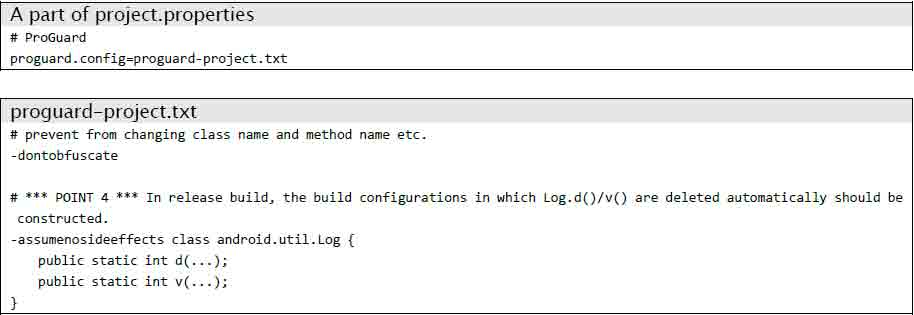

开发版所有 log 都打印出来了。

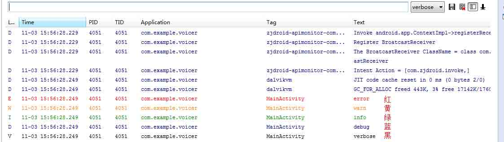

发行版 ProGuard 移除了 d/v 的 log

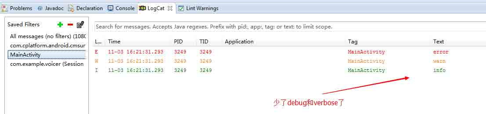

反编译后查看确实被 remove 了

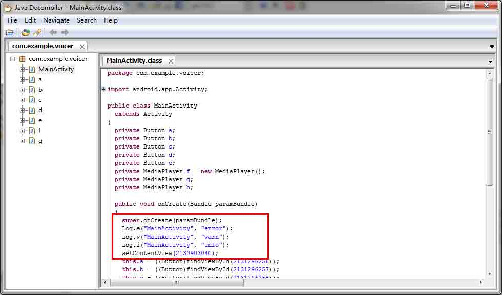

5、公开的 APK 文件应该是 release 版而不是 development 版。

## 0x04 native code

* * *

android.util.Log 的构造函数是私有的，并不会被实例化，只是提供了静态的属性和方法。 而 android.util.Log 的各种 Log 记录方法的实现都依赖于 native 的实现 println_native()，Log.v()/Log.d()/Log.i()/Log.w()/Log.e()最终都是调用了 println_native()。

Log.e(String tag, String msg)

```
public static int v(String tag, String msg) {
    return println_native(LOG_ID_MAIN, VERBOSE, tag, msg);
} 
```

println_native(LOG_ID_MAIN, VERBOSE, tag, msg)

```
/*
 * In class android.util.Log:
 *  public static native int println_native(int buffer, int priority, String tag, String msg)
 */
static jint android_util_Log_println_native(JNIEnv* env, jobject clazz,
    jint bufID, jint priority, jstring tagObj, jstring msgObj)
{
const char* tag = NULL;
const char* msg = NULL;

if (msgObj == NULL) {
    jniThrowNullPointerException(env, "println needs a message");
    return -1;
}

if (bufID < 0 || bufID >= LOG_ID_MAX) {
    jniThrowNullPointerException(env, "bad bufID");
    return -1;
}

if (tagObj != NULL)
    tag = env->GetStringUTFChars(tagObj, NULL);
msg = env->GetStringUTFChars(msgObj, NULL);

int res = __android_log_buf_write(bufID, (android_LogPriority)priority, tag, msg);

if (tag != NULL)
    env->ReleaseStringUTFChars(tagObj, tag);
env->ReleaseStringUTFChars(msgObj, msg);

return res;
} 
```

其中 __android_log_buf_write()又调用了 write_to_log 函数指针。

```
static int __write_to_log_init(log_id_t log_id, struct iovec *vec, size_t nr)
{
#ifdef HAVE_PTHREADS
    pthread_mutex_lock(&log_init_lock);
#endif

    if (write_to_log == __write_to_log_init) {
        log_fds[LOG_ID_MAIN] = log_open("/dev/"LOGGER_LOG_MAIN, O_WRONLY);
        log_fds[LOG_ID_RADIO] = log_open("/dev/"LOGGER_LOG_RADIO, O_WRONLY);
        log_fds[LOG_ID_EVENTS] = log_open("/dev/"LOGGER_LOG_EVENTS, O_WRONLY);
        log_fds[LOG_ID_SYSTEM] = log_open("/dev/"LOGGER_LOG_SYSTEM, O_WRONLY);

        write_to_log = __write_to_log_kernel;

        if (log_fds[LOG_ID_MAIN] < 0 || log_fds[LOG_ID_RADIO] < 0 ||
            log_fds[LOG_ID_EVENTS] < 0) {
            log_close(log_fds[LOG_ID_MAIN]);
            log_close(log_fds[LOG_ID_RADIO]);
            log_close(log_fds[LOG_ID_EVENTS]);
            log_fds[LOG_ID_MAIN] = -1;
            log_fds[LOG_ID_RADIO] = -1;
            log_fds[LOG_ID_EVENTS] = -1;
            write_to_log = __write_to_log_null;
        }

        if (log_fds[LOG_ID_SYSTEM] < 0) {
            log_fds[LOG_ID_SYSTEM] = log_fds[LOG_ID_MAIN];
        }
    }

#ifdef HAVE_PTHREADS
    pthread_mutex_unlock(&log_init_lock);
#endif

    return write_to_log(log_id, vec, nr);
} 
```

总的来说 println_native()的操作就是打开设备文件然后写入数据。

## 0x05 其他注意

* * *

* * *

1、使用 Log.d()/v()打印异常对象。（如 SQLiteException 可能导致 sql 注入的问题）

2、使用 android.util.Log 类的方法输出日志，不推荐使用 System.out/err

3、使用 BuildConfig.DEBUG ADT 的版本不低于 21

```
public final static boolean DEBUG = true; 
```

在 release 版本中会被自动设置为 false

```
if (BuildConfig.DEBUG) android.util.Log.d(TAG, "Log output information"); 
```

4、启动 Activity 的时候，ActivityManager 会输出 intent 的信息如下：

*   目标包名
*   目标类名
*   intent.setData(URL)的 URL

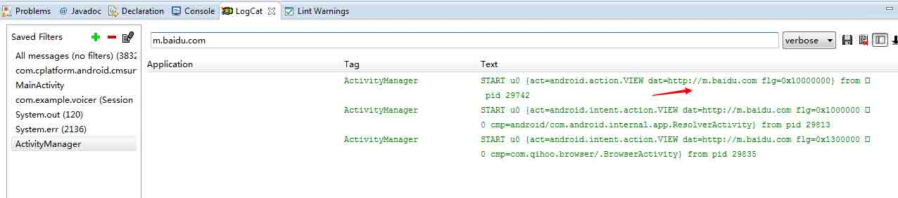

5、即使不用 System.out/err 程序也有可能输出相关信息，如使用 Exception.printStackTrace()

6、ProGuard 不能移除如下 log：("result:" + value).

```
Log.d(TAG, "result:" + value); 
```

当遇到此类情况应该使用 BulidConfig（注意 ADT 版本）

```
if (BuildConfig.DEBUG) Log.d(TAG, "result:" + value); 
```

7、不应将日志输出到 sdscard 中，这样会让日志变得全局可读

## ##0x06 乌云案例

* * *

[WooYun: 途牛网 app logcat 信息泄露用户的同团聊的聊天内容](http://www.wooyun.org/bugs/wooyun-2014-079241)

[WooYun: 冲浪浏览器 locat 出用户短信](http://www.wooyun.org/bugs/wooyun-2014-079357)

[WooYun: 杭州银行 Android 客户端登录账号密码信息本地泄露](http://www.wooyun.org/bugs/wooyun-2014-082717)

## 0x07 参考

* * *

[`www.jssec.org/dl/android_securecoding_en.pdf`](http://www.jssec.org/dl/android_securecoding_en.pdf)

[`source.android.com/source/code-style.html#log-sparingly`](http://source.android.com/source/code-style.html#log-sparingly)

[`developer.android.com/intl/zh-cn/reference/android/util/Log.html`](http://developer.android.com/intl/zh-cn/reference/android/util/Log.html)

[`developer.android.com/intl/zh-cn/tools/debugging/debugging-log.html`](http://developer.android.com/intl/zh-cn/tools/debugging/debugging-log.html)

[`developer.android.com/intl/zh-cn/tools/help/proguard.html`](http://developer.android.com/intl/zh-cn/tools/help/proguard.html)

[`www.securecoding.cert.org/confluence/display/java/DRD04-J.+Do+not+log+sensitive+information`](https://www.securecoding.cert.org/confluence/display/java/DRD04-J.+Do+not+log+sensitive+information)

[`android.googlesource.com/platform/frameworks/base.git/+/android-4.2.2_r1/core/jni/android_util_Log.cpp`](https://android.googlesource.com/platform/frameworks/base.git/+/android-4.2.2_r1/core/jni/android_util_Log.cpp)

版权声明：未经授权禁止转载 [瘦蛟舞](http://drops.wooyun.org/author/瘦蛟舞 "由 瘦蛟舞 发布")@[乌云知识库](http://drops.wooyun.org)

分享到：碎银子打赏，作者好攒钱娶媳妇：


### 相关日志

*   [Android Activtity Security](http://drops.wooyun.org/tips/3936)
*   [Denial of App – Google Bug 13416059 分析](http://drops.wooyun.org/tips/2976)
*   [Android Broadcast Security](http://drops.wooyun.org/tips/4393)
*   [Android 证书信任问题与大表哥](http://drops.wooyun.org/tips/3296)
*   [Android Content Provider Security](http://drops.wooyun.org/tips/4314)
*   [Samsung S Voice attack](http://drops.wooyun.org/tips/2736)