# metasploit 渗透测试笔记(基础篇)

2014/06/04 19:40 | [DM_](http://drops.wooyun.org/author/DM_ "由 DM_ 发布") | [技术分享](http://drops.wooyun.org/category/tips "查看 技术分享 中的全部文章") | 占个座先 | 捐赠作者

## 0x00 背景

* * *

笔记在 kali linux(32bit)环境下完成，涵盖了笔者对于 metasploit 框架的认识、理解、学习。

这篇为基础篇，并没有太多技巧性的东西，但还是请大家认真看啦。

如果在阅读中有任何问题都可以与我邮件联系（contact@x0day.me）

## 0x01 在 kali 中使用 metasploit

* * *

在 kali 中使用 metasploit，需要先开启 PostgreSQL 数据库服务和 metasploit 服务，然后就可以完整的利用 msf 数据库查询 exploit 和记录了。这一点比 bt5 要方便很多，所以现在就放弃了 bt5。

具体命令与截图

```
service postgresql start
service metasploit start 
```


如果不想每次开机都这样，还可以配置随系统启动。

```
update-rc.d postgresql enable
update-rc.d metasploit enable 
```

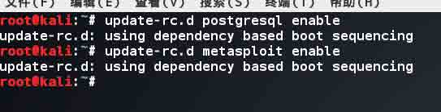

## 0x02 metasploit 目录结构

* * *

之所以会讲到这，是因为我认为框架代码是用来学习的一个非常好的来源。并且 metasploit 是用 ruby 脚本语言编写，所以阅读起来非常方便。在渗透，exploit 编写过程前理解框架的优势以及大致内容则能够快速构建出自己的工具或者找到已知可用的工具。这样不仅有利于得到结果，也提高了效率。

这里只介绍几个目录，也希望读者能把 modules 下 auxiliary 的模块大致都看一遍。这样有个印象也便于快速查找。

对于工具的使用，没有会不会的。只是有没有发现而已。目录大概看一遍，这个问题就差不多了吧！


Kali 中 msf 的路径为`/usr/share/metasploit-framework`

### modules

首先看 modules 目录:

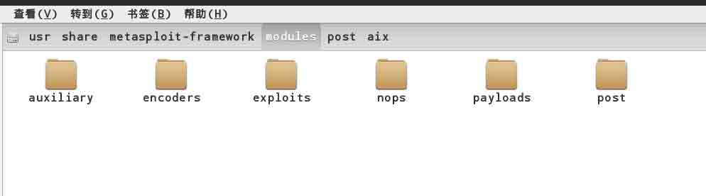

这里

```
Auxiliary：辅助模块，
encoders：供 msfencode 编码工具使用，具体可以使用 msfencode –l
exploits：攻击模块 每个介绍 msf 的文章都会提到那个 ms08_067_netapi，它就在这个目录下。
nops：NOP (No Operation or Next Operation) sled,由于 IDS/IPS 会检查数据包中不规则的数据，所以在某些场合下(比如针对溢出攻击),某些特殊的滑行字符串(NOPS x90x90...)则会因为被拦截而导致攻击失效，所以此时需要修改 exploit 中的 NOPs.nops 文件夹下的东西会在 payload 生成时用到(后面会有介绍)。比如我们打开 php 的 NOPS 生成脚本，就会发现它只是返回了指定长度的空格而已。 
```

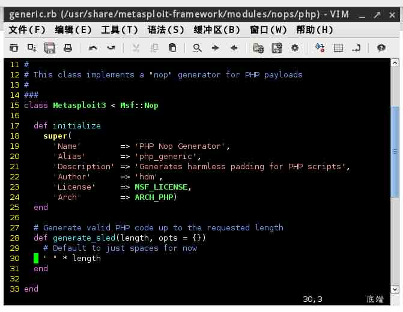

```
payloads：这里面列出的是攻击载荷,也就是攻击成功后执行的代码。比如我们常设置的 windows/meterpreter/reverse_tcp 就在这个文件夹下。
Post：后渗透阶段模块，在获得 meterpreter 的 shell 之后可以使用的攻击代码。比如常用的 hashdump、arp_scanner 就在这里。 
```

### data

其次是 data 目录:

这里存放的是 metasploit 的脚本引用文件，重点介绍几个文件


第一个是 data 下 js 文件夹下的 detect，这里面存放的是 metasploit 的探针文件。如果看过 metasploit 浏览器攻击脚本的代码，就会发现调用了一个 js 库，然后检查当前请求是否符合被攻击环境。如果符合则发送攻击代码，否则中断。Memory 中主要是一些堆喷射代码。在大部分浏览器漏洞利用过程，堆喷射是一个不可或缺的过程(当然不是绝对的！)。并且不同的浏览器及版本间，堆喷射代码都有所不同。所以这里给出的探针代码和堆喷射代码是不是一个非常好的学习资源呢？ script

最后是 msf 下 script 目录中的 resource 目录:

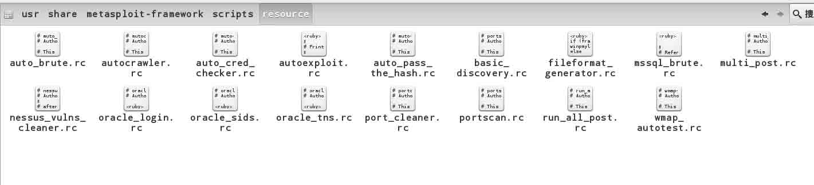

这里的 rc 脚本相当于 windows 下的批处理脚本，在某些情况下会有一定便捷性。比如 Veil 在生成免杀 payload 的同时也会生成一个 rc 脚本，此时使用 msfconsole –r xx.rc 便可以快速的建立一个和 payload 对应的 handler，亦或在攻过程中需要你反复的 set exploit,那么就可以使用这个批处理脚本了，而这个目录下则是一些给定的 rc 脚本，虽然你可能不习惯这样使用，但作为改写自己的 rc 脚本的资源也不错。

## 0x03 metasploit 基本命令

* * *

列一些其他文章中不常提到的命令或者是我经常碰到或使用的方法。

### Msfpayload

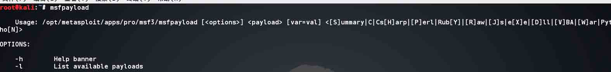

这是我最常用的一个命令，用来生成 payload 或者 shellcode。

在不知道 payload 名称又不想开 msfconsole 搜索的时候可以用`msfpayload –l |grep “windows”` 这样的命令查询。

-o 选项可以列出 payload 所需的参数。

### msfencode

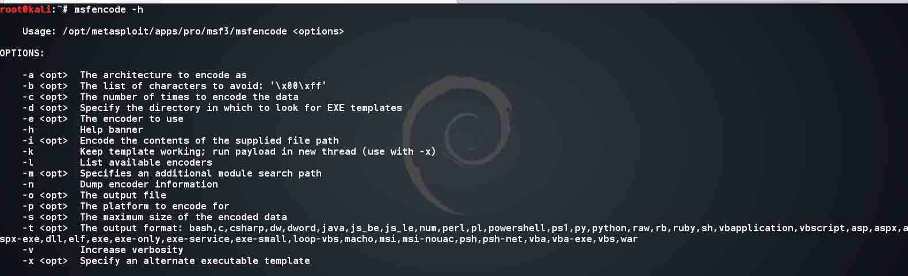

msf 中的编码器，早期为了编码绕过 AV，现在我常用 msfpayload 与它编码 exploit 的坏字符串。

### msfconsole

开启 metasploit 的 console，有个重要的参数 –r，加载 resources 脚本

数据库有关命令

### hosts

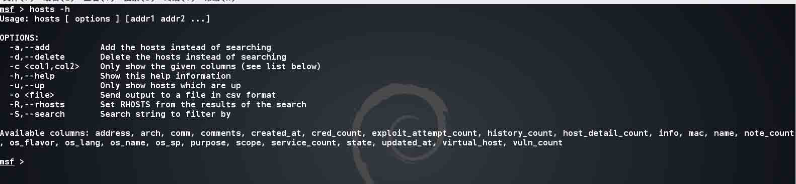

这里可以使用 hosts 查询指定字段的内容，可用的字段下面有列出。或者也可以使用 hosts –S “keyword” 进行搜索。

### Creds

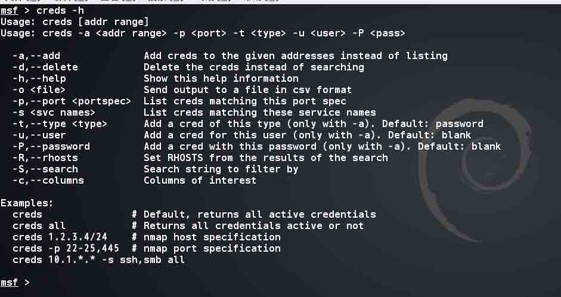

Creds 命令可以列出成功获取到的信息，比如用户名密码，数据库密码，开放端口及服务等。

### Console 中有关命令

### search

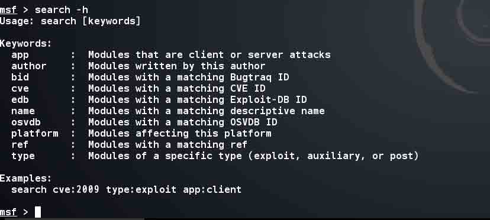

搜索一切可以 use 的模块,常用的方法是 search 直接加关键词，比如 search 08_067,但是我们也可以根据 cve 编号查找。通常用 nessus 扫到的漏洞都有 cve 信息，这里我们就可以这样搜索了。

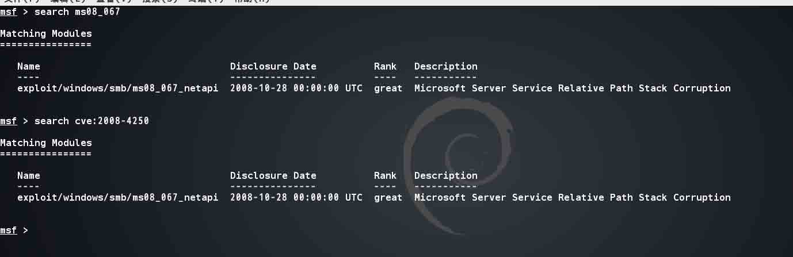

### spool

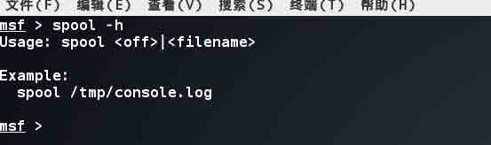

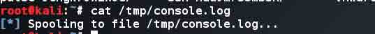

将屏幕输出重定向到某个文件中，在使用 HTTP 弱口令破解、，内网 http 目录等不会记录在 creds 中的内容时你怎样解决查询成功结果的？反正这个问题我快要疯了。 要不就改写 exploit，不成功不打印，要不就重定向之后自己再 grep 吧。如果有好的方法，一定要分享啊！

### show advanced

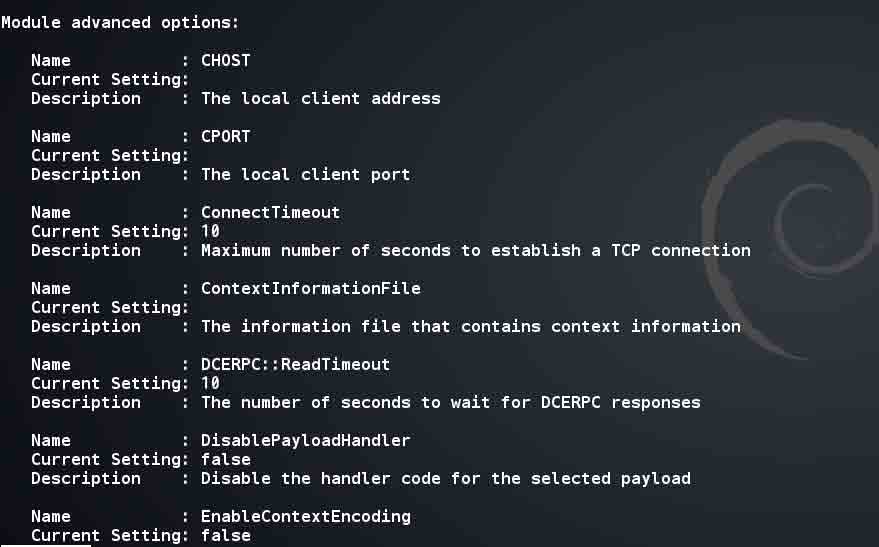

在选定一个 module(exploit,payload …)之后，使用 show advanced 命令可以显示关于此 module 的高级选项，具体内容会在后面”metasploit tricks and tips”中分享。

## 0x04 攻击示例

* * *

同样我还是选择 ms08_067 这个漏洞，并且随便输入一个 ip，演示下最基本的攻击过程(为了让基础篇看起来更完整点)结束基础篇的分享。说明:

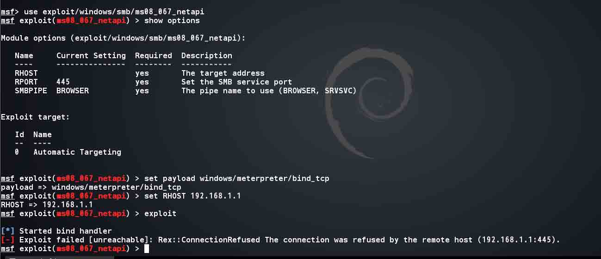

从图中也可以看出一次基本的攻击过程大概是这样的：

```
1\. 选择 exploit (use exploit/windows/smb/ms08_067_netapi)
2\. 选择 payload
3\. 设置参数 (set RHOST,set LPORT …)
4\. 执行攻击 
```

版权声明：未经授权禁止转载 [DM_](http://drops.wooyun.org/author/DM_ "由 DM_ 发布")@[乌云知识库](http://drops.wooyun.org)

分享到：

### 相关日志

*   [metasploit 渗透测试笔记(内网渗透篇)](http://drops.wooyun.org/tips/2746)
*   [从丝绸之路到安全运维（Operational Security）与风险控制（Risk Management） 上集](http://drops.wooyun.org/news/674)
*   [PostgreSQL 的那点事儿](http://drops.wooyun.org/tips/218)
*   [XSS 与字符编码的那些事儿 —科普文](http://drops.wooyun.org/tips/689)
*   [深入分析 Fiesta Exploit Kit](http://drops.wooyun.org/tips/4858)
*   [nmap 脚本使用总结](http://drops.wooyun.org/tips/2188)