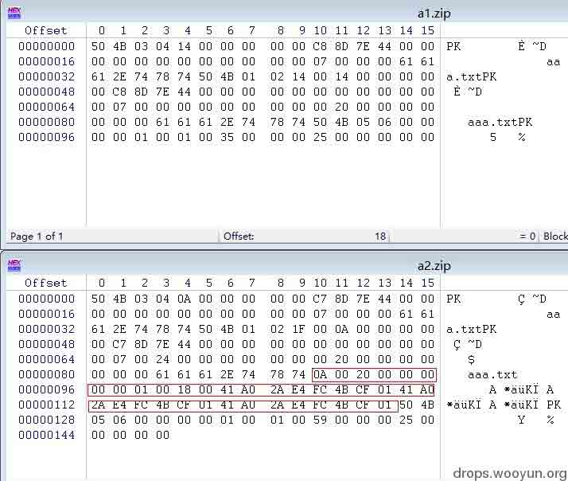
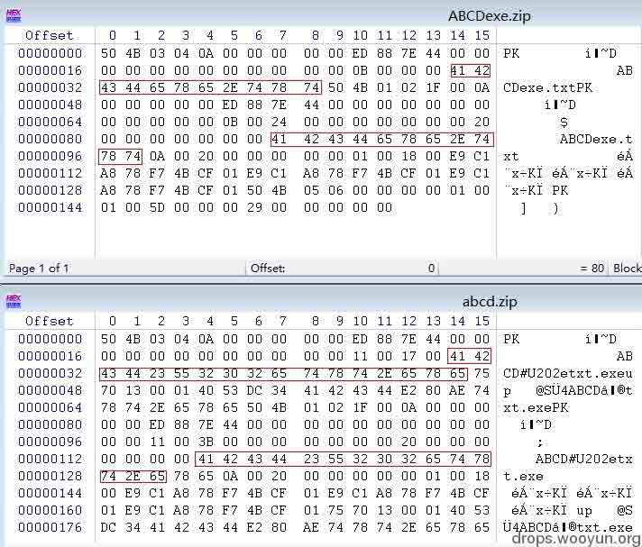

# Winrar4.x 的文件欺骗漏洞利用脚本

2014/03/31 14:24 | [Xcode](http://drops.wooyun.org/author/Xcode "由 Xcode 发布") | [二进制安全](http://drops.wooyun.org/category/binary "查看 二进制安全 中的全部文章"), [技术分享](http://drops.wooyun.org/category/tips "查看 技术分享 中的全部文章") | 占个座先 | 捐赠作者

## 0x00 背景

* * *

这几天仔细研究了 winrar4.x 系列的文件扩展名欺骗漏洞的那篇文章，通过一些测试对其有了一些新的想法和建议。（准确的说应该不能算文件扩展名欺骗漏，不止扩展名，整个文件名都是可以欺骗的）

具体的漏洞成因相信文章中都很清楚了，简单说一下：

zip 格式中有 2 个 filename，一般情况下，一般应用程序打开 zip 时，预览使用的是 filename2，点击预览也是以 filename2 方式打开的，只有在解压的时候才会使用 filename1。然而在 winrar4.x 中，点击预览是以预览 filename1 方式打开的。

这会造成什么结果呢？当第一个 filename 为 readme.exe，第二个 filename 为 readme.txt 时，用 winrar4.x 打开时，你在程序窗口看到的文件名为 readme.txt，然后你再点击文件时却是以 readme.exe 方式打开，这就形成漏洞了。

文章给出了如何利用这个 bug 的方法，更改 filename2 即可。但是作者是手动操作的，那么能不能写成利用脚本呢？这个 filename2 的长度有没有要求，需不需要和 filename1 长度相同？这正是本文要研究的。

## 0x01 细节

* * *

在研究这个问题以前，先科普一下 zip 格式（想看详细版的去网上下载 APPNOTE.TXT）。

zip 格式由 3 部分组成：

```
1.文件内容源数据
2.目录源数据
3.目录结束标识结构 
```

以只压缩了一个文件的 zip 文件为例，大致格式为：

```
[file header]
[file data]
[data descriptor]
[central directory file header]
[end of central directory record] 
```

其中关键的几个字段为：

```
[file header]: 

Offset           Bytes               Description 
18                 4                   Compressed size 
26                 2                   File name length (n) 
28                 2                   Extra field length (m) 
30                 n                   File name 
30+n               m                  Extra field 

[central directory file header]: 

Offset           Bytes            Description 
28                 2                   File name length (n) 
30                 2                   Extra field length (m) 
34                 2                   File comment length (k) 

[end of central directory record]: 

Offset           Bytes                Description 
12                 4                   Size of central directory (bytes) 
16                 4                   Offset of start of central directory, relative to start of archive 
```

在了解了 zip 基本格式后，我对 winrar 压缩生成的 zip 文件和用 windows 生成的 zip 文件进行了分析，它们的区别是 winrar 的 zip 文件在 Extra field 区段都进行了一些数据填充。



由于不清楚 Extra field 这部分的值会不会影响到 winrar 的校验，所以根据不同情况做了几个测试，当 filename2 长度改变时，并且对受 filename2 长度影响的所有字段（除 Extra field）进行修改后，文件可以正常打开。测试结果证明 Extra field 的值并不会影响 winrar 打开 zip 文件。

这样一来，只要按照 zip 的格式，更改和 filename2 有关的所有字段，就可以写出一个利用脚本了。

等等，该文章中同时提到了，这个漏洞存在有一个限制：解压。如果你是以右键解压打开这个压缩包的话，那么只会使用 filename1，和 filename2 无关，也就不存在这个漏洞了。作者在文章最后提到了可以利用 LRO 解决这个限制，那应该如何结合利用 RLO 呢？

用 WinHex 对正常 zip 文件、使用了字符反转的 zip 文件进行分析：



通过对比分析可以看到，当使用含有 RLO 文件名的文件进行压缩时，压缩的格式有点区别，继续做了几个测试，发现 winrar 在 Extra field 添加的信息，不会影响到漏洞的利用。

据此可以将这两个漏洞完美的结合在一起，写成一个利用脚本。

以 python 为例，具体思路为：

```
1．生成一个带 LRO 的文件名的文件，并用 winrar 压缩为 zip。在 python 中可以使用 u'\u202e'来构造字符串反转，用 os.system()函数来执行 winrar 命令。 
2．处理 zip 文件中的数据，将 filename2 更改为自己需要定义的字符串。按照 zip 格式依次读取，修改 filename2 为新的字符串，计算出新的长度，并且修改 File name length2 字段，Sizeofcentraldirectory 和 Offsetofstartofcentraldirectory 字段，处理好它们新的偏移位置。 
3．重新生成新的 zip。 
```

在文章最后附上完整的利用脚本 WinrarExp.py

本程序只用于测试，仅供安全学习、研究所用，请勿用于非法用途，否则造成的一切后果自负。

使用方法：

```
WinrarExp.py [-f <open file>][-s <forged name>][-v <reversed string>] 

```

-f 表示要压缩的文件，比如 1.exe
-s 表示要伪装的文件名，比如 readme.txt
-v 表示需要反转的字符串，该参数为选用。比如想要文件名反转变成 readmeEXE.jpg 则参数只要设置为 EXE.jpg

下载地址：[WinrarExp.py](http://static.wooyun.org/20141017/2014101712290362071.zip)

版权声明：未经授权禁止转载 [Xcode](http://drops.wooyun.org/author/Xcode "由 Xcode 发布")@[乌云知识库](http://drops.wooyun.org)

分享到：

### 相关日志

*   [逆向基础（三）](http://drops.wooyun.org/tips/1963)
*   [逆向基础（十二）](http://drops.wooyun.org/tips/3167)
*   [关于 OpenSSL“心脏出血”漏洞的分析](http://drops.wooyun.org/papers/1381)
*   [逆向基础（四）](http://drops.wooyun.org/tips/2046)
*   [逆向基础（七）](http://drops.wooyun.org/tips/2282)
*   [逆向基础（六）](http://drops.wooyun.org/tips/2177)