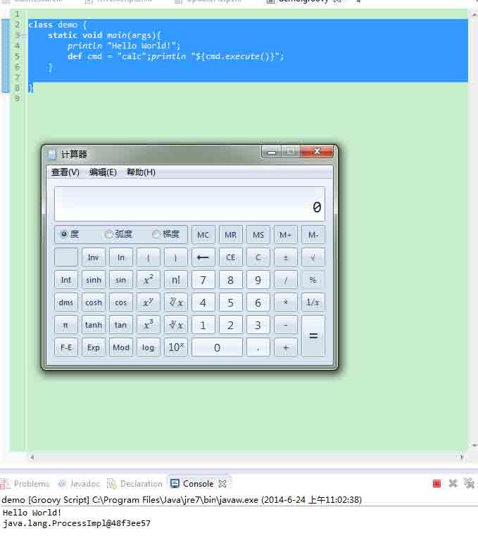

# 一种新的攻击方法——Java-Web-Expression-Language-Injection

2014/07/03 13:10 | [绿盟科技](http://drops.wooyun.org/author/绿盟科技 "由 绿盟科技 发布") | [技术分享](http://drops.wooyun.org/category/tips "查看 技术分享 中的全部文章") | 占个座先 | 捐赠作者

Nsfocus-TRC

```
title: “一种新的攻击方法——Java-Web-Expression-Language-Injection”
date: 2014-06-24 16:36:56 +0800
comments: true
categories: “安全技术”
author: “申军利” 
```

tags: [Java Web,Expression Language]

## 0×00 引言

* * *

在 2014 年 6 月 18 日@终极修炼师曾发布这样一条微博：


链接的内容是一个名为 Jenkins 的服务，可以在没有 password 的情况下受到攻击。而攻击方法比较有趣，Jenkins 提供了一个 Script Console 功能，可以执行 Groovy 脚本语言。下面我们来看下维基百科对于这个脚本语言的解释：

> Groovy 是 Java 平台上设计的面向对象编程语言。这门动态语言拥有类似 Python、Ruby 和 Smalltalk 中的一些特性，可以作为 Java 平台的脚本语言使用。
> Groovy 的语法与 Java 非常相似，以至于多数的 Java 代码也是正确的 Groovy 代码。Groovy 代码动态的被编译器转换成 Java 字节码。由于其运行在 JVM 上的特性，Groovy 可以使用其他 Java 语言编写的库。

比较巧的是，我前一段时间因为在关注表达式注入这个攻击方向，也研究了下 Groovy 这个语言。这个语言简单而强大，我可以直接用一个字符串来执行系统命令。下面是一个 demo:

```
java
class demo {
static void main(args){
def cmd = "calc";
println "${cmd.execute()}";
}
} 
```



如果单纯的看 Jenkins 的这个问题，可能只是觉得这是一个比较有趣的攻击手法。但如果我们再联想一下之前的一些漏洞，就会发现这些个体之间是存在某种联系的。

> 2014 年 5 月：CVE-2014-3120，ELASTICSEARCH 远程代码代码漏洞
> 2013 年 5、6、7 月：Struts2 多个 OGNL 导致的远程命令执行漏洞
> 2012 年 12 月：国外研究者@DanAmodio 发布《Remote-Code-with-Expression-Language-Injection》一文

这些事件的串联导致了我打算写下这篇文章，来向各位介绍这种新的攻击方法（虽然实际上，它已经存在了很久），我们可能会在未来很长的一段时间内和它打交道，就像我们当初和 SQL 注入、代码执行、命令执行这些一样。

它的名字叫做**Java Web Expression Language Injection——Java Web 表达式注入**

## 0×01 表达式注入概述

* * *

2013 年 4 月 15 日 Expression Language Injection 词条在 OWASP 上被创建，而这个词的最早出现可以追溯到 2012 年 12 月的《Remote-Code-with-Expression-Language-Injection》一文，在这个 paper 中第一次提到了这个名词。

而这个时期，我们其实也一直在响应这个新型的漏洞，只不过我们还只是把它叫做远程代码执行漏洞、远程命令执行漏洞或者上下文操控漏洞。像 Struts2 系列的 s2-003、s2-009、s2-016 等，这种由 OGNL 表达式引起的命令执行漏洞。

而随着 Expression Language 越来越广泛的使用，它的受攻击面也随着展开，所以我们觉得有必要开始针对这种类型的漏洞进行一些研究，Expression Language Injection 在将来甚至有可能成为 SQL 注入一样的存在。

而且从 OWASP 中定义的表达式注入以及《Remote-Code-with-Expression-Language-Injection》这篇 paper 所提到的表达式注入所面向的服务，可以看出这种漏洞，在目前的 web 现状中，只存在于 Java Web 服务。而在未来的 web 发展中，其他的 Web 方向也有可能出现表达式的存在，所以我们为了谨慎起见，将这个称为 Java Web Expression Language Injection。

从以往的这种形式的漏洞来看，这种漏洞的威力往往都非常大，最典型的就像 Struts2 的 OGNL 系列漏洞。而漏洞的形成原因，一般是功能滥用或者过滤不严这两种，比较代表性的例子是 Struts2 的 s2-16（功能滥用）和 s2-009（过滤不严）。

## 0×02 一些流行的表达式语言

* * *

我们在去年的时候做过一个关于 Java Web 的研究课题，对于一些 Java Web 框架和程序进行过比较深入的研究。而且对于 Java Web 表达式注入（后面简称 JWEI）也做了一点积累，在这小节中我觉得有必要向各位介绍一下它们，以方便日后研究工作的开始。

下面我将用尽量简单的语言来向各位介绍几种简单的流行表达式语言和它们的基本用法（攻击相关），以及它们曾经导致的漏洞。

### Struts2——OGNL

实至名归的“漏洞之王”，目前被攻防双方理解得足够透彻的唯一表达式语言。

基本用法：

```
java
ActionContext AC = ActionContext.getContext();
Map Parameters = (Map)AC.getParameters();
String expression = "${(new java.lang.ProcessBuilder('calc')).start()}";
AC.getValueStack().findValue(expression)); 
```

相关漏洞：

s2-009、s2-012、s2-013、s2-014、s2-015、s2-016，s2-017

### Spring——SPEL

SPEL 即 Spring EL，故名思议是 Spring 框架专有的 EL 表达式。相对于其他几种表达式语言，使用面相对较窄，但是从 Spring 框架被使用的广泛性来看，还是有值得研究的价值的。而且有一个 Spring 漏洞的命令执行利用，让漏洞发现者想得脑袋撞墙撞得梆梆响都没想出来，而我却用 SPEL 解决了，大家来猜下是哪个漏洞呢^_^。

基本用法：

```
java
String expression = "T(java.lang.Runtime).getRuntime().exec(/"calc/")";
String result = parser.parseExpression(expression).getValue().toString(); 
```

相关漏洞：

> 暂无公开漏洞

### JSP——JSTL_EL

这种表达式是 JSP 语言自带的表达式，也就是说所有的 Java Web 服务都必然会支持这种表达式。但是由于各家对其实现的不同，也导致某些漏洞可以在一些 Java Web 服务中成功利用，而在有的服务中则是无法利用。

例如：《Remote-Code-with-Expression-Language-Injection》一文中所提到的问题，在 glassfish 和 resin 环境下是可以成功实现命令执行的，而在 tomcat 的环境下是没有办法实现的。

而且 JSTL_EL 被作为关注的对象，也是由于它的 2.0 版本出现之后，为满足需求，这个版本在原有功能的基础之上，增加了很多更为强大的功能。

从这点中我们不难看出，随着未来的发展，对于表达式语言能实现比较强大的功能的需求越来越强烈，主流的表达式语言都会扩展这些功能。而在扩展之后，原来一些不是问题的问题，却成了问题。

基本用法：

```
jsp
<spring:message text="${/"/".getClass().forName(/"java.lang.Runtime/").getMethod(/"getRuntime/",null).invoke(null,null).exec(/"calc/",null).toString()}"></spring:message> 
```

相关漏洞：

CVE-2011-2730

### Elasticsearch——MVEL

首先要感谢下 Elasticsearch 的 CVE-2014-3120 这个漏洞，因为跟踪这个漏洞时，让我开始重新关注到 Java Web 表达式研究的价值，并决定开始向这个方向作深入的研究。

MVEL 是同 OGNL 和 SPEL 一样，具有通过表达式执行 Java 代码的强大功能。

基本用法：

```
java import org.mvel.MVEL;
public class MVELTest {
        public static void main(String[] args) {
              String expression = "new java.lang.ProcessBuilder(/"calc/").start();";
               Boolean result = (Boolean) MVEL.eval(expression, vars);
         }
  } 
```

相关漏洞：

CVE-2014-3120

## 0×03 总结

* * *

在未来针对表达式语言开展的研究中，我准备将研究表达式语言定位为和 SQL 语法一样的利用方法研究。从我们上面对于表达式语言分析的结果来看，JWEI 攻击和 SQL 注入攻击很像。

多种平台风格，但是基本的语法一定 多数情况下是由于拼接问题，或用户直接操控表达式，从而造成的攻击 由此我们未来的研究，会将 Java Web 表达式语言作为一种利用方法来研究。

而 JWEI 漏洞的研究，我们会通过研究程序员在编程中如何使用表达式语言来进行。具体的操作方法，会是阅读研究的表达式语言所对应的框架代码。试图从中找到一些规律和习惯。最终总结出一些针对表达式注入漏洞挖掘和利用方法。

## 0×04 扩展延伸

* * *

在研究表达式语言时，翻阅以往 Java Web 资料的过程中，我还发现了一些 Java Web 漏洞的小细节。这些细节可能没有表达式语言这么通用，但也是 Java Web 中不可忽略的潜在漏洞点。

### 反序列化代码执行

序列化是 Java 的一个特性，在 Web 服务中也经常用来传输信息，这就导致攻击者有可能通过出传递带有恶意序列化内容的代码实现攻击。典型的漏洞有 Spring 的 CVE-2011-2894 和 JBoss 的 CVE-2010-0738。

### 利用 Java 反射触发命令执行

反射是 Java 的一个大特性，如果在开发过程中没有针对对象的行为进行严格的限制的话，用户就有可能通过操控一些可控对象，利用反射机制触发命令执行攻击。典型的漏洞有 CVE-2014-0112。

### 利用框架某些特性实现代码执行

这种形式的攻击，根据框架的某些特性才能进行，而大部分框架的功能实现是有很大的不同的，所以此类攻击定制性很强。不过，框架之间还是有一些共同性的，譬如自定义标签库的实现和调用，都是大同小异的。典型漏洞有 CVE-2010-1622。

版权声明：未经授权禁止转载 [绿盟科技](http://drops.wooyun.org/author/绿盟科技 "由 绿盟科技 发布")@[乌云知识库](http://drops.wooyun.org)

分享到：

### 相关日志

*   [攻击 JavaWeb 应用[5]-MVC 安全](http://drops.wooyun.org/tips/347)
*   [Spring 框架问题分析](http://drops.wooyun.org/tips/2892)
*   [JAVA 逆向&反混淆-追查 Burpsuite 的破解原理](http://drops.wooyun.org/tips/2689)
*   [一次 app 抓包引发的 Android 分析（续）](http://drops.wooyun.org/tips/2986)
*   [攻击 JavaWeb 应用[3]-SQL 注入[1]](http://drops.wooyun.org/tips/236)
*   [Android 证书信任问题与大表哥](http://drops.wooyun.org/tips/3296)