# 编写自己的 Acunetix WVS 漏洞脚本

2014/07/04 14:44 | [乌帽子](http://drops.wooyun.org/author/乌帽子 "由 乌帽子 发布") | [工具收集](http://drops.wooyun.org/category/tools "查看 工具收集 中的全部文章"), [技术分享](http://drops.wooyun.org/category/tips "查看 技术分享 中的全部文章") | 占个座先 | 捐赠作者

## 0x00 背景

* * *

AWVS 提供了自定义的脚本编程接口，可是网上的资料很少，只有官方的几篇介绍和参考手册，最近研究了一下怎么编写 AWVS 的漏洞脚本来写一篇简单性的文章，大家有兴趣的可以交流。

本文以 8.0 为例，首先呢安装好 Acunetix Web Vulnerability Scanner 8（该破解的破解，该付费的付费），然后我们需要 WVS 公开的小小的 SDK，下载地址：[`www.acunetix.com/download/tools/WVSSDK.zip`](http://www.acunetix.com/download/tools/WVSSDK.zip)，下载好了后解压 bin 目录下的 WVSS.exe 到 WVS 安装目录下面，此即为 WVS 脚本编写工具。另外 sdk 里还有 3 个简单的脚本小例子和 WVS_SDK_Quick_Introduction.pdf，耐心的可以看看。

## 0x01 细节

* * *

下面的截图就是 WVS 码脚本工具了

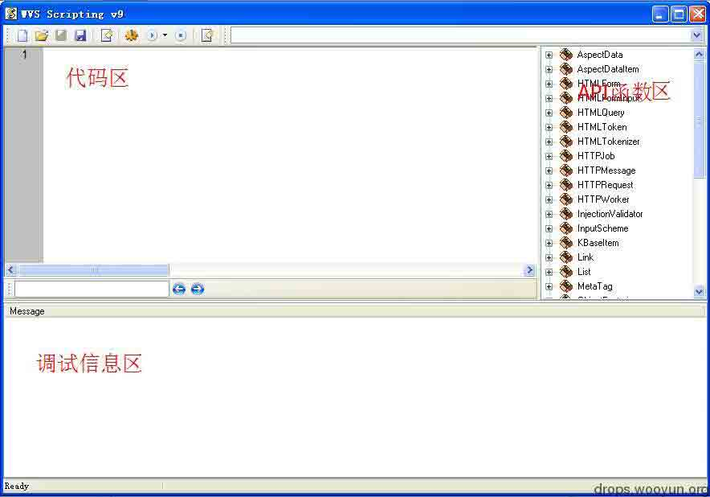

打开 WVS 数据目录，通常是在**C:\Documents and Settings\All Users\Application Data\Acunetix WVS 8\Data\Scripts**下，可以看到有 10 个文件夹，Network、PerFile、PerScheme、PostScan、PerFolder、PerServer、PostCrawl、WebApps、XML。我们先来认识一下：

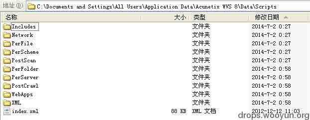

```
Network：此目录下的脚本文件是当扫描器完成了端口扫描模块后执行，这些脚本可以检测 TCP 端口的开放情况，比如检测 FTP 的 21 端口是否开放、是否允许匿名登录； 
PerFile：此目录下的脚本是当扫描器爬虫爬到文件后执行，比如你可以检查当前测试文件是否存在备份文件，当前测试文件的内容等； 
PerFolder：此目录下的脚本是当扫描器爬虫爬行到目录后执行，比如你可以检测当前测试目录是否存在列目录漏洞等； 
PerScheme：此目录下的脚本会对每个 URL 的 GET、POST 结构的参数进行检测，AWVS 定义了的参数包括 HTTP 头、Cookies、GET/POST 参数、文件上传(multipart/form-data)……比如你可以检测 XSS、SQL 注入和其他的应用程序测试； 
PerServer：此目录下的脚本只在扫描开始是执行一次，比如你可以检测 Web 服务器中间件类型； 
PostScan：此目录下的脚本只在扫描结束后执行一次，比如你可以检测存储型 XSS、存储型 SQL 注入、存储型文件包含、存储型目录遍历、存储型代码执行、存储型文件篡改、存储型 php 代码执行等； 
XML：漏洞的详细描述文档都在这里。 
```

今天演示的漏洞是 Discuz 7.2 的 faq.php SQL 注入，关于漏洞：[`ha.cker.in/1087.seo`](http://ha.cker.in/1087.seo)

我们就用 POC 来写漏洞的脚本吧！

检测原理：

根据公开的 POC 构造出特殊请求，若存在 SQL 注入则构造的 SQL 语句将会执行成功并在返回到响应内容，构造 POC 如下：

```
/faq.php?action=grouppermission&gids[99]='&gids[100][0]=) and (select 1 from (select count(*),concat((select 0x4861636B656442795365636572),floor(rand(0)*2))x from information_schema.tables group by x)a)%23 
```

URLEncode 编码一下：

```
faq.php?action=grouppermission&gids[99]='&gids[100][0]=)%20and%20(select%201%20from%20(select%20count(),concat((select%200x4861636B656442795365636572),floor(rand(0)2))x%20from%20information_schema%20.tables%20group%20by%20x)a)%23 
```

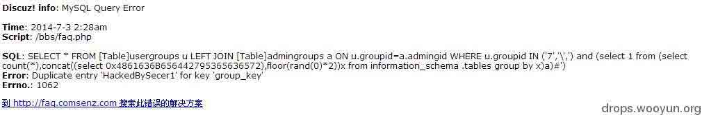

我们需要用 WVS 的脚本请求此 URL 并处理返回的内容，以此判断是否存在漏洞。

打开 AWVS，Tools -> Vulnerability Editor，右键 VulnXMLs 节点，选择‘Add Vulnerability’


新建一个漏洞，VulnXML FILENAME 为**Discuz7.2FaqSqlinjection**，点 Add 按钮（新建的 VulnXML 会被保存到 XML 文件夹下哦）

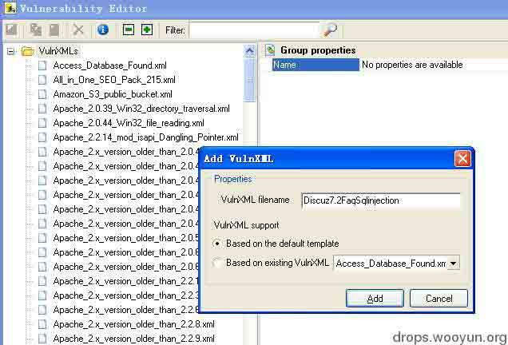

接下来登记下该漏洞的相关信息

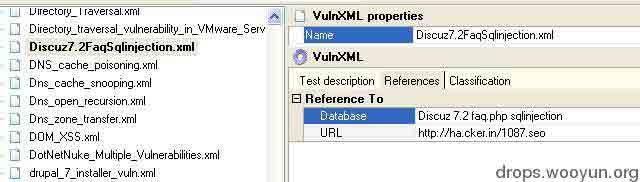

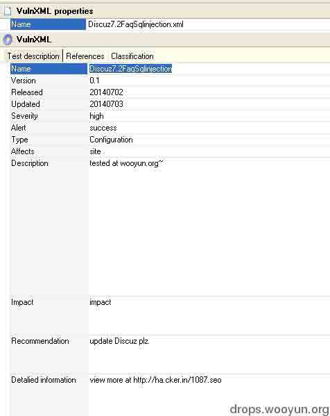

然后进入 wvss 写脚本，保存为 Discuz7.2FaqSqlinjection.script 放入 PerServer 文件夹吧。

测试脚本：

使用 AWVS 的网站爬虫爬行网站并保存结果，

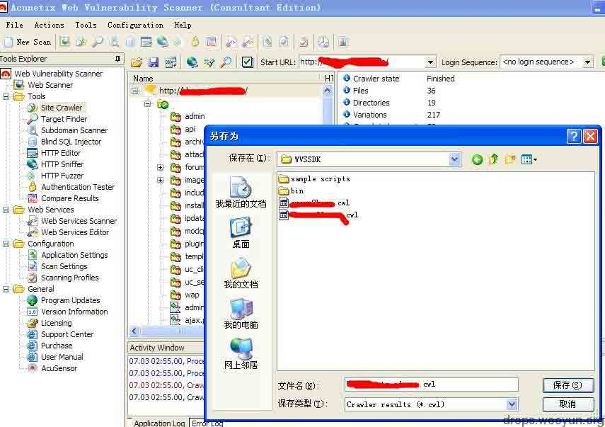

这里选择根目录

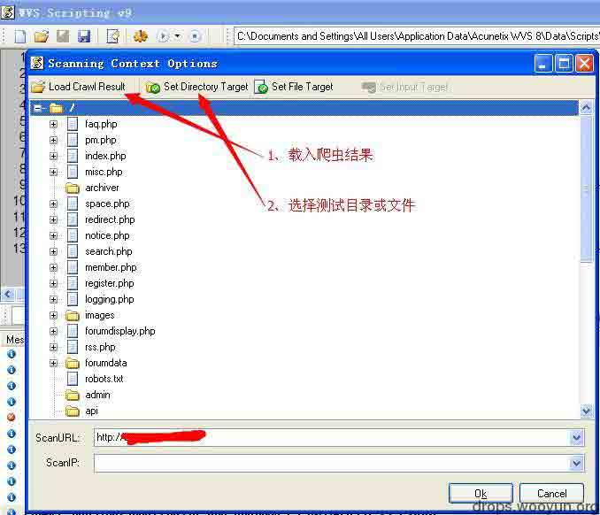

点击小三角按钮测试


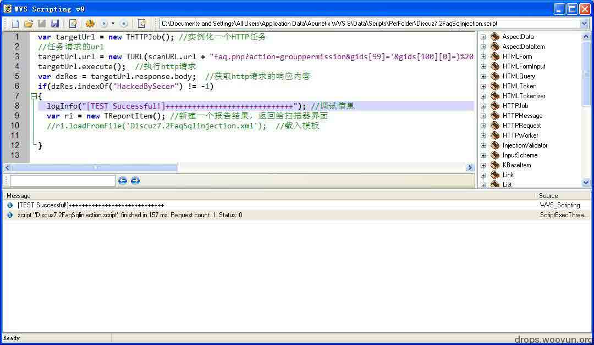

完整的代码如下

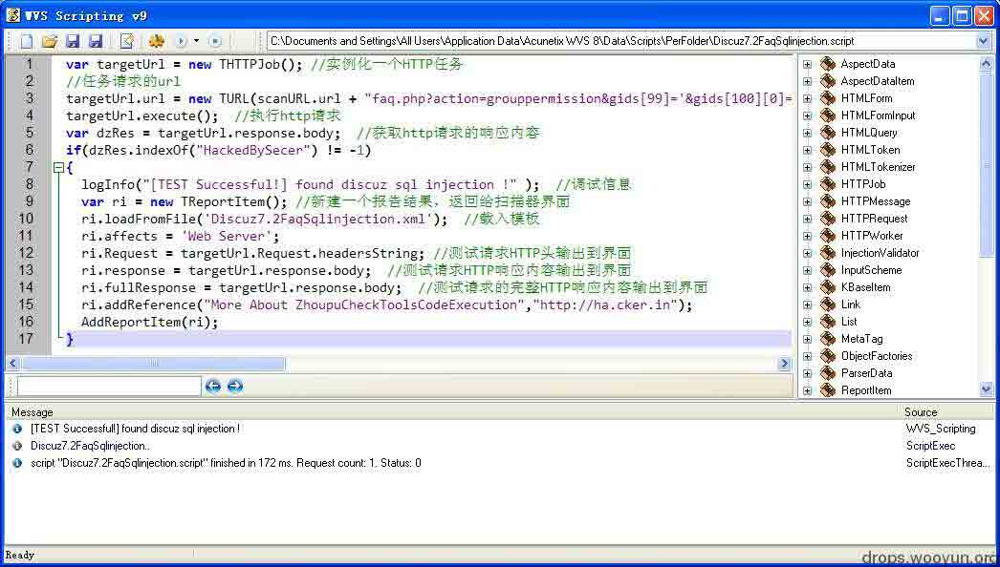

测试成功了，我到 WVS 里扫描去测试扫描看看~

我们新建的漏洞脚本在这里，Scanning Profiles –》 PerFolder 目录下，新建一个扫描模板勾选要测试的脚本并保存，这里保存为“test_HA.CKER.IN”，然后用这个模板扫描目标站测试吧

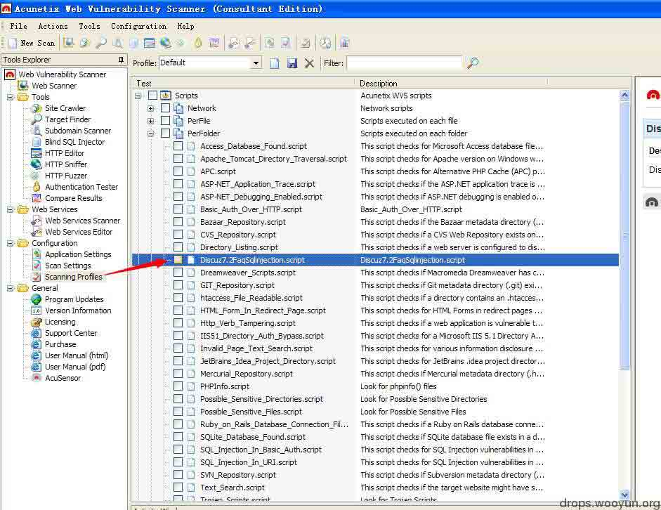

选择模板并开始扫描

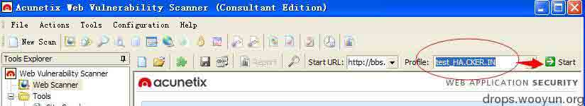

扫描完成后，结果如图

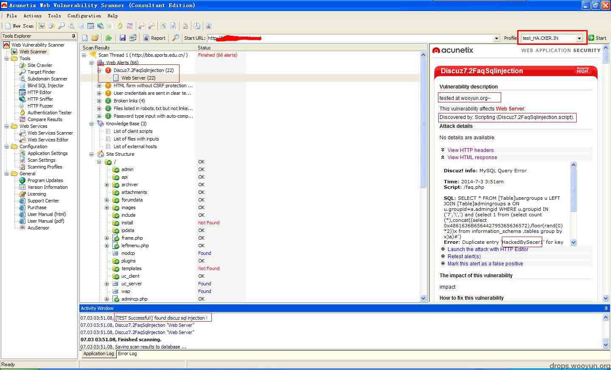

漏洞脚本重复检测了很多次，下次更新修复下这个问题。

## 0x02 总结

* * *

本人不才，这次对 AWVS 自定义脚本编写简单的介绍就到这了，只是做个示例展示给大家，这些 API 不是很详细我也不是很会写，更多的 API 等你去挖掘吧！

参考：

[`www.acunetix.com/vulnerability-scanner/scriptingreference/index.html`](http://www.acunetix.com/vulnerability-scanner/scriptingreference/index.html)

[`www.acunetix.com/blog/docs/creating-custom-checks-acunetix-web-vulnerability-scanner/`](http://www.acunetix.com/blog/docs/creating-custom-checks-acunetix-web-vulnerability-scanner/)

版权声明：未经授权禁止转载 [乌帽子](http://drops.wooyun.org/author/乌帽子 "由 乌帽子 发布")@[乌云知识库](http://drops.wooyun.org)

分享到：

### 相关日志

*   [多层代理下解决链路低延迟的技巧](http://drops.wooyun.org/tips/1286)
*   [自制分布式漏洞扫描](http://drops.wooyun.org/tips/862)
*   [hackyou2014 CTF web 关卡通关攻略](http://drops.wooyun.org/tips/870)
*   [从内存中窃取未加密的 SSH-agent 密钥](http://drops.wooyun.org/tips/2719)
*   [mitmproxy 中 libmproxy 简单介绍](http://drops.wooyun.org/tips/2943)
*   [InsightScan:Python 多线程 Ping/端口扫描 + HTTP 服务/APP 探测，可生成 Hydra 用的 IP 列表](http://drops.wooyun.org/tools/427)