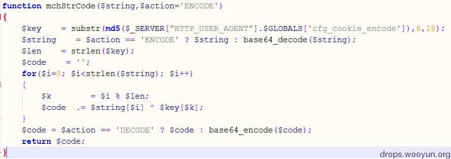
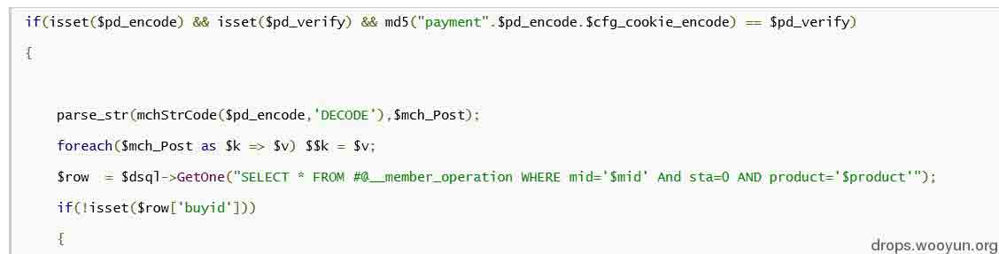
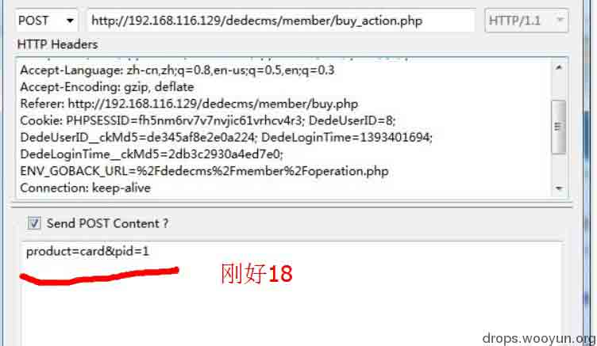
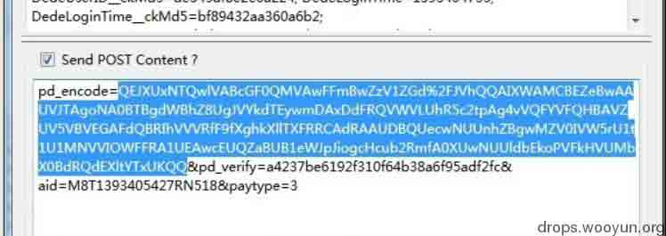
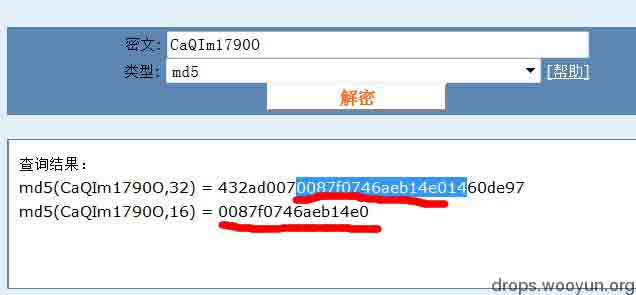
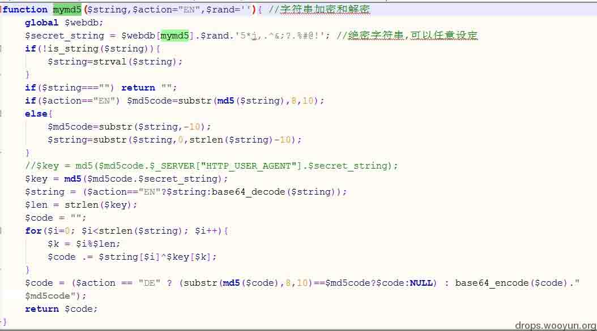

# 异或加密之美 #主流 web 弱算法科普文

2014/07/18 16:56 | [小飞](http://drops.wooyun.org/author/小飞 "由 小飞 发布") | [漏洞分析](http://drops.wooyun.org/category/papers "查看 漏洞分析 中的全部文章") | 占个座先 | 捐赠作者

本文只是对异或算法的科普文 逆向 dede 漏洞的原作者是 @[my5t3ry](http://loudong.360.cn/vul/profile/uid/1893575) 而不是我
有些图片甚至直接借用 我不是抄袭狗 - -
哥就是抱在大牛的大腿上的那个人
研究对称算法的时候 对异或加密产生了性欲

刚刚高考完 高中闭关结束 I AM BACK~

科普文 帮助新手对算法的理解吧 异或加密是 web 应用中十分流行的加密算法，通过将可信任（已安全过滤）的用户数据和加密 key 用算法加密，生成字符串再来传递以执行 sql 操作。

但是这种算法极其不安全 因为在异或算法里面

```
A^K=E  
E^A=K 
```

有了 A 和 E(加密前后的字符串)就等获得 k，一旦我们知道了 key 就能本地构造那个字符串（evilcode）进行攻击！
今天 我们研究 DedeCMS(buy_action.php)



这是个简单的异或算法

## 0x01 初识你的美，算法分析

* * *

```
string[0]^key[0] 
```

然后是

```
string[1]^key[1] 
```

将他们添加到$code 尾部，如此循环。这时会有两种情况。

**case one**

```
$key 长度（18）<=$string 长度 
```

那么当$k=$i=17，就取尽了$key，下一次执行会变成：

```
$i=18  $k=0 
```

也就是说 重新开始一遍位运算 示意图如下

```
key    |  i  a  m  a  k  e  y   i   m   
string |  i  a  m  a  s  r   i   n   g 
```

等于 key 被重复了多次直到 string 被完全加密!
**case two**

```
$key 长度（18）>$string 长度 
```

那么当

```
$k=$i=  strlen($string) -1 
```

就取尽了$string，下一次执行会直接跳出，也就是说，此时的 key 都没完整进入$code。
示意图如下

```
key    |  i  a  m  a  k  (e  y )  
string |  i  a  m  a  s 
```

括号里面表示没能进入$code 部分
现在分析完了算法 我们就能够来思考如何注入到 key 了

## 0x02 禁不起推敲的美 攻击算法

* * *

现在我们要得到 key 当然是要完整的
所以是选择 case one

所以思路应该是构造一个

```
string>=18 
```

然后在受害 web 上构造 string 并且获得$code，再到本地。

```
$string^$code 
```

就能得到 $key 的...md5 破解得到密匙，就能构造$pr_verify 骗取验证进入此支。

```
$pr_verify=md5("payment".$pr_encode.$cfg_cookie_encode); 
```

通过变量覆盖进行 GLOBALS[cfg_dbprefix]覆盖注入



接下来看图看代码
我们先看看$string(代码中的$pr_encode)是如何获取的

```
$pr_encode = '';  
    foreach($_REQUEST as $key => $val)  
    {  
        $pr_encode .= $pr_encode ? "&$key=$val" : "$key=$val";  
    }  

    $pr_encode = str_replace('=', '', mchStrCode($pr_encode));  

    $pr_verify = md5("payment".$pr_encode.$cfg_cookie_encode);  

    $tpl = new DedeTemplate();  
    $tpl->LoadTemplate(DEDEMEMBER.'/templets/buy_action_payment.htm');  
    $tpl->Display(); 
```

知道了获取办法 让我们控制它吧



此处的

```
$string=product=card&pid=1.$_COOKIES 
```

因为$_REQUEST 获取参数是从$_GET->$_POST->$_COOKIE 依次获取

所以加密得到的$code（也就是$pd_encode） 包含了 post 和 cookies 全部内容 如图



也就是符合

```
$string>=$key 
```

所以我们直接取 post 的巧合 18 位，进行破解，后面的其实不用管，要不然得到的 key 由于 case one 的不同重复，就是真正 key 的一遍遍重复。


这样我们就得到了 MD5 形式的 key 不过是 18 位 去掉最后两位开始跑吧



后来的故事就是变量覆盖 不在本文的讨论之类

## 0x03 金絮其外 败絮其中 算法优缺点分析

* * *

简单异或算法实际上并不复杂，因为它并不比维吉尼亚密码多什么东西。它之所以被包括在这本书中，是因为它在商业软件包中很流行，至少在 MS-DOS 和 Macintosh 世界中是这样[1502，1387]。不幸的是，如果一个软件保密程序宣称它有一个“专有”加密算法（该算法比 DES 更快) ---|||应用密码学
确实异或算法轻巧，采用位运算，在速度方面有十分大的优势。
但是轻巧简单却带来了弱逻辑，所以更应该小心使用 比如对$key 的复杂程度 应该有更苛刻的要求
否则会让 safe_code 变成 evil_code

## 0x04 你本来就很美 好的程序员才写得出安全算法

* * *

那么怎么样的异或才是安全简便的？ 我们看看齐博 cms 的这个吧



优点有两个
一， 绝密字串有三部分 两部分可控

```
$webdb[mymd5].$rand.'5*j,.^&;?.%#@!' 
```

复杂程度令人发指。

二，引入 MD5code 把传入参数加入到 key 里面

```
$md5code=substr($string,-10);    $key = md5($md5code.$secret_string); 
```

使得 key 无比复杂。

两次加盐加酱油的 MD5，一定时间内，基本不可破解了。

所以 异或算法用得好，其实可以是强算法，不过前提是保证 key 安全。 当然，qibo 这个系统有几处能够读取 key 的漏洞，也导致了算法成为 evilcode 最终能获得后台权限，但那是后话。

## 0x05 参考文章

* * *

DedeCMS 最新通杀注入(buy_action.php)漏洞分析

版权声明：未经授权禁止转载 [小飞](http://drops.wooyun.org/author/小飞 "由 小飞 发布")@[乌云知识库](http://drops.wooyun.org)

分享到：

### 相关日志

*   [webgame 中常见安全问题、防御方式与挽救措施](http://drops.wooyun.org/papers/2677)
*   [DedeCMS 最新通杀注入(buy_action.php)漏洞分析](http://drops.wooyun.org/papers/979)
*   [2014 年澳大利亚信息安全挑战 CySCA CTF 官方 write up Web 篇](http://drops.wooyun.org/tips/2444)
*   [Drupal – pre Auth SQL Injection Vulnerability](http://drops.wooyun.org/papers/3197)
*   [Shell Injection & Command Injection](http://drops.wooyun.org/papers/1018)
*   [理解 php 对象注入](http://drops.wooyun.org/papers/4820)