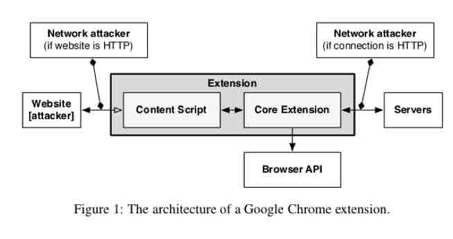
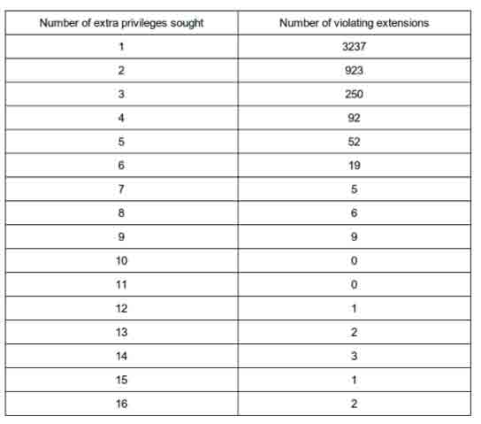
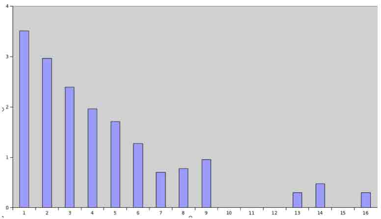

# A Security Analysis Of Browser Extensions

2014/09/26 16:11 | [DBA](http://drops.wooyun.org/author/DBA "由 DBA 发布") | [web 安全](http://drops.wooyun.org/category/web "查看 web 安全 中的全部文章") | 占个座先 | 捐赠作者

## 0x00 前言

* * *

浏览器扩展安全似乎讨论的不多，drops 上也没有相关的文章，我只在知乎上搜到一篇关于扩展问题的实例文章，[链接请点我](http://zhuanlan.zhihu.com/wooyun/19773919)。因此，我搜索了一些关于扩展安全的研究报告，如下便是其中一篇，来自于康奈尔大学图书馆（跟伯克利并列的学校哦），在大批量分析扩展安全性和绕过静默安装的方法上给我们提供了非常好的思路，我认为是值得学习的，故翻译下来分享给大家。 原文：[`arxiv.org/abs/1403.3235`](http://arxiv.org/abs/1403.3235)

## 0x01 摘要

* * *

浏览器扩展（通常称为插件或者加载项）本质上是让开发者给浏览器附加功能的一小段代码。然而,扩展也是有安全代价的：用户必须信任插件开发者。我们来看看这种信任关系是如何被打破，从而造成恶意的扩展被安装到用户的浏览器。同样，我们也看看在各种浏览器中扩展的静默安装方法以及浏览器本身是如何预防静默安装的。

我们通过比较多种浏览器的扩展机制，试图创建了一种保持插件在浏览器中的权限最小化规则，然后以此为依据分析了各种各样的插件，以便观察最小化权限规则是否满足插件对权限的要求。

同样的，我们也对多种浏览器上的很多插件做了调查，查明了可能造成攻击的根本原因。举个例子，如果开发者的账号被黑，那么此开发者开发的扩展中是可能被嵌入恶意代码的。我们还发现了权限滥用问题，调查到很多扩展会申请超出本身使用的更多的权限。

最后提供了一个解决方案让用户在下载扩展前检查其可靠性。

## 0x02 介绍

* * *

浏览器扩展现在已经极度受欢迎，超过 33%的 Chrome 浏览器使用者不止安装了一个扩展。在正常的网站上，扩展（也称插件）是一小段能允许用户修改浏览器行为的代码。大多数插件使用 javascript 编写，当然也有其他的脚本。当扩展被如此广泛的在桌面操作系统中使用的时候，在移动浏览器中，仍处在最初的阶段，只有在一小部分移动浏览器会支持第三方扩展，比如 Mozilla’s Firefox for Android and Dolphin 由于时间的关系，在此文中，我们仅以 Google Chrome 和 Firefox 为例，其他浏览器暂时不作考虑。

大多数浏览器在它们的扩展平台中都有自己的安全模型。此文中，我们分析了多种由于扩展造成的或可能造成的漏洞。同时，基于测试结果验证了这些安全模型的有效性。

## 0x03 安全概述

* * *

1、Google Chrome 使用三种方式保证扩展的安全性。

```
1）关键字隔离。扩展的脚本不能直接访问当前页面的 DOM 树，但是能复制一份，间接的访问。页面 javascript 代码的执行跟扩展 javascript 代码严格分离。否则，会造成大量的攻击向量失效。  
2）权限隔离。Chrome 的扩展运行在两种不同的权限机制中。一种是内容脚本（content-scripts），另一种是核心扩展脚本（core-extension scripts）。核心扩展脚本能够直接访问 Chrome 的本地 API，内容脚本则不能，但是能通过与核心扩展脚本消息通信，间接的访问 Chrome 的本地 API。使得攻击过程必须经过消息接口的方式实现，从而加强了模型的安全性。  
3）权限模型。扩展必须先声明使用的权限，然后浏览器会匹配相应的权限模型用于限制扩展。所以，如果是核心扩展脚本被发现了漏洞，攻击者还是会被权限模型限制。 
```



图 1：Google Chrome 的扩展架构图

2、威胁。

在扩展中有两种可能的攻击方式：

```
1）恶意扩展：理论上，攻击者是能够在用户的浏览器上安装具有很大破坏力的恶意扩展的。在这之前，有少数扩展被查出盗取银行密码和其他一些安全性较高的网站的敏感信息。尽管浏览器及时的屏蔽了这些扩展，但是威胁仍然存在。  
我们来看看恶意扩展的安装机制，扩展可以通过其他的可执行文件实现静默安装。Chrome 和 Firefox 都提供有静默安装的接口，但是在安装之前会弹出确认窗口给用户提示。  
2）扩展本身的漏洞：由于开发者本身编码不够安全，造成扩展本身也是可能存在安全漏洞的。在 Chrome Web 商店中，有超过 10000 个的扩展，其中有一些是本身就有安全漏洞。之前一项研究表明，即使是最受欢迎的、甚至是 Google 公司自己开发的扩展，都存在过安全漏洞。这些扩展能被恶意的网站利用，主要包括非法处理用户的输入，未过滤或者未处理过的用户输入在扩展中被使用，扩展元数据被攻击能方式。 
```

我们没有研究 Firefox 的扩展，因为 Firefox 对扩展没有权限管理。因此，所有的扩展都能读写用户的家目录。这导致 Firefox 的扩展权限过大，也造成了更多的漏洞。

## 0x04 方式

* * *

我们使用如下操作：

```
1）在 Chrome 和 Firefox 下，用一种方式绕过浏览器对于静默安装的提示。  
2）分析 Chrome Web 商城里排名前 10000 扩展的代码。分析在某些攻击向量和权限滥用的情况下，扩展的代码和执行。  
3）创建一种方法，在安装扩展前，观察其在经过上面两步操作后的结果。这能更好的帮助用户分析，以决定是否安装该扩展。我们研究结果表明，数个扩展会申请大于它们自身使用的权限。 
```

## 0x05 统计

* * *

我们总共从 Chrome Web 商店下载了 10047 个扩展。它们以受欢迎的程度排序，因此能够代表扩展的使用频率是最高的。

1）内容安全策略（Content-Security Policy）

内容安全策略作为一个新特性被引入到 Chrome 的第 18 个版本，通过其严格的策略，阻止了大多数如上我们讨论的漏洞情况。我们发现有 4079 个扩展已经升级它的 manifest 到第二版，从而强制使内容安全策略得以被应用。尽管这些扩展仍然存在权限滥用和自身漏洞，但是也比其他未应用该策略的扩展要更加安全。
在 10047 个扩展中，我们成功扫描的有 9558 个，其他的因为错误的 manifest 文件和部分文件丢失未能成功分析。

2）权限滥用

通过解析 manifest.json 文件，我们扫描了这些扩展申请的权限。该方法来自 Google Chrome 开发者网站页面：“所有的扩展，浏览器应用程序和主题都有一个 json 格式的 manifest 文件，以 manifest.l 命名，或者 missing.json，用于提供扩展的重要信息。”

然后跟扩展实际使用的权限匹配。Chrome 的安全策略仅允许‘backgroud-scripts’直接访问核心的 API。通过解析所有文件源码中的‘backgroud-scripts’段，分析出扩展需要实际需要的权限。

我们发现这些扩展中，超过一半的都申请了大于实际使用必须的权限。其中大多数多申请了一到两个额外的权限，这可以归结于开发者的水平和不严谨。另外有 192 个扩展多申请了 4 个或更多的权限，体现出较为严重的安全问题。

在统计中，我们没有包含那些不能被滥用的权限。比如，通知功能的权限，能被允许使用 HTML5 的通知接口，但是无法被滥用。有超过 300 个扩展申请了该权限，却并未使用，我们也就没有将这些扩展列入统计结果。尽管它们不会造成安全问题，但在申请权限中，这也是个不好的习惯。
如下是我们统计的数据：



下面是一个权限滥用的扩展数量和申请的额外的权限数量对比的树状分布图，Y 坐标是以 10 为底对数的值。



很多不合格的扩展会申请极度敏感的权限，这样就能很容易的被黑客和居心叵测的开发者利用这些权限获取用户的账号信息，如浏览器的 cookie。

3）网络层面的攻击

我们发现有一些扩展在 HTTP 网络层面也存在漏洞，它们会通过 HTTP 协议加载远程脚本。由于技术原因，无法统计到所有产生的 HTTP 请求，但还是发现了 146 个扩展往外部发起过 HTTP 请求。我们只统计了直接包含`<script>`标签的的请求，如果加上包含 XHR 的请求（很多扩展会使用），这个数字会高很多。

我们没能是能够用程序来统计包含 XHR 的请求，如果通过手动的方式统计，会是一份吃力的工作。这是由于很多请求是直接使用 javascript 发起，或者使用``标签发起，如 JQuery、MooTools 等其他 javacript 框架。我们打算通过分析所有的 URL 字符串，假定其为请求的地址，结果发现导致了大量的错误，从而否定了这个做法。

网络层面的攻击包括中间人攻击（MitM）,如果利用这种方式，将会允许远程代码执行，而当问题出在核心扩展部分，这意味着所有的权限都能被滥用。举个例子，中间人攻击的方式能复制用户浏览器的 cookie 值，然后发送给攻击者本身。这将会导致类似于“圣杯”攻击，从而危及到用户所有的账号。

## 0x06 工作模型

* * *

### 1、静默安装

Firefox 和 Chrome 都有静默安装的方式。正常情况下，这就涉及到注册表编辑。浏览器启动时，会检查注册表中相应的键值，当安装扩展时，会弹出警告窗口。只有用户允许了，扩展才会被安装。

我们创建了一种不需要弹出警告窗口的机制，通过不同的方式对两种浏览器进行测试。

```
1）Firefox：Firefox 会在用户的配置目录下建立一个叫 extensions.sqlite 的文件用于保存所有已经安装的扩展的列表。所以我们直接往这个文件里写假的扩展安装信息。这种方法是基于 Julien Sobrier 早期完成的研究。这样便很简单的让我们静默安装扩展，而不弹窗提示。  
2）Chrome：Chrome 会在用户的数据目录下建立一个偏好设置文件，用于保存已安装扩展的列表。该文件是以 JSON 格式保存，我们往里面写入假的扩展信息，当浏览器启动时，显示我们写入假的扩展已经被安装了。 
```

在对静默安装机制上的研究表明，浏览器现在的方式还不够完善，很容易就被绕过。当然，在浏览器对应 bypass 静默安装方面，这永远是一个猫鼠游戏。

2、扩展检查

我们通过设置一个在线的扩展检查数据库，让用户使用我们的研究结果。用户能轻松的找到对应扩展的权限滥用和外部 HTTP 请求分析。我们也打算尽快发布到网站上。

网站通过读取 manifest.json 文件来对比扩展实际需要的权限和申请的权限，分析过后将其存入数据库中，并提供 HTTP 方式的接口访问。

## 0x07 结论

* * *

我们成功的开发出了脚本，实现了 Chrome 和 Firefox 扩展的无警告静默安装，证明了现在的防范机制还不够完善。

在分析的扩展中，大约有 50%的存在权限滥用的情况。虽然很难给出准确的数字，但是还是可以得出结论，有相当一部分的扩展会因为权限滥用的情况而受到攻击。我们也认识到，内容安全策略（Content-Security Policy）在保证扩展安全中的确是一个高效的方案。Google Chrome Web 商店也会因为该策略的实行更加安全。

最后，附上这个项目的 github 上的源码地址：[`github.com/captn3m0/nullcon2014`](https://github.com/captn3m0/nullcon2014)

```
[1]: Carlini, Nicholas, Adrienne Porter Felt, and David Wagner. “An evaluation of the google chrome extension security architecture.“ Proceedings of the 21st USENIX Conference on Security. 2012\. 
[2]: Sobrier, Julien. “How to install silently malicious extensions for Firefox”ZScaler Blog. 25 Sep. 2012\. 
[3]: Aaron Boodman, “A Year of Extensions”. The Chromium Blog. 9 Dec 2010\. 
[4]: Siegler, M. G. “Chrome Appears To Have Hit 10,000 Extensions, Inching Closer To Firefox.“ TechCrunch. N.p., 10 Dec. 2010. 
```

版权声明：未经授权禁止转载 [DBA](http://drops.wooyun.org/author/DBA "由 DBA 发布")@[乌云知识库](http://drops.wooyun.org)

分享到：

### 相关日志

*   [SCTF-WriteUp](http://drops.wooyun.org/tips/4243)
*   [2014 年澳大利亚信息安全挑战 CySCA CTF 官方 write up Web 篇](http://drops.wooyun.org/tips/2444)
*   [常见的 HTTPS 攻击方法](http://drops.wooyun.org/tips/4403)
*   [Google Chrome 开发者工具漏洞利用](http://drops.wooyun.org/papers/974)
*   [XSS Filter Evasion Cheat Sheet 中文版](http://drops.wooyun.org/tips/1955)
*   [URL Hacking – 前端猥琐流](http://drops.wooyun.org/tips/750)