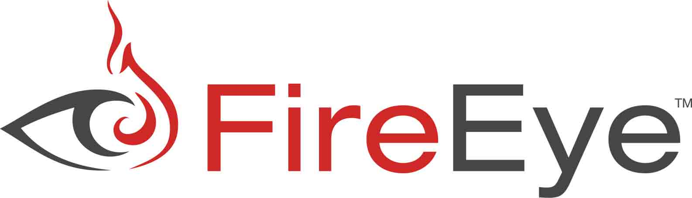

# FireEye 实验室在一次水坑式攻击中发现 IE 0DAY

2014/02/15 22:56 | [News](http://drops.wooyun.org/author/news "由 News 发布") | [业界资讯](http://drops.wooyun.org/category/news "查看 业界资讯 中的全部文章") | 占个座先 | 捐赠作者

FireEye 实验室确认，在美国的一个违法网站上发现了一个新的 IE 10 的 0day，这是一个经典的偷渡式攻击。这个 0day 攻击成功后，会从远程服务器下载一个 XOR 编码的 payload，然后解码并执行。

发表这个声明是为了警示广大网民，FireEye 正在与微软安全团队合作进行防御。

关于这次攻击的详细报告，已经发表在 FireEye 的博客上：

[operation snowman deputydog actor compromises us veterans of foreign wars website](http://www.fireeye.com/blog/technical/cyber-exploits/2014/02/operation-snowman-deputydog-actor-compromises-us-veterans-of-foreign-wars-website.html)

译者注：水坑攻击是 APT 攻击的一种常用手段，是指黑客通过分析被攻击者的网络活动规律，寻找被攻击者经常访问的网站的弱点，先攻下该网站并植入攻击代码，等待被攻击者来访时实施攻击。这种攻击行为类似《动物世界》纪录片中的一种情节：捕食者埋伏在水里或者水坑周围，等其他动物前来喝水时发起攻击猎取食物。

原文：[new i.e. zero day found in watering hole attack](http://www.fireeye.com/blog/technical/cyber-exploits/2014/02/new-ie-zero-day-found-in-watering-hole-attack-2.html)

版权声明：未经授权禁止转载 [News](http://drops.wooyun.org/author/news "由 News 发布")@[乌云知识库](http://drops.wooyun.org)

分享到：

### 相关日志

*   [马航 MH370 航班被黑了？](http://drops.wooyun.org/news/1202)
*   [通过伪造乌克兰相关文件进行传播的恶意软件 MiniDuke](http://drops.wooyun.org/news/1373)
*   [网络安全威胁周报——第 201410 期](http://drops.wooyun.org/news/1034)
*   [NSA 暗中监视中国政府和企业网络（目标华为）](http://drops.wooyun.org/news/1289)
*   [APPLE IOS 7.1 修复了超过 20 个代码执行的漏洞](http://drops.wooyun.org/news/1057)
*   [GnuTLS 和 Apple 证书验证的 bugs 并非为同一个](http://drops.wooyun.org/news/1021)