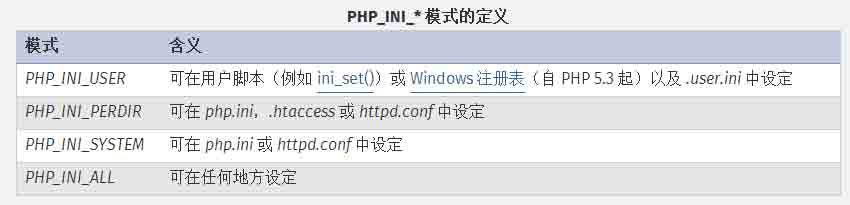
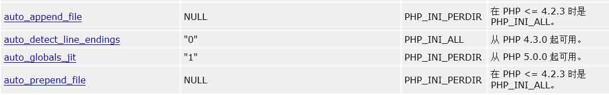
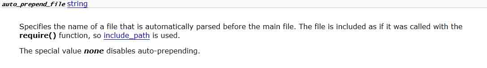
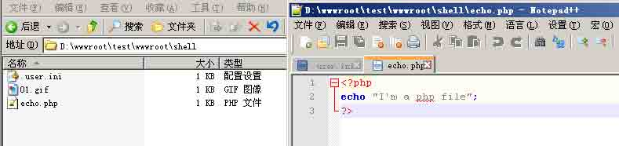
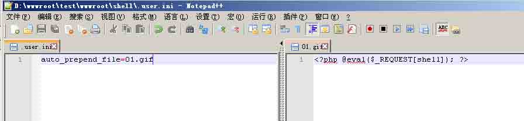
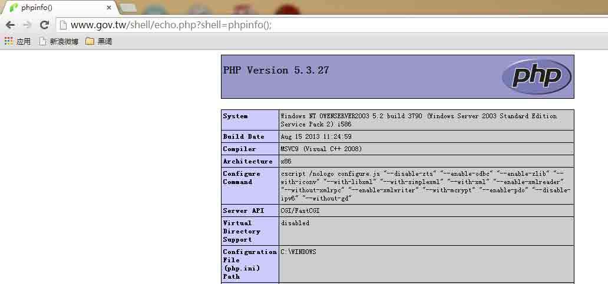
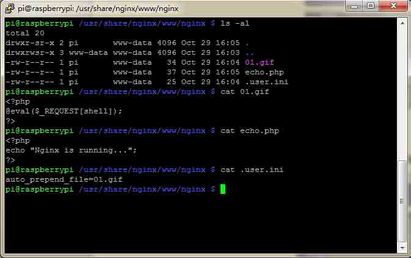
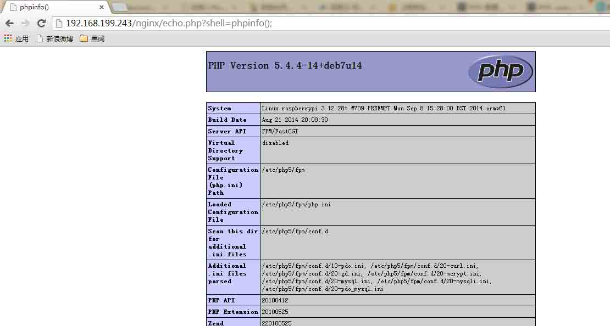

# .user.ini 文件构成的 PHP 后门

2014/10/30 10:51 | [phith0n](http://drops.wooyun.org/author/phith0n "由 phith0n 发布") | [web 安全](http://drops.wooyun.org/category/web "查看 web 安全 中的全部文章"), [技术分享](http://drops.wooyun.org/category/tips "查看 技术分享 中的全部文章") | 占个座先 | 捐赠作者

## 0x00 背景

* * *

这个估计很多同学看了不屑，认为是烂大街的东西了：

[.htaccess 文件构成的 PHP 后门](http://zone.wooyun.org/content/16114)

那么我来个新的吧：`.user.ini`。它比`.htaccess`用的更广，不管是 nginx/apache/IIS，只要是以 fastcgi 运行的 php 都可以用这个方法。我的 nginx 服务器全部是 fpm/fastcgi，我的 IIS php5.3 以上的全部用的 fastcgi/cgi，我 win 下的 apache 上也用的 fcgi，可谓很广，不像.htaccess 有局限性。

## 0x01 .user.ini

* * *

那么什么是.user.ini？

这得从 php.ini 说起了。php.ini 是 php 默认的配置文件，其中包括了很多 php 的配置，这些配置中，又分为几种：`PHP_INI_SYSTEM`、`PHP_INI_PERDIR`、`PHP_INI_ALL`、`PHP_INI_USER`。 在此可以查看：[`php.net/manual/zh/ini.list.php`](http://php.net/manual/zh/ini.list.php) 这几种模式有什么区别？看看官方的解释：



其中就提到了，模式为 PHP_INI_USER 的配置项，可以在 ini_set()函数中设置、注册表中设置，再就是.user.ini 中设置。 这里就提到了.user.ini，那么这是个什么配置文件？那么官方文档在[这里](http://php.net/manual/zh/configuration.file.per-user.php)又解释了：

除了主 php.ini 之外，PHP 还会在每个目录下扫描 INI 文件，从被执行的 PHP 文件所在目录开始一直上升到 web 根目录（`$_SERVER['DOCUMENT_ROOT']` 所指定的）。如果被执行的 PHP 文件在 web 根目录之外，则只扫描该目录。

在 `.user.ini` 风格的 INI 文件中只有具有 PHP_INI_PERDIR 和 PHP_INI_USER 模式的 INI 设置可被识别。

这里就很清楚了，`.user.ini`实际上就是一个可以由用户“自定义”的 php.ini，我们能够自定义的设置是模式为“PHP_INI_PERDIR 、 PHP_INI_USER”的设置。（上面表格中没有提到的 PHP_INI_PERDIR 也可以在.user.ini 中设置）

实际上，除了`PHP_INI_SYSTEM`以外的模式（包括 PHP_INI_ALL）都是可以通过.user.ini 来设置的。

而且，和`php.ini`不同的是，`.user.ini`是一个能被动态加载的 ini 文件。也就是说我修改了`.user.ini`后，不需要重启服务器中间件，只需要等待`user_ini.cache_ttl`所设置的时间（默认为 300 秒），即可被重新加载。

然后我们看到 php.ini 中的配置项，可惜我沮丧地发现，只要稍微敏感的配置项，都是`PHP_INI_SYSTEM`模式的（甚至是 php.ini only 的），包括`disable_functions`、`extension_dir`、`enable_dl`等。 不过，我们可以很容易地借助`.user.ini`文件来构造一个“后门”。

Php 配置项中有两个比较有意思的项（下图第一、四个）：



`auto_append_file`、`auto_prepend_file`，点开看看什么意思：



指定一个文件，自动包含在要执行的文件前，类似于在文件前调用了 require()函数。而 auto_append_file 类似，只是在文件后面包含。 使用方法很简单，直接写在.user.ini 中：

```
auto_prepend_file=01.gif 
```

01.gif 是要包含的文件。

所以，我们可以借助.user.ini 轻松让所有 php 文件都“自动”包含某个文件，而这个文件可以是一个正常 php 文件，也可以是一个包含一句话的 webshell。

测试一下，我分别在 IIS6.0+Fastcgi+PHP5.3 和 nginx+fpm+php5.3 上测试。 目录下有.user.ini，和包含 webshell 的 01.gif，和正常 php 文件 echo.php：





访问 echo.php 即可看到后门：



Nginx 下同样：





那么，我们可以猥琐地想一下，在哪些情况下可以用到这个姿势？ 比如，某网站限制不允许上传.php 文件，你便可以上传一个.user.ini，再上传一个图片马，包含起来进行 getshell。不过前提是含有.user.ini 的文件夹下需要有正常的 php 文件，否则也不能包含了。 再比如，你只是想隐藏个后门，这个方式是最方便的。

## 0x02 参考文献：

* * *

*   [`php.net/manual/zh/ini.list.php`](http://php.net/manual/zh/ini.list.php)
*   [`php.net/manual/zh/configuration.changes.modes.php`](http://php.net/manual/zh/configuration.changes.modes.php)
*   [`php.net/manual/zh/configuration.file.per-user.php`](http://php.net/manual/zh/configuration.file.per-user.php)
*   [`php.net/manual/zh/configuration.changes.php`](http://php.net/manual/zh/configuration.changes.php)

版权声明：未经授权禁止转载 [phith0n](http://drops.wooyun.org/author/phith0n "由 phith0n 发布")@[乌云知识库](http://drops.wooyun.org)

分享到：

### 相关日志

*   [攻击 JavaWeb 应用[1]-JavaEE 基础](http://drops.wooyun.org/tips/163)
*   [Hacking weblogic](http://drops.wooyun.org/tips/402)
*   [PHP 绕过 open_basedir 列目录的研究](http://drops.wooyun.org/tips/3978)
*   [攻击 JavaWeb 应用[7]-Server 篇[1]](http://drops.wooyun.org/tips/604)
*   [URL Hacking – 前端猥琐流](http://drops.wooyun.org/tips/750)
*   [Web 攻击日志分析的过去现在与未来](http://drops.wooyun.org/tips/4051)